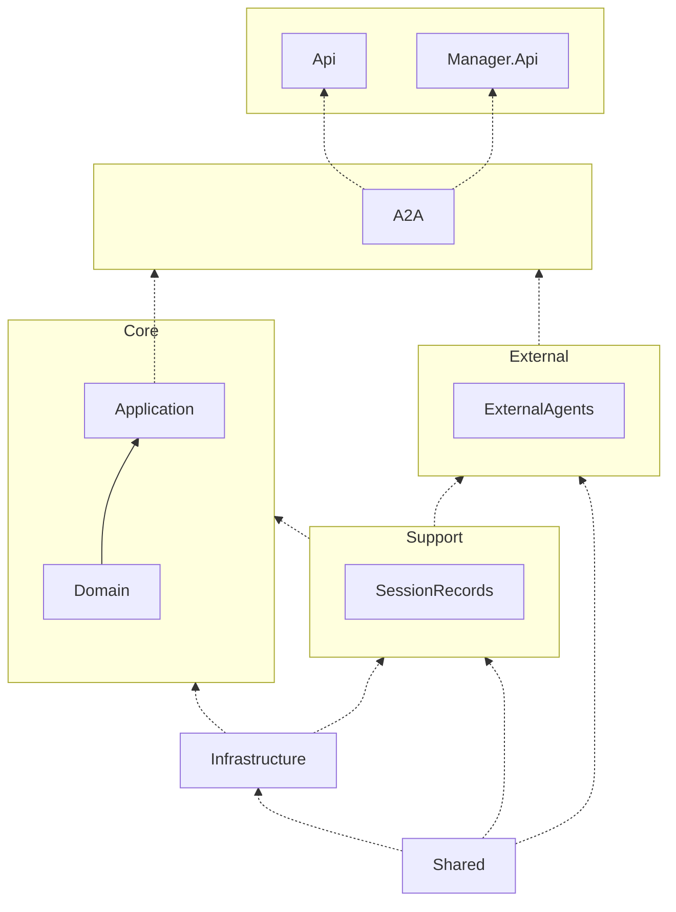

# Project dependencies

- Layer API: 
  - project Api: 对外统一入口项目，负责承载 HTTP / RPC 等对外接口。
  - project Manager.Api：用于后台管理系统的 API
- Layer Protocol : 通信协议的转换与定义层。
  - project A2A: A2A 通信协议的**实现与适配层**。
- Layer Core:
  - project Appliaction: 系统的**用例层 / 应用服务层**。
  - project Domain：系统的**核心业务模型层**。
- Layer External:
  - project ExternalAgents：对外部 Agent / 第三方系统的扩展适配层。

- Layer Support:
  - project SessionRecords：系统运行期的**支撑型能力项目**。
- project Infrastructure：基础设施实现层。
- project Shared: 全局共享基础项目。





# LLM Manager Backend

ASP.NET Core + EF Core backend for managing LLM models, providers, their pricing links, and API keys. Clean Architecture with anemic domain models operated through domain services, a generic repository, and a unit of work.

## Projects
- `LlmManager.Domain`: Entities, enums, repository/UoW abstractions, and domain services.
- `LlmManager.Infrastructure`: EF Core DbContext plus repository and unit of work implementations; supports SQLite (default), PostgreSQL, and MySQL.
- `LlmManager.Api`: Web API that wires up DI and exposes CRUD/list endpoints.

## Configuration
`appsettings.json` (or environment vars) drives database selection:
```json
"Database": {
  "Provider": "sqlite", // sqlite | postgres | mysql
  "ConnectionString": "Data Source=llmmanager.db"
}
```

## Run
```bash
cd src/backend/LlmManager.Api
dotnet run
```
Swagger/OpenAPI available in Development at `/openapi`.

## EF Core migrations
Generate migrations from the API project root:
```bash
dotnet ef migrations add InitialCreate -p ../LlmManager.Infrastructure -s .
dotnet ef database update -p ../LlmManager.Infrastructure -s .
```
Swap `Database:Provider`/`ConnectionString` to target PostgreSQL or MySQL before applying migrations.
