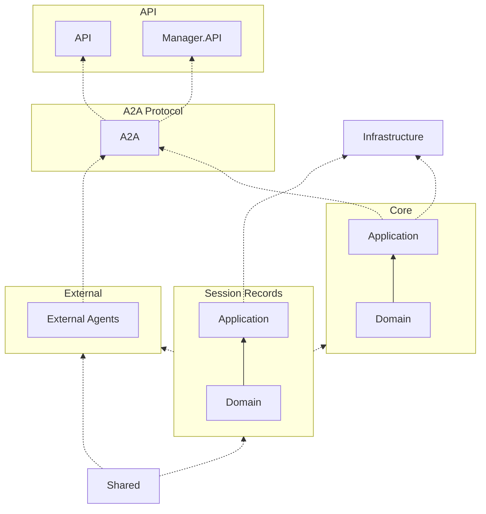

# Project dependencies





# LLM Manager Backend

ASP.NET Core + EF Core backend for managing LLM models, providers, their pricing links, and API keys. Clean Architecture with anemic domain models operated through domain services, a generic repository, and a unit of work.

## Projects
- `LlmManager.Domain`: Entities, enums, repository/UoW abstractions, and domain services.
- `LlmManager.Infrastructure`: EF Core DbContext plus repository and unit of work implementations; supports SQLite (default), PostgreSQL, and MySQL.
- `LlmManager.Api`: Web API that wires up DI and exposes CRUD/list endpoints.

## Configuration
`appsettings.json` (or environment vars) drives database selection:
```json
"Database": {
  "Provider": "sqlite", // sqlite | postgres | mysql
  "ConnectionString": "Data Source=llmmanager.db"
}
```

## Run
```bash
cd src/backend/LlmManager.Api
dotnet run
```
Swagger/OpenAPI available in Development at `/openapi`.

## EF Core migrations
Generate migrations from the API project root:
```bash
dotnet ef migrations add InitialCreate -p ../LlmManager.Infrastructure -s .
dotnet ef database update -p ../LlmManager.Infrastructure -s .
```
Swap `Database:Provider`/`ConnectionString` to target PostgreSQL or MySQL before applying migrations.
