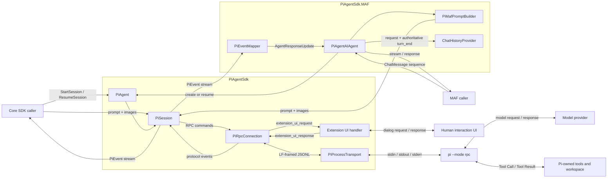

# pi-agent-sdk-csharp

.NET 10 SDK for running the [Pi coding agent](https://pi.dev) through its RPC mode and exposing it as a Microsoft Agent Framework `AIAgent`.

The initial compatibility baseline is `@earendil-works/pi-coding-agent` 0.84.4.

## Packages

- [`PiAgentSdk`](src/PiAgentSdk/README.md) owns Pi process lifecycle, strict LF-framed JSONL RPC, persistent sessions, cancellation, and Extension UI requests.
- [`PiAgentSdk.MAF`](src/PiAgentSdk.MAF/README.md) maps Pi messages, Tool activity, usage, errors, sessions, and history hooks to Microsoft Agent Framework.

## Overall Data Flow

Core callers work directly with `PiSession` and receive `PiEvent` values. MAF callers enter through `PiAgentAIAgent`, which builds a Pi prompt from the current invocation, maps the same event stream into MAF updates, and persists only requests and authoritative `turn_end` messages.



The Pi process is started lazily at the first session operation. A prompt acknowledgement means only that Pi accepted the command; completion occurs when `agent_settled` reaches `PiSession`.

## Requirements

Install Node.js and the pinned Pi CLI:

```bash
npm install -g @earendil-works/pi-coding-agent@0.84.4
```

Alternatively, set `PiAgentOptions.PiPathOverride` to an existing executable. On Windows, standard npm `pi.cmd`/`pi.bat` shims are resolved to the package-declared JavaScript entrypoint and launched through Node without `cmd.exe`; unrecognized command scripts fail closed.

The SDK never installs or updates Pi automatically and never probes the executable during construction.

## Core SDK

```csharp
using PiAgentSdk;

var agent = new PiAgent(
    new PiAgentOptions
    {
        CommandTimeout = TimeSpan.FromSeconds(30),
        AbortGracePeriod = TimeSpan.FromSeconds(5),
    }
);

await using var session = agent.StartSession(
    new PiSessionOptions
    {
        WorkingDirectory = "/path/to/project",
        SessionDir = "/path/to/pi-sessions",
        ProjectTrust = PiProjectTrust.Deny,
        NoExtensions = true,
    }
);

var turn = await session.RunAsync("List the projects in this workspace.");
Console.WriteLine(turn.FinalResponse);

var sessionId = session.Id;
```

Pi owns the provider-side conversation. `agent_settled`, not `agent_end`, is the completion boundary.

## Resume

Persistent Pi sessions are JSONL files. If a process is forcibly killed, the current `PiSession` object becomes unusable, but the persisted conversation can be reopened with a new object:

```csharp
await using var resumed = agent.ResumeSession(
    sessionId!,
    new PiSessionOptions
    {
        WorkingDirectory = "/path/to/project",
        SessionDir = "/path/to/pi-sessions",
        NoExtensions = true,
    }
);
```

Recovery starts from Pi's last persisted Session entry; an in-flight Tool operation may not have been written before the kill. `NoSession=true` is ephemeral and cannot be resumed.

## Session Directory Precedence

Pi resolves its Session directory in this order:

```text
--session-dir > PI_CODING_AGENT_SESSION_DIR > Pi default
```

`PiSessionOptions.SessionDir` maps to `--session-dir`. Agw forcibly sets both the CLI flag and environment variable to the same user-scoped trusted path.

## Environment and Security

The SDK starts from a sanitized environment instead of inheriting every host variable. It preserves process essentials, locale, proxy variables, and common certificate trust variables. API keys and variables such as `NODE_OPTIONS` are inherited only when supplied explicitly through SDK options.

Agw reuses the host Pi configuration directory at `~/.pi/agent`, including `auth.json`, `settings.json`, and `models.json`. It keeps only Session files under the Agw user-scoped Session directory. To avoid executing unrelated or incompatible host extensions in the server process, Agw starts Pi with `--no-extensions`.

Because the host configuration directory is process-level, every Agw user running under the same server OS account shares the same provider identity and quota from `auth.json` and `models.json`. Within Pi's filesystem integration, per-user isolation applies only to the Session directory.

Administrators may still load an explicit extension allowlist and bound history persistence:

```json
{
  "ExternalAgents": {
    "Pi": {
      "Extensions": ["/trusted/extensions/approval.ts"],
      "HistoryPersistenceTimeout": "00:00:30"
    }
  }
}
```

Agent `ExtraSetting` cannot add or replace these extension paths or override the persistence timeout.

Explicit Agent, Project, or turn environment variables are passed to Pi after the sanitized host environment and therefore override ordinary `models.json` key expressions. Pi itself resolves credentials in this order: `--api-key`, `auth.json`, environment variables, then `models.json`. Consequently, an existing `auth.json` entry for the same provider still has priority over an environment variable; Agw does not place plaintext API keys in process arguments to bypass that rule.

Project trust defaults to `--no-approve`. Pi does not provide an in-process sandbox: unattended or untrusted work should run in a container, VM, or policy-controlled sandbox with only required files, credentials, and network access.

Agw additionally sets:

```text
PI_OFFLINE=1
PI_SKIP_VERSION_CHECK=1
PI_TELEMETRY=0
```

## Extension UI

The SDK supports select, confirm, input, and editor dialogs through a typed callback. Notification/status/widget/title/editor-text events remain fire-and-forget events. Agw bridges foreground dialogs from explicitly allowlisted extensions to its human-interaction channel and cancels background dialogs. With the default empty allowlist, no extension code is loaded and therefore no Extension UI request is expected.

## MAF Tool Boundary

Pi executes its own built-in and extension Tools. MAF receives Pi Tool calls as informational `FunctionCallContent`; it must not execute them a second time. Dynamic injection of MAF Tools into Pi is outside v1.

`BashExecutionMessage` represents Pi's separate direct RPC `bash` command. That command is not exposed by v1 and is not part of `turn_end.toolResults`, which contains only Tool Result messages.

## Compatibility and Tests

Before upgrading Pi:

1. Confirm the published npm version.
2. Compare RPC command/event types and framing rules.
3. Update protocol fixtures.
4. Run all Core, MAF, Agw, and optional real-CLI tests.

Default tests never launch the real Pi CLI:

```bash
dotnet test src/sdks/pi-agent-sdk-csharp/tests/PiAgentSdk.Tests
dotnet test src/sdks/pi-agent-sdk-csharp/tests/PiAgentSdk.MAF.Tests
```
