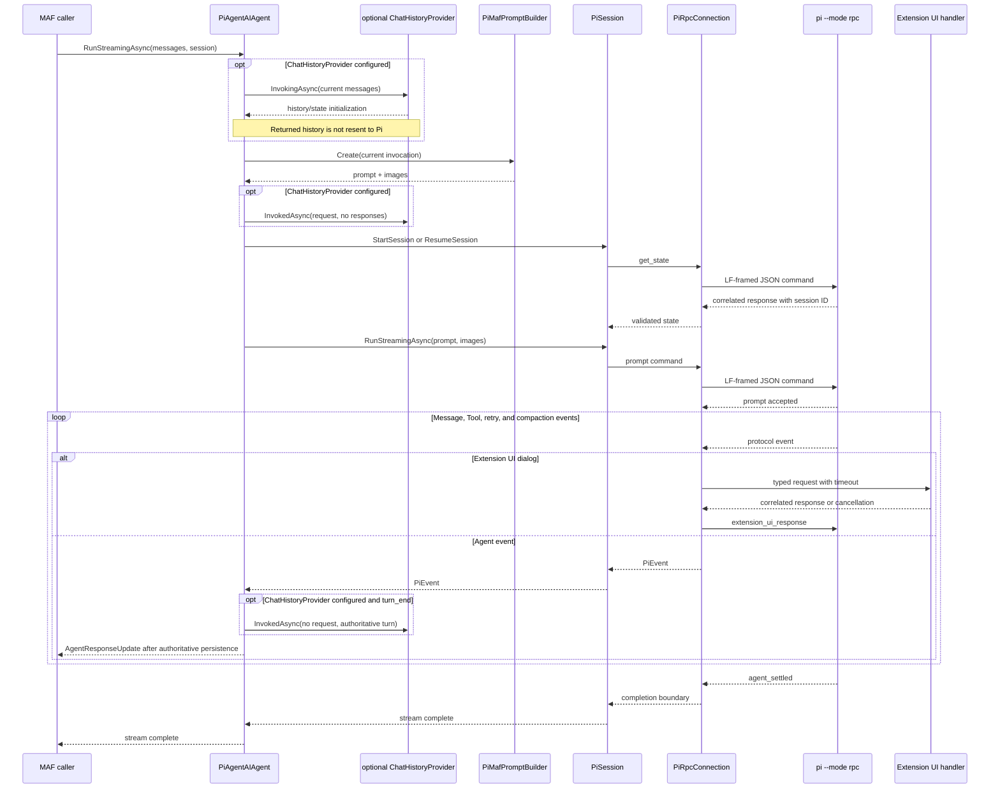

# PiAgentSdk.MAF

`PiAgentSdk.MAF` adapts the stateful Pi RPC client from [`PiAgentSdk`](https://github.com/zxyao145/agw/blob/main/src/sdks/pi-agent-sdk-csharp/src/PiAgentSdk/README.md) to Microsoft Agent Framework's `AIAgent`, `AgentSession`, `AgentResponse`, and `AgentResponseUpdate` contracts. An absolute repository link is used because this file is also rendered as the NuGet package README.

Use this project when an application already executes Agents through Microsoft Agent Framework. Use `PiAgentSdk` directly when the caller wants raw `PiEvent` values and does not need MAF message, session, history, or middleware integration.

## Basic Streaming Usage

```csharp
using Microsoft.Agents.AI;
using Microsoft.Extensions.AI;
using PiAgentSdk;
using PiAgentSdk.MAF;

await using var agent = new PiAgentAIAgent(
    new PiAgentAIAgentOptions
    {
        GlobalOptions = new PiAgentOptions
        {
            CommandTimeout = TimeSpan.FromSeconds(30),
            AbortGracePeriod = TimeSpan.FromSeconds(5),
        },
        SessionOptions = new PiSessionOptions
        {
            WorkingDirectory = "/path/to/project",
            SessionDir = "/path/to/pi-sessions",
            ProjectTrust = PiProjectTrust.Deny,
            NoExtensions = true,
        },
        HistoryPersistenceTimeout = TimeSpan.FromSeconds(30),
    }
);

AgentSession session = await agent.CreateSessionAsync();
var request = new ChatMessage(ChatRole.User, "Inspect the project and summarize its architecture.");

await foreach (AgentResponseUpdate update in agent.RunStreamingAsync([request], session))
{
    foreach (var text in update.Contents.OfType<TextContent>())
    {
        Console.Write(text.Text);
    }
}
```

Construction and `CreateSessionAsync` do not start Pi. The child process is created lazily when the first run binds the MAF session to a live `PiSession`.

## Non-Streaming Usage

```csharp
AgentResponse response = await agent.RunAsync(
    [new ChatMessage(ChatRole.User, "Run the relevant checks and report the result.")],
    session
);

foreach (ChatMessage message in response.Messages)
{
    Console.WriteLine(message.Text);
}

UsageDetails? usage = response.Usage;
```

The non-streaming response contains authoritative completed-turn messages, accumulated usage, and fatal provider errors. Transport failures remain exceptions.

## Persistent Sessions and Resume

For a new session, `OnSessionStartedAsync` runs once after Pi returns its provider session ID. Persist that ID with the application's own session binding:

```csharp
string? savedSessionId = null;

var options = new PiAgentAIAgentOptions
{
    SessionOptions = new PiSessionOptions
    {
        WorkingDirectory = "/path/to/project",
        SessionDir = "/path/to/pi-sessions",
    },
    OnSessionStartedAsync = (sessionId, cancellationToken) =>
    {
        savedSessionId = sessionId;
        return ValueTask.CompletedTask;
    },
};
```

To rebuild the runtime later, create a new Agent with the stored ID and `IsResume=true`:

```csharp
await using var resumedAgent = new PiAgentAIAgent(
    options with
    {
        SessionId = savedSessionId ?? throw new InvalidOperationException("Pi did not report a session ID."),
        IsResume = true,
        OnSessionStartedAsync = null,
    }
);

AgentSession resumedSession = await resumedAgent.CreateSessionAsync();
```

MAF session serialization also preserves the `PiAgentSession.SessionId` and normal `StateBag`. `NoSession=true` is ephemeral and cannot be combined with resume state or a session-start callback.

## Chat History Semantics

Set `PiAgentAIAgentOptions.ChatHistoryProvider` when the host needs Agw-style display and audit history:

```csharp
var optionsWithHistory = options with
{
    ChatHistoryProvider = historyProvider,
};
```

Here, `historyProvider` is a host-provided `ChatHistoryProvider` implementation.

Pi remains the source of model-side conversation history:

- `InvokingAsync` is called so the provider can initialize and read MAF session state.
- Messages returned by `InvokingAsync` are deliberately not appended to the Pi prompt.
- Current request messages are persisted before Pi starts the run.
- Every authoritative `turn_end` Assistant/Tool message is persisted incrementally.
- Text deltas and partial Tool output are never persisted as authoritative history.
- Cancellation, exceptions, and early stream disposal retain completed-turn persistence.
- Request/turn persistence and the session-start callback ignore caller cancellation but are bounded by `HistoryPersistenceTimeout`.

## Prompt and Event Mapping

The prompt builder uses only messages supplied for the current invocation. It preserves System, Assistant handoff, User, and Tool text in order; it does not send private `TextReasoningContent` back to Pi. User `DataContent` images become Pi base64 image attachments.

| Pi protocol input | MAF handling |
|---|---|
| `text_delta` | `TextContent` |
| `thinking_delta` | `TextReasoningContent` |
| `toolcall_end` | One informational `FunctionCallContent` |
| `tool_execution_end` | `FunctionResultContent` and optional `ErrorContent` |
| `turn_end` | Persisted authoritative Assistant/Tool history and non-streaming response messages |
| `message_end`/`turn_end` without a streamed block | The missing authoritative Assistant content block |
| Final retry, compaction, or provider failure | Fatal `ErrorContent` |
| Authoritative usage boundaries | `UsageContent` or `AgentResponse.Usage` |

Pi executes its own Tools. `FunctionCallContent.InformationalOnly` is set so a MAF function loop must not execute the same Tool Call again.

## Extension UI

For trusted Pi extensions, keep discovery disabled, load explicit files, and configure the typed Core SDK handler through `SessionOptions.ExtensionUiHandler`:

```csharp
static ValueTask<PiExtensionUiResponse> HandleUiAsync(
    PiExtensionUiRequest request,
    CancellationToken cancellationToken
)
{
    if (request.Method == "confirm")
    {
        return ValueTask.FromResult(
            new PiExtensionUiResponse
            {
                Id = request.Id,
                Confirmed = true,
            }
        );
    }

    return ValueTask.FromResult(PiExtensionUiResponse.Cancel(request.Id));
}

var optionsWithUi = options with
{
    SessionOptions = options.SessionOptions with
    {
        NoExtensions = true,
        Extensions = ["/trusted/extensions/approval.ts"],
        ExtensionUiHandler = HandleUiAsync,
    },
};
```

Dialog responses must use the matching request ID. Select handlers should return one of `request.Options`. Pi-provided dialog timeouts are enforced by the Core RPC layer. Fire-and-forget notification, status, widget, title, and editor-text events remain ordinary System updates.

## MAF Data Flow



## Lifetime and Middleware

`PiAgentAIAgent` implements `IAsyncDisposable` and owns every live Pi RPC process created for its MAF sessions. Always dispose the concrete owner.

Current MAF `.AsBuilder().Use(...).Build()` wrappers do not forward `IAsyncDisposable`. If middleware is added, retain the original owner explicitly:

```csharp
await using var piOwner = new PiAgentAIAgent(options);
AIAgent composedAgent = piOwner
    .AsBuilder()
    .Use(
        runFunc: static (messages, session, runOptions, innerAgent, cancellationToken) =>
            innerAgent.RunAsync(messages, session, runOptions, cancellationToken),
        runStreamingFunc: static (messages, session, runOptions, innerAgent, cancellationToken) =>
            innerAgent.RunStreamingAsync(messages, session, runOptions, cancellationToken)
    )
    .Build();

AgentSession composedSession = await composedAgent.CreateSessionAsync();
// Execute composedAgent while piOwner remains in scope.
```

Each `PiSession` permits one active run. Cancellation or early stream disposal sends `abort` and drains to `agent_settled`; if Pi does not settle within `AbortGracePeriod`, the process tree is killed and that live session object becomes unusable. Persistent state can then be reopened through a new resumed Agent.

## Verification

From the repository root, default tests use fake transports and never launch a real Pi CLI:

```bash
dotnet test src/sdks/pi-agent-sdk-csharp/tests/PiAgentSdk.MAF.Tests
dotnet csharpier check src/sdks/pi-agent-sdk-csharp/src/PiAgentSdk.MAF
```
