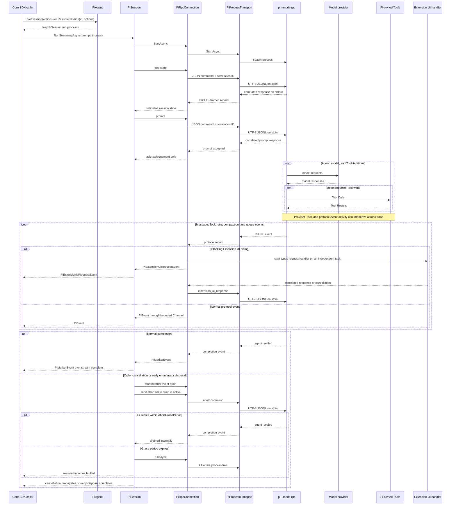

# PiAgentSdk

`PiAgentSdk` is the Core .NET 10 client for running the Pi coding agent as a long-lived `pi --mode rpc` child process. It exposes raw Pi protocol events, persistent provider sessions, cancellation, process cleanup, and typed Extension UI requests without depending on Microsoft Agent Framework.

Use this project when the caller wants direct control over `PiSession` and `PiEvent`. For MAF integration, use [`PiAgentSdk.MAF`](https://github.com/zxyao145/agw/blob/main/src/sdks/pi-agent-sdk-csharp/src/PiAgentSdk.MAF/README.md). See the [SDK overview](https://github.com/zxyao145/agw/blob/main/src/sdks/pi-agent-sdk-csharp/README.md) for installation, compatibility, and Agw integration notes. Absolute repository links are used because this file is also rendered as the NuGet package README.

## Quick Start

```csharp
using PiAgentSdk;

var agent = new PiAgent(
    new PiAgentOptions
    {
        CommandTimeout = TimeSpan.FromSeconds(30),
        AbortGracePeriod = TimeSpan.FromSeconds(5),
    }
);

await using PiSession session = agent.StartSession(
    new PiSessionOptions
    {
        WorkingDirectory = "/path/to/project",
        SessionDir = "/path/to/pi-sessions",
        ProjectTrust = PiProjectTrust.Deny,
        NoExtensions = true,
    }
);

PiTurn turn = await session.RunAsync("Inspect this project and summarize its architecture.");
Console.WriteLine(turn.FinalResponse);
Console.WriteLine($"Pi session: {session.Id}");
```

Creating `PiAgent` or `PiSession` does not locate or start the CLI. The process starts lazily when the first operation calls `EnsureStartedAsync`, `RunAsync`, `RunStreamingAsync`, or `AbortAsync`.

## Streaming Raw Events

`RunStreamingAsync` yields events in Pi arrival order and completes only at `agent_settled`:

```csharp
await foreach (PiEvent evt in session.RunStreamingAsync("Run the relevant checks."))
{
    switch (evt)
    {
        case PiMessageUpdateEvent { AssistantMessageEvent: PiTextDelta text }:
            Console.Write(text.Delta);
            break;

        case PiToolExecutionEvent { Type: "tool_execution_start" } tool:
            Console.WriteLine($"Starting Tool: {tool.ToolName}");
            break;

        case PiToolExecutionEvent { Type: "tool_execution_end", IsError: true } tool:
            Console.WriteLine($"Tool failed: {tool.ToolName}");
            break;

        case PiTurnEndEvent turnEnd:
            Console.WriteLine($"Completed turn with {turnEnd.ToolResults.Count} Tool Results.");
            break;
    }
}
```

The RPC response to `prompt` is only an acknowledgement that Pi accepted the command. `agent_end` completes one low-level Agent pass but may be followed by retry, compaction, or queued continuation. `agent_settled` is the session-level completion boundary.

## Persistent Sessions and Resume

After startup, `PiSession.Id` contains the provider-issued string identifier and `PiSession.SessionFile` contains Pi's JSONL path when persistence is enabled.

```csharp
string sessionId = session.Id ?? throw new InvalidOperationException("Pi did not report a session ID.");

await using PiSession resumed = agent.ResumeSession(
    sessionId,
    new PiSessionOptions
    {
        WorkingDirectory = "/path/to/project",
        SessionDir = "/path/to/pi-sessions",
        NoExtensions = true,
    }
);

PiTurn nextTurn = await resumed.RunAsync("Continue from the previous session.");
```

Resume performs a new `get_state` handshake and fails if Pi reports a different ID. A forced kill does not delete the persistent JSONL file, but the killed `PiSession` object remains faulted; create a new object with `ResumeSession`. Recovery reaches Pi's last persisted entry and may not include in-flight Tool state that had not been written.

`NoSession=true` disables persistence and cannot be resumed.

## Images

Attach base64 image data to either streaming or non-streaming runs:

```csharp
var image = new PiImage(
    Convert.ToBase64String(await File.ReadAllBytesAsync("diagram.png")),
    "image/png"
);

PiTurn turnWithImage = await session.RunAsync("Explain this diagram.", [image]);
```

## Extension UI

Trusted Pi extensions can request select, confirm, input, and editor dialogs through `PiSessionOptions.ExtensionUiHandler`:

```csharp
static ValueTask<PiExtensionUiResponse> HandleUiAsync(
    PiExtensionUiRequest request,
    CancellationToken cancellationToken
)
{
    if (request.Method == "confirm")
    {
        return ValueTask.FromResult(
            new PiExtensionUiResponse
            {
                Id = request.Id,
                Confirmed = true,
            }
        );
    }

    return ValueTask.FromResult(PiExtensionUiResponse.Cancel(request.Id));
}

await using PiSession interactiveSession = agent.StartSession(
    new PiSessionOptions
    {
        WorkingDirectory = "/path/to/project",
        NoExtensions = true,
        Extensions = ["/trusted/extensions/approval.ts"],
        ExtensionUiHandler = HandleUiAsync,
    }
);
```

`NoExtensions=true` disables discovery from Pi settings while explicit `Extensions` paths are still loaded. This is the preferred mode for server processes: only pass extension files already trusted by the host. The response ID must match the request. Select handlers should return one of `request.Options`. Pi-provided dialog timeouts are enforced with a linked cancellation token. Missing handlers, timeouts, cancellation, mismatched IDs, and handler failures return a cancelled response. Dialog work runs on an independent task, so the stdout pump never waits for user input.

Notification, status, widget, title, and editor-text requests are fire-and-forget events and remain visible in the normal `PiEvent` stream.

## Architecture

| Component | Responsibility |
|---|---|
| `PiAgent` | Validates global options and creates lazy new or resumed sessions. |
| `PiSession` | Owns the run gate, handshake, prompt lifecycle, authoritative turn collection, abort/drain, and fault state. |
| `PiRpcConnection` | Starts the transport, correlates command responses by ID, dispatches events, handles Extension UI, and completes pending operations on every terminal path. |
| `PiProcessTransport` | Owns `Process`, serialized stdin writes, the stdout reader, the bounded stderr pump, process-tree kill, and asynchronous disposal. |
| `PiJsonlReader` | Reads strict LF-framed JSONL with UTF-8 validation and a bounded record size. |
| `PiProtocolJson` | Deserializes polymorphic messages, content, deltas, and events while preserving unknown variants as raw JSON. |
| `PiProcessEnvironment` | Builds a sanitized environment and applies explicit global/session overrides. |
| `PiProcessTarget` | Resolves direct executables and trusted Windows npm shims without routing arguments through `cmd.exe /c`. |

The implementation has four important boundaries:

1. **Lazy ownership:** one `PiSession` owns one RPC connection and, after startup, one child process.
2. **Command/event separation:** command responses complete ID-correlated pending requests; all other JSON records enter the bounded event Channel.
3. **Single active run:** a Session rejects concurrent prompts immediately while still allowing serialized protocol writes such as Extension UI responses.
4. **Terminal cleanup:** timeout, caller cancellation, write failure, process exit, kill, and disposal remove or fault pending work instead of leaving awaiters behind.

## Core Data Flow



## Concurrency and Backpressure

- A `PiSession` allows exactly one active `RunAsync` or `RunStreamingAsync` call.
- RPC command IDs are GUID strings and pending requests are stored independently from streamed events.
- stdin writes are serialized so prompts, aborts, and Extension UI responses cannot interleave bytes.
- The event Channel holds at most 256 events and applies backpressure to the stdout pump.
- Cancellation and early stream disposal drain buffered events concurrently with the abort command, allowing its response to be parsed even when the Channel was full.
- A JSONL record is limited to 4 MiB; oversized or invalid UTF-8 records fail the connection.
- stderr retains only the latest 64 KiB for process-exit diagnostics.

## Cancellation, Kill, and Disposal

Caller cancellation or early stream disposal follows this cleanup path:

1. Start draining buffered events with an internal cleanup token.
2. Send `abort` while that drain is active, then await both the correlated response and `agent_settled`.
3. If `AbortGracePeriod` expires, kill the entire process tree.
4. Fault pending operations and mark the current `PiSession` unusable after a kill.
5. Propagate caller cancellation after cleanup; early enumerator disposal completes normally after cleanup.

`DisposeAsync` is idempotent and terminates the owned process. Always dispose every Session, including sessions that failed during startup or execution.

## Environment and Security

The child process does not inherit the complete host environment. The safe base includes process essentials, locale (`LC_` prefix matching), Windows process variables, proxy variables, and common certificate trust variables. Explicit `PiAgentOptions.EnvironmentVariables` values overlay that base, followed by `PiSessionOptions.EnvironmentVariables`.

Provider API keys, `NODE_OPTIONS`, SSH-agent variables, and cloud credentials are not inherited implicitly. Supply required credentials explicitly or through Pi's configured `~/.pi/agent` files. The SDK does not log raw prompts, reasoning, Tool payloads, stdout, or environment-variable values.

`PiProjectTrust.Deny` is the default and emits `--no-approve`. This prevents implicit project trust but is not an operating-system sandbox. Run untrusted or unattended workloads inside an external container, VM, or equivalent policy boundary.

## Exceptions

| Exception | Meaning |
|---|---|
| `PiRpcException` | Pi returned an unsuccessful response for a correlated command. |
| `PiCommandTimeoutException` | A command exceeded `CommandTimeout`. |
| `PiProtocolException` | Pi emitted invalid, oversized, or incompatible protocol data. |
| `PiProcessExitException` | The RPC child process exited unexpectedly. |
| `PiSessionBusyException` | A second run was attempted while the Session was active. |

Caller cancellation remains `OperationCanceledException` and is not converted into a provider failure.

## Verification

From the repository root, default tests use fake transports plus short-lived generated helper processes for transport lifecycle coverage. They never start a real Pi CLI:

```bash
dotnet test src/sdks/pi-agent-sdk-csharp/tests/PiAgentSdk.Tests
dotnet csharpier check src/sdks/pi-agent-sdk-csharp/src/PiAgentSdk
```
