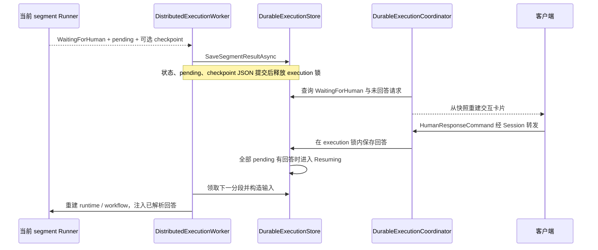

# Durable HumanInteraction：保存等待边界并恢复人工回答

本目录把运行时人工请求转换为可持久化快照，并向恢复后的交互工具提供已经保存的回答。当前 segment 遇到需要人工处理的请求后结束，等待期间由数据库保存执行事实；回答到齐后，Worker 领取新的 segment 继续。

先读 [HumanInteraction 总览](../README.md) 了解交互契约，再按本文的“暂停原理 → Runner → 数据 → 提交 → 恢复”阅读。Worker 与启动入口见 [Runtimes README](../../Runtimes/README.md)，数据库状态和并发细节见 [Persistence README](../../Persistence/README.md)。

## 1. Durable 等待的整体过程

Durable 对应 `Execution:Provider=Distributed`。一次业务 execution 可以跨多个 segment；每个 segment 仍在某个 Worker 进程内执行，但不会通过长期保留该 segment 的 Task 来等待用户。



数据库状态通常经过：

```text
Queued → Running → WaitingForHuman → Resuming → Running
                       ↑                         │
                       └──── 下一次人工边界 ─────┘

Running → Completed / Failed
活动执行可通过显式中断进入 Interrupted
```

`Resuming` 表示回答已准备好、可以调度，不表示回答提交方法同步执行了 Agent。

## 2. 为什么先经过 MAF Approval

工具内部的 `await channel.RequestAsync(...)` 依赖当前调用栈，无法仅靠保存聊天消息恢复。Agw 通过 MAF 的 `ApprovalRequiredAIFunction` 在真正进入交互工具之前返回一个明确的请求，把执行控制权交还给 Runner。

[AgentRuntimeService.CreateDurableRuntimeAsync](../../Agents/Runtime/AgentRuntimeService.CreateRuntime.cs) 在构造 runtime 时启用 `DeferHumanInteractions`。[ToolRegistryService](../../../Agw.Tools/ToolRegistryService.cs) 在该标记启用且工具是 `HumanInteractionRequiredAIFunction` 时增加一层包装：

```text
ApprovalRequiredAIFunction
    └── HumanInteractionRequiredAIFunction
            └── ask_user_question 内层工具
```

两层职责不同：

| 包装层 | 暂停前 / 恢复后的作用 |
| --- | --- |
| MAF approval 外层 | 暂停前生成 `ToolApprovalRequestContent`；恢复时消费 approval 响应决定是否调用工具 |
| HumanInteraction 内层 | 真正执行时创建交互请求、取得结构化回答、校验并绑定参数 |

对问答而言，这是一次用户交互。外层提供恢复边界，恢复后的内层使用预回答 channel，不再次弹出问题。`FullAccess` 分类明确排除 `ask_user_question`，避免在没有持久回答时提前放行。

`DeferHumanInteractions` 是工具物化参数，不是当前 Provider 的别名；其他无人值守构造路径也可能启用它。是否形成持久等待，由外围 Runner、审批策略和 `HumanInteractionPolicy` 决定。

## 3. 普通 Agent 与 Agentflow 怎样结束分段

### 3.1 普通 System Agent：CaptureDurableApprovalHandler

[DurableAgentSegmentRunner](../../Agents/Runners/Durable/DurableAgentSegmentRunner.cs) 每个 segment 都重建 runtime，加载适用的 Agent session，并提供 `ResolvedHumanInteractionChannel`。

允许人工交互时，它将内部 `CaptureDurableApprovalHandler` 包在 `PermissionAwareApprovalHandler` 中。遇到不能自动批准的请求，capture handler：

1. 调用 `DurableHumanInteractionMapper.FromRequest` 保存 `PendingInteraction`。
2. 创建并记住专用的 `AgwException` 对象。
3. 通过 `ConversationHistoryPersistenceContext.IgnoreInterruption` 标记预期中断。
4. 立即抛出该异常，退出当前 approval 调用。

Runner 的异常筛选通过 `ReferenceEquals` 确认是自己创建的中断，将其转换为 `WaitingForHuman` 分段结果。其他异常进入失败处理。当前 capture handler 捕获首个请求就结束该 Agent segment，因此返回一个 pending 项。

首段 `SegmentIndex == 0` 使用原始用户输入；后续分段把持久回答转换成 `ChatRole.User` 的 MAF approval 消息，通过 `ExecuteDurableSegmentStreamingAsync` 继续保存的 session。

Agent session 的保存位于 [AgentRuntimeService.Execution](../../Agents/Runtime/AgentRuntimeService.Execution.cs) 的执行清理路径。普通 Agent 的这条等待结果可以没有 workflow checkpoint；恢复主要依靠 session 和工具请求快照。

### 3.2 Agentflow：外部请求与 checkpoint

[DurableAgentflowSegmentRunner](../../Agentflows/Runners/Durable/DurableAgentflowSegmentRunner.cs) 直接消费 workflow 事件：

1. 首段调用 MAF `InProcessExecution.RunStreamingAsync`；后续分段从持久 checkpoint 调用 `ResumeStreamingAsync`。
2. 仅首段发送启动 `TurnToken`；恢复后的 run 自己恢复队列并重新发布待处理请求。
3. 收到 `RequestInfoEvent`，区分 checkpoint marker、工具审批和 HumanGate。
4. 按 `RequestId` 找到已解析回答时发送响应，并登记到 `consumed`。
5. 未回答请求先经过权限判断；可以自动批准则直接继续，需要人工则加入 `pending`。
6. 在 `SuperStepCompletedEvent` 的人工等待边界取得 checkpoint，处理同时存在的 checkpoint marker，取消当前 run。
7. 返回 `WaitingForHuman`、全部 pending 和最新的 durable checkpoint。

人工等待没有可用 checkpoint 时返回失败。完成路径还会检查输入中是否存在未消费的已解析回答，防止恢复了不同请求却报告成功。

这里 MAF API 名称中的 `InProcessExecution` 表示单个 workflow run 在当前进程执行。跨 segment 的领取、状态和回答持久化由 Agw 负责，因此这仍是 Agw 的 Durable 路径。

这两类 Runner 不要求一个对称的 `DurableHumanGateApprovalCoordinator`：普通 Agent 使用内部 capture handler 截断，Agentflow 使用自身外部请求和 checkpoint 协议截断。

## 4. 本目录保存什么数据

[DurableHumanInteractionContracts.cs](Contracts/DurableHumanInteractionContracts.cs) 中的类型都是数据载体：

| 类型 | 内容 | 使用阶段 |
| --- | --- | --- |
| `DurableHumanInteractionSnapshot` | 请求、节点、工具调用、提示与重建载荷 | Runner 产出 pending；客户端重建卡片；恢复工具调用 |
| `DurableHumanResponseEnvelope` | execution / request ID、批准结果、文本、范围和结构化回答 | Store 保存人工响应 |
| `DurableResolvedInteraction` | 一条 Request 与对应 Response | 构造下一 segment 的输入 |
| `SubmitDurableHumanResponseRequest` | 从客户端 command 转换的提交参数 | Session → Coordinator → Store |

请求快照字段的分工如下：

| 字段 | 含义 |
| --- | --- |
| `RequestId` | 持久 pending 与 response 的关联键 |
| `Kind` | 交互分类；问答使用 `questions`，普通工具使用 `tool-approval`，HumanGate 保留请求 mode |
| `NodeId`、`NodeName` | 请求来源节点或 standalone 标识 |
| `ToolName`、`CallId` | 恢复工具调用、关联客户端工具输出 |
| `Prompt` | 展示提示 |
| `Payload` | 交互界面需要的结构化数据，或 HumanGate 的输入预览 |
| `Arguments` | 普通工具的参数副本；问答快照不保存这一份原始参数 |

### 4.1 DurableHumanInteractionMapper.FromRequest

[Mapper](DurableHumanInteractionMapper.cs) 对请求做三种转换：

| 输入 | 快照结果 |
| --- | --- |
| 能识别 `questions` 参数的 `ask_user_question` | `Kind=questions`；Payload 仅包含 questions / metadata；Arguments 为 null |
| 其他 MAF 工具审批 | `Kind=tool-approval`；保存工具名、CallId 和 JSON 参数副本 |
| 不带 MAF 工具审批的 HumanGate | Kind 保留 Mode；可把最后一条消息文本放入 `Payload.inputPreview` |

问题与答案必须分开：模型传入工具参数的 `answers` 不会进入问答 pending。真正答案只能由后续响应数据提供，再交给工具协议校验。这里是针对 `ask_user_question` 的明确分支，不是自动序列化所有 `IHumanInteractionProtocol` 的通用机制。

### 4.2 DurableHumanInteractionMapper.ToMessage

Mapper 根据快照重建 System 控制消息：`questions` 生成 `human-interaction-request`；其余有工具名的请求生成 `tool-approval-request`；没有工具名则生成 `human-gate-request`。

它按调用方提供的信息附上 `executionId` 和 `streamingScopeId`。Coordinator 的订阅路径传入 manifest 原始输入的消息标识，结合 `callId` 把卡片放回对应工具调用。Session 提交回答后重新展示剩余请求时，当前调用只传入 execution ID。

## 5. 请求先持久化，回答再推进状态

### 5.1 Worker 提交等待结果

[DistributedExecutionWorker](../../Runtimes/Durable/DistributedExecutionWorker.cs) 在 execution 分布式锁内领取并执行一段，将结果交给 [DurableExecutionStore.SaveSegmentResultAsync](../../Persistence/Durable/DurableExecutionStore.cs)。Store 校验状态、segment index 和预期 `StateVersion`，防止旧 Worker 覆盖新的执行状态。

等待结果更新同一条 execution 记录：

```text
Status                  = WaitingForHuman
SegmentIndex            = 当前分段索引 + 1
CheckpointJson          = 本段 checkpoint，或 null
PendingInteractionsJson = 本段 pending
ResponsesJson           = null
```

这些字段在一次状态保存中提交。这个原子性描述的是 execution 记录；聊天历史、普通 Agent SDK session 和独立 checkpoint occurrence 使用各自的持久化路径，不能推断它们全在同一事务中提交。

### 5.2 控制消息在提交后发布

[ExecutionStreamMessageSink](../../Outbound/Durable/ExecutionStreamMessageSink.cs) 会过滤人工请求和 `turn-finished` 控制消息，防止 runtime 在状态提交前把它们发布出去。普通输出仍进入事件流。

[DurableExecutionCoordinator.ReadAsync](../../Runtimes/Durable/DurableExecutionCoordinator.cs) 在读取事件流与持久状态后，从已提交的未回答 pending 合成交互消息。客户端因此不会回答一个尚未持久化的请求；事件流不可用时，持久状态仍能提供待回答卡片。

### 5.3 人工回答与批次完成

[DurableExecutionSession.RespondAsync](../../Runtimes/Durable/DurableExecutionSession.cs) 使用 command 的 `ExecutionId`，未提供时使用当前 attachment 的 execution ID，再携带连接用户 ID 转交 Coordinator。

Coordinator 校验请求参数，在 execution 锁内创建独立 DI scope 并调用 Store。Store 检查所有者、会话代次和请求关联：

- 当前保存的同一请求已有相同回答时幂等返回；已有不同回答时返回冲突。
- 没有已有回答时，要求 execution 为 `WaitingForHuman`，且请求 ID 存在于 pending。
- 回答追加到 `ResponsesJson`；全部 pending 都有回答后才进入 `Resuming`。
- Session 在提交后可以再次展示同批尚未回答的请求。

下一次 Worker 领取时，`DurableExecutionSnapshot.CreateSegmentInput` 要求每个 pending 恰好有一条对应回答，并校验 response 的 execution ID，随后创建 `DurableResolvedInteraction` 列表。

## 6. ResolvedHumanInteractionChannel 怎样交还答案

[ResolvedHumanInteractionChannel](ResolvedHumanInteractionChannel.cs) 不读数据库、不发布卡片、不等待客户端。Runner 在构造时已经传入本分段的全部已解析交互。

`RequestAsync` 的匹配顺序是：

1. 当前请求有 `CallId`，按 CallId 匹配。
2. 当前请求没有 CallId，按 ToolName 匹配。
3. 仍未匹配且列表只有一个交互时，使用唯一项兜底。
4. 否则抛出 `DurableExecutionConflict`。

返回值采用当前工具请求的 `RequestId`，把保存的 `Approved` 反向映射为 `Cancelled`，并返回原 `ResponseData`。

例如旧 approval 请求是 `approval-1`，工具调用是 `call-7`。恢复后的工具包装器生成新交互 ID `interaction-2`，channel 用 `call-7` 找到保存的答案，再返回 `RequestId=interaction-2`。这样既恢复了原工具答案，又满足包装器的请求 / 响应 ID 校验。

channel 不会消费或移除列表项。Agentflow 在外层维护 `consumed` 检查恢复请求；不能把 channel 的查询本身理解成恰好一次回答消费。

普通 Agent 恢复前还需要重建 MAF 响应：Runner 用快照中的工具名、CallId，以及 `Arguments ?? Payload` 创建 function call，再调用 `ToolApprovalSupport.CreateResponse`。只有 MAF 允许实际工具调用进入内层时，预回答 channel 才会被访问。

## 7. 权限、拒绝与运行限制

| 情况 | 当前处理 |
| --- | --- |
| FullAccess 下的普通工具审批 | 使用自动批准响应继续，不创建人工等待 |
| `HumanInteractionPolicy.Reject` 且仍需人工 | `UnattendedApprovalHandler` 明确失败 |
| 已保存的工具拒绝回答 | 恢复为 MAF 否定响应，由 MAF 处理；不保证调用内层问答工具的取消结果方法 |
| 已保存的 HumanGate 拒绝回答 | Runner 发布拒绝消息并取消当前 workflow run |
| SignalR 断开 | Session 取消订阅，持久 execution 与 pending 保留 |
| 缺少匹配回答或必要 checkpoint | 返回恢复冲突 / 失败，不能用猜测的数据继续 |

Durable 恢复直接使用持久化 `ApprovalScope` 创建响应，不重新进入 InProcess 的决策返回路径做范围归一。当前连接内的实时权限切换也不重写已登记的 durable manifest。两条路径的具体边界见 [Approvals README](../Approvals/README.md)。

Durable 普通 Agent 当前只支持 System Agent；不能把外部 SDK 的进程内交互桥接等同于已实现 Durable 支持。恢复中的定义和 checkpoint 也需要保持兼容。Worker 故障可能重试整个 segment，持久人工等待不提供所有外部副作用的恰好一次保证。

## 8. 验证入口

| 测试文件 | 可核对的行为 |
| --- | --- |
| [DurableExecutionStoreTests](../../../../../tests/Agw.Agents.Tests/DurableExecutionStoreTests.cs) | 等待到恢复的状态转换、回答幂等、缺失回答校验、预回答 channel、卡片重建 |
| [HumanGateApprovalCoordinatorTests](../../../../../tests/Agw.Agents.Tests/HumanGateApprovalCoordinatorTests.cs) | 问答快照排除模型 answers |
| [AgentflowRuntimeCharacterizationTests](../../../../../tests/Agw.Agents.Tests/AgentflowRuntimeCharacterizationTests.cs) | HumanGate 恢复、审批范围恢复、多个并行 HumanGate、无法恢复请求时失败 |
| [AgentflowRuntimeCheckpointTests](../../../../../tests/Agw.Agents.Tests/AgentflowRuntimeCheckpointTests.cs) | checkpoint 与 HumanGate 共存时恢复、不重复执行已越过的节点 |
| [ApprovalContinuationHistoryTests](../../../../../tests/Agw.Agents.Tests/ApprovalContinuationHistoryTests.cs) | 审批继续与会话重载时的工具分组及 reasoning 历史 |

这些测试用于核对各边界，不能单凭单元 / 特征测试推断整个集群已完成故障切换验证。部署与数据保护要求继续以 [Execution README](../../README.md) 和 Persistence 文档为准。
