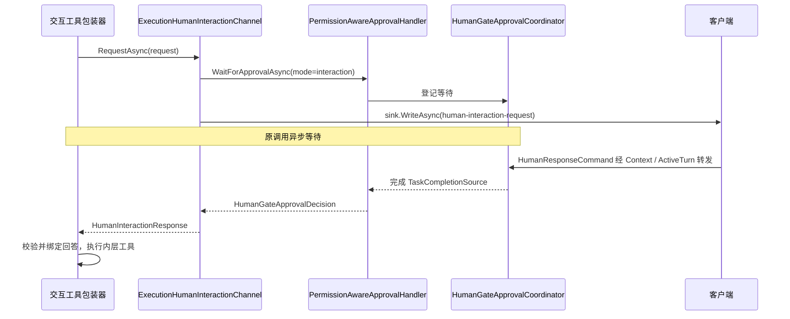

# InProcess HumanInteraction：在当前 turn 中等待回答

本目录实现进程内人工等待。执行在当前异步调用中暂停，用户回答后完成等待 Task，原 Agent 或 Agentflow 调用继续运行。等待不持续占用线程，但当前 turn、运行时对象和相关执行资源仍然存活。

整体契约与三种交互类型见 [HumanInteraction 总览](../README.md)，执行入口见 [Runtimes README](../../Runtimes/README.md)。本文按“装配 → 请求 → 响应 → 生命周期”展开；权限决策细节见 [Approvals README](../Approvals/README.md)。

## 1. 两个组件的分工

| 组件 | 实现的接口 | 职责 |
| --- | --- | --- |
| [ExecutionHumanInteractionChannel](ExecutionHumanInteractionChannel.cs) | `IHumanInteractionChannel` | 将工具交互转换成内部等待请求，发布结构化消息，再把决策转换回工具响应 |
| [HumanGateApprovalCoordinator](HumanGateApprovalCoordinator.cs) | `IHumanGateApprovalHandler` | 按 `RequestId` 登记等待、接收决策、批量批准工具请求和取消等待 |

Coordinator 不负责生成 UI payload，也不依赖 SignalR sink。Channel 不负责保存长期授权规则或写数据库。两者通过同一个审批契约连接。

## 2. RuntimeFactory 为每个 turn 装配能力

[RuntimeFactory.StartCoreAsync](../../Runtimes/InProcess/RuntimeFactory.cs) 分别为 Agent 和 Agentflow 创建本轮的：

```text
PermissionModeState
    └── PermissionAwareApprovalHandler
            └── HumanGateApprovalCoordinator

ExecutionHumanInteractionChannel
    ├── 同一个 PermissionAwareApprovalHandler
    └── 本轮 IExecutionMessageSink
```

Agent 的现有 `AgentSession` 会登记到权限状态中；Agentflow 的节点 session 在创建 / 获取时登记到共享的权限状态中。Runtime 可以跨 turn 复用，但 coordinator 与本轮 channel 不跨 turn 复用。

Factory 启动 `ActiveTurn` 时安装三组控制委托：

| 控制操作 | 委托作用 |
| --- | --- |
| 人工响应 | 调用 `coordinator.TrySubmitAsync` |
| 权限切换 | 调用 `approvalHandler.SetPermissionMode` |
| 执行中断 | 取消所有 pending；Agent 路径还取消当前 SDK 请求 |

实际执行委托通过 `HumanInteractionContextAccessor.Push` 暴露本轮 channel。执行结束后 scope 恢复旧值，工具通过 accessor 取得的能力因而与当前 turn 对齐。

## 3. ExecutionHumanInteractionChannel 的请求流程

`RequestAsync` 使用 `SemaphoreSlim(1, 1)` 串行化同一个 channel 上的交互调用。获得锁后，`RequestCoreAsync` 按以下顺序工作：

1. 创建与调用 token 关联的请求取消源。
2. 将 `HumanInteractionRequest` 转换为 `HumanGateApprovalRequest`：保留请求 ID 和 prompt，使用 `NodeId = "human-interaction"`、`Mode = "interaction"`，消息列表为空。
3. 调用 handler 的 `WaitForApprovalAsync`，先建立 pending 等待。
4. 用 `CreateMessage` 生成 `human-interaction-request`，写入 sink。
5. 等待 handler 的决策。
6. 返回相同请求 ID、`Cancelled = !Approved` 和 `ResponseData`。
7. 释放 channel 请求锁。

这里内部等待请求不需要携带完整问题 payload：payload 在 channel 发布的控制消息中，coordinator 只需要保存与响应关联的数据。



先登记、后发布的顺序保证快速返回的用户响应有对应等待者。写消息或等待阶段失败时，channel 会取消已建立的等待并观察其完成，清理过程中出现的次级异常不会覆盖原异常。

`CreateMessage` 产生 System 角色的 `AgwMessage`，将 `type`、`requestId`、`interactionKind`、`prompt`、`payload` 放进 `AdditionalProperties`，有来源信息时附上 `toolName` 与 `callId`。这套输出让客户端把问题放回对应的工具调用位置。

## 4. Coordinator 的状态与并发处理

Coordinator 的核心状态是：

```csharp
ConcurrentDictionary<string, PendingApproval> _pending;
```

每个 `PendingApproval` 包含原请求和 `TaskCompletionSource<HumanGateApprovalDecision>`。TaskCompletionSource 使用 `RunContinuationsAsynchronously`，避免在响应提交路径中同步展开后续执行调用。

### 4.1 登记和等待

`WaitForApprovalAsync` 用 `GetOrAdd` 按请求 ID 取得 pending，调用 `_pendingChanged(request)` 通知人工等待状态，再通过 `pending.Source.Task.WaitAsync(cancellationToken)` 等待。

等待完成或调用 token 取消后，`finally` 尝试移除记录并通知 `_pendingChanged(null)`。同 ID 的等待会取得同一 pending；调用方仍应给不同请求使用不同 ID。

字典可以索引多个 pending，但 channel 的串行锁只约束经该 channel 发起的交互。直接调用审批 handler 的路径不经过这把锁。`_pendingChanged` 是当前请求 / 清空通知，不是全部 pending 的持久化列表。

### 4.2 提交响应

`TrySubmitAsync` 检查取消状态、非空请求 ID，并用 `TryRemove` 取得等待记录。随后把 command 中的批准结果、文本、范围和结构化数据完整复制到决策，调用 `TrySetResult`。

没有匹配项或请求已经被取走时返回 `false`。因此晚到响应、重复提交不会完成下一轮的其他等待。这里没有 Durable 那种数据库回答幂等记录；当前等待结束后，内存项就被移除。

Coordinator 负责关联，不验证业务答案是否合法。答案的字段、选项和内容限制由工具的 `IHumanInteractionProtocol.BindResponse` 校验。

### 4.3 批量放行与取消

`ApprovePendingToolRequests` 遍历字典快照，使用 `PermissionAwareApprovalHandler.IsToolApproval` 筛选普通工具审批。成功移除后返回 `Approved = true`、`ApprovalScope = "always-tool"`，并通知等待状态变化。HumanGate、`mode=interaction` 和 `ask_user_question` 不在自动放行范围。

`CancelAll` 则移除所有 pending 并取消对应 Task。这是中断执行时的协作式清理机制，不会把取消伪装成用户批准。

## 5. 三种请求如何到达同一个 coordinator

| 来源 | 请求发布和等待位置 | 收到响应后的处理 |
| --- | --- | --- |
| 通用用户交互 | `ExecutionHumanInteractionChannel` | 将 `Approved` 反向映射为 `Cancelled`，把 `ResponseData` 交给工具协议 |
| 普通 Agent 工具审批 | [AgentRuntime](../../Agents/Runtime/AgentRuntime.cs) 的 approval 循环 | `ToolApprovalSupport.CreateResponse` 生成 MAF 响应，开始下一轮执行 |
| Agentflow 工具审批 | [InProcessAgentflowRunner](../../Agentflows/Runners/InProcess/InProcessAgentflowRunner.cs) 的 `RequestInfoEvent` 分支 | 创建符合 workflow 端口类型的响应并调用 `run.SendResponseAsync` |
| Agentflow HumanGate | 同一个 Runner 的 HumanGate 分支 | 批准则追加 human 消息并继续，拒绝则取消 run 并发送拒绝消息 |

HumanGate 分支也先建立 approval Task 再发布请求。普通工具审批的现有循环使用 `RequiresHumanResponse` 决定是否发卡片，再调用 `WaitForApprovalAsync`；不要把 channel 的登记顺序当成所有审批调用方都已经统一采用的顺序。

Agent 的非流式执行还会由 RuntimeFactory 套上 `MessageSinkApprovalHandler`，使需要人工处理的工具审批消息能够直接写入 sink。通用问答 channel 本来就直接持有 sink，所以不依赖普通模型输出是否缓冲。

## 6. 响应入口、断线与释放

响应路径为：

```text
HumanResponseCommandHandler.HandleAsync
    → ExecutionConnectionContext.SubmitHumanDecisionAsync
    → RuntimeBase.TrySubmitHumanResponseAsync
    → ActiveTurn.TrySubmitHumanResponseAsync
    → HumanGateApprovalCoordinator.TrySubmitAsync
```

Context 在转发前建立连接所有者的用户上下文。当前没有 Runtime，或没有匹配的活动请求时，它发送 `No matching HumanGate request is waiting for this response.` 系统消息。

| 情况 | 当前行为 |
| --- | --- |
| 用户提交答案 | 完成等待，继续原工具调用 |
| 用户取消通用问答 | channel 返回 `Cancelled=true`；问答协议生成取消结果，未必结束整个 turn |
| 用户拒绝 HumanGate | Runner 停止 workflow |
| 显式中断或 Host 关闭 | 取消 pending 和执行 token，等待执行清理 |
| SignalR 断线且正在等待人工 | `ExecutionConnectionContext.PrepareForDetach` 请求中断 turn |
| SignalR 断线但仍在普通执行 | 后台 turn 可继续持久化与收尾；detached sink 丢弃输出 |
| 服务进程退出 | 已保存的历史等数据仍可保留，当前 pending Task 无法由此恢复 |

RuntimeBase 的完全空闲屏障覆盖执行和清理。复用 Runtime 或释放连接 scope 时等待该屏障，避免旧等待和取消源继续进入下一轮。生命周期细节见 [Runtimes README](../../Runtimes/README.md)。

## 7. 阅读与验证入口

| 测试文件 | 可核对的行为 |
| --- | --- |
| [ExecutionHumanInteractionChannelTests](../../../../../tests/Agw.Agents.Tests/ExecutionHumanInteractionChannelTests.cs) | 结构化消息字段、等待匹配回答、回答数据返回 |
| [HumanGateApprovalCoordinatorTests](../../../../../tests/Agw.Agents.Tests/HumanGateApprovalCoordinatorTests.cs) | 决策字段、授权范围、ResponseData 和 ActiveTurn 转发 |
| [PermissionAwareApprovalHandlerTests](../../../../../tests/Agw.Agents.Tests/PermissionAwareApprovalHandlerTests.cs) | 动态 FullAccess 放行普通工具，同时保留问答等待 |
| [ExecutionConnectionTests](../../../../../tests/Agw.Agents.Tests/ExecutionConnectionTests.cs) | idle、running、waiting-for-human 下的断线处理 |
| [AgentflowRuntimeCharacterizationTests](../../../../../tests/Agw.Agents.Tests/AgentflowRuntimeCharacterizationTests.cs) | HumanGate 批准 / 拒绝、缺少交互能力和输出顺序 |

这些文件是行为验证入口，不代表所有取消、竞态和错误分支都已有单独测试。开发时从需要改变的行为选择测试，不为文档阅读运行真实外部 Agent CLI。
