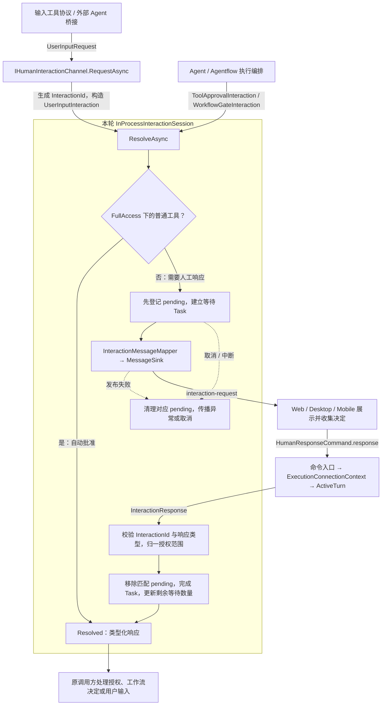
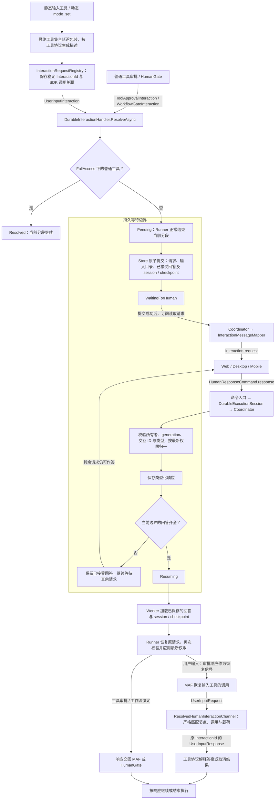

# HumanInteraction

执行缺少人的决定时，通过本模块请求决定，再继续原来的调用。

| 场景 | 请求 / 响应 | 使用位置 | 拒绝或取消的结果 |
| --- | --- | --- | --- |
| 工具需要授权 | `ToolApprovalInteraction` / `ToolApprovalDecision` | Agent、Agentflow 的 MAF 工具审批边界 | 工具不执行，拒绝结果交回 Agent |
| 工作流需要人决定是否继续 | `WorkflowGateInteraction` / `WorkflowGateDecision` | Agentflow 的 HumanGate 节点 | 终止整个工作流，取消剩余等待 |
| 工具需要答案、确认或其他输入 | `UserInputInteraction` / `UserInputResponse` | `IHumanInteractionProtocol`，例如问答、模式切换；外部 Agent 的输入桥接 | 返回工具协议定义的取消结果 |

三类请求共享关联与生命周期。`FullAccess` 只自动批准普通工具；用户输入和显式 HumanGate 始终需要真实响应。执行中断是独立的取消操作。

## 从哪里接入

| 要做的事 | 入口 | 模块承担的工作 |
| --- | --- | --- |
| 工具向人获取输入 | [IHumanInteractionProtocol](../../Agw.Tools/HumanInteraction/IHumanInteractionProtocol.cs)，由 `HumanInteractionRequiredAIFunction` 调用 channel | 分配交互 ID、发布、等待或恢复；工具解释答案 |
| 执行层提交人工决定请求 | [IInteractionHandler.ResolveAsync](Application/IInteractionHandler.cs) | 返回 `Resolved` 或 `Pending`，调用方无需发布卡片或预登记等待 |
| 接收客户端回答 | [HumanResponseCommandHandler](../Commands/Hitl/HumanResponseCommandHandler.cs) | 命令翻译、执行与用户校验；向交互模块传递类型化响应 |
| 修改权限规则 | [InteractionRules](Application/InteractionRules.cs) | 两种执行方式共用归一和响应校验 |
| 修改 SDK 审批适配 | [MAF Adapter](Infrastructure/Maf/README.md) | MAF 内容转换、SDK 请求关联、session 授权缓存 |

纯数据契约和工具 channel 位于 [Agw.Agents.Contracts](../../Agw.Agents.Contracts/Execution/HumanInteraction.cs)。`HumanInteraction/Application` 不依赖 MAF、SignalR 或数据库。客户端消息仅由 [InteractionMessageMapper](../Outbound/InteractionMessageMapper.cs) 投影。

## 装配位置与两条执行链

下图以允许人工交互的执行为例，箭头标明请求、响应和恢复数据的流向。无人值守请求的拒绝策略见 [权限规则](Application/README.md)。

**InProcess**：`RuntimeFactory` 为一轮执行创建一个 `InProcessInteractionSession`，同时作为 handler 和 channel，通过 `HumanInteractionContextAccessor.Push` 限定到本轮。session 在同一操作内完成登记、发布、等待和清理；响应提交按 ID 和变体校验。Agentflow 可同时等待多个节点，连接的等待状态来自整个 pending 集合。



即使客户端在发布请求期间立即响应，pending 也已经存在。用户输入经 channel 返回工具协议；工具审批和 HumanGate 的响应交还执行编排，分别执行上表中的继续、拒绝或取消语义。

**Durable**：`AgentCapabilityComposer` 在所有工具生成 provider 后加入 `DeferredHumanInteractionProvider`，因此静态问答和动态 `mode_set` 采用相同的暂停机制。Runner 得到 `Pending` 后正常结束分段；Store 将请求与 session / checkpoint 一起提交，Coordinator 才发布卡片。恢复后的工具通过 `ResolvedHumanInteractionChannel` 取得同一逻辑交互的回答。



Durable 的等待由持久状态承载，暂停期间不保留原调用 Task。恢复可能进入下一个人工边界；同一批工具在后续分段仍可能需要前面已接受的答案，因此输入目录和回答随恢复状态一起保留。

交互 ID 只在逻辑交互建立时生成一次；业务节点、SDK 调用和 SDK 请求端口分别保存，不按工具名或“只剩一条回答”推测关联。外部 Agent 的桥接仍只使用 InProcess channel。

## 新增需要人工输入的工具

工具在自己的实现或物化位置声明输入协议；权限层按 `UserInputInteraction` 类型处理，无需维护一份 FullAccess 例外工具名单。接入步骤如下：

1. **在工具所属模块实现 `IHumanInteractionProtocol`。** 协议负责提示、载荷、答案校验和取消结果：

   | 方法 | 负责的内容 |
   | --- | --- |
   | `CreateRequest(arguments)` | 返回 `UserInputRequest(inputKind, prompt, payload)`，说明需要用户提供什么 |
   | `BindResponse(arguments, response)` | 校验 `ResponseData`，把真实用户输入绑定到内部工具参数；保留 `arguments.Services` |
   | `CreateCancelledResult(arguments, response)` | 返回工具定义的取消结果；包装器不会再执行内部工具 |

   协议不生成 `InteractionId`，也不发布消息或自行等待客户端。需要控制跨分段保存的调用参数时，显式提供 `UserInputRequest.Arguments`；不要把模型传入的答案当作用户回答。

2. **用 `HumanInteractionRequiredAIFunction` 包装原工具。** 以下使用 [完整示例](Extending.md) 中的 `TitleInputProtocol`：

   ```csharp
   var function = AIFunctionFactory.Create(
       (string suggestedTitle, string title) => title,
       new AIFunctionFactoryOptions { Name = "choose_title" });
   var tool = new HumanInteractionRequiredAIFunction(function, new TitleInputProtocol());
   ```

   静态工具在 `ToAITool` 或物化时返回包装后的函数，可参考 [ask_user_question](../../Agw.Tools/Impl/Basic/AskUserQuestionTool.cs)。动态工具在生成它的 provider 之后包装，可参考 [mode_set](../../Agw.Tools/ToolBlocks/Blocks/Mode/ModeSetHumanInteractionProvider.cs)。通过现有 `AgentCapabilityComposer` 装配后，Durable 的 `DeferredHumanInteractionProvider` 会在最终工具集合上识别协议并建立暂停边界。

3. **接入客户端展示。** 复用已有 `inputKind` 时遵循其载荷和响应格式；新增形式时，在共享 `chat-core` 解析层、Web/Desktop 的 `chat` 面板及 `chat-native` 面板增加对应展示。客户端提交 `kind: "user-input"`、原 `interactionId`、`cancelled` 和可选 `responseData`。

4. **验证两条执行链。** 覆盖真实输入、无效答案、取消不执行内部工具、FullAccess 仍需输入，以及 Durable 暂停恢复后的身份和答案关联。参考 `BuiltInInteractionIntegrationTests` 和 `MafInteractionIntegrationTests`。

新增输入工具通常只涉及工具协议与对应 UI；`InteractionRules`、pending 管理、Durable Store / Runner、命令分派和 MAF 通用适配无需增加工具名分支。普通工具仅需要执行授权时，沿用工具审批链即可。

## 接口如何等待客户端响应

接口声明的是调用契约，等待机制由当前执行方式装配的实现提供：

| 接口 | 谁调用 | InProcess 实现 | Durable 实现 |
| --- | --- | --- | --- |
| `IInteractionHandler.ResolveAsync` | Agent / Agentflow 执行编排，提交三类交互请求 | `InProcessInteractionSession` 自动批准，或等待后返回 `Resolved` | `DurableInteractionHandler` 自动批准，或返回 `Pending` 让 Runner 保存状态并结束本段 |
| `IHumanInteractionChannel.RequestAsync` | 输入工具包装器或外部 Agent 桥接 | 同一个 `InProcessInteractionSession` 创建 `UserInputInteraction`，内部调用 `ResolveAsync` | `ResolvedHumanInteractionChannel` 只读取严格匹配的已保存答案；它不建立新的等待 |

**InProcess：通过 `TaskCompletionSource` 连接工具调用与客户端命令。**

`RuntimeFactory` 为本轮创建同一个 session，并把其 `TrySubmitAsync` 绑定到 `ActiveTurn` 的响应回调。`ResolveAsync` 先把请求和 `TaskCompletionSource<InteractionResponse>` 按 `InteractionId` 放入 `_pending`，再通过 sink 发布卡片，最后在这里异步等待：

```csharp
var response = await pending.Completion.Task.WaitAsync(cancellationToken);
```

客户端通过 SignalR 发送 `HumanResponseCommand`。命令 handler 经 `ExecutionConnectionContext`、Runtime 和 `ActiveTurn`，调用本轮 session 的 `TrySubmitAsync`。它按 ID 找到同一个 pending，校验响应类型并归一权限，然后完成对应 Task：

```csharp
pending.Completion.TrySetResult(decision);
```

原来的 `await` 随即可以继续：执行编排获得 `Resolved`，输入工具获得 `UserInputResponse`。这里不会阻塞一个线程，但本轮 Task 和执行资源仍然存活。`RunContinuationsAsynchronously` 避免在提交响应的锁内同步展开工具后续逻辑；取消、发布失败和整轮结束都会清理等待。

**Durable：通过数据库状态跨分段等待。**

`DurableInteractionHandler` 返回 `Pending` 后，本次调用正常结束。请求和恢复状态提交为 `WaitingForHuman` 后才展示；客户端响应经 `DurableExecutionSession`、Coordinator 交给 Store 校验并持久化。当前边界的回答到齐后，状态进入 `Resuming`，Worker 加载快照执行后续分段。

恢复时，工具审批和 HumanGate 的决定交给对应执行边界；输入工具再次调用 channel 时，`ResolvedHumanInteractionChannel` 返回此前保存的 `UserInputResponse`。此处没有一个原始 Task 等待唤醒；若找不到匹配答案，恢复会失败。

`HumanInteractionContextAccessor` 使用 AsyncLocal 将本轮装配的 channel 传给工具；它本身不承担客户端消息接收或等待。

阅读 [InProcess 生命周期](InProcess/README.md)、[Durable 暂停与恢复](Durable/README.md)、[权限规则](Application/README.md) 或 [新增输入协议的完整示例](Extending.md)。
