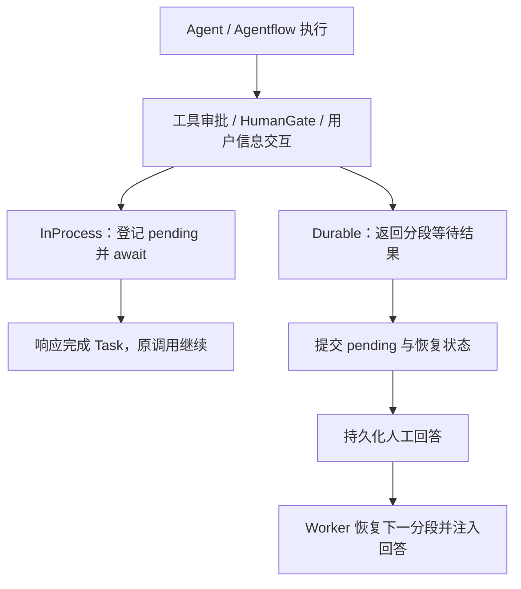

# HumanInteraction：人工交互的统一入口与执行适配

`HumanInteraction` 连接 Agent / Agentflow 的执行过程与用户的人工响应。它统一处理工作流人工关卡、工具审批和用户信息交互，并根据执行方式选择在当前进程等待，或在持久分段恢复后注入回答。

本文是人工交互文档的总入口，按“交互类型与执行方式 → 契约 → 上下文 → 调用链”展开。先读本文建立整体认识，再分别阅读 [InProcess](InProcess/README.md)、[Durable](Durable/README.md) 和 [Approvals](Approvals/README.md) 的具体实现。需要补充 turn、segment 和 Worker 的运行时背景时，可参考 [Runtimes README](../Runtimes/README.md)。

## 1. 总体职责

### 1.1 三种人工交互

| 交互类型 | 触发位置 | 人工响应的含义 | 主要客户端消息 |
| --- | --- | --- | --- |
| HumanGate | Agentflow 的人工节点 | 批准 / 拒绝后续工作流，并可提供补充文本 | `human-gate-request` |
| Tool approval | MAF 返回 `ToolApprovalRequestContent` | 是否允许工具调用，以及本次授权的范围 | `tool-approval-request` |
| 用户信息交互 | `HumanInteractionRequiredAIFunction` 或外部 Agent 交互桥接 | 提供结构化信息，例如回答 `ask_user_question` | `human-interaction-request` |

三者共用 `HumanResponseCommand` 作为客户端响应入口，但后续处理不同。HumanGate 拒绝会停止 workflow；工具审批拒绝交给 MAF；用户问答则需要把结构化答案绑定回工具参数。

### 1.2 执行方式与审批策略

| 维度 | 实现 | 解决的问题 |
| --- | --- | --- |
| 执行方式 | `InProcess/` | 原异步调用如何登记等待、接收响应并继续？ |
| 执行方式 | `Durable/` | 请求如何跨 segment 保存，回答如何注入重建的工具？ |
| 共享能力 | `Approvals/` | 是否需要人工批准、授权范围是什么、如何适配 MAF？ |

`Approvals` 供两种执行方式复用。FullAccess 可以自动批准普通工具，却不能生成用户尚未提供的答案，也不能跳过显式 HumanGate。Durable 还借用 MAF approval 协议，在交互工具真正执行之前建立可以恢复的等待边界。

配置项使用 `Execution:Provider=InProcess` 或 `Distributed`；当前 `Distributed` 对应代码中的 Durable 实现。InProcess 同样保存历史和适用的 session / checkpoint，但当前人工等待只由进程内对象持有。持久化边界见 [Persistence README](../Persistence/README.md)。

### 1.3 两种执行方式如何等待和继续

一次 turn 表达本轮输入的执行过程；Durable 可以把一次业务 execution 划分为多个 segment，每段在当前人工边界或完成点结束，再由 Worker 领取后续分段。

| 比较项 | InProcess | Durable |
| --- | --- | --- |
| 人工等待的承载者 | 本轮 coordinator 与未完成 Task | PostgreSQL 中的 pending / response 与执行状态 |
| 遇到需要人工的边界 | 保持原调用等待 | 结束当前 segment，保存 `WaitingForHuman` |
| 用户回答后 | 完成 Task，原调用继续 | 回答到齐进入 `Resuming`，Worker 领取下一段 |
| 工具访问的 channel | `ExecutionHumanInteractionChannel` 发布请求并等待 | `ResolvedHumanInteractionChannel` 返回恢复输入中的已保存回答 |
| 等待期间连接断开 | 中断当前 turn | 停止 attachment 的订阅，保留持久 execution |



## 2. 目录与阅读分工

```text
HumanInteraction/
├── README.md
├── IHumanGateApprovalHandler.cs
├── HumanInteractionContextAccessor.cs
├── InProcess/
│   ├── README.md
│   ├── ExecutionHumanInteractionChannel.cs
│   └── HumanGateApprovalCoordinator.cs
├── Durable/
│   ├── README.md
│   ├── DurableHumanInteractionMapper.cs
│   ├── ResolvedHumanInteractionChannel.cs
│   └── Contracts/
│       └── DurableHumanInteractionContracts.cs
└── Approvals/
    ├── README.md
    ├── PermissionAwareApprovalHandler.cs
    ├── PermissionModeState.cs
    ├── ToolApprovalPermissionState.cs
    ├── ToolApprovalSupport.cs
    └── UnattendedApprovalHandler.cs
```

| 文档 | 展开的内容 |
| --- | --- |
| 本文 | 三类交互、共享契约、作用域、请求与响应如何关联 |
| [InProcess README](InProcess/README.md) | Factory 装配、内存等待、命令回传、取消与断线 |
| [Durable README](Durable/README.md) | 工具延迟包装、两种 Runner 的暂停方式、快照、提交和恢复 |
| [Approvals README](Approvals/README.md) | 权限判断、session 授权状态、MAF 响应转换、无人值守 |

当前审批请求、决策和接口同置于根目录的 `IHumanGateApprovalHandler.cs`，其命名空间仍为 `Agw.Agents.Execution.HumanInteraction.Contracts`。跨模块 channel 契约则在另一个程序集 `Agw.Agents.Contracts`，没有移入本目录。

## 3. 两组共享契约

### 3.1 面向工具的 IHumanInteractionChannel

[跨模块契约](../../Agw.Agents.Contracts/Execution/HumanInteraction.cs) 定义通用交互请求、响应、channel 和 accessor。

```csharp
ValueTask<HumanInteractionResponse> RequestAsync(
    HumanInteractionRequest request,
    CancellationToken cancellationToken);
```

| 请求字段 | 用途 |
| --- | --- |
| `RequestId` | 本次交互请求与返回值的关联标识 |
| `InteractionKind` | 交互形式；问答协议使用 `questions` |
| `Prompt` | 用户可见的提示 |
| `Payload` | 结构化交互内容，类型为 `JsonElement` |
| `ToolName`、`CallId` | 可选的来源工具及原始 function call 标识 |

`HumanInteractionResponse` 只有 `RequestId`、`Cancelled`、`ResponseData`。工具不需要知道回答来自 SignalR 还是恢复输入；它通过相同接口取得数据，再由自身协议解释。

### 3.2 面向执行编排的 IHumanGateApprovalHandler

[IHumanGateApprovalHandler.cs](IHumanGateApprovalHandler.cs) 定义：

```csharp
bool RequiresHumanResponse(HumanGateApprovalRequest request);

ValueTask<HumanGateApprovalDecision> WaitForApprovalAsync(
    HumanGateApprovalRequest request,
    CancellationToken cancellationToken);
```

`RequiresHumanResponse` 默认返回 `true`，调用方据此决定是否发布人工请求。权限包装器可以返回 `false`，随后在 `WaitForApprovalAsync` 中立即返回自动批准的决策。

| 数据 | 字段与用途 |
| --- | --- |
| `HumanGateApprovalRequest` | `RequestId`、`NodeId`、`NodeName`、`Mode`、`Prompt`、`Messages`，以及可选的 MAF `ToolApprovalRequest` |
| `HumanGateApprovalDecision` | `RequestId`、`Approved`、`ResponseText`、默认 `once` 的 `ApprovalScope`、可选的 `ResponseData` |

接口名称保留 HumanGate，但实际同时服务 HumanGate、工具审批和 InProcess 通用交互的等待。它的实现也不都真正等待：InProcess coordinator 等待 Task；权限 handler 可以立即批准；无人值守 handler 抛出错误；Durable Agent 的 capture handler 捕获请求并立即结束分段。

## 4. HumanInteractionContextAccessor：当前执行的交互能力

[HumanInteractionContextAccessor](HumanInteractionContextAccessor.cs) 用 `AsyncLocal<IHumanInteractionChannel?>` 保存当前 channel。`Push(channel)` 记录旧值并返回可释放的 scope；scope 释放后恢复旧值，重复释放通过 `Interlocked` 防护。`Suppress()` 等同于 `Push(null)`。

[DependencyInjection](../DependencyInjection.cs) 将具体类型与 `IHumanInteractionContextAccessor` 注册到同一个 singleton。singleton 是 accessor 的生命周期；`Current` 的值沿异步执行上下文传播，不能理解成所有用户共用一个 channel。

| 场景 | 谁建立作用域 | 提供的 channel |
| --- | --- | --- |
| InProcess 交互式 Agent / Agentflow turn | `RuntimeFactory.ExecuteAgentAsync` / `ExecuteAgentflowAsync` | 本轮新建的 `ExecutionHumanInteractionChannel` |
| Durable Agent segment | `DurableAgentSegmentRunner` | 包含本段已解析回答的 `ResolvedHumanInteractionChannel` |
| Durable Agentflow segment | `DurableAgentflowSegmentRunner` | 同上 |

无人值守入口不应继承前台交互 channel。没有 channel 时，`HumanInteractionRequiredAIFunction` 明确报错。其他通过 approval 边界进入的无人值守请求由 `UnattendedApprovalHandler` 处理。两者分别防止工具内部等待和审批循环无限等待。

## 5. 工具怎样使用这组契约

[HumanInteractionRequiredAIFunction](../../Agw.Tools/HumanInteraction/HumanInteractionRequiredAIFunction.cs) 是一个工具包装器。其调用过程为：

1. 从 `AIFunctionArguments.Services` 取得 accessor，再读取 `Current`；没有 channel 则失败。
2. 由工具的 [IHumanInteractionProtocol](../../Agw.Tools/HumanInteraction/IHumanInteractionProtocol.cs) 创建请求。
3. 从 MAF 当前 function invocation 上下文补充 `ToolName`、`CallId`。
4. 调用 channel，要求返回的 `RequestId` 与当前请求一致。
5. 用户取消时调用协议的 `CreateCancelledResult`。
6. 用户提交时调用 `BindResponse` 校验并绑定回答，再执行内层工具。

[AskUserQuestionTool](../../Agw.Tools/Impl/Basic/AskUserQuestionTool.cs) 的协议只展示 `questions` 和 `metadata`。它校验用户提交的 `answers` / `annotations`，用这些数据覆盖工具参数中的同名字段，避免把模型生成的答案当作用户输入。

InProcess 的交互式工具路径直接进入这个包装器并等待。Durable 构造工具时额外套上 MAF `ApprovalRequiredAIFunction`，先返回一个可以恢复的 approval 请求；批准并恢复之后，内层包装器从预回答 channel 取得保存的答案。具体顺序见 [Durable README](Durable/README.md)。

## 6. 客户端协议与响应关联

交互消息使用 `AgwMessage`，展示字段主要放在 `AdditionalProperties`：

| 消息类型 | 关键字段 | 生成位置 |
| --- | --- | --- |
| `human-interaction-request` | `requestId`、`interactionKind`、`prompt`、`payload`，以及可选 `toolName` / `callId` | InProcess channel；Durable mapper |
| `tool-approval-request` | `requestId`、`nodeId`、`mode`、`prompt`、`toolName`、可选参数 JSON 字符串 | `ToolApprovalSupport`；Durable mapper |
| `human-gate-request` | `requestId`、节点、`mode`、`prompt`、可选 `inputPreview` | `AgentflowMessageMapper`；Durable mapper |

[HumanResponseCommand](../Commands/Hitl/HumanResponseCommand.cs) 携带 `RequestId`、`Approved`、`ResponseText`、`ApprovalScope`、`ResponseData` 和可选 `ExecutionId`。它默认使用 `once` 范围，空白范围也会归一为 `once`。

[HumanResponseCommandHandler](../Commands/Hitl/HumanResponseCommandHandler.cs) 只转发到 `ExecutionConnectionContext.SubmitHumanDecisionAsync`。Context 建立连接所有者的用户上下文后分流：

```text
HumanResponseCommand
    → ExecutionConnectionContext.SubmitHumanDecisionAsync
        ├── InProcess：RuntimeBase → ActiveTurn → coordinator.TrySubmitAsync
        └── Durable：DurableExecutionSession → Coordinator → Store
```

几种 ID 不能互相替代：

| 标识 | 关联对象 |
| --- | --- |
| `ExecutionId` | 一次业务执行；Durable 回答据此定位持久记录并校验所有者 |
| `RequestId` | 一条人工请求；InProcess 等待配对和 Durable pending / response 配对使用它 |
| `CallId` | 原始工具调用；恢复后的工具请求可据此找到持久回答 |
| `streamingScopeId` | 客户端消息归属；Durable 订阅合成请求时使用 manifest 中原始输入的消息标识 |

恢复后的工具会创建新的交互 `RequestId`。`ResolvedHumanInteractionChannel` 按 `CallId` 等信息找到原回答后，返回当前请求的 ID，使工具侧关联校验仍成立。完整的匹配规则见 Durable 文档。

## 7. 职责边界与验证入口

本目录不负责 SignalR 连接鉴权、数据库写入或 Worker 调度。它提供请求 / 决策、channel、映射和审批策略；具体执行器与运行时将这些能力组合起来。

| 要理解的行为 | 代码或测试入口 |
| --- | --- |
| 工具协议如何校验用户答案 | [AskUserQuestionToolTests](../../../../tests/Agw.Tools.Tests/AskUserQuestionToolTests.cs) |
| 发布结构化请求并等待匹配回答 | [ExecutionHumanInteractionChannelTests](../../../../tests/Agw.Agents.Tests/ExecutionHumanInteractionChannelTests.cs) |
| 决策字段传递、排除模型答案 | [HumanGateApprovalCoordinatorTests](../../../../tests/Agw.Agents.Tests/HumanGateApprovalCoordinatorTests.cs) |
| FullAccess、权限切换与授权状态 | [PermissionAwareApprovalHandlerTests](../../../../tests/Agw.Agents.Tests/PermissionAwareApprovalHandlerTests.cs) |
| pending / response 状态转换与回放 channel | [DurableExecutionStoreTests](../../../../tests/Agw.Agents.Tests/DurableExecutionStoreTests.cs) |
| HumanGate / 工具审批的 workflow 恢复 | [AgentflowRuntimeCharacterizationTests](../../../../tests/Agw.Agents.Tests/AgentflowRuntimeCharacterizationTests.cs) |

新增交互形式时，先定义工具协议和客户端 payload，再检查 InProcess channel、Durable 快照与恢复、FullAccess 分类和无人值守行为。当前 Durable mapper 对 `ask_user_question` 有专门映射，不能仅凭 `IHumanInteractionChannel` 通用就推断任意交互形式都已支持持久恢复。
