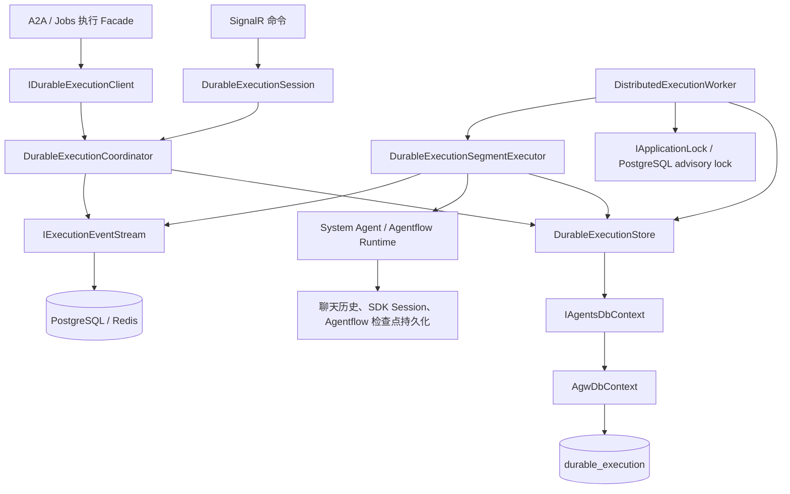
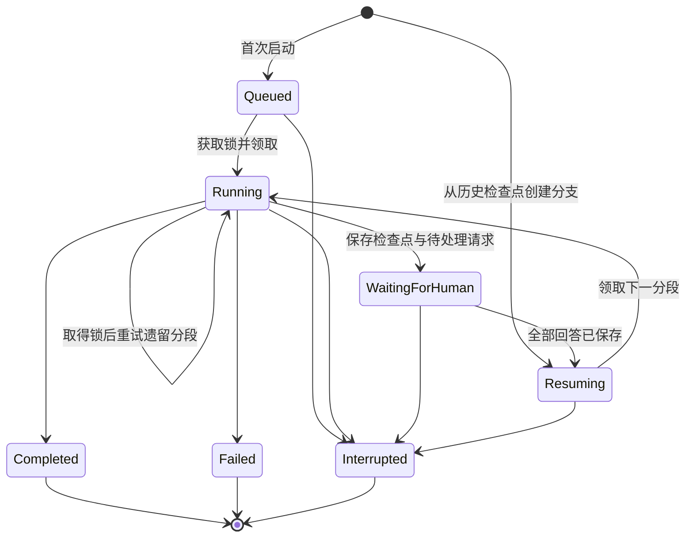
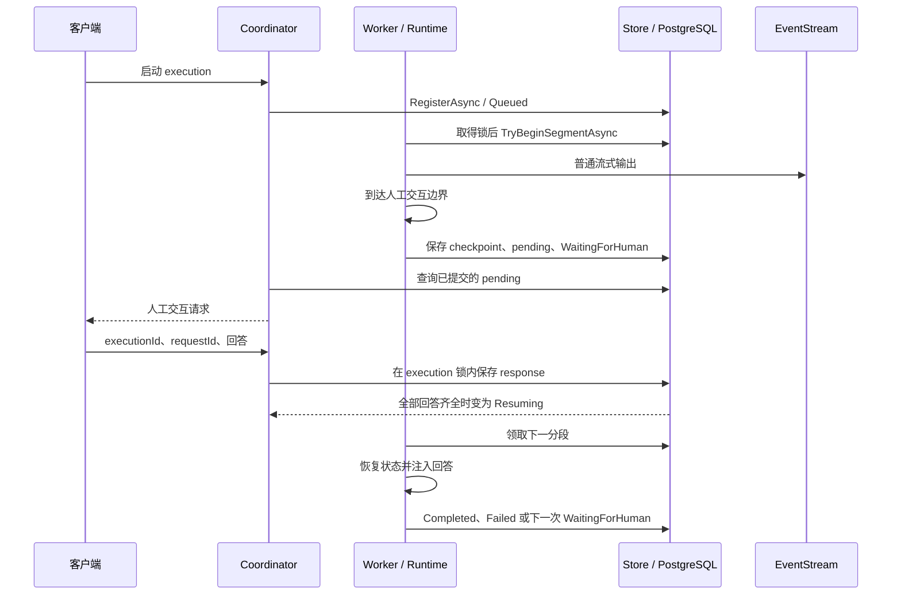

# 执行持久化

本目录负责 Agent / Agentflow 的持久执行状态管理。当前实现集中在 `Durable/`，供 `Execution:Provider=Distributed` 使用：把一次执行的启动参数、进度、人工交互和恢复边界保存到数据库，使执行能够在等待用户回答、服务重启或切换 Worker 后继续。

**InProcess 同样需要、也已经实现持久化。** 两种执行方式都会保存聊天历史、适用的 Agent 会话状态和 Agentflow 检查点。它们的区别在于：InProcess 的当前执行与人工等待由本进程持有；Distributed 额外持久化执行状态机，由 Worker 从数据库领取并恢复执行。

本文围绕本目录说明持久化架构、运行原理、配置、调用方式和恢复限制。完整的运行时与传输协议见[执行模块说明](../README.md)，历史写入策略见[对话历史与事件持久化](../../../../docs/operations/conversation-persistence.md)。

## 1. 持久化的数据分别解决什么问题

| 数据 | 用途 | 主要实现 | 适用模式 |
| --- | --- | --- | --- |
| 聊天历史 | 展示历史、为模型提供上下文、保留工具调用和回复 | Projects 的 `EfCoreChatHistoryProvider` | 两者 |
| Agent SDK Session | 保存 SDK 可序列化的会话状态，供后续构建 Agent 时恢复 | `AgentSessionStateStore` → `IAgentSessionStatePersistence` | 两者；当前 Store 跳过 External Agent |
| Agentflow 检查点 occurrence | 记录某一次检查点、图定义指纹及聊天历史截止序号，支持显式恢复分支 | `AgentflowCheckpointStore` → `IAgentflowCheckpointPersistence` | 两者，恢复条件不同 |
| Durable execution 状态 | 决定执行能否领取、正在等待谁、从哪里恢复、是否已结束 | 本目录的 `DurableExecutionStore` | Distributed |
| 执行事件流 | 按 cursor 回放流式输出，支持客户端重连 | `IExecutionEventStream` 的 PostgreSQL / Redis 实现 | Distributed |

聊天历史、执行状态和事件流有各自的职责与提交时机。历史存在，并不意味着一个正在执行的 turn 可以自动恢复；事件已经发出，也不能代替执行状态提交成功。客户端恢复订阅时，以持久状态机判断等待和终态，以事件流补齐输出。

### 1.1 InProcess 与 Distributed 的持久化边界

| 能力 | InProcess | Distributed |
| --- | --- | --- |
| 执行位置 | 当前 Agw 进程的 Runtime | 取得 execution 分布式锁的 Worker |
| 数据库 | SQLite 或 PostgreSQL | PostgreSQL |
| 聊天历史、适用的 SDK Session | 保存到数据库 | 复用相同的持久化能力 |
| Agentflow 检查点 occurrence | 落库；恢复还要求当前 Runtime 持有该 occurrence | 落库；可在新 Worker 重建恢复上下文 |
| 当前 turn、取消信号 | 进程内对象 | 当前分段仍在内存执行，执行事实另存数据库 |
| 人工交互等待 | `InProcessInteractionSession` 在内存中等待 | pending / response 与状态持久化，等待期间释放 Worker 执行资源 |
| 客户端断线 | 普通运行中的 turn 继续，输出被丢弃；等待 HumanGate 时中断 | 停止当前订阅，后台 execution 继续 |
| 服务进程退出 | 已提交数据保留，当前 turn 和人工等待失效 | 未完成 execution 可由 Worker 按持久边界继续或重试 |
| 输出重连回放 | 通过历史读取已提交消息；没有这套 durable cursor 回放 | PostgreSQL 或 Redis 事件流按 cursor 回放 |

InProcess 检查点恢复的限制由两处共同实现：

- [`AgentflowCheckpointStore.ListAsync`](../Agentflows/Checkpoints/AgentflowCheckpointStore.cs) 对非 durable 记录检查 `inProcessOccurrences`，同时检查定义指纹和 checkpoint 可读性。
- [`ExecutionConnectionContext.ResumeCheckpointAsync`](../Inbound/Connections/ExecutionConnectionContext.cs) 要求当前目标对应的 `AgentflowRuntime.TryGetCheckpoint` 成功。

因此，数据库中仍有 InProcess 检查点，并不表示服务重启后可以直接恢复它。原 Runtime 被释放后，该检查点会失去当前实现要求的恢复条件。

Agent Session 的恢复也有边界：[`AgentSessionStateStore`](../Agents/Sessions/AgentSessionStateStore.cs) 读取可序列化状态，反序列化失败时记录警告并创建新 Session；External Agent 由各自 SDK 适配路径处理，不能据此推断所有外部 CLI 的内部执行状态都被该 Store 保存。

## 2. 本目录与相关代码

```text
Persistence/
├── README.md
└── Durable/
    ├── DurableExecutionStore.cs
    ├── DurableExecutionMapper.cs
    └── DurableExecutionJson.cs
```

| 文件 / 类型 | 职责 |
| --- | --- |
| [`DurableExecutionStore`](Durable/DurableExecutionStore.cs) | 通过 `IAgentsDbContext` 读写状态；处理登记幂等、分段领取与提交、用户归属校验、人工回答和中断 |
| 同文件中的 `DurableExecutionSnapshot` | 将数据库记录还原为运行时可消费的快照；提取未回答请求，校验 pending / response 对应关系并构造分段输入 |
| [`DurableExecutionMapper`](Durable/DurableExecutionMapper.cs) | 在 `AgentExecutionTask`、`ExecutionSettings` 与持久化快照之间转换；恢复时还原任务投影和设置命令 |
| [`DurableExecutionJson`](Durable/DurableExecutionJson.cs) | 复用 `JsonUtil` 的序列化约定；必需 payload 反序列化为空时抛出 `DurableExecutionConflict` |

`DurableExecutionJson` 不负责加密，也不把所有 JSON 解析异常统一转换成同一种错误。加密由 EF 持久化机制完成；清单版本、execution ID 和 owner 一致性由 Store 的快照物化逻辑校验。

相关实现按职责分布在其他目录：

| 位置 | 内容 |
| --- | --- |
| [`Runtimes/Durable`](../Runtimes/Durable/) | Coordinator、Client、Session、Worker 和 SegmentExecutor |
| [`Messaging/Durable`](../Messaging/Durable/) | 事件流接口、PostgreSQL / Redis 事件存储与回放实现 |
| [`Outbound/Durable`](../Outbound/Durable/) | 分段消息的批量写入 Sink |
| [`HumanInteraction/Durable`](../HumanInteraction/Durable/) | 人工请求快照、回答及恢复后的交互通道 |
| [`Agents/Sessions`](../Agents/Sessions/) | SDK Session 加载、保存与范围标识 |
| [`Agentflows/Checkpoints`](../Agentflows/Checkpoints/) | 检查点记录、可用性查询、显式恢复和图定义指纹 |
| [`Agw.Agents/Application/Persistence`](../../Agw.Agents/Application/Persistence/) | `IAgentsDbContext`、Session / Checkpoint 持久化接口、durable manifest 和维护接口 |
| [`Agw.Infrastructure/Agents`](../../Agw.Infrastructure/Agents/) | Session / Checkpoint 持久化适配器、执行归属回填和隔离维护 |
| [`Agw.Data/Entities/Executions`](../../Agw.Data/Entities/Executions/) | Durable execution、Agentflow checkpoint 的数据实体和 EF 配置 |
| [`EfCoreChatHistoryProvider`](../../Agw.Projects/Infrastructure/EfCoreChatHistoryProvider.cs) | Projects 所有的聊天历史持久化及请求生命周期管理 |

`Agw.Agents` 与 `Agw.Agents.Execution` 是同一逻辑 Agents 模块的两个程序集。执行记录和检查点由 Agents 所有；实体类型放在 `Agw.Data`、共用 `AgwDbContext`，不改变逻辑数据归属。

本目录的 Store 直接使用 Agents 的 `IAgentsDbContext` 持久化接口，并包含执行状态转换的协调逻辑；它没有独立的 `IDurableExecutionStore` 接口。Session 和 Agentflow checkpoint 则经 Application 持久化接口调用 Infrastructure 适配器。新增功能时应遵循已有边界，不因文件都与数据库有关而让其他模块直接依赖内部 Store。

## 3. 架构与调用链



### 3.1 各组件的分工

- **Session** 管理当前连接对 execution 的附着和订阅。它不拥有 Worker 的后台执行任务，SignalR 断开不会自动取消 durable execution。
- **Coordinator** 协调登记、授权读取、人工回答、中断、检查点恢复和消息回放。提交人工回答时获取 execution 锁；中断通过状态与并发版本更新生效，不等待正在执行的分段释放锁。
- **Worker** 等待 Server 初始化，轮询可运行记录，竞争分布式锁，领取并执行一个分段，最后提交分段结果。
- **SegmentExecutor** 加载 manifest，恢复用户和会话代次上下文，建立历史写入作用域，构建 Runtime，并将普通输出送入事件流。
- **Store** 保存权威执行状态。Runtime 返回的分段结果只有在这里成功提交后，才成为其他 Server 可以观察、恢复的执行事实。
- **EventStream** 保存和回放输出。Coordinator 在流不可用或控制消息缺失时，通过数据库状态合成 pending / terminal 消息。

### 3.2 注册与生命周期

[`AddAgentExecution`](../DependencyInjection.cs) 在启动时根据 `Execution:Provider` 注册运行实现，同一部署的 Host 应使用一致的配置。

- 两种模式均注册 `AgentSessionStateStore`（Scoped）和 `AgentflowCheckpointStore`（Singleton）。后者通过 `IServiceScopeFactory` 为持久化操作创建作用域，不长期持有 DbContext。
- Distributed 额外注册 `DurableExecutionStore`、SegmentExecutor 等 Scoped 服务，以及 Singleton 的 Coordinator、Client 和 EventStream；按 Host 选项注册 Worker。
- Coordinator 每次访问持久状态都创建独立 scope；Worker 也为扫描和分段处理创建 scope，避免连接断开后后台任务继续使用已释放的请求 DbContext。
- Infrastructure 将 `IAgentsDbContext` 映射到同一 Scoped `AgwDbContext`，并注册 Session / Checkpoint 适配器。
- Standalone 组合执行入口和 Worker；拆分部署中 Data Plane 负责 SignalR / A2A 和 Worker，Control Plane 为 Jobs 提供 durable client。

## 4. 持久状态的数据模型

[`DurableExecutionRecord`](../../Agw.Data/Entities/Executions/DurableExecutionRecord.cs) 映射到 `durable_execution` 表，一次 execution 对应一行。

| 字段 | 含义 |
| --- | --- |
| `Id` | 稳定的业务 execution ID；也是 execution 锁资源名的组成部分 |
| `UserId` / `CreateBy` | 执行的稳定用户归属；新记录两者使用相同 owner |
| `ProjectId` / `ProjectConversationId` | 可直接查询的归属索引，用于调度、清理和恢复校验 |
| `ScopeBackfilled` | 标记旧记录的归属是否已处理；调度还要求两个归属 ID 均非空 |
| `ManifestJson` | 加密的启动清单，保存重建运行时所需的输入 |
| `Status` | `Queued`、`Running`、`WaitingForHuman`、`Resuming` 或终态 |
| `SegmentIndex` | 当前待执行分段的序号；普通首次登记为 0 |
| `CheckpointJson` | 加密的最新 Agentflow 恢复检查点，可为空 |
| `PendingInteractionsJson` | 加密的当前等待边界人工请求 |
| `ResponsesJson` | 加密的当前等待边界已收到回答 |
| `ErrorMessage` | 加密的执行错误信息 |
| `StateChangedAt` | 最后一次状态转换的 UTC 时间；用于筛选可能遗留的 Running 记录 |
| `StateVersion` | EF 乐观并发 token，区分不同领取和状态更新 |

[`DurableExecutionRecordConfiguration`](../../Agw.Data/Entities/Executions/DurableExecutionRecordConfiguration.cs) 配置主键、并发 token 及状态时间、用户项目会话、归属回填索引。`StateVersion` 是并发凭据，`StateChangedAt` 是状态转换时间，两者都不等同于独立的 Worker 心跳。

### 4.1 Manifest 保存什么

[`DurableExecutionManifest`](../../Agw.Agents/Application/Persistence/DurableExecutionManifest.cs) 位于 Agents 的 Application 持久化边界，当前 schema 版本为 1，主要包含：

- execution ID、稳定用户 ID、Agent ID 和运行目标类型（Agent / Agentflow）。
- 原始 `AgwUserInput`，包括恢复展示归属所需的原消息标识。
- 最小任务快照：`TaskId`、`ProjectId`、`ProjectConversationId`、`ContextId` 和 `Generation`。
- 执行设置：环境变量、权限模式、人工交互策略和 `Resume`。
- 显式恢复分支的来源 occurrence 与需要继续的 Checkpoint 节点标识。

Manifest 保存的是启动上下文，不包含完整的 Agent 实例、DI 容器、执行线程或整个项目文件树。Runtime 恢复时仍要读取 Agent / Agentflow 定义和项目工作区，因此活动执行依赖的定义发生变化后，旧状态可能不再兼容。

`DurableExecutionMapper.FromSettings` 按键排序环境变量后复制，保证相同设置的序列化顺序稳定。旧任务快照缺少 `Generation` 时按 0 读取，序列化省略默认的 0，保留既有幂等比较行为。旧清单的用户兼容默认值只用于读取旧格式；新登记要求有效且与当前认证上下文一致的用户 ID。

### 4.2 三种容易混淆的检查点

| 名称 | 实际含义 |
| --- | --- |
| `durable_execution.CheckpointJson` | 当前 execution 的最新 Agentflow 分段恢复状态 |
| `AgentflowCheckpointRecord` | 用户可选择的某次检查点 occurrence，包含 Marker、定义指纹和历史边界 |
| `DurableAgentflowCheckpointStore` | MAF JSON checkpoint 的运行时适配器；由恢复快照初始化，并向外提供最新 checkpoint |

[`DurableAgentflowCheckpointStore`](../Agentflows/Checkpoints/Durable/DurableAgentflowCheckpointStore.cs) 的类名带有 Durable，但单独创建它不会自动写数据库。真正的落库由执行状态 Store 或 Agentflow occurrence 持久化流程完成。

独立执行的 System Agent 依赖保存的 SDK Session 和工具审批响应恢复；其分段结果可以没有 Agentflow `CheckpointJson`。因此不能用 `CheckpointJson` 是否为空判断一次执行是否具有恢复能力。

## 5. 执行状态机与完整流程

一个 **execution** 是稳定 ID 标识的一次执行；一个 **segment** 是从首次输入或上次恢复边界开始，到完成、失败或下一次人工等待为止的一段运行。等待人工回答时，Worker 结束当前分段；回答齐全后再领取下一段。



普通首次登记从 `Queued`、`SegmentIndex=0` 开始。显式 Agentflow 检查点恢复由 `AgentflowCheckpointStore` 登记新 execution，初始为 `Resuming`、`SegmentIndex=1`，携带来源 checkpoint。维护流程还可能将损坏的非终态记录隔离为 `Failed`。

### 5.1 首次登记与领取

1. 调用方提供稳定的 `executionId`，准备目标、用户输入、项目任务和设置。
2. Coordinator 调用 `RegisterAsync`。Store 校验 owner，生成 manifest，取得项目生命周期锁，并通过 `SaveConversationChangesAsync` 校验会话代次后写入 `Queued`。
3. Worker 扫描归属完整的 `Queued`、`Resuming`，以及超过 `RecoveryProbeSeconds` 的 `Running` 记录。`WaitingForHuman` 不进入可运行队列。
4. Worker 取得 `DurableExecutionLock`，再调用 `TryBeginSegmentAsync`。该方法重新校验记录与会话，将状态改为 `Running`，保存并返回新的 `StateVersion`。
5. SegmentExecutor 恢复 manifest 所有者的用户上下文和 `Generation`，构建 Runtime 并执行。

`RecoveryProbeSeconds` 只控制何时可以尝试接管。一个正常长任务超过该时间后，原 Worker 仍持有 PostgreSQL advisory lock，其他 Worker 就不能领取它。

### 5.2 人工等待与恢复



进入等待时，`SaveSegmentResultAsync` 将 `SegmentIndex` 加 1，并在一次状态提交中保存 checkpoint、pending，清空上一边界的回答。Pending 的 `requestId` 必须非空、不重复且长度不超过 128。

每次回答由 `SubmitHumanResponseAsync` 按 `executionId + owner + requestId` 处理。相同回答重试保持幂等；已保存的同一请求提交不同回答会冲突；只有全部 pending 都有对应 response，状态才推进到 `Resuming`。恢复输入会再次校验回答数量、请求对应关系和 execution ID。

- System Agent 恢复 SDK Session，将回答还原为 `ToolApprovalResponseContent`；需要用户信息的 Tool 再通过 `ResolvedHumanInteractionChannel` 取得已保存的回答。
- Agentflow 用 JSON checkpoint 重建 workflow 执行上下文，并注入已解析的回答。
- 客户端看到人工请求之前，该等待边界必须已经落库，避免用户回答一个尚不存在的持久请求。

### 5.3 完成、失败与中断

Worker 提交分段结果时必须传入领取时获得的 `StateVersion`。Store 同时检查 `Running` 状态、`SegmentIndex` 和版本，拒绝旧 Worker 的迟到结果。

正常完成或失败通过 `SetTerminal` 保存终态，并清空仅供当前分段恢复使用的 checkpoint、pending 和 response；manifest 和状态记录保留。显式中断走独立的条件更新路径，将活动记录改为 `Interrupted` 并刷新版本，不经过 `SetTerminal` 清理这些 JSON 字段。中断后即使仍有旧字段，也不能据此恢复执行。

Worker 监测状态变化和锁失效信号，协作式取消当前分段。服务正常关闭时，不把关闭造成的取消写成执行失败；记录可保留为 `Running`，锁释放后供后续 Worker 重试。

### 5.4 Store 方法速查

| 方法 | 用途与约束 |
| --- | --- |
| `RegisterAsync` | 登记启动清单；同 ID、同 owner、同 manifest 幂等，不同内容冲突 |
| `GetAsync` | 后台内部读取完整快照，依赖调用方正确建立执行上下文 |
| `GetAuthorizedAsync` | 按 execution ID 和 owner 读取，并检查会话代次 |
| `GetAuthorizedOutcomeAsync` | 只投影 ID、状态；失败时额外读取加密错误，避免频繁加载 manifest |
| `GetRunnableExecutionIdsAsync` | 找候选记录，不代表已经取得执行权 |
| `TryBeginSegmentAsync` | 在 Worker 已持有 execution 锁时领取分段；竞争失败或状态不适用时返回空 |
| `SaveSegmentResultAsync` | 使用原领取版本提交等待状态或终态 |
| `SubmitHumanResponseAsync` | 保存回答并在全部回答齐全时推进状态；由 Coordinator 在 execution 锁内调用 |
| `RequestInterruptAsync` | 条件更新活动执行；已是终态返回 `false`，不存在或无权访问则返回相应错误 |

## 6. 一致性与故障恢复原理

### 6.1 原子提交的范围

`durable_execution` 把分段 checkpoint、pending / response 和状态放在同一行，使一次状态提交中的这些字段一起成功或一起失败。

聊天历史、SDK Session、用户可选的检查点 occurrence 和事件流仍有各自的持久化边界，并没有与所有外部 Tool 操作组成一个全局事务。执行路径通过顺序和刷新屏障建立恢复边界：

1. 保存 SDK Session 或记录检查点历史序号前，刷新历史并阻止并发追加越过该边界。
2. 分段退出时先完成普通事件和历史等必要刷新，再由 Worker 保存分段状态。
3. 状态提交成功后发布或合成人工等待 / 终态消息。
4. 订阅端观察到等待或终态时，再读取一次事件尾部，避免末批输出被控制消息抢先截断。

### 6.2 锁与版本解决不同的竞争

- **项目生命周期和会话边界锁**：协调登记、历史、Session、检查点、删除和重置，保持既有锁顺序。
- **execution 分布式锁**：同一 execution 同时由一个持锁 Worker 执行；人工回答也在该锁下更新。
- **`StateVersion`**：拒绝已失去领取权的结果，保护并发中断。完成时重新读取到的新版本不能替代原领取凭据。
- **`HandleLostToken`**：锁失效后取消执行和对应写入作用域，阻止作废 attempt 继续提交缓冲或发布终态。

只扫描到 `Running` 超时或只拿到数据库快照，都不构成执行权。

### 6.3 用户、会话代次和加密

执行归属使用稳定用户 ID。新登记要求 manifest owner 与当前认证上下文一致；用户读取、回答和中断带 owner 条件，其他用户的 execution 按不可访问处理。后台扫描使用受限系统作用域，实际执行再恢复 manifest 所有者的上下文，不把系统扫描权限传给业务 Tool。

Manifest 的 `Generation` 标记会话代次。会话清空后代次递增，旧执行、旧 SDK 回调或旧历史缓冲不能向新代次写入数据。`SaveConversationChangesAsync` 和恢复预检验证项目、会话、owner 与代次，避免迟到写入把已清空或删除的状态重新建立起来。

Manifest、checkpoint、pending、response 和错误使用实体上的 `[Encrypted]` 通过 EF 加密机制落库。多副本需要共享可解密的 Data Protection key ring。排障时优先查看 ID、状态、版本和时间，不输出完整清单、环境变量或加密字段的明文。

### 6.4 至少一次执行

故障恢复以分段为单位，语义是 **at-least-once**。例如：

1. Tool 已在外部系统完成一次写入。
2. Worker 在分段结果提交前退出。
3. 新 Worker 只能读取上一次持久边界，因此可能重跑该段，再次调用 Tool。

执行登记的幂等、事件位置的去重和 `StateVersion` 都不能撤销已发生的外部副作用。需要幂等的 Tool 应使用业务键或稳定的 execution / request 标识实现去重。

### 6.5 旧数据回填和损坏隔离

[`DurableExecutionScopeMaintenance`](../../Agw.Infrastructure/Agents/DurableExecutionScopeMaintenance.cs) 负责旧 manifest 的归属解析、索引回填、会话验证和损坏隔离。调度只领取 `ScopeBackfilled=true` 且项目、会话 ID 完整的记录。

[`DurableExecutionScopeRecoveryService`](../../Agw.Infrastructure/Agents/DurableExecutionScopeRecoveryService.cs) 在两种执行模式中均注册，等待 Setup 完成后以独立 scope 分批处理旧记录。这是数据维护能力，不代表 InProcess 启用了 distributed Worker。

损坏的非终态记录在锁和版本条件保护下转为 `Failed`；无法信任的归属不会被猜测或用于误删其他项目。维护保留原始加密数据供诊断，不能通过手动填充 `ScopeBackfilled`、owner 或版本来绕过校验。

## 7. 聊天历史与事件流的写入策略

### 7.1 两种模式共用的聊天历史策略

配置来自 `ConversationHistory`：

| 配置 | 默认值 | 作用 |
| --- | --- | --- |
| `Mode` | `Interval` | `Interval` 定时提交、`TurnEnd` 回合结束提交、`Immediate` Provider 每次追加提交 |
| `FlushIntervalSeconds` | Host 模板 `10`；省略配置时 `5` | 从第一条待写历史起计算的定时提交间隔 |
| `MaxBufferedBytes` | `16777216` | 每个执行作用域默认 16 MiB，达到阈值提前提交 |

模型读取合并数据库与本作用域待写历史；普通历史 API 返回已提交内容。正常结束、取消、异常和枚举器释放时都会尝试刷新剩余历史；保存 Session / 检查点等必要边界也会提前刷新，因此 `TurnEnd` 不表示所有状态都等到最后才保存。

进程突然退出或掉电时，未提交的历史可能丢失。即使选择 `Immediate`，也仍受 SDK 何时把消息交给 Provider 的影响。详细的流式快照、缓冲上限和故障行为见[历史持久化说明](../../../../docs/operations/conversation-persistence.md)。

### 7.2 Distributed 的事件流策略

事件实现位于 [`Messaging/Durable`](../Messaging/Durable/)，默认使用 PostgreSQL 的 `execution_stream_entry` 表，也可配置 Redis Stream。

- 默认按 250 毫秒或 100 条普通事件批量提交，达到任一条件即刷新；写入间隔设为 0 时逐次写入。
- 每条事件保留 `ExecutionId + SegmentIndex + Sequence` 的逻辑位置；相同位置保留首次提交内容，cursor 用于从已读取位置之后继续回放。
- 状态行保存有界的恢复快照；事件流按输出追加，避免每个 token 放大状态行或制造状态更新冲突。
- 事件流故障会降低中间输出的回放能力；只要状态存储仍正常，执行仍可等待、回答和结束。缺失的普通输出不会凭空重建。
- Redis TTL 只控制事件保留；它不负责保存 durable execution 的权威状态。

## 8. 配置与启动

### 8.1 本地 InProcess

默认是 InProcess，可使用 SQLite。以下环境变量显式选择本地执行，并保留默认的历史批量提交策略：

```bash
export Execution__Provider=InProcess
export Database__Provider=sqlite
export Database__ConnectionString='Data Source=agw.db'
export DistributedLock__Provider=inmemory
export ConversationHistory__Mode=Interval
export ConversationHistory__FlushIntervalSeconds=10
dotnet run --project src/server/Agw.Standalone.Host
```

从仓库根目录运行命令，首次启动按 Setup 流程初始化。无需为保存聊天历史或 SDK Session 启用 Distributed。

### 8.2 Distributed

切换到 Distributed 需要 PostgreSQL 数据库和 PostgreSQL 分布式锁。下面的连接字符串是占位符，部署时通过环境变量或 Secrets 注入实际值：

```bash
export Execution__Provider=Distributed
export Database__Provider=postgres
export Database__ConnectionString='<postgres-connection-string>'
export DistributedLock__Provider=postgres
export DistributedLock__ConnectionString=''
export Execution__Distributed__EventStream__Provider=Postgres
dotnet run --project src/server/Agw.Standalone.Host
```

锁连接字符串为空时复用数据库连接字符串。启用 Redis 事件流时额外配置：

```bash
export Execution__Distributed__EventStream__Provider=Redis
export Execution__Distributed__EventStream__Redis__ConnectionString='<redis-connection-string>'
export Execution__Distributed__EventStream__Redis__StreamTtlMinutes=1440
```

Redis 是事件回放的可选实现，启用后仍需要 PostgreSQL 状态库与分布式锁。

部署前需保证：

- 所有执行节点连接同一套状态数据库和锁基础设施；配置 Redis 时共享事件流实例。
- 节点可使用同一套 Data Protection 密钥解密历史持久数据。
- `Project.Workspace` 在各执行节点可见，挂载路径语义一致。
- 数据库具有当前版本需要的 schema。升级按仓库迁移流程显式执行；不能仅切换数据库 Provider 而忽略匹配的连接字符串和初始化 / 迁移。
- 新旧版本兼容在途 manifest / checkpoint。破坏兼容性的变更应排空旧执行或提供明确的兼容读取路径。

拆分部署先启动 Control Plane 完成共享初始化，再启动 Data Plane。配置变化后重启 Host，Provider 不按单个请求动态切换。

### 8.3 调度与回放参数

以下键均位于 `Execution:Distributed`；默认值以 [`ExecutionRuntimeOptions`](../Configuration/ExecutionRuntimeOptions.cs) 和 [Host 配置](../../Agw.Host/appsettings.json) 为准。

| 相对配置键 | 默认值 | 含义 |
| --- | --- | --- |
| `WorkerPollingMilliseconds` | `250` | Worker 调度轮询间隔 |
| `MaxConcurrentExecutions` | `4` | 每个 Server 的最大并发 execution 数量 |
| `RecoveryProbeSeconds` | `30` | 遗留 Running 记录进入恢复候选的时间条件 |
| `LockAcquireTimeoutMilliseconds` | `500` | Worker 本轮竞争 execution 锁的最长等待时间 |
| `EventStream:Provider` | `Postgres` | `Postgres` 或 `Redis` |
| `EventStream:WriteIntervalMilliseconds` | `250` | 普通事件写入间隔；0 表示逐次写入 |
| `EventStream:WriteBatchSize` | `100` | 普通事件批量写入条数 |
| `EventStream:ReadPollingMilliseconds` | `250` | 事件读取轮询间隔 |
| `EventStream:ReadBatchSize` | `100` | 单次读取条数 |
| `EventStream:Redis:StreamTtlMinutes` | `1440` | Redis 事件保留分钟数 |

除事件写入间隔允许为 0 外，上述数值参数要求为正；Redis 专用参数在选择 Redis 时校验。Distributed 配 SQLite、进程内锁或缺少必需 Redis 连接字符串时，启动阶段直接拒绝配置。

## 9. 如何使用

### 9.1 通过 SignalR 执行和恢复订阅

客户端连接 `/api/hubs/exec`，通过 `GetExecutionProvider()` 获取恢复能力，通过 `DispatchCommand` 发送命令，并通过 `ReceiveMessage` 接收输出。命令契约与序列化注册位于 [`Commands`](../Commands/)。

| 步骤 | 命令 / 操作 | 关键要求 |
| --- | --- | --- |
| 1 | `SettingCommand` | 设置 `projectId`、`contextId`、环境变量和权限模式 |
| 2 | `ExecCommand` | 指定 Agent / Agentflow、会话和输入；Distributed 使用稳定 `executionId` 且 `stream=true` |
| 3 | 保存收到的消息与 cursor | cursor 仅表示事件消费位置，不是执行状态或检查点 ID |
| 4 | `HumanResponseCommand` | 携带 `executionId` 和类型化 `response`（`kind`、`interactionId`、决定或用户输入） |
| 5 | 重连后重发设置，再发送 `SubscribeExecutionCommand` | 使用原 execution ID 和最后 cursor，附着已有执行；不创建新 execution |
| 6 | `InterruptCommand` | 明确中断指定 execution；断开连接只会结束 Distributed 的当前订阅 |

为同一次启动重试保留相同 execution ID 和输入标识，避免网络重试创建多个执行。执行已登记后需要的是重新订阅时，应使用 `SubscribeExecutionCommand`。

`SettingCommand.Resume` 是服务端内部属性，带 `[JsonIgnore]`，不能通过发送同名 JSON 字段控制恢复。人工回答必须来自响应命令，模型生成的 Tool 参数不能冒充用户回答。

### 9.2 从 Agentflow 检查点创建分支

先通过 `GetAgentflowCheckpoints(agentflowId)` 取得 occurrence 及可用性，再发送 `ResumeCheckpointCommand(checkpointOccurrenceId, resumeExecutionId, agentflowId)`。

- occurrence 标识某一次具体到达，不能只用节点名；循环中同一个节点可能产生多次 occurrence。
- 恢复会校验 owner、图定义指纹、记录可读性和当前活动执行，并按 `BoundarySequence` 裁剪该边界之后的历史，再启动新分支。
- 新分支使用新的稳定 `resumeExecutionId`；同一次恢复的网络重试复用该 ID。
- Distributed 要求来源 execution 已结束，并等待其释放锁，再原子处理历史裁剪和新分支登记；首个恢复分段使用已保存的 checkpoint。
- InProcess 额外要求当前 Runtime 仍持有对应 occurrence；仅有数据库记录不足以绕过该条件。
- 检查点记录的 `IsDurable` 必须匹配当前恢复模式，不能通过切换 Provider 把 InProcess occurrence 当作 Distributed 检查点恢复。

重新订阅、回答人工请求和从检查点建立新分支是三种独立操作：它们分别恢复输出消费、继续当前 execution、创建新的恢复执行。

### 9.3 后端模块接入与内部开发

A2A、Jobs 等跨模块调用通过 [`IAgentExecutionFacade` / `IDurableAgentExecutionFacade`](../../Agw.Agents.Contracts/Execution/AgentExecutionContracts.cs) 接入。执行模块内部的 [`IDurableExecutionClient`](../Runtimes/Durable/Contracts/IDurableExecutionClient.cs) 提供登记、结果查询、等待、事件读取和中断；不要从外部模块直接构造内部 Store 或手动插入状态行。

无人值守的 Durable Job 通过轻量 outcome 查询等待状态变化，无需回放整条事件流。Jobs 固定使用 Full access 自动批准普通工具调用，并拒绝需要真实用户回答的交互；A2A 沿用执行请求的权限策略。当前以独立 Agent 为目标（`AgentRuntimeType.Agent`）的 durable 执行只支持 System Agent，External Agent 会返回不支持的分段失败。

修改本目录时，保留以下约束：

- 改 manifest / mapper 时同时考虑序列化顺序、schema、旧数据和登记幂等；不要把 Runtime、服务实例或连接对象放进清单。
- 改状态流转时同步检查 [`DurableExecutionQueries`](../../Agw.Agents/Application/Persistence/DurableExecutionQueries.cs)、Worker 扫描、中断条件和前端状态映射。
- 改结果提交时保留领取版本校验、历史刷新边界与控制消息顺序。
- 使用 `IAgentsDbContext` 和现有持久化接口；跨模块历史修改继续通过批准的 Infrastructure 协调边界完成。
- 数据模型变化需要匹配 SQLite / PostgreSQL 的迁移；遵循仓库显式迁移流程，不自动生成或应用迁移，不引入数据库外键约束。

## 10. 排障与验证

### 10.1 常见现象

| 现象 | 检查方向 |
| --- | --- |
| InProcess 重启后历史仍在，但原审批无法继续 | 当前 turn / 等待对象已结束，符合该模式的恢复边界 |
| InProcess 检查点显示不可恢复 | 原 Runtime 是否仍存在、是否保有 occurrence、目标与图定义指纹是否匹配 |
| `Queued` 长时间未执行 | Server 是否初始化，Data Plane / Standalone Worker 是否启用，是否有并发容量，记录归属是否完整 |
| `Running` 超过恢复时间仍未被接管 | 原 Worker 是否仍持有 execution 锁；恢复时间不是强制超时 |
| `WaitingForHuman` 不再领取 | 正常等待；检查是否所有 pending 都收到匹配 response |
| 回答或重复启动返回冲突 | 是否复用了错误的 execution / request ID，是否修改了原 manifest 或已保存回答 |
| `ConversationSessionConflict` | 会话是否已清空、删除或代次变化；不能通过读取最新代次替换旧执行凭据 |
| 终态已知但中间输出缺失 | 事件流连接、Redis TTL、cursor 和写入故障；同时读取已提交聊天历史 |
| Manifest / checkpoint 不能解密或恢复 | 密钥是否共享、schema 是否兼容、定义是否变化、记录是否被维护流程隔离 |
| 故障恢复后 Tool 操作重复 | 检查外部业务幂等；故障恢复可能重跑当前分段 |

排查先读取执行 ID、owner、项目 / 会话 ID、`Status`、`SegmentIndex`、`StateVersion` 和 `StateChangedAt`，再结合 Worker、Coordinator 与维护服务日志定位。不要直接改状态表伪造完成、清除并发版本或绕过用户范围。

### 10.2 测试入口

修改持久化逻辑时，可按受影响的行为选择以下测试。

| 测试 | 关注点 |
| --- | --- |
| [`DurableExecutionStoreTests`](../../../../tests/Agw.Agents.Tests/DurableExecutionStoreTests.cs) | 登记与回答幂等、owner 校验、状态转换、迟到结果、中断和事件 cursor |
| [`DistributedExecutionWorkerOwnershipTests`](../../../../tests/Agw.Agents.Tests/DistributedExecutionWorkerOwnershipTests.cs) | 锁失效时取消分段并拒绝迟到完成 |
| [`AgentSessionStateStoreTests`](../../../../tests/Agw.Agents.Tests/AgentSessionStateStoreTests.cs) | Session 保存和恢复、范围隔离、并发插入 |
| [`AgentflowCheckpointStoreTests`](../../../../tests/Agw.Agents.Tests/AgentflowCheckpointStoreTests.cs) | occurrence、历史边界、事务回滚、定义变更与恢复幂等 |
| [`ConversationGenerationPersistenceTests`](../../../../tests/Agw.Agents.Tests/ConversationGenerationPersistenceTests.cs) | 会话重置后拒绝旧历史、checkpoint 和 manifest |
| [`DurableExecutionScopeMaintenanceTests`](../../../../tests/Agw.Agents.Tests/DurableExecutionScopeMaintenanceTests.cs) | 归属回填、损坏隔离、并发保护和调度可见性 |
| [`ExecutionEventBatchingTests`](../../../../tests/Agw.Agents.Tests/ExecutionEventBatchingTests.cs) | 批量写入、背压、作废 attempt 和终态顺序 |
| [`ExecutionRuntimeConfigurationTests`](../../../../tests/Agw.Agents.Tests/ExecutionRuntimeConfigurationTests.cs) | 注册生命周期、默认 Provider 和无效配置拒绝 |

从仓库根目录运行定向验证：

```bash
dotnet test tests/Agw.Agents.Tests --filter "FullyQualifiedName~DurableExecutionStoreTests|FullyQualifiedName~DistributedExecutionWorkerOwnershipTests|FullyQualifiedName~ConversationGenerationPersistenceTests"
dotnet test tests/Agw.Agents.Tests --filter "FullyQualifiedName~AgentSessionStateStoreTests|FullyQualifiedName~AgentflowCheckpointStoreTests|FullyQualifiedName~ExecutionRuntimeConfigurationTests"
```

真实 PostgreSQL 验证见 [`PostgresExecutionFencingTests`](../../../../tests/Agw.Agents.Tests/PostgresExecutionFencingTests.cs) 和 [`PostgresEventBatchingTests`](../../../../tests/Agw.Agents.Tests/PostgresEventBatchingTests.cs)。它们通过 `AGW_TEST_POSTGRES_CONNECTION_STRING` 显式启用，需使用允许创建临时数据库的隔离实例。SQLite 测试覆盖不表示生产 Distributed 支持 SQLite，也不能替代 PostgreSQL 锁和并发行为验证。

## 11. 延伸阅读

- [执行模块总览](../README.md)：命令、Runtime、Host 分工和传输协议。
- [Turn 生命周期](../Turns/README.md)：执行上下文、取消、消息与历史刷新边界。
- [Agentflow 设计](../../../../docs/6.Agentflow.md)：图执行、检查点分支与 Chat 归属。
- [历史与事件持久化配置](../../../../docs/operations/conversation-persistence.md)：批量提交、恢复边界和异常退出影响。
- [仓库规则](../../../../docs/rules.md)：模块数据所有权、用户隔离、时间和迁移约束。
