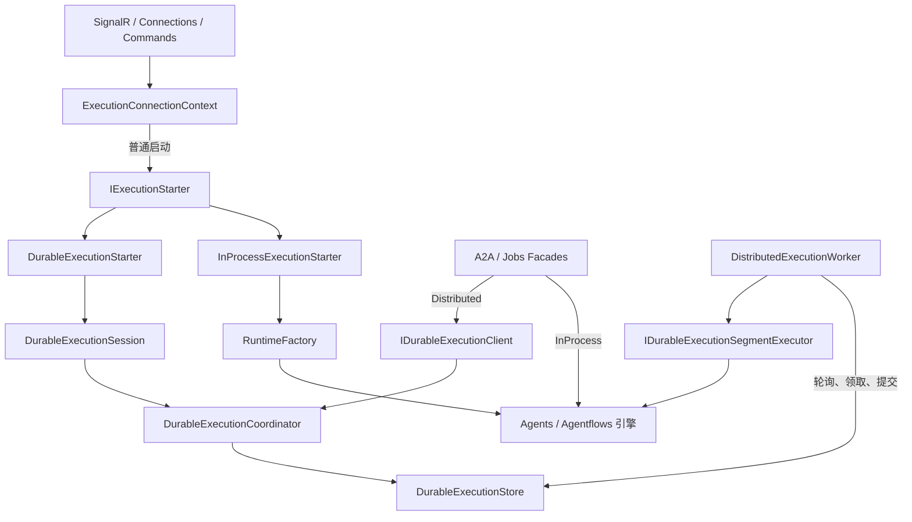
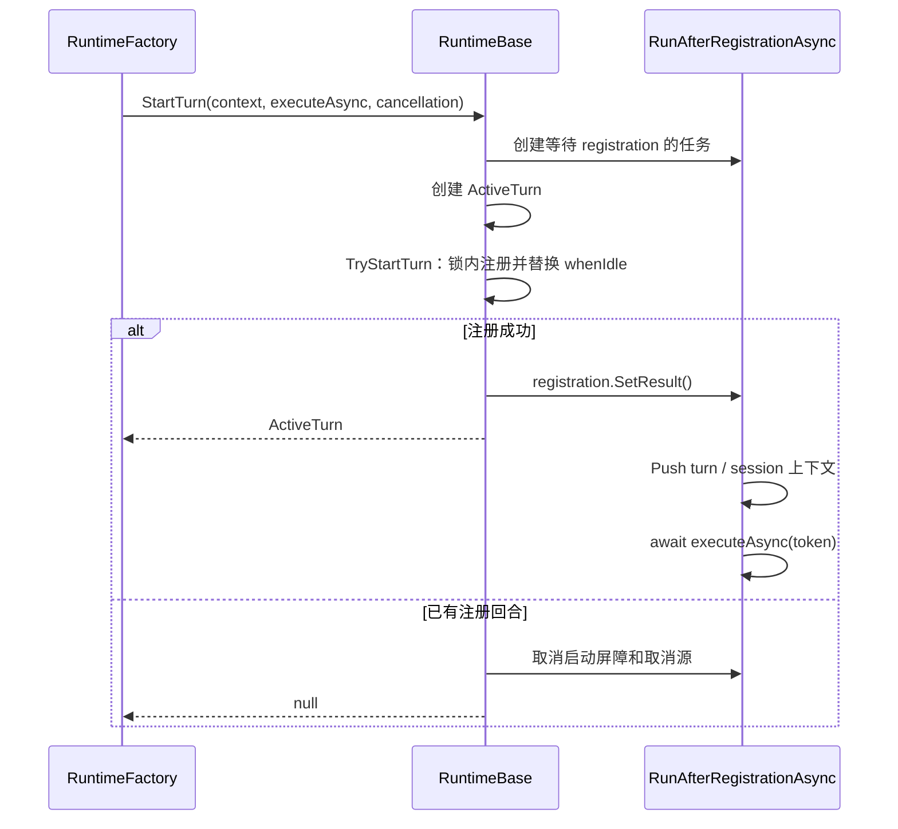
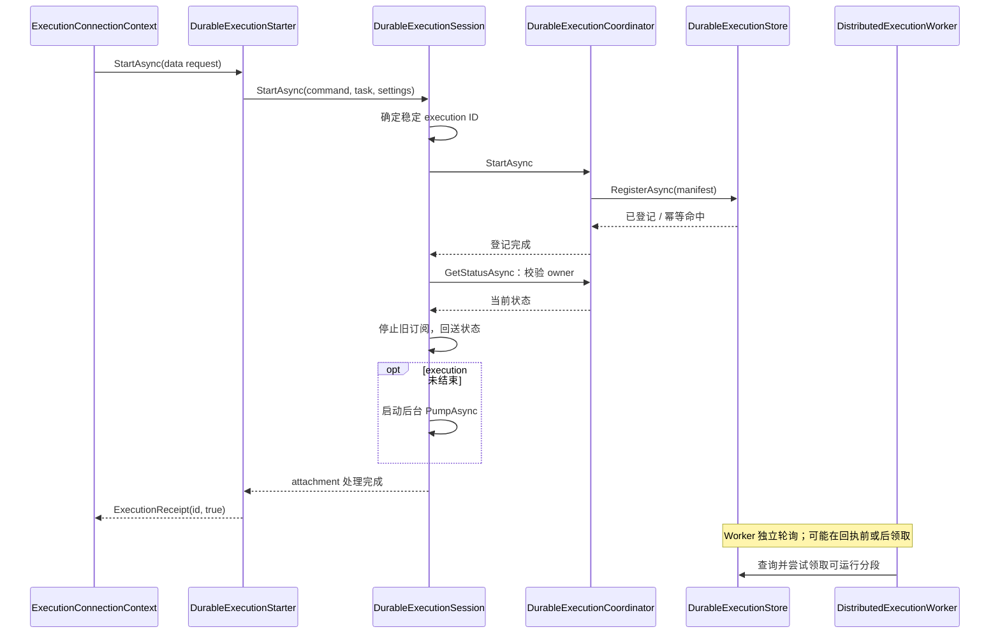
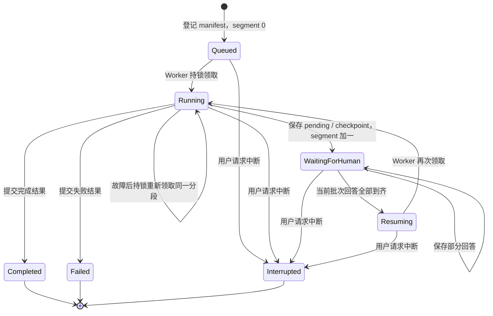
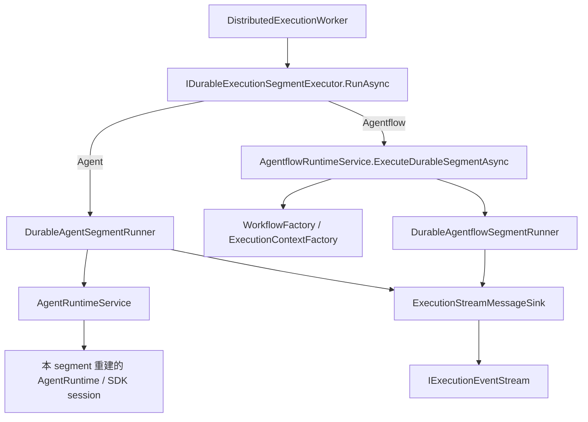

# Runtimes：执行启动、回合生命周期与持久化调度

`Runtimes` 负责把已经解析的执行请求交给 Agent 或 Agentflow，并管理执行所需的生命周期。这里包含连接内的统一启动入口、进程内 Runtime 的共同基类，以及 Durable 的登记、订阅、领取和分段调度。

本文按“整体位置 → 核心抽象 → InProcess → Durable → 跨能力依赖与生命周期”的顺序展开。完整的 SignalR 命令协议见 [Execution README](../README.md)，回合数据与消息协议见 [Turns README](../Turns/README.md)。

阅读导航：

1. [总体定位](#overview)
2. [目录与核心抽象](#abstractions)
3. [IExecutionStarter：统一接受启动](#starter)
4. [RuntimeBase：进程内回合生命周期](#runtime-base)
5. [InProcess：创建、复用与执行](#in-process)
6. [Durable：登记、领取、分段与恢复](#durable)
7. [跨能力依赖与服务生命周期](#dependencies)
8. [控制操作与取消边界](#control)
9. [配置与部署前提](#configuration)
10. [阅读代码与验证入口](#verification)

<a id="overview"></a>

## 1. 总体定位

### 1.1 执行目标与执行方式是两个维度

| 维度 | 代码中的选择 | 回答的问题 |
| --- | --- | --- |
| 执行目标 | `AgentRuntimeType.Agent` / `AgentRuntimeType.Agentflow` | 执行单个 Agent，还是执行由节点和路由组成的 Workflow？ |
| 执行方式 | 配置中的 `ExecutionProvider.InProcess` / `ExecutionProvider.Distributed` | 在当前进程内管理活动 turn，还是通过持久状态交给 Worker 调度？ |

配置使用 **Distributed**，实现目录使用 **Durable**：前者描述部署与调度方式，后者强调执行状态可以保存、暂停和恢复。它们在当前代码中对应同一套执行实现。

两种目标和两种执行方式的组合如下：

| 目标 | InProcess 交互式执行 | Durable 执行 |
| --- | --- | --- |
| Agent | `RuntimeFactory` 创建或复用 `AgentRuntime`，注册一个 `ActiveTurn` | `DurableAgentSegmentRunner` 每段重建 Agent Runtime，通过保存的 SDK session 与人工回答继续执行 |
| Agentflow | `RuntimeFactory` 创建或复用 `AgentflowRuntime`，由 RuntimeService 调用 InProcess Runner | `AgentflowRuntimeService` 构建 Workflow，由 Durable Runner 从 checkpoint 开始或恢复一个分段 |

`AgentRuntimeType.Agent` 与 Agent 定义中的 `AgentType.System` / `External` 也不是同一维度。当前 `DurableAgentSegmentRunner` 只支持 System Agent；它会明确拒绝 External Agent。

### 1.2 为什么保留共享的 Runtimes 目录

启动受理、单活动 turn、取消、持久执行领取等机制同时服务 Agent 和 Agentflow，因此集中在 `Runtimes`。模型构造、工具和 SDK session 属于 [Agents](../Agents/)；Workflow 构建、节点运行和 checkpoint 属于 [Agentflows](../Agentflows/)。

`Runtimes` 是 `Agw.Agents.Execution` 程序集内的能力目录，没有独立的项目或程序集。目录表达职责，不能把目录之间的引用直接理解为独立分层项目的依赖：例如 `RuntimeFactory` 创建 `AgentRuntime`，而 `AgentRuntime` 又继承共享的 `RuntimeBase`。

### 1.3 总体调用关系

下图展示入口和调度关系。Worker 主动查询持久状态，Coordinator 不直接调用 Worker；引擎节点代表下文展开的 Agent / Agentflow 服务。



`IExecutionStarter` 统一的是**当前连接接受一次启动**。A2A、Jobs 通过既有 Facade 使用执行服务；它们的 Durable 路径经 Client 汇入同一个 Coordinator，不需要创建 SignalR 连接或 attachment。

<a id="abstractions"></a>

## 2. 目录与核心抽象

```text
Runtimes/
├── README.md
├── RuntimeBase.cs
├── ExecutionStartCommandMapper.cs
├── Contracts/
│   ├── IExecutionStarter.cs
│   ├── ExecutionStartRequest.cs
│   └── ExecutionReceipt.cs
├── InProcess/
│   ├── InProcessExecutionStarter.cs
│   └── RuntimeFactory.cs
└── Durable/
    ├── DurableExecutionStarter.cs
    ├── DurableExecutionSession.cs
    ├── DurableExecutionClient.cs
    ├── DurableExecutionCoordinator.cs
    ├── DistributedExecutionWorker.cs
    ├── DurableExecutionSegmentExecutor.cs
    └── Contracts/
        ├── IDurableExecutionClient.cs
        └── DurableExecutionContracts.cs
```

| 抽象或类型 | 表达的边界 | 结果或状态 |
| --- | --- | --- |
| `IExecutionStarter` | 连接向执行方式提交启动请求 | `ExecutionReceipt`，只说明是否接受启动 |
| `IRuntimeFactory` | InProcess 实现创建 / 复用具体 Runtime 并启动 turn | `RuntimeStartResult`，包含 Runtime 与 ActiveTurn 引用 |
| `RuntimeBase` | 一个进程内 Runtime 的活动回合生命周期 | 当前 `ActiveTurn`、空闲屏障、回合结束后的动作 |
| `IDurableExecutionClient` | Facade 访问 Durable 登记、结果、回放和中断 | 持久 execution ID、outcome、带 cursor 的事件 |
| `IDurableExecutionSegmentExecutor` | Worker 执行一次可恢复分段 | `DurableExecutionSegmentResult` |

`RuntimeStartRequest`、`RuntimeStartResult` 和 `IRuntimeFactory` 当前与实现同置于 [RuntimeFactory.cs](InProcess/RuntimeFactory.cs)。`IDurableExecutionSegmentExecutor` 当前与实现同置于 [DurableExecutionSegmentExecutor.cs](Durable/DurableExecutionSegmentExecutor.cs)。不要只在 `Contracts` 目录查找这些接口。

<a id="starter"></a>

## 3. IExecutionStarter：统一接受启动

### 3.1 请求与回执

[IExecutionStarter](Contracts/IExecutionStarter.cs) 是执行程序集内部接口：

```csharp
Task<ExecutionReceipt> StartAsync(
    ExecutionStartRequest request,
    CancellationToken cancellationToken);
```

[ExecutionStartRequest](Contracts/ExecutionStartRequest.cs) 是已解析的数据请求：

| 字段 | 来源和用途 |
| --- | --- |
| `ExecutionId` | 当前执行标识；Durable 用它登记、订阅和重试 |
| `Target` | `AgentId` 与 `AgentRuntimeType`，保留 Agent / Agentflow 区分 |
| `Task` | 已解析的 Project、Conversation、Context、Task 和 Generation 快照 |
| `Settings` | 本次执行的配置快照，包括权限与环境变量等 |
| `Input`、`Stream` | 用户输入及消息输出方式 |
| `Workspace` | 连接已解析的工作目录，供进程内 turn 上下文使用 |
| `RequestedMode` | 可选的 Agent mode 请求，由进程内 Factory 应用 |
| `ResumeCheckpoint` | 可选的 Agentflow 恢复快照，供进入普通启动路径的恢复请求使用 |

请求不携带 `RuntimeBase`、`ActiveTurn`、消息 sink、用户身份回调或取消源。这些资源属于具体实现绑定的生命周期。请求也不是新的持久化格式：Durable 仍使用既有 manifest、task、settings 和 checkpoint 数据。

[ExecutionStartCommandMapper](ExecutionStartCommandMapper.cs) 把数据请求转回底层 Factory / Session 已使用的 `ExecCommand`。它映射 execution ID、目标、conversation、输入、stream 和 checkpoint；存在 checkpoint 时，从任务快照填写 `ResumeGeneration`。它不分配新 ID，也不负责权限、工作目录或任务解析。

[ExecutionReceipt](Contracts/ExecutionReceipt.cs) 只有两个字段：

```csharp
internal readonly record struct ExecutionReceipt(Guid ExecutionId, bool Accepted);
```

| 实现 | `Accepted = true` 的含义 | 不能从回执推断的事情 |
| --- | --- | --- |
| InProcess | Factory 返回了已注册的 `ActiveTurn` | turn 已经成功完成，或消息一定晚于回执到达 |
| Durable | 执行登记与当前连接的 attachment 处理完成 | Worker 已经领取，或此时一定仍处于 Queued |

Durable 幂等重试可以命中已有 execution，包括已经结束的 execution，因此回执不承诺当前持久状态。InProcess 返回空 Runtime 或没有成功注册 turn 时，`Accepted` 为 `false`。参数校验、数据库或基础设施异常继续沿既有异常边界传播，不统一转换为 `false`。

这个回执只供服务端内部使用，不增加 SignalR 的返回字段。实际进度与完成状态仍通过 `AgwMessage` 和既有持久状态查询传递。

### 3.2 连接在调用接口前完成什么

[ExecutionConnectionContext.StartTurnAsync](../Inbound/Connections/ExecutionConnectionContext.cs) 依次处理：

1. 建立连接所有者的用户上下文，检查当前是否忙碌。Durable 当前已附着同一个 execution ID 时走重新订阅。
2. 进程内旧 turn 的执行任务可能已完成但仍在清理，先等待 `WhenIdleAsync`。
3. 校验 Agent ID、Conversation ID 和连接绑定关系，沿用现有 execution ID 生成规则。
4. 解析任务、会话代次和 workspace；代次变化时使旧 Runtime 与解析缓存失效。
5. 校验 checkpoint 的恢复代次，处理 target 变化及排队的 Agent mode。
6. 构造 `ExecutionStartRequest`，只调用 `_executionStarter.StartAsync`。
7. 根据回执更新 execution ID 与 target；启动未被接受时发送既有错误消息。

Starter 因此不重复承担连接鉴权、任务解析和命令并发控制。`ExecutionConnection` 的 command gate 仍负责串行处理命令；启动无需等待整个执行完成，后续中断和人工回答命令才能进入。

### 3.3 实现如何选择

[ExecutionConnectionContextFactory](../Inbound/Connections/ExecutionConnectionContextFactory.cs) 读取全局 `Execution:Provider`。使用 Distributed 时，为当前连接构造 `DurableExecutionSession`；InProcess 时不创建该 Session。

Context 在构造时据此创建一个 `InProcessExecutionStarter` 或 `DurableExecutionStarter`。Starter 与连接一一绑定，不是 singleton，也不是每次启动都重新选择 Provider。InProcess 实现保存用户、sink、Host token 和 HumanGate 状态回调；Durable 实现保存当前连接的 Session。

<a id="runtime-base"></a>

## 4. RuntimeBase：进程内回合生命周期

### 4.1 它管理什么

[RuntimeBase](RuntimeBase.cs) 是 `AgentRuntime` 与 `AgentflowRuntime` 的共同基类。它接收执行委托，管理一个 Runtime 同时最多注册一个 turn 的约束，不负责模型调用、Workflow 编译或持久 execution 状态转换。

| 内部状态 | 用途 |
| --- | --- |
| `_lock` | 保护 turn 注册、空闲任务、结束动作和释放标记 |
| `_activeTurn` | 当前已注册的回合对象 |
| `_whenIdle` | 当前 turn 执行、释放和结束动作全部收敛后的完成任务 |
| `_afterTurnActions` | 按字符串 key 保存回合结束后的动作，同 key 后写覆盖先写 |
| `_disposed` | 阻止已释放 Runtime 接受新 turn 或新结束动作 |

[ActiveTurn](../Turns/ActiveTurn.cs) 保存执行 `Task`、取消源、额外中断 hook，以及人工回答和权限切换委托。RuntimeBase 只向当前 ActiveTurn 转发这些控制操作。

### 4.2 先注册，后执行

`StartTurn` 用 `TaskCompletionSource` 建立启动屏障，避免执行委托已经运行，而连接仍看不到活动 turn 的竞态：



`TryStartTurn` 在锁内检查释放状态和 `_activeTurn`，注册成功后启动 `ObserveTurnAsync`。实际执行由异步任务继续推进，没有为每个 turn 创建独立 HostedService，也没有依靠占用 command gate 来等待完成。

`RunAfterRegistrationAsync` 在执行委托前建立两个作用域：

- `RuntimeTurnContextAccessor.Push`：传播本轮 settings、target、用户、workspace、消息 sink 等快照。
- `ConversationSessionContext.Push`：传播 Project、Context 和 Generation，供历史与 session 持久化识别当前代次。

作用域随该次异步执行恢复，不把连接中可变的 settings 或 Runtime 缓存放入全局上下文。

### 4.3 执行完成与完全空闲不同

`HasActiveTurn` 根据 `ActiveTurn.ExecutionTask.IsCompleted` 判断执行是否仍在运行。执行 Task 完成后，Runtime 可能仍在释放取消源或执行排队动作；此时 `HasActiveTurn` 可以为 `false`，但 `WhenIdleAsync` 尚未完成。

`ObserveTurnAsync` 的收尾顺序是：

1. 等待执行 Task；即使任务失败，也进入清理流程。
2. 释放 ActiveTurn，等待其执行结束后再释放取消源。
3. 在锁内取出并清空 `_afterTurnActions`，在锁外逐个执行；期间加入的新动作由下一轮取出。
4. 没有剩余动作时清除 `_activeTurn`。
5. 完成 `_whenIdle`。

例如 Agent mode 的延后切换使用固定 key：同一 turn 内多次切换保留最后一次请求。`WhenIdleAsync` 是复用 Runtime 和释放连接 scope 时需要等待的完整屏障。

执行异常的客户端展示由 TurnPipeline 或具体引擎负责；RuntimeBase 的观察任务负责生命周期收敛，不自行生成成功或失败消息。

### 4.4 中断与释放

`RequestInterrupt` 转发到 ActiveTurn。ActiveTurn 先调用额外的中断 hook，再取消执行 token：Agent 可以同时取消 SDK 请求与全部等待审批，Agentflow 可以取消等待中的人工交互。

`RuntimeBase.DisposeAsync` 在锁内标记已释放并请求中断，然后在锁外等待空闲。派生 Runtime 随后释放自身资源：

| 派生类型 | 持有的引擎状态 | 释放内容 |
| --- | --- | --- |
| [AgentRuntime](../Agents/Runtime/AgentRuntime.cs) | `AIAgent`、SDK `AgentSession`、session scope、Project / Context、独立请求取消源 | 等待基类收敛后，释放支持释放接口的 Agent 和请求取消源 |
| [AgentflowRuntime](../Agentflows/Runtime/AgentflowRuntime.cs) | Agentflow ID、任务、settings、RuntimeService、连接内 checkpoint 状态 | 等待基类收敛后，清空 checkpoint 状态 |

SDK session 的保存由 AgentRuntimeService 的执行路径负责。`RuntimeBase.DisposeAsync` 本身不保存历史或 checkpoint。

<a id="in-process"></a>

## 5. InProcess：创建或复用 Runtime，启动本地 turn

### 5.1 Starter、Factory 与引擎各自负责什么

| 组件 | 直接依赖 | 实现逻辑 |
| --- | --- | --- |
| [InProcessExecutionStarter](InProcess/InProcessExecutionStarter.cs) | `IRuntimeFactory`、连接绑定的用户 / sink / Host token / 回调 | 保存可复用 Runtime；检查启动前取消和目标变化；建立 turn 上下文；把 Factory 结果转换成回执 |
| [RuntimeFactory](InProcess/RuntimeFactory.cs) | Agent / Agentflow RuntimeService、文件系统 resolver、turn / 人工交互 accessor、conversation execution gate | 获取执行 lease、检查 workspace、选择 Runtime、装配审批与取消逻辑、注册 ActiveTurn |
| Agent / Agentflow RuntimeService | 各自的定义、会话、构建与 Runner 能力 | 创建并执行实际引擎，管理引擎专属资源与持久化 |
| [TurnPipeline](../Turns/TurnPipeline.cs) | 引擎消息流与 `IExecutionMessageSink` | 输出启动 / 结束协议，处理流式或缓冲输出、异常与取消 |

Starter 保存 Runtime 引用，Context 维护 settings、target、generation 等失效规则。Factory 仍保留 `RuntimeStartRequest.CurrentRuntime` 和 `RuntimeStartResult`，这些进程内对象不会泄露到统一回执。

### 5.2 启动流程

1. Starter 检查启动请求是否已取消；目标变化时释放旧 Runtime。
2. Starter 用请求数据和连接资源构造 `RuntimeTurnContext`，把旧 Runtime 一起交给 Factory。
3. Factory 建立会话代次上下文，通过 `IConversationExecutionGate` 获取 conversation 执行 lease，并链接 Host token 与 lease 丢失信号。
4. Factory 经文件系统 resolver 检查 workspace，按 Agent / Agentflow 类型创建或复用 Runtime。
5. 为本轮创建 `MafPermissionState` 和共享同一权限状态的 `InProcessInteractionSession`。
6. Factory 调用 `RuntimeBase.StartTurn`，安装执行、中断、人工回答与权限切换委托。
7. Starter 保存返回的 Runtime，并根据是否取得 ActiveTurn 返回回执。
8. 后台执行把引擎消息交给 TurnPipeline；turn 完全空闲后释放 conversation lease。

Factory 构造参数允许不提供 conversation gate；提供时 lease 覆盖整个活动回合及收尾过程。创建失败或未能注册 turn 时立即释放 lease，不把 lease 留给一个不存在的后台任务。

### 5.3 Runtime 复用与失效

| 场景 | 处理位置与结果 |
| --- | --- |
| 同目标、同一兼容会话且 Agent definition 版本未变 | Starter 传入旧 Runtime，Factory 通过当前用户的 `UpdateTime ?? CreateTime` 检查后复用 |
| Agent 会话 Project、规范化 Context、Generation 或 definition 版本不兼容 | Factory 释放旧 Runtime 并重建；保留 Conversation 与外部 provider-session 绑定 |
| 外部 Agent 的 PermissionVersion 改变 | Starter 在下一轮释放旧 Runtime；当前 turn 和待答交互不变 |
| Agent ID 或 Agent / Agentflow 类型变化 | Context / Starter 释放旧目标 Runtime |
| settings 内容变化 | Context 在空闲时释放 Runtime，并清空任务、workspace 和 target 缓存 |
| Conversation Generation 变化 | 下一次启动重新检查代次，释放 Runtime 并重新解析任务与 workspace |
| 普通 turn 完成 | 清理 ActiveTurn，保留 Runtime 供下一轮使用 |
| 连接最终释放 | 释放 Runtime，再释放 connection DI scope |

Agent definition 变更只在新 turn 开始时检查；运行中或等待人工响应时不会替换实例。重建失败后 Starter 清除已释放的 Runtime 引用，后续请求可重试。独立修改关联 Provider 不改变 Agent 行版本，不构成单独的缓存失效信号。

AgentflowRuntime 的复用依赖外层 Context / Starter 已处理 target、settings 与 generation 的失效。复用该包装对象不等于复用一个永不结束的 Workflow run：RuntimeService 仍按执行创建 Workflow Lease 和运行资源。

### 5.4 输出、人工交互与取消

Agent 路径调用 AgentRuntimeService 的流式或非流式方法；Agentflow 路径通过 AgentflowRuntime 调用 RuntimeService 与 InProcess Runner。两者的输出最终都进入 TurnPipeline，后者发送 `turn-start`、普通消息与 `turn-finished`，并统一处理执行失败和取消。

`stream=false` 时普通输出缓冲到结束；需要用户处理的控制消息保持可见。人工交互通过 `HumanInteractionContextAccessor` 暴露本轮的 `InProcessInteractionSession`；该对象统一登记、发布、等待和清理，并按 pending 总数报告等待状态。等待期间 ActiveTurn 和执行资源仍然存活。

启动方法收到的 cancellation token 只在 Starter 受理前检查；Factory 仍使用连接创建时绑定的 Host token。普通断线不直接取消正在运行的 turn，连接先标记 detached，等待持久化与收尾后再释放 scope；若正在等待人工回答，则请求中断。Host 关闭和显式 interrupt 通过既有执行取消链终止工作。

<a id="durable"></a>

## 6. Durable：登记执行，由 Worker 领取可恢复分段

### 6.1 各组件的职责

| 组件 | 负责什么 | 不由它持有的状态 |
| --- | --- | --- |
| [DurableExecutionStarter](Durable/DurableExecutionStarter.cs) | 映射启动请求，委托 Session，再返回启动回执 | Worker 的运行任务和分段领取权 |
| [DurableExecutionSession](Durable/DurableExecutionSession.cs) | 当前连接的 execution ID、订阅 pump、状态回送、回答、中断和重新附着 | 持久 execution 的生命周期 |
| [DurableExecutionClient](Durable/DurableExecutionClient.cs) | 为 Facade 提供登记、查询、等待、事件读取和中断入口 | SignalR attachment 和可复用 Runtime |
| [DurableExecutionCoordinator](Durable/DurableExecutionCoordinator.cs) | 编排状态存储、人工回答锁、checkpoint 分支和事件回放 | 长期存活的 DbContext、引擎实例 |
| [DistributedExecutionWorker](Durable/DistributedExecutionWorker.cs) | 轮询候选、限制本机并发、竞争锁、领取分段、监测中断、提交结果 | SignalR 连接状态 |
| [DurableExecutionSegmentExecutor](Durable/DurableExecutionSegmentExecutor.cs) | 恢复执行上下文，调用具体引擎分段并输出普通消息 | 下一段的进程内对象或长期运行会话 |

PostgreSQL 中的执行状态决定是否可以继续、等待或结束；event stream 用于输出回放。Coordinator 和 Worker 都访问 Store，但两者之间没有“提交请求后直接调用 Worker”的关系。

### 6.2 启动登记与连接 attachment



普通 SignalR Durable 启动要求 `stream=true`。Session 使用客户端提供的非空 execution ID；缺少或为空时生成 ID。Coordinator 将命令投影为 `DurableExecutionRequest`，Store 保存 owner 与 manifest，初始状态为 `Queued`、`SegmentIndex = 0`。

登记按 execution ID 幂等：相同 ID、owner 与清单内容可以重复提交，不同内容返回冲突。登记前后仍校验 Conversation 所有权与 Generation，ID 幂等不会绕过会话失效规则。

`AttachAsync` 先查询并鉴权，再停止旧订阅、回送当前 turn 状态。终态直接完成 attachment 处理；非终态建立绑定 Host token 的订阅 pump。`PumpAsync` 持续把 Coordinator 的输出转发到当前连接的 sink，收到结束消息后清除活动 execution ID。

断开连接调用 `PrepareForDetach`，只取消 pump；释放 Session 等待订阅退出并清理本地状态。持久记录继续存在，其他连接可以通过 execution ID 与 cursor 重新附着。

Client 使用同一个 Coordinator，但不维护上述 attachment。`ReadAsync` 先检查已授权 outcome，再输出带 cursor 的事件；`WaitForActionableOutcomeAsync` 在 `WaitingForHuman` 或终态时返回，不能把该方法理解成“只等待成功完成”。

### 6.3 Execution 状态与 Segment 结果

一次 execution 可以跨多个 segment。分段是“从当前输入或恢复点开始，运行到完成、失败或下一个人工等待边界”的工作单元。



持久 execution 状态有 `Queued`、`Running`、`WaitingForHuman`、`Resuming` 和各终态；[DurableExecutionSegmentStatus](Durable/Contracts/DurableExecutionContracts.cs) 则只有 `WaitingForHuman`、`Completed`、`Failed`。`Interrupted` 由持久控制路径写入，分段通过协作式取消退出。

`DurableExecutionSegmentInput` 包含 execution ID、从零开始的 SegmentIndex、已解析人工回答和可选 Agentflow checkpoint。`DurableExecutionSegmentResult` 包含同一分段标识、结果状态、pending 请求、checkpoint 和错误信息。两者都不携带活动 Task、Runtime 或 DbContext。

Store 保存等待结果时，原子写入 pending / checkpoint、清空上一批回答，并把 SegmentIndex 加一。普通重新领取或故障重试不会直接增加分段号；增加分段号发生在进入新的人工等待边界时。

### 6.4 Worker 的领取与并发保护

`DistributedExecutionWorker` 是一个 `BackgroundService`，在服务完成初始化后开始轮询。主循环通过 `_runningExecutions` 跟踪本机任务，并受 `MaxConcurrentExecutions` 限制。每个竞争任务处理一个 segment，结束或等待后释放本机容量。

领取与执行过程如下：

1. Store 查询 `Queued`、`Resuming` 和超过恢复探测时间的 `Running` 候选；扫描临时进入受控系统作用域。
2. Worker 竞争 execution ID 对应的 `IApplicationLock`。获取超时说明当前仍可能由其他 Server 持有，本轮跳过。
3. 获得锁后创建独立 DI scope，调用 `TryBeginSegmentAsync` 再次校验可运行条件并保存 `Running`。
4. 保存领取快照中的 `StateVersion`，将 Host token 与 `HandleLostToken` 链接为本次领取的取消信号。
5. 启动状态监测任务，每 250 ms 检查状态仍为 `Running` 且版本等于领取版本；不匹配时取消当前 segment。
6. 调用 `IDurableExecutionSegmentExecutor.RunAsync` 执行分段。
7. 用**原领取版本**调用 `SaveSegmentResultAsync`。Store 同时检查状态、SegmentIndex、StateVersion，并通过 EF 并发条件处理提交竞争。
8. 状态成功提交后，终态消息才由 Worker 尽力发布；随后释放 scope 和 execution 锁。

分布式锁与 StateVersion 解决的问题不同：锁防止两个健康 Worker 同时执行同一 execution；版本校验防止已经失去领取权的旧结果覆盖中断或后续领取的状态。提交前读取“最新版本”替换原领取版本会破坏这项保护。

`RecoveryProbeSeconds` 是候选扫描阈值，不是执行超时或锁的租期。长任务超过该时间仍受实际分布式锁保护，不会因此获得两个合法执行者。

Host 关闭导致取消时，Worker 不把未完成分段写成失败终态；锁释放后其他 Worker 可从保留的 `Running` 快照重新领取。恢复采用分段至少一次执行，不能保证模型调用或外部工具副作用只发生一次。

### 6.5 SegmentExecutor 与两类引擎的实际调用关系

SegmentExecutor 在当前分段的 DI scope 中加载 manifest，恢复持久 owner 的用户上下文，再建立 Conversation Generation 与历史持久化作用域，最后创建本段的 `ExecutionStreamMessageSink`。

具体分派路径如下，Agentflow 中间经过 RuntimeService：



Agent Runner 调用 `CreateDurableRuntimeAsync` 重建引擎。首段消费原始输入；后续段把保存的人工回答转换为 Tool approval response，交给恢复后的 SDK session。需要人工处理时捕获请求并结束当前段，返回 `WaitingForHuman`；最终释放本段 Runtime。

Agentflow RuntimeService 校验可见目标与 Project，创建 session scope 和 Workflow Lease，再调用 Durable Runner。Runner 首段创建 Workflow run，后续段从 `DurableAgentflowCheckpointStore` 恢复；只在首段发送新的 `TurnToken`。Runner 释放本段 run，RuntimeService 释放 Workflow Lease。

这里需要区分两种“进程内”：Durable Agentflow Runner 调用的是 MAF SDK 的 `InProcessExecution.RunStreamingAsync` / `ResumeStreamingAsync`，用于在当前 Worker 进程中运行这一段 Workflow。**Agw 的 Durable 指跨分段、跨进程的调度与恢复方式**，并不要求单段 Workflow 通过另一种远程引擎执行。

Durable Agent 也会创建继承 RuntimeBase 的 AgentRuntime 对象，但这个对象随 segment 重建和释放，不承担连接内的 ActiveTurn 调度。持久 execution 的身份与状态不依赖 RuntimeBase 对象存活。

### 6.6 人工交互如何跨分段继续

InProcess 在内存中等待用户回答；Durable 将等待边界保存后释放分段资源：

1. 引擎捕获 Tool approval、HumanGate 或信息请求，返回 pending 快照；Agentflow 同时提供恢复所需的 checkpoint。
2. Worker 提交等待结果，execution 进入 `WaitingForHuman`。Coordinator 读取已提交状态后向订阅端展示请求。
3. 用户通过 Session 提交回答。Coordinator 在 execution 锁内校验并调用 Store，按 owner 和 RequestId 匹配当前 pending 请求。
4. 相同回答可幂等重试，冲突回答被拒绝。当前批次回答全部到齐后，状态变为 `Resuming`。
5. Worker 重新领取；SegmentInput 携带请求与回答的配对结果，Runner 把响应注入 SDK / Workflow，并通过 `ResolvedHumanInteractionChannel` 为实际 Tool 提供已保存的信息。

权限判断和响应归一共用 `InteractionRules`；`DurableInteractionHandler` 返回显式 `Resolved` / `Pending`，`UnattendedInteractionHandler` 明确拒绝无法提供人工输入的调用。无人值守拒绝策略不会创建一个永远等不到回答的后台等待。审批规则和交互协议的归属是 [HumanInteraction](../HumanInteraction/)，Worker 只协调持久状态。

显式 checkpoint 分支与“同一次 execution 的人工回答续跑”也不同：Durable 的 `ResumeCheckpointAsync` 等待来源 execution 的锁，在 checkpoint 能力中校验并准备新的恢复 execution，再让 Session 附着新 ID。它是专门的控制路径，不重复登记一个普通启动清单。

### 6.7 消息顺序与回放降级

[ExecutionStreamMessageSink](../Outbound/Durable/ExecutionStreamMessageSink.cs) 为当前 segment 的普通输出分配序号并串行批量写入 `IExecutionEventStream`。它拦截人工等待和 turn-finished 控制消息，避免把尚未持久化的等待点或终态提前暴露给客户端。

正常路径的顺序是：

```text
引擎输出普通消息
  → 分段退出时排空事件批次、完成历史持久化作用域
  → Worker 保存 segment 结果
  → Coordinator 根据已提交状态合成 pending
    或 Worker 尽力发布 terminal
  → Session / Client 回放到调用方
```

领取失效或取消后，sink 丢弃该 attempt 尚未提交的缓冲事件。历史与执行状态仍使用原来的会话代次、领取版本和持久化边界。

Coordinator 的 `ReadAsync` 从 cursor 回放普通事件，并周期性查询 PostgreSQL 状态。准备合成 pending 或 terminal 时，会再读一次事件流尾部，避免最后一批输出被终止消息抢先截断；同一订阅内还会按 RequestId 去重已展示的 pending。

已识别的 event stream 不可用错误会进入既有降级路径：停止当前 attempt 的后续普通输出写入，订阅端继续通过状态表获知等待或结束。状态表可以重建控制消息，但不能补回没有成功保存的普通文本，因此持久状态与完整输出回放是两项不同的保证。

<a id="dependencies"></a>

## 7. 跨能力依赖与服务生命周期

### 7.1 Runtimes 与相邻目录的边界

| 依赖能力 | Runtimes 如何使用它 | 该能力保留的职责 |
| --- | --- | --- |
| [Inbound/Connections](../Inbound/Connections/) | 接收已解析的启动请求和连接资源 | settings、task、workspace、target、命令串行化与失效规则 |
| [Turns](../Turns/) | 注册 ActiveTurn，建立 turn 上下文，输出统一协议 | 单回合数据、取消委托、上下文访问和 TurnPipeline |
| [Agents/Runtime](../Agents/Runtime/) | 创建与执行 Agent Runtime，恢复 Agent session | 定义组合、工具 / 技能、外部 SDK 适配、session 保存 |
| [Agentflows](../Agentflows/) | 调用 RuntimeService 与分段 Runner | Workflow 构建、节点上下文、checkpoint、节点追踪 |
| [HumanInteraction](../HumanInteraction/) | 为当前 turn 或 segment 配置审批和交互 Channel | 权限策略、请求 / 回答协议、等待与回答注入 |
| [Outbound](../Outbound/) | 经消息发送接口输出当前 turn 或 segment 的消息 | SignalR 客户端发送和 Durable 分段消息批量写入 |
| [Messaging](../Messaging/) | 读取和写入 Durable 事件流 | 消息转换、cursor 回放与事件存储实现 |
| [Persistence/Durable](../Persistence/Durable/) | 经 Store 登记、查询和提交 execution 状态 | JSON 与状态映射、幂等校验、并发提交、持久状态查询 |

Durable manifest、任务与 settings 的持久数据类型，以及 `IAgentsDbContext` 等持久化接缝仍在 `Agw.Agents`。执行程序集单向引用 Agents 定义与持久化边界，没有为每种 Runtime 增加数据库或程序集。

### 7.2 DI 生命周期

注册位置为 [DependencyInjection.AddAgentExecution](../DependencyInjection.cs)：

| 组件 | 生命周期 / 创建方式 | 原因 |
| --- | --- | --- |
| `IRuntimeFactory`、Agent / Agentflow RuntimeService、Runners | Scoped | 使用当前连接或 segment 的依赖作用域 |
| `ExecutionConnectionContextFactory` | Scoped，启用 transport 时注册 | 为连接组合配置与执行资源 |
| Context、两个 Starter、Durable Session | 按连接手动构造，由 connection 生命周期持有 | 绑定特定用户、sink、Host token 与本地状态 |
| `RuntimeBase` 派生对象 | 由 Factory / RuntimeService 构造 | 进程内跨 turn 复用，或 Durable 中随 segment 释放 |
| `RuntimeTurnContextAccessor`、`HumanInteractionContextAccessor` | Singleton | 使用异步上下文隔离，不共享当前执行的可变状态 |
| `DurableExecutionCoordinator`、`IDurableExecutionClient`、`IExecutionEventStream` | Singleton，Distributed 时注册 | 共享协调 / 回放入口，通过独立 scope 访问持久化依赖 |
| `DurableExecutionStore`、`IDurableExecutionSegmentExecutor` | Scoped，Distributed 时注册 | 每次状态操作或分段使用独立依赖与 DbContext |
| `DistributedExecutionWorker` | HostedService，按 Host 注册选项启用 | 承担整个 Host 的轮询与本机并发管理 |

Coordinator 的状态操作创建短 DI scope，Worker 的每次领取和执行也创建 scope。后台 pump 因此不会长期捕获已经结束的 Hub 调用或请求级 DbContext。

`RegistrationOptions.AddExecutionTransport` 与 `AddDistributedWorker` 独立控制 transport 和 Worker 注册。Host 可以只组合 durable client / Facade，而不运行 SignalR transport 或 Worker；调用 Client 并不意味着同一个 Host 必须负责执行。

<a id="control"></a>

## 8. 控制操作与取消边界

`IExecutionStarter` 的契约只描述启动。中断、人工回答、mode / 权限切换、checkpoint 查询与恢复仍由 Context 的稳定操作进入各自实现，不能从“启动接口统一”推断所有控制能力都具备相同语义。

| 事件 | InProcess | Durable |
| --- | --- | --- |
| 启动请求在受理前取消 | Starter 检查 token；尚未进入 Factory 时不创建 Runtime | 登记 / 鉴权 / attachment 使用请求 token；若登记已经提交，取消调用不等于撤销持久 execution |
| 普通执行期间断线 | detached 后等待当前 turn 收敛，再释放连接 scope；同一用户可经 Hub 发现原连接并查询/停止，输出不重放 | 取消当前订阅并释放 attachment，execution 继续 |
| 权限模式切换 | 更新连接的下轮设置；当前 turn 保持快照 | 更新 manifest 的 NextPermissionMode/NextPermissionVersion；当前 execution 恢复继续使用原权限 |
| 人工等待期间断线 | 请求中断等待中的 ActiveTurn | pending 保留在状态库，可由后续连接回答 |
| 显式中断 | 调用 ActiveTurn 的 hook 并取消执行 token | 先持久写入 Interrupted，再由 Worker 的状态监测取消旧 segment |
| Host 关闭 | Host token 取消执行，完成资源收尾 | Worker 取消当前段并释放锁，保留可恢复的持久状态 |
| 领取权丢失 | conversation lease 的丢失信号进入执行取消链 | execution lock 丢失信号取消分段；原版本阻止迟到结果提交 |
| 最终完成 | 清理 ActiveTurn，兼容 Runtime 可继续复用 | 保存终态并释放本段 Runtime / Workflow；订阅收到终态后结束 |

三个“Session”名称也需要分清：SDK `AgentSession` 是模型会话状态；`ConversationSessionContext` 是当前异步执行的会话代次上下文；`DurableExecutionSession` 是一个连接对持久 execution 的临时 attachment。

<a id="configuration"></a>

## 9. 配置与部署前提

配置类型位于 [ExecutionRuntimeOptions](../Configuration/ExecutionRuntimeOptions.cs)。Provider 在 Host 启动时确定，当前不是按请求动态切换。

| 配置键 | 默认值 | 影响 |
| --- | --- | --- |
| `Execution:Provider` | `InProcess` | 选择进程内或 Distributed 实现 |
| `Execution:Distributed:WorkerPollingMilliseconds` | `250` | Worker 查询候选的间隔 |
| `Execution:Distributed:MaxConcurrentExecutions` | `4` | 单个 Server 的并发 execution 上限 |
| `Execution:Distributed:RecoveryProbeSeconds` | `30` | Running 记录成为恢复候选的时间阈值 |
| `Execution:Distributed:LockAcquireTimeoutMilliseconds` | `500` | 单次竞争 execution 锁的最长等待 |
| `Execution:Distributed:EventStream:Provider` | `Postgres` | 使用 PostgreSQL 或 Redis 回放 |
| `Execution:Distributed:EventStream:WriteIntervalMilliseconds` | `250` | 事件写入批次间隔；`0` 表示逐条提交 |
| `Execution:Distributed:EventStream:WriteBatchSize` | `100` | 提前提交事件批次的数量阈值 |
| `Execution:Distributed:EventStream:ReadPollingMilliseconds` | `250` | 无新事件时的回放轮询间隔 |
| `Execution:Distributed:EventStream:ReadBatchSize` | `100` | 单批读取上限 |

Distributed 注册时会校验 PostgreSQL 数据库与 PostgreSQL 分布式锁。事件流默认也使用 PostgreSQL；只有选择 Redis 时才要求 Redis connection string。Redis 替换的是消息回放实现，执行状态和领取锁仍以 PostgreSQL 为依据。

Worker 的中断监测间隔固定为 250 ms，Coordinator 的状态检查间隔固定为 1 秒，二者不是表中的事件流读取配置。

<a id="verification"></a>

## 10. 阅读代码与验证入口

从调用方理解实现时，可依次阅读：

1. `ExecutionConnectionContext.StartTurnAsync` 与 `Contracts/IExecutionStarter.cs`：明确输入准备和受理边界。
2. `InProcessExecutionStarter` → `RuntimeFactory` → `RuntimeBase` / `ActiveTurn`：理解本地 turn 的注册、复用与收尾。
3. `DurableExecutionStarter` → `DurableExecutionSession` → `DurableExecutionCoordinator`：理解登记、attachment 和控制路径。
4. `DistributedExecutionWorker` → `DurableExecutionSegmentExecutor` → 两类 Runner：理解领取、分段与恢复。
5. `DurableExecutionStore` 与 `ExecutionStreamMessageSink`：理解状态正确性、消息顺序和输出降级的边界。

相关行为测试：

| 测试文件 | 关注点 |
| --- | --- |
| [RuntimeBaseTests.cs](../../../../tests/Agw.Agents.Tests/RuntimeBaseTests.cs) | 单活动回合、中断、结束动作、上下文与释放 |
| [InProcessExecutionStarterTests.cs](../../../../tests/Agw.Agents.Tests/InProcessExecutionStarterTests.cs) | 两类目标的启动回执、启动前取消和未受理结果 |
| [DurableExecutionStarterTests.cs](../../../../tests/Agw.Agents.Tests/DurableExecutionStarterTests.cs) | Queued 受理、断开后幂等重试和非流式拒绝 |
| [ExecutionCommandHandlerTests.cs](../../../../tests/Agw.Agents.Tests/ExecutionCommandHandlerTests.cs) | 连接状态、Runtime 复用与缓存失效 |
| [ExecutionConnectionTests.cs](../../../../tests/Agw.Agents.Tests/ExecutionConnectionTests.cs) | running / idle / 人工等待时的断线处理 |
| [DurableExecutionStoreTests.cs](../../../../tests/Agw.Agents.Tests/DurableExecutionStoreTests.cs) | 持久状态、回答、分段结果与恢复边界 |
| [PostgresExecutionFencingTests.cs](../../../../tests/Agw.Agents.Tests/PostgresExecutionFencingTests.cs) | PostgreSQL 锁连接丢失后，旧 Worker 无法覆盖新领取结果 |

从仓库根目录运行 `dotnet test tests/Agw.Agents.Tests`。需要真实 PostgreSQL 的集成场景依照测试中的显式启用条件执行；默认测试通过不等于已运行这些集成场景。
