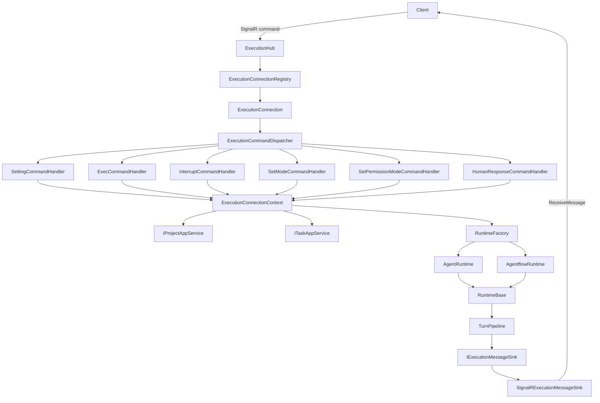
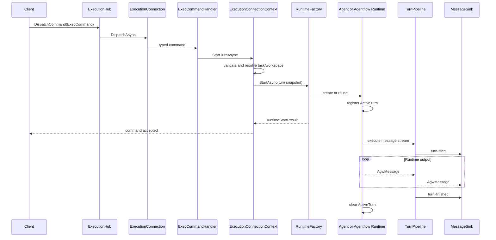
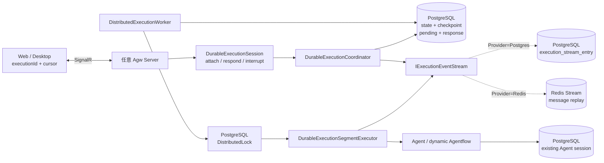
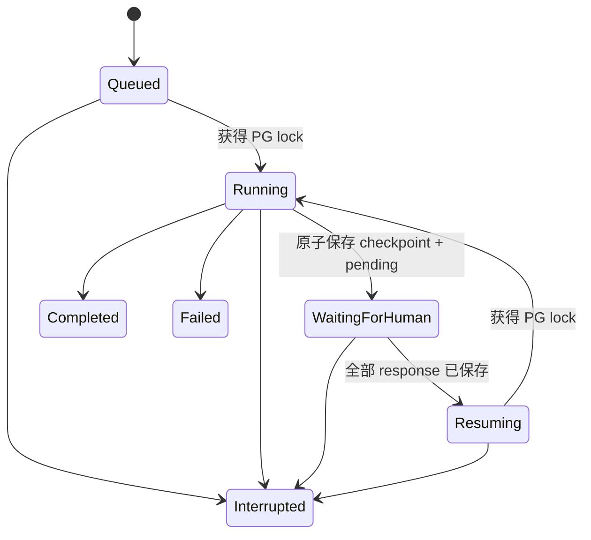
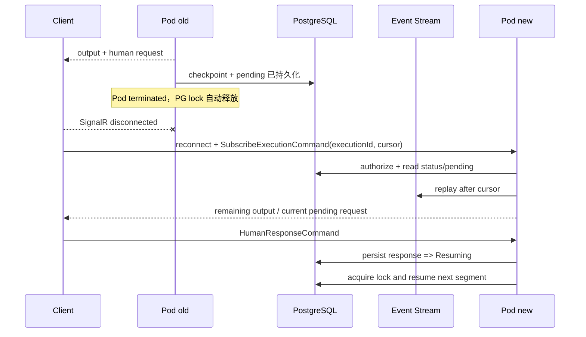
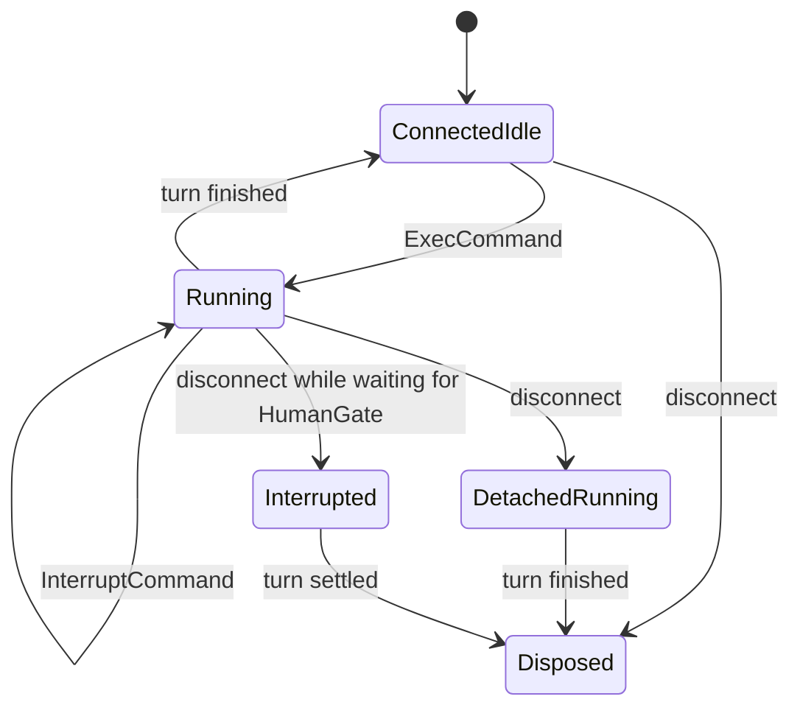

# Execution 执行子系统

`Execution` 负责把客户端命令转换为 Agent 或 Agentflow 的一次次执行 turn，并管理连接状态、运行时复用、中断、HumanGate、用户信息交互、消息输出和资源释放。它既包含 SignalR 实时执行入口，也提供给 A2A、Jobs 等模块复用的 Agent/Agentflow 执行服务。

Connection 生命周期、Command Handler 扩展方式与状态所有权的决策依据见 [`ADR 0001`](../../../../docs/adr/0001-execution-connection-command-architecture.md)。

这里刻意区分了六种生命周期：

| 对象 | 生命周期 | 主要职责 |
| --- | --- | --- |
| `ExecutionHub` | 一次 SignalR Hub 调用 | 接收命令并把 `AgwException` 转为 `HubException` |
| `ExecutionConnection` | 一条 SignalR 实时连接 | 串行分派命令、管理 attached 状态和 connection 级 DI scope |
| `ExecutionConnectionContext` | 同一条 SignalR 连接 | 维护 settings、task、workspace、target、runtime 的一致性 |
| `DurableExecutionSession` | 一条连接对持久执行的 attachment | 管理 executionId、订阅、回答、中断与重连；不拥有后台 execution |
| `RuntimeBase` | 同一执行目标的多轮对话 | 持有当前 `ActiveTurn`，负责中断、等待空闲和释放 |
| `ActiveTurn` | 一次 `ExecCommand` | 跟踪执行任务、取消源和 HumanGate 响应入口 |

`Microsoft.Agents.AI.AgentSession` 只存在于 `AgentRuntime` 内部，不承担 SignalR connection 或 turn 的职责。

## 两套执行提供者

实时执行现在保留两套实现，并通过 `Execution:Provider` 在进程启动时二选一。它不是按请求动态切换；同一套部署中的所有 Pod 必须使用相同配置。

| 能力 | `InProcess`（默认） | `Distributed`（集群） |
| --- | --- | --- |
| 运行位置 | 当前 Agw 进程 | 任意获得 execution 分布式锁的 Agw Server |
| HITL 等待状态 | `HumanGateApprovalCoordinator` 内存 | PostgreSQL pending + response 快照 |
| Agentflow 恢复点 | 当前 workflow run | PostgreSQL 中的加密 JSON checkpoint |
| 消息传输 | 当前 SignalR connection | `IExecutionEventStream`，可选择 PostgreSQL 或 Redis Stream 并按 cursor 重放 |
| 进程重启 | 活动 turn 失效 | 从持久状态继续 |
| K8s 滚动更新 | 正在等待/运行的 turn 可能中断 | PostgreSQL advisory lock 释放后由新 Pod 至少一次恢复 |
| 基础设施 | SQLite/PostgreSQL 均可 | PostgreSQL + PostgreSQL DistributedLock；Redis 可选 |
| 适用场景 | 本机、单实例、最低运维成本 | 多副本、滚动发布、长时间 HITL |

默认值仍为 `InProcess`，因此没有配置集群依赖的现有部署行为不变。选择 `Distributed` 时会在启动阶段校验 PostgreSQL 与 PostgreSQL DistributedLock，不会静默降级到进程内实现。消息回放默认也使用 PostgreSQL；只有显式选择 Redis provider 时才要求 Redis connection string。

当前 `Distributed` provider 只接受 `ExecCommand.stream=true`。非流式缓冲若要跨多个 HITL segment 保持与进程内模式完全一致，需要另行定义持久缓冲语义；本实现选择明确拒绝，而不是静默丢失或提前发送缓冲消息。

## 目录结构

```text
Execution/
├── Agentflows/
│   ├── AgentflowRuntimeService.cs
│   ├── AgentflowWorkflowCompiler.cs
│   ├── HumanGateApproval.cs
│   └── IAgentflowRuntimeService.cs
├── Agents/
│   ├── Dtos/
│   ├── Middleware/
│   ├── Utils/
│   ├── AgentRuntimeService.*.cs
│   ├── AgentSessionStateStore.cs
│   └── IAgentRuntimeService.cs
├── Commands/
│   ├── Abstracts/
│   │   ├── AgentRunCommand.cs
│   │   └── IExecutionCommandHandler.cs
│   ├── Exec/
│   │   ├── ExecCommand.cs
│   │   └── ExecCommandHandler.cs
│   ├── Hitl/
│   │   ├── HumanResponseCommand.cs
│   │   └── HumanResponseCommandHandler.cs
│   ├── Interrupt/
│   │   ├── InterruptCommand.cs
│   │   └── InterruptCommandHandler.cs
│   ├── Mode/
│   │   ├── SetModeCommand.cs
│   │   └── SetModeCommandHandler.cs
│   ├── Permission/
│   │   ├── SetPermissionModeCommand.cs
│   │   └── SetPermissionModeCommandHandler.cs
│   ├── Setting/
│   │   ├── SettingCommand.cs
│   │   ├── PermissionMode.cs
│   │   └── SettingCommandHandler.cs
│   ├── Subscribe/
│   │   ├── SubscribeExecutionCommand.cs
│   │   └── SubscribeExecutionCommandHandler.cs
│   ├── ExecutionCommandDispatcher.cs
│   └── ExecutionCommandRegistration.cs
├── Messaging/
│   └── IExecutionMessageSink.cs
├── Runtimes/
│   ├── RuntimeBase.cs
│   ├── RuntimeFactory.cs
│   ├── AgentRuntime.cs
│   └── AgentflowRuntime.cs
├── Connections/
│   ├── ExecutionConnection.cs
│   ├── ExecutionConnectionContext.cs
│   ├── ExecutionConnectionContextFactory.cs
│   ├── ExecutionSettings.cs
│   └── ExecutionTarget.cs
├── Durable/
│   ├── DistributedExecutionWorker.cs
│   ├── DurableExecutionSegmentExecutor.cs
│   ├── DurableExecutionSession.cs
│   ├── DurableExecutionStore.cs
│   ├── DurableAgentflowCheckpointStore.cs
│   ├── IExecutionEventStream.cs
│   ├── PostgresExecutionEventStream.cs
│   └── RedisExecutionEventStream.cs
├── Summaries/
│   ├── AgentTurnSummaryService.cs
│   ├── IAgentTurnSummaryService.cs
│   ├── ISummaryChatClientFactory.cs
│   └── SummaryChatClientFactory.cs
├── Transport/SignalR/
│   ├── ExecutionHub.cs
│   ├── ExecutionConnectionRegistry.cs
│   ├── IExecutionHubClient.cs
│   └── SignalRExecutionMessageSink.cs
├── Turns/
│   ├── ActiveTurn.cs
│   ├── RuntimeTurnContext.cs
│   ├── RuntimeTurnContextAccessor.cs
│   ├── TurnPipeline.cs
│   ├── TurnMessageFactory.cs
│   └── HumanGateApprovalCoordinator.cs
└── AgwMessageUtil.cs
```

### `Commands`

这里按 command 垂直切片：每个子目录共置 transport contract 与对应 handler，修改一种 command 时不需要跨 `Contracts/` 和 `Commands/` 两棵目录跳转。`Abstracts/` 只保存所有切片共享的 `AgentRunCommand` 和 handler 接口；dispatcher 与注册 seam 留在 `Commands/` 根目录。

`AgentRunCommand` 使用 `type` 作为 JSON discriminator，目前包含七种命令。派生类型映射不写在 contract 基类上，而由 command 的 DI 注册统一提供：

| Command | 作用 | 是否改变 connection 状态 |
| --- | --- | --- |
| `SettingCommand` | 设置 project、context、环境变量和默认权限策略 | 是；settings 变化时清理旧 runtime、task 和 target |
| `ExecCommand` | 指定 Agent/Agentflow 目标和用户输入，启动一个 turn | 是；解析 task，并创建或复用 runtime |
| `InterruptCommand` | 请求中断当前 turn | 否；只转发给当前 `ActiveTurn` |
| `SetModeCommand` | 切换支持 mode 的 Agent | 是；空闲时立即应用，活动 turn 结束后应用最后一次请求 |
| `SetPermissionModeCommand` | 切换工具审批策略 | 是；立即更新 settings 和当前活动 turn，不重建 runtime |
| `HumanResponseCommand` | 提交审批或用户信息交互响应 | 否；只转发给当前 turn 的协调器 |
| `SubscribeExecutionCommand` | 按 `executionId` 和 event stream cursor 重新订阅集群执行 | 是；替换当前消息订阅，不启动新执行 |

`SettingCommand.Resume` 是服务端属性，带有 `[JsonIgnore]`。transport command 自身的等价性不包含 `Resume`；复制出的 `ExecutionSettings` 会包含它，因为 resume 变化需要使 connection-owned runtime 失效。

`ExecutionCommandDispatcher` 在构造时把内部 handler adapter 按 command CLR type 建成字典。重复注册同一命令会立即抛出 `AgwException`；运行时收到未注册命令也会失败，而不是落入默认分支。

每种命令实现独立的 `IExecutionCommandHandler<TCommand>`。handler 只把输入翻译为 `ExecutionConnectionContext` 的稳定操作，不读取 runtime、不修改状态字段，也不依赖 SignalR。新增 command 时不需要修改 dispatcher 或 `AgentRunCommand`。

`AddExecutionCommand<TCommand, THandler>(discriminator)` 是唯一注册 seam，同时注册 typed handler、dispatcher adapter 和 SignalR JSON discriminator。新增 compile-time command 只需定义 contract、实现 handler，并调用一次该扩展方法。

### `Connections`

`ExecutionConnection` 是命令并发与资源生命周期的边界。所有 command 先经过 `_commandGate`，因此同一条 connection 不会并发执行状态变更；它本身只持有 dispatcher、context、DI scope 和 attached 状态。

`ExecutionConnectionContext` 是状态内核，独占：

- 当前不可变 `ExecutionSettings`；
- 已解析的 `TaskProjection`；
- 已解析并规范化的 workspace；
- 当前 `ExecutionTarget`；
- 可跨 turn 复用的 `RuntimeBase`；
- user、消息 sink、host cancellation token 和 waiting-for-human 状态。

集群 provider 的持久 identity 与订阅生命周期不进入该状态内核，而由独立的 `DurableExecutionSession` 持有；Context 只在 provider seam 处调用 session。

它通过 `ApplySettingsAsync`、`StartTurnAsync`、`InterruptTurnAsync` 和 `SubmitHumanDecisionAsync` 提供原子操作，并以只读属性共享 project/context/workspace/agent/task/user 数据；它不公开 `RuntimeBase`、`ActiveTurn` 或状态 setter。`ExecCommand` 启动后台 turn 后会很快返回，command gate 随即释放，后续 interrupt 和 HumanGate response 才能进入。

`Messaging` 定义 transport-neutral 的 `IExecutionMessageSink`。Connection 和 runtime 只面向该接口输出消息，SignalR adapter 提供具体实现。

### `Runtimes`

`RuntimeBase` 维护“同一 runtime 同时最多一个活动 turn”的约束。它负责注册 `ActiveTurn`、等待执行结束、清除活动引用、中断转发和异步释放。

`AgentRuntime` 持有实际 `AIAgent`、SDK `AgentSession`、session key 和独立取消源。`AgentRuntimeService` 负责从持久化定义构造 Agent、加载技能和工具、创建外部 Agent，并在执行结束后保存 session state。

`AgentflowRuntime` 保存 Agentflow id、task、settings 和 `AgentflowRuntimeService`。每个 Agentflow turn 都会创建新的 `HumanGateApprovalCoordinator`，workflow 本身由 `AgentflowWorkflowCompiler` 生成。

`RuntimeFactory` 负责把已解析好的 execution/turn 输入对应到具体 runtime，并将 runtime 输出接入统一的 `TurnPipeline`。task 与 workspace 的解析由 `ExecutionConnectionContext` 统一完成。Agent runtime 只有在 project 和 context 仍兼容时才会复用；settings 或 target 变化会先释放旧 runtime。

### `Turns`

turn 是一次用户输入到执行结束的完整过程。`RuntimeTurnContext` 是不可变快照，包含 settings、task、target、project/context/agent 标识、当前用户、绝对 workspace、消息 sink 和 HumanGate 状态回调。`RuntimeTurnContextAccessor` 使用 `AsyncLocal` 在执行任务内部暴露该快照，作用域在 turn 结束后恢复；connection 级可变状态不会进入 `AsyncLocal`。

`IRuntimeTurnContextAccessor` 只公开 `Current`。`Push` 仅在 Agents 模块内部由 `RuntimeBase` 使用，Jobs 等 runtime skill 只能读取当前 turn，不能伪造或覆盖执行上下文。

需要用户提供信息的 Tool 使用 `HumanInteractionRequiredAIFunction` 包装，并由各自的 `IHumanInteractionProtocol` 负责生成请求、校验响应和绑定 Tool 参数。`RuntimeFactory` 仅在交互式 turn 中通过 `HumanInteractionContextAccessor` 提供 channel；Jobs、后台 Agent 等无人值守执行没有 channel，遇到此类 Tool 会明确失败而不会无限等待。

在 `InProcess` 模式中，Tool 直接进入进程内 channel。`Distributed` 模式则只在 durable runtime 构造时，再套一层 MAF `ApprovalRequiredAIFunction`，把 Tool 调用截断在可 checkpoint 的 `ToolApprovalRequestContent` 边界；恢复 segment 后，持久化回答先还原为 `ToolApprovalResponseContent`，随后由预回答 channel 注入真正的 `ask_user_question` Tool。两种模式复用同一个 Tool 和交互协议，普通执行路径没有行为变化。

`TurnPipeline` 统一输出协议：

1. 先发送 `turn-start`；
2. 转发 runtime 消息；
3. 正常结束发送 `turn-finished(status=completed)`；
4. 收到取消时发送 `turn-finished(status=interrupted)`；
5. runtime 抛错时先发送 `AgwErrorContent`，再发送 `turn-finished(status=failed)`。

当 `stream=false` 时，普通消息会缓冲到 runtime 执行结束后再发送。`human-gate-*` 控制消息不缓冲，否则客户端无法及时提交审批结果。runtime 自己产生的 `turn-finished` 会被过滤，避免重复终止消息。

### `Transport/SignalR`

SignalR Hub 路由为 `/api/hubs/exec`，公开命令入口和一个只读能力探测方法：

```text
DispatchCommand(AgentRunCommand)
GetExecutionProvider() -> "InProcess" | "Distributed"
```

服务端通过 typed client callback 返回消息：

```text
ReceiveMessage(AgwMessage)
```

`ExecutionConnectionRegistry` 是 singleton，只负责把 SignalR `connectionId` 映射到 `ExecutionConnection`。每条 connection 拥有独立的异步 DI scope；`SignalRExecutionMessageSink` 通过 `IHubContext` 向指定客户端发送消息，不捕获短生命周期的 Hub 实例。

## 总体架构



架构依赖从 transport 指向执行内核：SignalR adapter 只认识 connection 和 command；typed handler 只认识自己的 command 与 `ExecutionConnectionContext`；runtime 不依赖 Hub，只依赖 transport-neutral 的 `IExecutionMessageSink`。

## 数据处理流程

### 建立连接

1. `ExecutionHub.OnConnectedAsync` 调用 registry。
2. registry 为 connection 创建独立 `AsyncServiceScope`。
3. 从该 scope 解析 `ExecutionCommandDispatcher`、handlers 和 `ExecutionConnectionContextFactory`。
4. 创建 `SignalRExecutionMessageSink` 与 `ExecutionConnection`，然后按 connection id 保存。

### 应用 Settings

`SettingCommandHandler` 只把 transport contract 转换为不可变 `ExecutionSettings`，然后调用 `ExecutionConnectionContext.ApplySettingsAsync`。Context 在活动 turn 期间返回 busy error；空闲且内容变化时释放旧 runtime，并清空 resolved task、workspace 和 target。

权限策略的初始值仍由 `SettingCommand.permissionMode` 保存。运行中切换通过 `SetPermissionModeCommand` 完成，因此不会触发 settings 的 busy 检查或重建 runtime；新的策略会立即应用到当前 turn。切换到 `FullAccess` 时，待处理及后续 Tool 审批均由服务端使用 `always-tool` 自动同意，普通 HumanGate 与用户信息交互不受影响。

### 执行 Agent 或 Agentflow



具体步骤如下：

1. `ExecCommandHandler` 校验 `agentId`，然后把命令交给 connection context。
2. Context 拒绝同一条 connection 上的并发 turn；没有 settings 时创建内置 project 的默认快照。
3. 首次执行通过 `ITaskAppService` 解析或创建 task，并通过 `IProjectAppService` 解析 workspace；后续 turn 复用两者。
4. target 改变时释放旧 runtime；同一 target 则尝试复用。
5. Context 从当前 connection 状态创建包含 settings、task、target、用户、workspace 和 message sink 的 `RuntimeTurnContext` 快照。
6. `RuntimeFactory` 确保 workspace 存在，并创建 `AgentRuntime` 或 `AgentflowRuntime`。
7. `RuntimeBase.StartTurn` 先注册 `ActiveTurn`，再启动实际执行，避免 turn 已运行但尚未对 interrupt 可见的竞态。
8. 后台任务进入 `RuntimeTurnContextAccessor` 作用域，并把输出交给 `TurnPipeline`。
9. turn 结束后，runtime 清理 `ActiveTurn`；runtime 本身仍留在 connection context 中，供下一轮复用。

Agent 执行结束时，`AgentRuntimeService` 会在 `finally` 中保存 SDK session state。外部 Codex Agent 还会通过 task-session binding 记录 provider session id，以支持后续恢复。

### Result Summary

Definition 创建的 System Agent 可通过 `EnableSummary` 在一次主执行成功后追加本轮总结。总结复用该 Agent 的 `ModelProviderId`，以一次性 `IChatClient` 调用执行；输入只包含本轮用户文字和本轮 Assistant 的 `TextContent`，不加载历史、工具或技能。External Agent 不支持该开关。

Agentflow 不读取内部 Agent 节点的 `EnableSummary`。流程总结只发生在显式 Output 节点：`ConfigJson.enableSummary` 为 `true` 时，流程必须只有一个 Output，并配置有效的 `SummaryModelProviderId`。传入总结模型的是流入 Output 的消息，Output 的 `Instructions` 会作为额外总结要求。

两种路径都保留原始输出并在末尾追加一条 `result`：

- `role = system`；
- `author = $agw-server`；
- 顶层 `additionalProperties.type = result`；
- `contents` 只有一个 `TextContent`。

总结文字可在有助于可读性时使用 Markdown（如标题、列表、强调或代码块），也可以保持纯文本；服务端除去首尾空白外不会改写模型返回的 Markdown。

总结为空或模型调用失败时仍返回 `Summary generation failed.`，不会使已成功的主执行失败；取消则继续向上传播。Summary 的 token usage 会累计到当前 project/context。`result` 会持久化供历史展示，但 `EfCoreChatHistoryProvider` 在构造下一轮模型历史时会过滤它。

### Interrupt、HumanGate 与用户信息交互

`InterruptCommandHandler` 只作用于当前活动 turn。`ActiveTurn.RequestInterrupt` 会先调用 runtime 专用 interrupt hook，再取消 linked cancellation source。没有活动 turn 时，服务端返回 system message。

Agentflow 进入 HumanGate、Tool 请求审批或 `HumanInteractionRequiredAIFunction` 请求用户输入后，`HumanGateApprovalCoordinator` 按 `requestId` 保存待处理响应。用户信息交互通过 `human-interaction-request` control message 携带来源 `toolName`/`callId`、`interactionKind` 和结构化 `payload`，客户端可将交互面板嵌入对应的 function call，并在 `HumanResponseCommand.responseData` 中返回结构化数据。`HumanResponseCommandHandler` 将响应转发给当前 `ActiveTurn`；request id 不匹配或已结束时返回 system message。

## Distributed HITL：`ask_user_question` 如何跨重启恢复

`Execution.Provider` 的结构是：

```text
Execution.Provider
├── InProcess
└── Distributed
    ├── PostgreSQL：执行状态、checkpoint、pending、response
    ├── PostgreSQL DistributedLock：跨 Server 排他执行
    └── IExecutionEventStream：消息回放
        ├── PostgreSQL（默认）
        └── Redis Stream（可选）
```

这个实现借鉴 [Microsoft Agent Framework Durable Extension](https://learn.microsoft.com/en-us/agent-framework/integrations/durable-extension) 的“在人工边界保存 checkpoint，收到外部回答后恢复”思路，但不依赖 AzureManaged 或 Durable Task Scheduler。Agw 的 Agentflow 是按数据库定义动态构造的，因此由自己的 PostgreSQL 单行状态机和后台 worker 承担调度。

### 第一性原理拆分

跨进程、跨 Pod 的 HITL 只需要恢复以下事实：

| 必须恢复的事实 | 唯一来源 | 理由 |
| --- | --- | --- |
| execution owner 与不可变启动输入 | PostgreSQL `durable_execution` | 用 `[Encrypted]` 保护输入和环境变量，并用于用户鉴权 |
| execution 状态与下一 segment index | PostgreSQL `durable_execution` | 任意 Server 都能判断该执行是否可领取 |
| 当前 pending human requests | PostgreSQL 加密 JSON | 新 Pod 可重建问题卡片并校验 requestId |
| human response | PostgreSQL 加密 JSON | 回答先落库，再把状态从 `WaitingForHuman` 推进到 `Resuming` |
| Agentflow checkpoint | PostgreSQL 加密 JSON | 与 pending、response 在同一行原子提交，不会出现半个恢复点 |
| Agent / Agentflow node 的模型 session | 既有 PostgreSQL `agent_session_state` | 复用现有会话连续性，不新增第二份 session 状态 |
| 跨 Server 排他权 | PostgreSQL advisory lock | 同一 execution 同时只有一个 Server 执行 segment |
| token/message replay cursor | `IExecutionEventStream` | PostgreSQL 或 Redis Stream 实现，支持实时输出与断线重放，不参与执行判定 |
| 当前 executionId/cursor | 客户端 localStorage | 页面刷新后发现并重新订阅执行 |

状态机只使用一张 `durable_execution` 表，没有为 checkpoint、pending 或 response 分表。除 `BaseEntity` 审计列外，核心字段为：

- `Id`、`UserName`、加密的 `ManifestJson`；
- `Status`、`SegmentIndex`、`StateChangedAt`；
- 加密的 `CheckpointJson`、`PendingInteractionsJson`、`ResponsesJson`、`ErrorMessage`；
- 乐观并发字段 `StateVersion`，用于保护终态不被迟到结果覆盖。

PostgreSQL event stream 另使用一张 `execution_stream_entry` append-only 表，保存 `ExecutionId + SegmentIndex + Sequence + 加密 PayloadJson`。这张表不能与状态行合并：流式 token 数量无界且写入频繁，把它们放入 `durable_execution` 会持续放大单行、制造状态更新冲突。它也不能复用对话历史表，因为对话历史不具备 execution cursor 和逐条传输消息语义。

因此新增实体严格保持为两张表：一张有界状态快照，一张可选的 PostgreSQL 消息流。单行状态快照保证一次 segment 的 checkpoint、pending 和状态一起成功或一起失败；任意 event stream 实现都不保存执行事实。消息流完全不可用时，执行仍能等待、回答、恢复，并根据 PostgreSQL 状态合成 pending/terminal 消息。

| Event stream 实现 | 优点 | 代价 |
| --- | --- | --- |
| PostgreSQL（默认） | 不增加基础设施；消息与状态使用同一个共享数据库 | 每条流式消息都会产生数据库写入，需要制定表清理策略 |
| Redis Stream | 高频追加和 cursor 回放开销更低；原生 TTL | 需要额外部署共享 Redis，TTL 到期后不再保留中间输出 |

### 组件与边界



`ExecutionConnectionContext` 只在 provider seam 处分派到进程内 runtime 或 `DurableExecutionSession`。Session 是连接 attachment，不拥有后台任务；断开 SignalR 只停止当前订阅。Coordinator 每次访问状态都创建独立 DI scope，因此后台订阅不会持有已经释放的 request-scope `DbContext`。

### 首次执行、暂停与回答

```mermaid
sequenceDiagram
    autonumber
    participant C as Client
    participant P as 任意 Agw Server
    participant PG as PostgreSQL
    participant W as Distributed Worker
    participant L as PG DistributedLock
    participant E as Event Stream (PG / Redis)

    C->>P: ExecCommand(stable executionId)
    P->>PG: INSERT manifest + status=Queued
    W->>PG: poll runnable execution
    W->>L: acquire(executionId)
    W->>PG: status=Running
    W->>E: append streaming output
    W->>W: defer ask_user_question at approval boundary
    W->>PG: transaction: checkpoint + pending + status=WaitingForHuman
    P->>PG: poll current status
    P-->>C: human-interaction-request

    C->>P: HumanResponseCommand(executionId, requestId)
    P->>L: acquire(executionId)
    P->>PG: append response; all answered => Resuming
    W->>L: acquire(executionId)
    W->>PG: status=Running
    W->>W: restore checkpoint and inject response
    W->>E: append resumed output
    W->>PG: Completed or next WaitingForHuman
```

问题只在 checkpoint、pending 和 `WaitingForHuman` 已经提交后展示，因此回答不会指向尚未持久化的请求。模型 Tool 参数中的 `answers` 不会被当作用户回答；客户端只接收 questions/metadata，真正回答由 `HumanResponseCommand.responseData` 提交。

恢复路径分两种：

- standalone System Agent：重建 Agent runtime，把回答还原为 `ToolApprovalResponseContent`，再由 `ResolvedHumanInteractionChannel` 将结构化回答注入真正的 `ask_user_question` Tool；
- Agentflow：用 PostgreSQL 中的 JSON checkpoint 初始化 `DurableAgentflowCheckpointStore`，调用 MAF `ResumeStreamingAsync`，并把已解析回答送入恢复后的 workflow。

同一个 checkpoint 可以包含多个 pending request。每个回答按 `requestId` 幂等保存；只有全部 pending 都有 response 时，状态才变为 `Resuming`。

### 状态机与一致性边界



- 客户端先生成稳定 `executionId`。同一 ID + 相同 manifest 重试是幂等；同一 ID + 不同 owner 或 manifest 返回 conflict。
- Worker 只把 `Queued`、`Resuming` 和可能由旧 Server 遗留的 `Running` 当作候选；真正执行前必须获得相同 executionId 的 PostgreSQL advisory lock。
- `StateVersion` 是乐观并发 token。中断会直接写入 `Interrupted` 并更新版本，已在运行的 segment 不能用迟到结果覆盖它。
- checkpoint、pending、response 都通过 EF 加密拦截器落库；状态转换与对应 JSON 在一次 `SaveChanges` 中提交。
- 两种 event stream 实现都以 `segment-sequence` 作为确定性位置，segment 重放不会在同一逻辑位置重复追加。消息缺失时，订阅端会根据 PostgreSQL 终态合成 `turn-finished`；Redis 额外使用 TTL 控制保留时间。
- 执行语义是 at-least-once。若进程在有副作用的 Tool 已成功、但 segment result 尚未提交时退出，新 Server 会重放该 segment；Tool 必须使用 executionId/requestId 或业务键实现幂等，本实现不宣称 exactly-once。

### K8s 滚动更新



等待中的 `ask_user_question` 不依赖旧 Pod 的 `TaskCompletionSource`，也不要求 sticky session。旧 Pod 在 `Running` 中被终止时，数据库保留输入 checkpoint；advisory lock 随连接断开自动释放。其他 Pod 在 recovery probe 到期后尝试获取锁，获取成功才重放该 segment。长时间正常运行的 segment 即使超过 probe 时间，也会因为旧 Pod 仍持有锁而保持排他。

滚动更新仍需保证新旧版本都能理解当前 manifest/checkpoint schema。`DurableExecutionManifest.CurrentSchemaVersion` 会拒绝未知版本；破坏兼容性的升级需要先让旧 execution 排空，或新增显式的兼容读取路径。

### 配置与部署前置条件

默认配置：

```json
{
  "Execution": {
    "Provider": "InProcess",
    "Distributed": {
      "WorkerPollingMilliseconds": 250,
      "MaxConcurrentExecutions": 4,
      "RecoveryProbeSeconds": 30,
      "LockAcquireTimeoutMilliseconds": 500,
      "EventStream": {
        "Provider": "Postgres",
        "ReadPollingMilliseconds": 250,
        "ReadBatchSize": 100,
        "Redis": {
          "ConnectionString": "",
          "StreamTtlMinutes": 1440
        }
      }
    }
  }
}
```

集群部署通常用环境变量覆盖：

```bash
Execution__Provider=Distributed
Database__Provider=postgres
Database__ConnectionString=<postgres-connection-string>
DistributedLock__Provider=postgres
DistributedLock__ConnectionString=<optional-separate-postgres-connection-string>
Execution__Distributed__EventStream__Provider=Postgres
```

需要 Redis Stream 时再覆盖：

```bash
Execution__Distributed__EventStream__Provider=Redis
Execution__Distributed__EventStream__Redis__ConnectionString=<redis-connection-string>
```

`DistributedLock:ConnectionString` 为空时复用 `Database:ConnectionString`。`Distributed` 模式会拒绝 SQLite 或 `inmemory` lock；只有选择 Redis event stream 时才校验 Redis connection string。

启用前必须满足：

1. 所有 Server 连接同一个 PostgreSQL；选择 Redis event stream 时还必须连接同一个 Redis。
2. 所有 Server 共享 Data Protection key ring；否则新 Server 无法解密 manifest、checkpoint、pending、response 和 PostgreSQL stream payload。
3. `Project.Workspace` 对所有可能执行 segment 的 Server 可见，并具有相同语义的挂载路径。
4. 为 `durable_execution` 和 `execution_stream_entry` 两个实体生成、审核并应用 EF Core migration；本改造不会自动创建或应用 migration。
5. 配置足够的 graceful termination 时间，并让有副作用的 Tool 实现业务幂等。
6. 制定 PostgreSQL execution/stream 记录的清理策略；选择 Redis 时配置 Stream TTL。清理消息只影响中间回放，不会丢失 execution 状态、checkpoint 或 pending request。

当前 durable standalone Agent 明确拒绝 External Agent。System Agent 与 Agentflow 支持持久 HITL；动态 Agent/Agentflow 定义在等待期间被修改，可能与旧 checkpoint 不兼容，上线策略应禁止修改活动执行所依赖的定义，或后续引入可验证的定义版本。

### 断开连接



上述状态图描述 `InProcess` 模式：断线不会直接取消普通运行中的 turn。`ExecutionConnection` 先标记为 detached，message sink 随后丢弃输出；后台任务继续完成持久化，空闲后再释放 connection scope。若断线时正在等待 HumanGate，由于客户端无法再响应，当前 turn 会被中断。应用关闭时，host cancellation token 会终止仍在执行的任务。

`Distributed` 模式下，断线只取消当前 event stream/PostgreSQL 状态订阅并立即释放 connection scope，不 interrupt execution。客户端重连或页面重开后重新发送 settings 与 `SubscribeExecutionCommand`；用户显式发送 `InterruptCommand(executionId)` 才会把 PostgreSQL 状态推进到 `Interrupted`。

## 状态归属与并发约束

| 状态 | 所有者 | 说明 |
| --- | --- | --- |
| connection id 映射 | `ExecutionConnectionRegistry` | SignalR transport 生命周期 |
| attached、command gate、DI scope | `ExecutionConnection` | connection 生命周期与命令串行化 |
| settings、resolved task、workspace、target | `ExecutionConnectionContext` | 只能通过原子操作更新 |
| Agent/Agentflow runtime | `ExecutionConnectionContext` | 空闲 turn 之间复用，不向 handler 暴露 |
| SDK AgentSession | `AgentRuntime` | 由 `AgentSessionStateStore` 加载和保存 |
| 当前 turn | `RuntimeBase` | 同一 runtime 最多一个 |
| cancellation、interrupt hook | `ActiveTurn` | 一次执行独享 |
| 待处理的审批与用户交互请求 | `HumanGateApprovalCoordinator` | 每个 turn 独享 |
| settings/task/target/user/workspace/message sink 快照 | `RuntimeTurnContext` | AsyncLocal，只读、仅在 turn 内可见 |
| durable manifest / owner / status / segment | PostgreSQL | 单行 execution 状态机 |
| pending / response / checkpoint / error | PostgreSQL | 加密 JSON，与状态转换原子提交 |
| execution 排他权 | PostgreSQL DistributedLock | 按 executionId 获取 advisory lock |
| durable output cursor | `IExecutionEventStream` | PostgreSQL 或 Redis Stream；缺失终态时以状态表合成，不作为执行事实来源 |

`ExecutionConnection` 的 command gate 保护命令级状态变更，`RuntimeBase` 的 lock 保护活动 turn。两个锁解决的问题不同，不应合并：前者负责命令串行化，后者负责后台 turn 生命周期。

## Command 扩展

Execution command 是 compile-time 模块扩展，不做 assembly scanning 或运行时插件加载。新增 command 只涉及 contract、typed handler、一次 DI 注册和测试，不需要修改 `AgentRunCommand`、dispatcher 或 SignalR 配置。下面以 `StopCommand` 为例。

### 1. 创建 command 切片

在 `Commands/Stop/` 中新建 `StopCommand.cs`，contract 与后续 handler 使用同一个 namespace：

```csharp
using Agw.Agents.Execution.Commands.Abstracts;

namespace Agw.Agents.Execution.Commands.Stop;

public sealed class StopCommand : AgentRunCommand
{
    public string? Reason { get; set; }
}
```

客户端发送的 discriminator 将是：

```json
{
  "type": "StopCommand",
  "reason": "user requested"
}
```

### 2. 在同一目录实现 handler

在 `Commands/Stop/` 新建 `StopCommandHandler.cs`：

```csharp
using Agw.Agents.Execution.Commands.Abstracts;
using Agw.Agents.Execution.Connections;

namespace Agw.Agents.Execution.Commands.Stop;

public sealed class StopCommandHandler : IExecutionCommandHandler<StopCommand>
{
    public Task HandleAsync(
        StopCommand command,
        ExecutionConnectionContext context,
        CancellationToken cancellationToken) =>
        context.InterruptTurnAsync(command.Reason, cancellationToken);
}
```

handler 应保持薄，只做 command 校验/翻译并调用 context 的稳定操作。若新 command 需要新的 connection 能力，应先在 `ExecutionConnectionContext` 中设计一个能维护完整不变量的操作，而不是暴露字段、runtime 或 message sink。

一个 command 的 contract、handler 和直接测试应保持命名一致；只有真正被多个 command 共享的抽象才进入 `Commands/Abstracts/`。

### 3. 注册 DI

在 `Agw.Agents.DependencyInjection.AddAgents` 中增加：

```csharp
services.AddExecutionCommand<StopCommand, StopCommandHandler>(nameof(StopCommand));
```

这一次调用同时注册 handler 和 JSON 派生类型映射。command CLR type 或 discriminator 重复时，应用在构造 dispatcher/options 时失败，避免出现不确定分派或协议漂移。

### 4. 明确 command 的行为边界

实现前需要决定以下事项：

- 活动 turn 期间是否允许执行；由 context 操作统一执行 busy 规则。
- 是否修改 settings、resolved task、workspace、target 或 runtime；这些状态只能由 context 维护。
- 是否启动后台工作；执行 Agent/Agentflow 时应走 `RuntimeFactory` 和 `RuntimeBase.StartTurn`。
- 输出是 system message、error message，还是进入标准 turn 协议。
- command 是否需要加入客户端 contract 类型和前端调用封装。

不应在 handler 中使用 `IHubContext`、捕获 Hub、创建锁、解析 project/task，或直接操作 `RuntimeBase`。这些行为分别属于 transport adapter、connection context 和 runtime 模块。

### 5. 添加测试

至少覆盖：

- contract 的 JSON discriminator 和字段反序列化；
- dispatcher 能找到唯一 handler；
- handler 在 idle、running 和无 runtime 状态下的行为；
- connection context 的状态失效与 runtime 释放；
- 客户端可见消息及错误边界。

现有测试可作为入口：

| 测试 | 覆盖内容 |
| --- | --- |
| `ExecutionRequestsTests` | command JSON contract |
| `ExecutionCommandRegistrationTests` | typed handler/JSON 单一注册 seam 与重复 discriminator |
| `ExecutionCommandDispatcherTests` | handler 查找、未知命令、重复注册 |
| `ExecutionCommandHandlerTests` | handler 翻译与 connection context 状态规则 |
| `ExecutionConnectionTests` | idle/running/HumanGate 断线处理 |
| `RuntimeBaseTests` | 单活动 turn、中断和 AsyncLocal 作用域 |
| `RuntimeTurnContextAccessorTests` | 上下文恢复与并行隔离 |
| `TurnPipelineTests` | streaming、buffering 和终止状态 |
| `ExecutionHubContractTests` | SignalR Hub 的公开契约 |

运行 Execution 相关测试：

```bash
dotnet test tests/Agw.Agents.Tests/Agw.Agents.Tests.csproj
```

如果修改了 `IAgentRuntimeService` 或跨模块 namespace，还需要运行：

```bash
dotnet test tests/Agw.A2A.Tests/Agw.A2A.Tests.csproj
dotnet test tests/Agw.Jobs.Tests/Agw.Jobs.Tests.csproj
```

## 非 SignalR 调用

A2A 和 Jobs 不经过 `ExecutionHub`、connection registry 或 command dispatcher。它们直接调用 `IAgentRuntimeService` / `IAgentflowRuntimeService`：

- `IAgentRuntimeService.ExecuteByIdAsync` 用于按 Agent id 执行；
- `IAgentRuntimeService.CreateRuntimeAsync` 可创建带 SDK session 的 `AgentRuntime`；
- `IAgentflowRuntimeService.ExecuteAsync` 用于非实时 Agentflow 执行。

因此，修改 Agent/Agentflow 构造、session 持久化或公共 service 接口时，需要同时检查 SignalR、A2A 和 Jobs；只修改 connection command 时，影响范围通常局限在实时执行链路。
