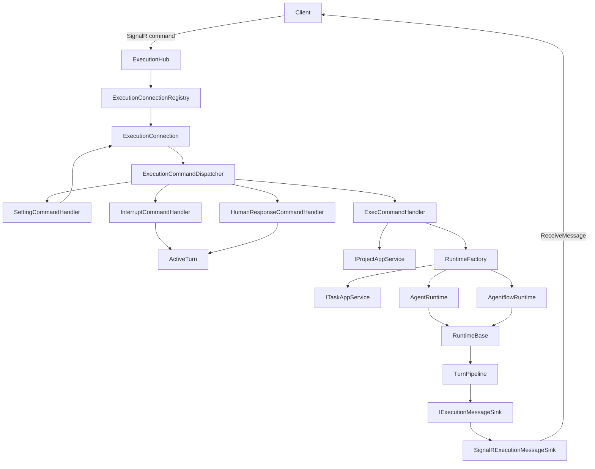
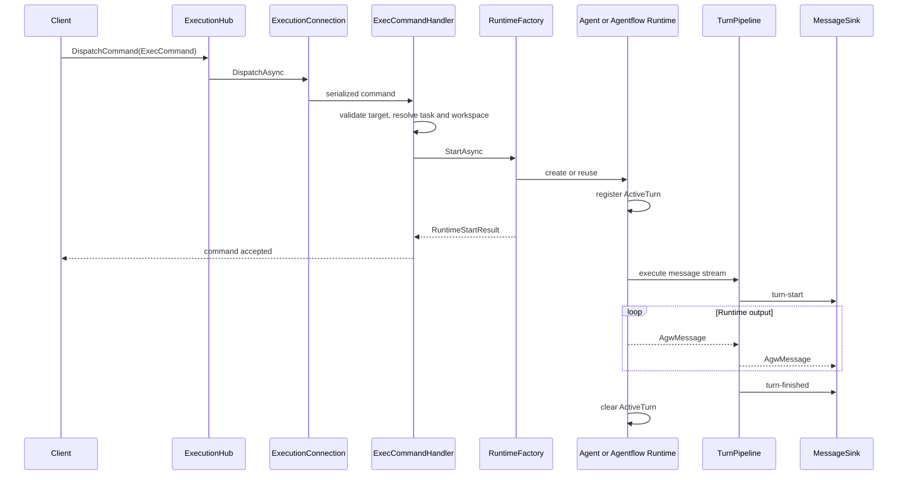
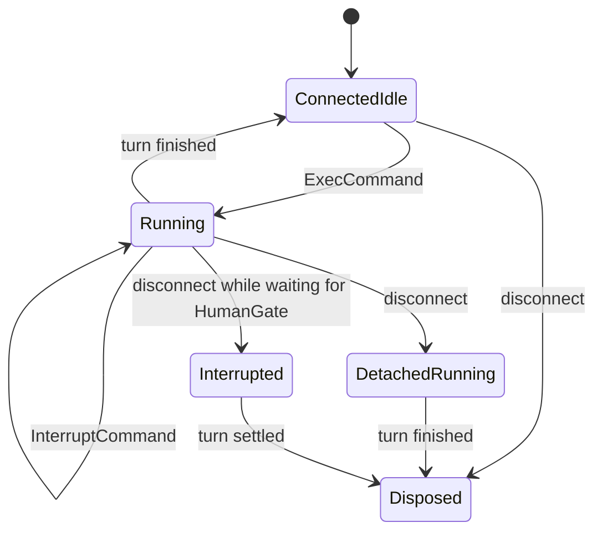

# Execution 执行子系统

`Execution` 负责把客户端命令转换为 Agent 或 Agentflow 的一次次执行 turn，并管理连接状态、运行时复用、中断、HumanGate、消息输出和资源释放。它既包含 SignalR 实时执行入口，也提供给 A2A、Jobs 等模块复用的 Agent/Agentflow 执行服务。

这里刻意区分了四种生命周期：

| 对象 | 生命周期 | 主要职责 |
| --- | --- | --- |
| `ExecutionHub` | 一次 SignalR Hub 调用 | 接收命令并把 `AgwException` 转为 `HubException` |
| `ExecutionConnection` | 一条 SignalR 连接 | 保存 settings、task、target、runtime，并串行处理命令 |
| `RuntimeBase` | 同一执行目标的多轮对话 | 持有当前 `ActiveTurn`，负责中断、等待空闲和释放 |
| `ActiveTurn` | 一次 `ExecCommand` | 跟踪执行任务、取消源和 HumanGate 响应入口 |

`Microsoft.Agents.AI.AgentSession` 只存在于 `AgentRuntime` 内部，不承担 SignalR connection 或 turn 的职责。

## 目录结构

```text
Execution/
├── Agentflows/
│   ├── AgentflowRuntimeService.cs
│   ├── AgentflowWorkflowCompiler.cs
│   ├── HumanGateApproval.cs
│   └── IAgentflowRuntimeService.cs
├── Agents/
│   ├── Dtos/
│   ├── Middleware/
│   ├── Utils/
│   ├── AgentRuntimeService.*.cs
│   ├── AgentSessionStateStore.cs
│   └── IAgentRuntimeService.cs
├── Commands/
│   ├── ExecutionCommandDispatcher.cs
│   ├── IExecutionCommandHandler.cs
│   └── *CommandHandler.cs
├── Connections/
│   ├── ExecutionConnection.cs
│   └── IExecutionMessageSink.cs
├── Contracts/
│   ├── AgentRunCommand.cs
│   └── *Command.cs
├── Runtimes/
│   ├── RuntimeBase.cs
│   ├── RuntimeFactory.cs
│   ├── AgentRuntime.cs
│   └── AgentflowRuntime.cs
├── Summaries/
│   ├── AgentTurnSummaryService.cs
│   ├── IAgentTurnSummaryService.cs
│   ├── ISummaryChatClientFactory.cs
│   └── SummaryChatClientFactory.cs
├── Transport/SignalR/
│   ├── ExecutionHub.cs
│   ├── ExecutionConnectionRegistry.cs
│   ├── IExecutionHubClient.cs
│   └── SignalRExecutionMessageSink.cs
├── Turns/
│   ├── ActiveTurn.cs
│   ├── RuntimeTurnContext.cs
│   ├── RuntimeTurnContextAccessor.cs
│   ├── TurnPipeline.cs
│   ├── TurnMessageFactory.cs
│   └── HumanGateApprovalCoordinator.cs
└── AgwMessageUtil.cs
```

### `Contracts`

这里定义 SignalR 的输入协议。`AgentRunCommand` 使用 `type` 作为 JSON discriminator，目前包含四种命令：

| Command | 作用 | 是否改变 connection 状态 |
| --- | --- | --- |
| `SettingCommand` | 设置 project、context 和环境变量 | 是；settings 变化时清理旧 runtime、task 和 target |
| `ExecCommand` | 指定 Agent/Agentflow 目标和用户输入，启动一个 turn | 是；解析 task，并创建或复用 runtime |
| `InterruptCommand` | 请求中断当前 turn | 否；只转发给当前 `ActiveTurn` |
| `HumanResponseCommand` | 提交 HumanGate 决策 | 否；只转发给当前 turn 的协调器 |

`SettingCommand.Resume` 是服务端属性，带有 `[JsonIgnore]`。settings 等价性目前比较 `ProjectId`、`ContextId` 和 `EnvironmentVariables`，不包含 `Resume`。

### `Commands`

`ExecutionCommandDispatcher` 在构造时把 `IExecutionCommandHandler` 按 `CommandType` 建成字典。重复注册同一命令会立即抛出 `AgwException`；运行时收到未注册命令也会失败，而不是落入默认分支。

每种命令由独立 handler 处理。handler 可以读取或更新 `ExecutionConnection` 的内部状态，但不负责 SignalR 连接索引、Hub 调用或底层消息发送。新增 command 时不需要修改 dispatcher。

### `Connections`

`ExecutionConnection` 是连接级状态容器，也是命令并发边界。它持有：

- 当前 `SettingCommand` 快照；
- 已解析的 `TaskProjection`；
- 当前 `ExecutionTarget`；
- 可跨 turn 复用的 `RuntimeBase`；
- 连接级 DI scope、消息 sink 和 host cancellation token；
- attached、waiting-for-human 等连接状态。

所有 command 先经过 `_commandGate`，因此同一连接不会并发修改 settings、task、target 或 runtime。`ExecCommand` 启动后台 turn 后会很快返回，command gate 随即释放，后续 `InterruptCommand` 和 `HumanResponseCommand` 才能进入。

### `Runtimes`

`RuntimeBase` 维护“同一 runtime 同时最多一个活动 turn”的约束。它负责注册 `ActiveTurn`、等待执行结束、清除活动引用、中断转发和异步释放。

`AgentRuntime` 持有实际 `AIAgent`、SDK `AgentSession`、session key 和独立取消源。`AgentRuntimeService` 负责从持久化定义构造 Agent、加载技能和工具、创建外部 Agent，并在执行结束后保存 session state。

`AgentflowRuntime` 保存 Agentflow id、task、settings 和 `AgentflowRuntimeService`。每个 Agentflow turn 都会创建新的 `HumanGateApprovalCoordinator`，workflow 本身由 `AgentflowWorkflowCompiler` 生成。

`RuntimeFactory` 负责把 `ExecCommand` 对应到具体 runtime，并将 runtime 输出接入统一的 `TurnPipeline`。Agent runtime 只有在 project 和 context 仍兼容时才会复用；settings 或 target 变化会先释放旧 runtime。

### `Turns`

turn 是一次用户输入到执行结束的完整过程。`RuntimeTurnContext` 是不可变快照，包含 settings、当前用户、展开为绝对路径的 project workspace、消息 sink 和 HumanGate 状态回调。`RuntimeTurnContextAccessor` 使用 `AsyncLocal` 在执行任务内部暴露该快照，作用域在 turn 结束后恢复；连接级可变状态不会进入 `AsyncLocal`。

`TurnPipeline` 统一输出协议：

1. 先发送 `turn-start`；
2. 转发 runtime 消息；
3. 正常结束发送 `turn-finished(status=completed)`；
4. 收到取消时发送 `turn-finished(status=interrupted)`；
5. runtime 抛错时先发送 `AgwErrorContent`，再发送 `turn-finished(status=failed)`。

当 `stream=false` 时，普通消息会缓冲到 runtime 执行结束后再发送。`human-gate-*` 控制消息不缓冲，否则客户端无法及时提交审批结果。runtime 自己产生的 `turn-finished` 会被过滤，避免重复终止消息。

### `Transport/SignalR`

SignalR Hub 路由为 `/api/hubs/exec`，公开一个服务端方法：

```text
DispatchCommand(AgentRunCommand)
```

服务端通过 typed client callback 返回消息：

```text
ReceiveMessage(AgwMessage)
```

`ExecutionConnectionRegistry` 是 singleton，以 `connectionId` 保存 `ExecutionConnection`。每个连接拥有独立的异步 DI scope；`SignalRExecutionMessageSink` 通过 `IHubContext` 向指定客户端发送消息，不捕获短生命周期的 Hub 实例。

## 总体架构



架构依赖从 transport 指向执行内核：SignalR 认识 connection 和 command；command handler 认识 connection 与 runtime factory；runtime 不依赖 Hub，只依赖 transport-neutral 的 `IExecutionMessageSink`。

## 数据处理流程

### 建立连接

1. `ExecutionHub.OnConnectedAsync` 调用 registry。
2. registry 为 connection 创建独立 `AsyncServiceScope`。
3. 从该 scope 解析 `ExecutionCommandDispatcher` 及其 handlers。
4. 创建 `SignalRExecutionMessageSink` 和 `ExecutionConnection`，然后按 connection id 保存。

### 应用 Settings

`SettingCommandHandler` 首先检查是否存在活动 turn。运行中修改 settings 会返回 busy error，不会打断当前执行。空闲时，handler 复制一份 settings 快照；如果内容未变化则直接返回，否则释放旧 runtime，并清空 resolved task 和 target。

### 执行 Agent 或 Agentflow



具体步骤如下：

1. `ExecCommandHandler` 校验 `agentId`，并拒绝同一 connection 上的并发 turn。
2. 没有 settings 时，使用内置 project 创建默认 settings。
3. 首次执行通过 `RuntimeFactory.ResolveTaskAsync` 转发到 `ITaskAppService`，解析或创建 task；后续 turn 复用 `TaskProjection`。
4. target 改变时释放旧 runtime；同一 target 则尝试复用。
5. handler 使用 resolved task 的真实 `ProjectId` 加载 project，将 `~` 展开并规范化为绝对 workspace 路径，再创建包含 settings、用户、workspace 和 message sink 的 `RuntimeTurnContext`。
6. `RuntimeFactory` 确保 workspace 存在，并创建 `AgentRuntime` 或 `AgentflowRuntime`。
7. `RuntimeBase.StartTurn` 先注册 `ActiveTurn`，再启动实际执行，避免 turn 已运行但尚未对 interrupt 可见的竞态。
8. 后台任务进入 `RuntimeTurnContextAccessor` 作用域，并把输出交给 `TurnPipeline`。
9. turn 结束后，runtime 清理 `ActiveTurn`；runtime 本身仍留在 connection 上，供下一轮复用。

Agent 执行结束时，`AgentRuntimeService` 会在 `finally` 中保存 SDK session state。外部 Codex Agent 还会通过 task-session binding 记录 provider session id，以支持后续恢复。

### Result Summary

Definition 创建的 System Agent 可通过 `EnableSummary` 在一次主执行成功后追加本轮总结。总结复用该 Agent 的 `ModelProviderId`，以一次性 `IChatClient` 调用执行；输入只包含本轮用户文字和本轮 Assistant 的 `TextContent`，不加载历史、工具或技能。External Agent 不支持该开关。

Agentflow 不读取内部 Agent 节点的 `EnableSummary`。流程总结只发生在显式 Output 节点：`ConfigJson.enableSummary` 为 `true` 时，流程必须只有一个 Output，并配置有效的 `SummaryModelProviderId`。传入总结模型的是流入 Output 的消息，Output 的 `Instructions` 会作为额外总结要求。

两种路径都保留原始输出并在末尾追加一条 `result`：

- `role = system`；
- `author = $agw-server`；
- 顶层 `additionalProperties.type = result`；
- `contents` 只有一个 `TextContent`。

总结文字可在有助于可读性时使用 Markdown（如标题、列表、强调或代码块），也可以保持纯文本；服务端除去首尾空白外不会改写模型返回的 Markdown。

总结为空或模型调用失败时仍返回 `Summary generation failed.`，不会使已成功的主执行失败；取消则继续向上传播。Summary 的 token usage 会累计到当前 project/context。`result` 会持久化供历史展示，但 `EfCoreChatHistoryProvider` 在构造下一轮模型历史时会过滤它。

### Interrupt 与 HumanGate

`InterruptCommandHandler` 只作用于当前活动 turn。`ActiveTurn.RequestInterrupt` 会先调用 runtime 专用 interrupt hook，再取消 linked cancellation source。没有活动 turn 时，服务端返回 system message。

Agentflow 进入 HumanGate 后，`HumanGateApprovalCoordinator` 按 `requestId` 保存待处理请求，并通过 control message 通知客户端。`HumanResponseCommandHandler` 将响应转发给当前 `ActiveTurn`；request id 不匹配或已结束时返回 system message。

### 断开连接



断线不会直接取消普通运行中的 turn。`ExecutionConnection` 先标记为 detached，message sink 随后丢弃输出；后台任务继续完成持久化，空闲后再释放 connection scope。若断线时正在等待 HumanGate，由于客户端无法再响应，当前 turn 会被中断。应用关闭时，host cancellation token 会终止仍在执行的任务。

## 状态归属与并发约束

| 状态 | 所有者 | 说明 |
| --- | --- | --- |
| connection id、attached | `ExecutionConnectionRegistry` / `ExecutionConnection` | transport 生命周期 |
| settings、resolved task、target | `ExecutionConnection` | command handlers 串行读写 |
| Agent/Agentflow runtime | `ExecutionConnection` | 空闲 turn 之间复用 |
| SDK AgentSession | `AgentRuntime` | 由 `AgentSessionStateStore` 加载和保存 |
| 当前 turn | `RuntimeBase` | 同一 runtime 最多一个 |
| cancellation、interrupt hook | `ActiveTurn` | 一次执行独享 |
| HumanGate pending requests | `HumanGateApprovalCoordinator` | 每个 Agentflow turn 独享 |
| settings/user/workspace/message sink 快照 | `RuntimeTurnContext` | AsyncLocal，只读、仅在 turn 内可见 |

`ExecutionConnection` 的 command gate 保护连接状态，`RuntimeBase` 的 lock 保护活动 turn。两个锁解决的问题不同，不应合并：前者负责命令串行化，后者负责后台 turn 生命周期。

## Command 扩展

新增 command 通常只涉及 contract、handler、DI 注册和测试，不需要修改 `ExecutionCommandDispatcher`。下面以只读的 `StatusCommand` 为例。

### 1. 定义 contract

在 `Contracts/` 新建命令：

```csharp
namespace Agw.Agents.Execution.Contracts;

public sealed class StatusCommand : AgentRunCommand;
```

然后在 `AgentRunCommand` 上注册 JSON 派生类型：

```csharp
[JsonDerivedType(typeof(StatusCommand), nameof(StatusCommand))]
```

客户端发送的 discriminator 将是：

```json
{
  "type": "StatusCommand"
}
```

### 2. 实现 handler

在 `Commands/` 新建 handler：

```csharp
using Agw.Agents.Execution.Connections;
using Agw.Agents.Execution.Contracts;

namespace Agw.Agents.Execution.Commands;

public sealed class StatusCommandHandler : ExecutionCommandHandler<StatusCommand>
{
    protected override Task HandleAsync(
        StatusCommand command,
        ExecutionConnection connection,
        CancellationToken cancellationToken)
    {
        var status = connection.Runtime is { HasActiveTurn: true }
            ? "running"
            : "idle";
        return connection.SendSystemMessageAsync(status);
    }
}
```

handler 应只协调当前 command 所需的状态和服务。通用 turn 生命周期放在 `RuntimeBase`，输出编排放在 `TurnPipeline`，连接索引和断线清理留在 SignalR transport。

### 3. 注册 DI

在 `Agw.Agents.DependencyInjection.AddAgents` 中增加：

```csharp
services.AddScoped<IExecutionCommandHandler, StatusCommandHandler>();
```

dispatcher 会自动发现 handler。若同一个 command 注册了两个 handler，应用在解析 dispatcher 时会失败，避免运行时出现不确定分派。

### 4. 明确 command 的行为边界

实现前需要决定以下事项：

- 活动 turn 期间是否允许执行；若不允许，沿用 `ExecutionConnection.BusyMessage`。
- 是否修改 settings、resolved task、target 或 runtime；修改时必须保持这些状态的一致性。
- 是否启动后台工作；执行 Agent/Agentflow 时应走 `RuntimeFactory` 和 `RuntimeBase.StartTurn`。
- 输出是 system message、error message，还是进入标准 turn 协议。
- command 是否需要加入客户端 contract 类型和前端调用封装。

不应在 handler 中直接使用 `IHubContext`、捕获 Hub 实例或创建新的连接级锁。需要输出时使用 `connection.MessageSink` 或现有的 `SendSystemMessageAsync`、`SendErrorAsync`。

### 5. 添加测试

至少覆盖：

- contract 的 JSON discriminator 和字段反序列化；
- dispatcher 能找到唯一 handler；
- handler 在 idle、running 和无 runtime 状态下的行为；
- 对 connection state 的修改与 runtime 释放；
- 客户端可见消息及错误边界。

现有测试可作为入口：

| 测试 | 覆盖内容 |
| --- | --- |
| `ExecutionRequestsTests` | command JSON contract |
| `ExecutionCommandDispatcherTests` | handler 查找、未知命令、重复注册 |
| `ExecutionCommandHandlerTests` | Setting、Exec、Interrupt、HumanResponse 行为 |
| `ExecutionConnectionTests` | idle/running/HumanGate 断线处理 |
| `RuntimeBaseTests` | 单活动 turn、中断和 AsyncLocal 作用域 |
| `RuntimeTurnContextAccessorTests` | 上下文恢复与并行隔离 |
| `TurnPipelineTests` | streaming、buffering 和终止状态 |
| `ExecutionHubContractTests` | SignalR Hub 的公开契约 |

运行 Execution 相关测试：

```bash
dotnet test tests/Agw.Agents.Tests/Agw.Agents.Tests.csproj
```

如果修改了 `IAgentRuntimeService` 或跨模块 namespace，还需要运行：

```bash
dotnet test tests/Agw.A2A.Tests/Agw.A2A.Tests.csproj
dotnet test tests/Agw.Jobs.Tests/Agw.Jobs.Tests.csproj
```

## 非 SignalR 调用

A2A 和 Jobs 不经过 `ExecutionHub`、connection registry 或 command dispatcher。它们直接调用 `IAgentRuntimeService` / `IAgentflowRuntimeService`：

- `IAgentRuntimeService.ExecuteByIdAsync` 用于按 Agent id 执行；
- `IAgentRuntimeService.CreateRuntimeAsync` 可创建带 SDK session 的 `AgentRuntime`；
- `IAgentflowRuntimeService.ExecuteAsync` 用于非实时 Agentflow 执行。

因此，修改 Agent/Agentflow 构造、session 持久化或公共 service 接口时，需要同时检查 SignalR、A2A 和 Jobs；只修改 connection command 时，影响范围通常局限在实时执行链路。
