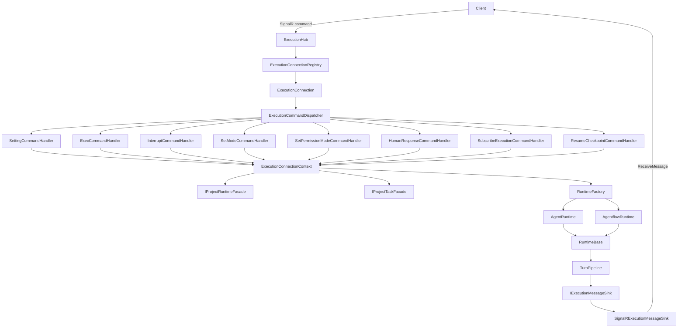
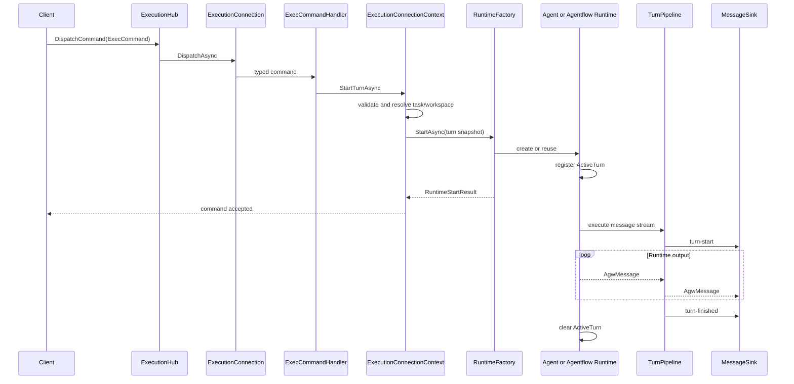
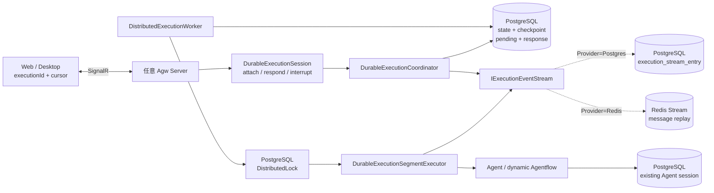
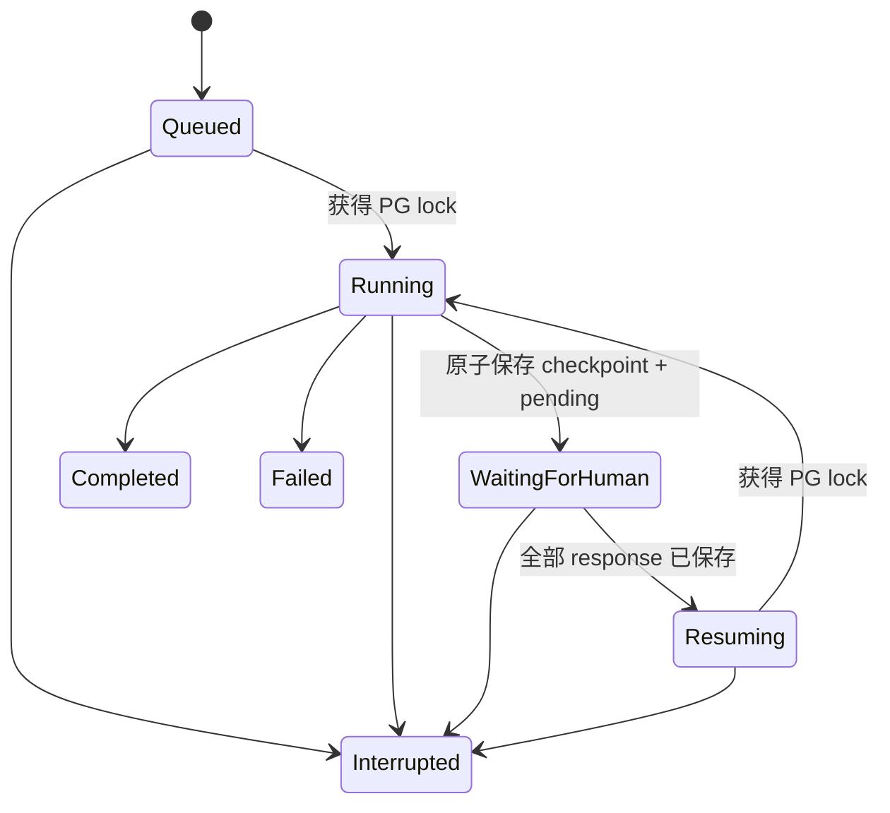
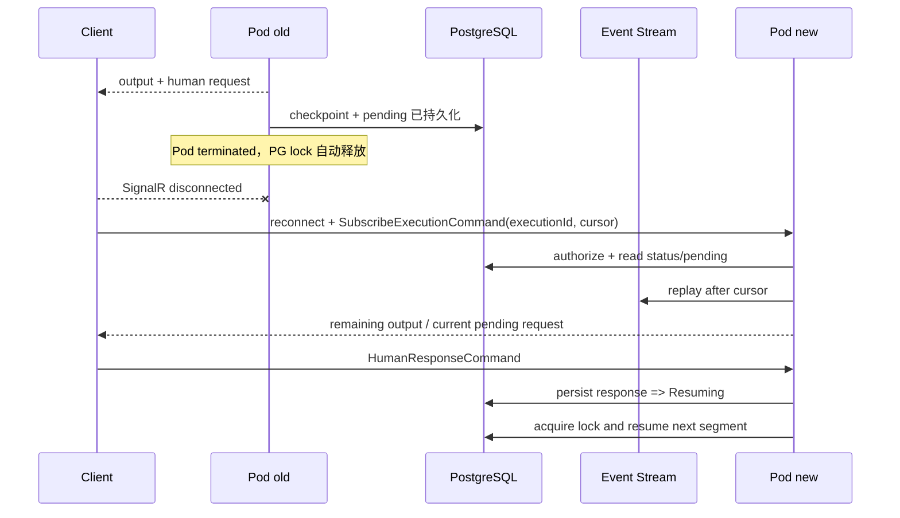
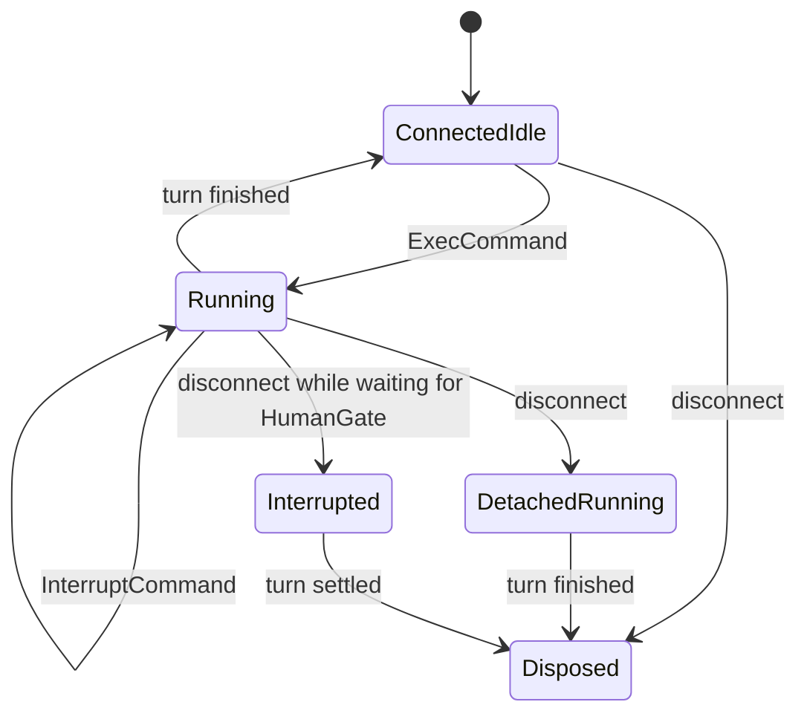

# Execution 执行子系统

`Execution` 负责把客户端命令转换为 Agent 或 Agentflow 的一次次执行 turn，并管理连接状态、运行时复用、中断、HumanGate、用户信息交互、消息输出和资源释放。它既包含 SignalR 实时执行入口，也提供给 A2A、Jobs 等模块复用的 Agent/Agentflow 执行服务。

Connection 生命周期、Command Handler 扩展方式与状态所有权的决策依据见 [`ADR 0001`](../../../../docs/adr/0001-execution-connection-command-architecture.md)。

这里刻意区分了六种生命周期：

| 对象 | 生命周期 | 主要职责 |
| --- | --- | --- |
| `ExecutionHub` | 一次 SignalR Hub 调用 | 接收命令并把 `AgwException` 转为 `HubException` |
| `ExecutionConnection` | 一条 SignalR 实时连接 | 串行分派命令、管理 attached 状态和 connection 级 DI scope |
| `ExecutionConnectionContext` | 同一条 SignalR 连接 | 维护 settings、task、workspace、target、runtime 的一致性 |
| `DurableExecutionSession` | 一条连接对持久执行的 attachment | 管理 executionId、订阅、回答、中断与重连；不拥有后台 execution |
| `RuntimeBase` | 同一执行目标的多轮对话 | 持有当前 `ActiveTurn`，负责中断、等待空闲和释放 |
| `ActiveTurn` | 一次 `ExecCommand` | 跟踪执行任务、取消源和 HumanGate 响应入口 |

`Microsoft.Agents.AI.AgentSession` 只存在于 `AgentRuntime` 内部，不承担 SignalR connection 或 turn 的职责。

## Agentflow Runtime 协作边界

`IAgentflowRuntimeService` 保持稳定入口。`AgentflowRuntimeService` 解析执行目标与 Project，通过 Execution Context Factory 准备会话，委托 Workflow Factory 构建 Workflow，再调用对应 Runner，并在执行结束或枚举器释放时释放 Workflow Lease。

| 组件 | 职责 | 生命周期 |
| --- | --- | --- |
| `AgentflowRuntimeService` | 目标解析、Runner 分派、顶层资源编排 | Scoped；接口与具体类型解析为同一实例 |
| `AgentflowWorkflowFactory` | 当前用户可见的图与嵌套 Workflow、Agent 资源及不可变节点元数据；Mermaid 使用同一构建路径 | Scoped；每次构建返回独立 Lease |
| `AgentflowExecutionContextFactory` | Conversation 解析、Provider / Agent Session Scope、Handoff 加载和初始消息准备 | Scoped；不保留单次执行状态 |
| `InProcessAgentflowRunner` | 流式/非流式事件消费、交互审批、Checkpoint Continue | Scoped；执行状态是方法局部变量 |
| `DurableAgentflowSegmentRunner` | 首段与恢复、持久化回答匹配、pending/consumed、Checkpoint 捕获、Segment Result | Scoped；每个分段独立持有可变状态 |
| `AgentflowCheckpointSupport` | Checkpoint 启动/恢复、Marker 映射、记录、Continue 与日志 | Scoped；不保存执行状态 |
| `AgentflowMessageMapper` | Framework 内容事件、HumanGate 和失败结果的协议映射；新控制消息 ID 由调用方提供 | 无服务依赖的确定性静态映射 |

构建图、HumanGate 元数据和 Checkpoint 节点名共用一次节点查询。Lease 携带这些元数据的不可变快照，Runner 使用该次构建的快照；下一次执行重新构建，不建立跨执行缓存。Checkpoint 指纹验证仍使用既有持久化读取。

Runtime 拥有 Workflow Lease，Runner 拥有当前 `StreamingRun`；Durable Runner 还拥有该段的人工交互作用域。释放顺序为 Run、人工交互作用域、Workflow Lease。Factory 构建失败时清理已经创建的 Agent 和嵌套 Lease，清理异常不能覆盖构建异常。

流式执行保持既有 Error/Finished 顺序；非流式执行保持原有输出集合与非交互审批错误。Durable Runner 逐条等待 sink 写入，返回分段状态；pending 与 terminal 控制消息仍由持久化提交后的协调层发布。Checkpoint 恢复会还原未完成 turn 的消息和待处理请求；只有首次执行发送启动 `TurnToken`，恢复时不能再次发送。Worker 故障后的整个 segment 重试仍为至少一次执行，不增加跨故障的恰好一次保证。

InProcess 的每次显式恢复都携带当前 occurrence 的 Marker；Durable 只在新恢复分支的首段（`SegmentIndex == 1` 且 Manifest 含恢复 occurrence）自动继续这些 Marker，后续 HITL 分段保留自己的等待边界。两者的恢复条件对应不同的输入协议。

JSON 配置解析及 HumanGate 默认 mode / prompt 是确定性转换。随机 ID 分配和可能生成输入 ID 的会话准备位于执行边界，Mapper 不分配 ID。非流式字符串入口继续使用原有 ChatMessage 语义。

Checkpoint 和 Agent Session 的持久化仍经过既有 Application Port / Infrastructure Adapter。Factory 中的 Repository 查询仅访问 Agents 所有的数据；这次拆分没有改变持久化边界、格式或项目引用。

## 领取权与会话重置

`TryBeginSegmentAsync` 返回持久化后的领取 `StateVersion`。worker 用该版本调用 `SaveSegmentResultAsync`，同时依靠 EF 并发条件拒绝迟到结果；读取最新记录不能替换原领取凭据。`IApplicationLockLease.HandleLostToken` 与 host、状态监测取消信号传到分段执行器，失去领取权后不发布该 attempt 的 terminal marker。外部工具已经发生的副作用仍可能在故障恢复中重复。

`ProjectConversation.Generation` 初始为 0，清空时在事务内递增，同时删除历史、trace、checkpoint、TaskSessionBinding 和 AgentSessionState，保留 ID、ContextId、标题和用量。InProcess 执行与清空共享 conversation execution lease；Durable 的 Queued、Running、WaitingForHuman 状态阻止清空。下一轮重新读取代次，释放旧 runtime 和解析任务缓存；Resume 指向已清空会话时创建新代次的任务。

任务快照和 durable manifest 携带代次。`ConversationSessionContext` 通过执行的异步上下文传递不可变代次，SDK history provider 把它保存在 session state，外部 SDK 回调显式捕获 `ProjectProviderSessionReference.Generation`。这些写入使用原代次；不能在迟到回调中读取当前值作为凭据。`SaveConversationChangesAsync` 在同一事务中按 Project → Conversation 锁顺序验证存活根、owner 和代次，再提交子记录。旧 manifest 缺少代次时按 0 读取；序列化省略默认 0，保留既有幂等比较。

部署与隔离 PostgreSQL 验证见 [运行时一致性维护说明](../../../../docs/operations/backend-runtime-consistency.md)。

## 两套执行提供者

实时执行保留两套实现，并通过 `Execution:Provider` 在进程启动时二选一。它不是按请求动态切换；同一套部署中的所有 Host 必须使用相同配置。拆分部署中，Data Plane 映射 SignalR/A2A 并运行 worker，Control Plane 只为 Jobs 注册 durable client，Standalone 同时组合两者。

| 能力 | `InProcess`（默认） | `Distributed`（集群） |
| --- | --- | --- |
| 运行位置 | 当前 Agw 进程 | 任意获得 execution 分布式锁的 Agw Server |
| HITL 等待状态 | `HumanGateApprovalCoordinator` 内存 | PostgreSQL pending + response 快照 |
| Agentflow 恢复点 | 当前 workflow run | PostgreSQL 中的加密 JSON checkpoint |
| 消息传输 | 当前 SignalR connection | `IExecutionEventStream`，可选择 PostgreSQL 或 Redis Stream 并按 cursor 重放 |
| 进程重启 | 活动 turn 失效 | 从持久状态继续 |
| K8s 滚动更新 | 正在等待/运行的 turn 可能中断 | PostgreSQL advisory lock 释放后由新 Pod 至少一次恢复 |
| 基础设施 | SQLite/PostgreSQL 均可 | PostgreSQL + PostgreSQL DistributedLock；Redis 可选 |
| 适用场景 | 本机、单实例、最低运维成本 | 多副本、滚动发布、长时间 HITL |

默认值仍为 `InProcess`，因此没有配置集群依赖的现有部署行为不变。选择 `Distributed` 时会在启动阶段校验 PostgreSQL 与 PostgreSQL DistributedLock，不会静默降级到进程内实现。消息回放默认也使用 PostgreSQL；只有显式选择 Redis provider 时才要求 Redis connection string。

当前 `Distributed` provider 只接受 `ExecCommand.stream=true`。非流式缓冲若要跨多个 HITL segment 保持与进程内模式完全一致，需要另行定义持久缓冲语义；本实现选择明确拒绝，而不是静默丢失或提前发送缓冲消息。Distributed Jobs 与 A2A 通过 transport-neutral durable request Interface 登记同一状态机；Jobs 和 A2A 不支持 HITL，遇到等待状态会失败或中断。

## 关键目录与入口

下面列出主要扩展点；同目录的 DTO、状态对象和内部 helper 省略。

```text
Execution/
├── Agentflows/
│   ├── AgentflowRuntimeService.cs
│   ├── AgentflowWorkflowFactory.cs
│   ├── AgentflowExecutionContextFactory.cs
│   ├── InProcessAgentflowRunner.cs
│   ├── DurableAgentflowSegmentRunner.cs
│   ├── AgentflowMessageMapper.cs
│   ├── AgentflowCheckpointSupport.cs
│   ├── AgentflowWorkflowCompiler.cs
│   ├── AgentflowCheckpointStore.cs
│   ├── AgentflowNodeScopedAgent.cs
│   ├── AgentflowMessageTransforms.cs
│   ├── HumanGateApproval.cs
│   └── IAgentflowRuntimeService.cs
├── Agents/
│   ├── Dtos/
│   ├── Middleware/
│   ├── Utils/
│   ├── AgentRuntimeService.*.cs
│   ├── ExternalAgentChatHistoryAgent.cs
│   ├── AgentSessionStateStore.cs
│   └── IAgentRuntimeService.cs
├── Commands/
│   ├── Abstracts/
│   │   ├── AgentRunCommand.cs
│   │   └── IExecutionCommandHandler.cs
│   ├── Checkpoint/
│   │   ├── ResumeCheckpointCommand.cs
│   │   └── ResumeCheckpointCommandHandler.cs
│   ├── Exec/
│   │   ├── ExecCommand.cs
│   │   └── ExecCommandHandler.cs
│   ├── Hitl/
│   │   ├── HumanResponseCommand.cs
│   │   └── HumanResponseCommandHandler.cs
│   ├── Interrupt/
│   │   ├── InterruptCommand.cs
│   │   └── InterruptCommandHandler.cs
│   ├── Mode/
│   │   ├── SetModeCommand.cs
│   │   └── SetModeCommandHandler.cs
│   ├── Permission/
│   │   ├── SetPermissionModeCommand.cs
│   │   └── SetPermissionModeCommandHandler.cs
│   ├── Setting/
│   │   ├── SettingCommand.cs
│   │   ├── PermissionMode.cs
│   │   └── SettingCommandHandler.cs
│   ├── Subscribe/
│   │   ├── SubscribeExecutionCommand.cs
│   │   └── SubscribeExecutionCommandHandler.cs
│   ├── ExecutionCommandDispatcher.cs
│   └── ExecutionCommandRegistration.cs
├── Messaging/
│   └── IExecutionMessageSink.cs
├── Runtimes/
│   ├── RuntimeBase.cs
│   ├── RuntimeFactory.cs
│   ├── AgentRuntime.cs
│   └── AgentflowRuntime.cs
├── Connections/
│   ├── ExecutionConnection.cs
│   ├── ExecutionConnectionContext.cs
│   ├── ExecutionConnectionContextFactory.cs
│   ├── ExecutionSettings.cs
│   └── ExecutionTarget.cs
├── Durable/
│   ├── DistributedExecutionWorker.cs
│   ├── DurableExecutionCoordinator.cs
│   ├── DurableAgentSegmentRunner.cs
│   ├── DurableExecutionSegmentExecutor.cs
│   ├── DurableExecutionSession.cs
│   ├── DurableExecutionStore.cs
│   ├── DurableAgentflowCheckpointStore.cs
│   ├── ExecutionRuntimeOptions.cs
│   ├── IExecutionEventStream.cs
│   ├── PostgresExecutionEventStream.cs
│   └── RedisExecutionEventStream.cs
├── Summaries/
│   ├── AgentTurnSummaryService.cs
│   ├── IAgentTurnSummaryService.cs
│   ├── ISummaryChatClientFactory.cs
│   └── SummaryChatClientFactory.cs
├── Transport/SignalR/
│   ├── ExecutionHub.cs
│   ├── ExecutionConnectionRegistry.cs
│   ├── IExecutionHubClient.cs
│   └── SignalRExecutionMessageSink.cs
├── Turns/
│   ├── ActiveTurn.cs
│   ├── RuntimeTurnContext.cs
│   ├── RuntimeTurnContextAccessor.cs
│   ├── TurnPipeline.cs
│   ├── TurnMessageFactory.cs
│   └── HumanGateApprovalCoordinator.cs
└── AgwMessageUtil.cs
```

### `Commands`

这里按 command 垂直切片：每个子目录共置 transport contract 与对应 handler，修改一种 command 时不需要跨 `Contracts/` 和 `Commands/` 两棵目录跳转。`Abstracts/` 只保存所有切片共享的 `AgentRunCommand` 和 handler 接口；dispatcher 与注册 seam 留在 `Commands/` 根目录。

`AgentRunCommand` 使用 `type` 作为 JSON discriminator，目前包含八种命令。派生类型映射不写在 contract 基类上，而由 command 的 DI 注册统一提供：

| Command | 作用 | 是否改变 connection 状态 |
| --- | --- | --- |
| `SettingCommand` | 设置 project、context、环境变量和默认权限策略 | 是；settings 变化时清理旧 runtime、task 和 target |
| `ExecCommand` | 指定 conversation、Agent/Agentflow 目标和用户输入，启动一个 turn | 是；持久化 conversation/task 后创建或复用 runtime |
| `InterruptCommand` | 请求中断当前 turn | 否；只转发给当前 `ActiveTurn` |
| `SetModeCommand` | 切换支持 mode 的 Agent | 是；空闲时立即应用，活动 turn 结束后应用最后一次请求 |
| `SetPermissionModeCommand` | 切换工具审批策略 | 是；立即更新 settings 和当前活动 turn，不重建 runtime |
| `HumanResponseCommand` | 提交审批或用户信息交互响应 | 否；只转发给当前 turn 的协调器 |
| `SubscribeExecutionCommand` | 按 `executionId` 和 event stream cursor 重新订阅集群执行 | 是；替换当前消息订阅，不启动新执行 |
| `ResumeCheckpointCommand` | 从一个精确的 Agentflow checkpoint occurrence 创建新执行分支 | 是；校验并裁剪 checkpoint 之后的历史，再启动恢复 turn |

`SettingCommand.Resume` 是服务端属性，带有 `[JsonIgnore]`。transport command 自身的等价性不包含 `Resume`；复制出的 `ExecutionSettings` 会包含它，因为 resume 变化需要使 connection-owned runtime 失效。

`ExecutionCommandDispatcher` 在构造时把内部 handler adapter 按 command CLR type 建成字典。重复注册同一命令会立即抛出 `AgwException`；运行时收到未注册命令也会失败，而不是落入默认分支。

每种命令实现独立的 `IExecutionCommandHandler<TCommand>`。handler 只把输入翻译为 `ExecutionConnectionContext` 的稳定操作，不读取 runtime、不修改状态字段，也不依赖 SignalR。新增 command 时不需要修改 dispatcher 或 `AgentRunCommand`。

`AddExecutionCommand<TCommand, THandler>(discriminator)` 是唯一注册 seam，同时注册 typed handler、dispatcher adapter 和 SignalR JSON discriminator。新增 compile-time command 只需定义 contract、实现 handler，并调用一次该扩展方法。

### `Connections`

`ExecutionConnection` 是命令并发与资源生命周期的边界。所有 command 先经过 `_commandGate`，因此同一条 connection 不会并发执行状态变更；它本身只持有 dispatcher、context、DI scope 和 attached 状态。

`ExecutionConnectionContext` 是状态内核，独占：

- 当前不可变 `ExecutionSettings`；
- 已解析的 `AgentExecutionTask`；
- 已解析并规范化的 workspace；
- 当前 `ExecutionTarget`；
- 可跨 turn 复用的 `RuntimeBase`；
- user、消息 sink、host cancellation token 和 waiting-for-human 状态。

集群 provider 的持久 identity 与订阅生命周期不进入该状态内核，而由独立的 `DurableExecutionSession` 持有；Context 只在 provider seam 处调用 session。

它通过 `ApplySettingsAsync`、`StartTurnAsync`、`InterruptTurnAsync`、`SubmitHumanDecisionAsync`、checkpoint 查询和 checkpoint 恢复提供原子操作，并以只读属性共享 project/context/workspace/agent/task/user 数据；它不公开 `RuntimeBase`、`ActiveTurn` 或状态 setter。`ExecCommand` 启动后台 turn 后会很快返回，command gate 随即释放，后续 interrupt 和 HumanGate response 才能进入。

`Messaging` 定义 transport-neutral 的 `IExecutionMessageSink`。Connection 和 runtime 只面向该接口输出消息，SignalR adapter 提供具体实现。

### `Runtimes`

`RuntimeBase` 维护“同一 runtime 同时最多一个活动 turn”的约束。它负责注册 `ActiveTurn`、等待执行结束、清除活动引用、中断转发和异步释放。

`AgentRuntime` 持有实际 `AIAgent`、SDK `AgentSession`、session key 和独立取消源。`AgentRuntimeService` 负责从持久化定义构造 Agent、加载技能和工具、创建外部 Agent，并在执行结束后保存 session state。

Definition Agent 的 Skill provider 明确把 Skill 内容与 Project Workspace 分开：模型通过 `load_skill`、`read_skill_resource` 和 `run_skill_script` 访问 Skill，不应使用 Shell 或 Project 文件工具寻找 Skill 文件。只读的 load/read Tool 自动批准；脚本执行仍受 Tool 审批策略控制。Local Skill 只发现 `.py`、`.js` 和 `.cs` 脚本，`Agw.Skills.Execution.LocalSkillScriptRunner` 在 Skill 根目录内校验路径，以无 Shell 的 `ArgumentList` 传递字符串参数，并使用 30 秒超时。Plugin Skill 不允许执行脚本。

`AgentflowRuntime` 保存 Agentflow id、task、settings 和 `AgentflowRuntimeService`。每个 Agentflow turn 都会创建新的 `HumanGateApprovalCoordinator`，workflow 本身由 `AgentflowWorkflowCompiler` 生成。

`RuntimeFactory` 负责把已解析好的 execution/turn 输入对应到具体 runtime，并将 runtime 输出接入统一的 `TurnPipeline`。task 与 workspace 的解析由 `ExecutionConnectionContext` 统一完成。Agent runtime 只有在 project 和 context 仍兼容时才会复用；settings 或 target 变化会先释放旧 runtime。

### `Turns`

turn 是一次用户输入到执行结束的完整过程。`RuntimeTurnContext` 是不可变快照，包含 settings、task、target、project/context/agent 标识、当前用户、绝对 workspace、消息 sink 和 HumanGate 状态回调。`RuntimeTurnContextAccessor` 使用 `AsyncLocal` 在执行任务内部暴露该快照，作用域在 turn 结束后恢复；connection 级可变状态不会进入 `AsyncLocal`。

`AgwUserInput` 会按原顺序转换文字、URI 和图片 DataContent。服务端只接受 JPEG、PNG、GIF、WebP；每条消息最多 5 张、单张最多 5 MB、总计最多 10 MB。客户端执行同一组前置校验，但服务端仍是最终边界。

`IRuntimeTurnContextAccessor` 只公开 `Current`。`Push` 仅在 Agents 模块内部由 `RuntimeBase` 使用，Jobs 等 runtime skill 只能读取当前 turn，不能伪造或覆盖执行上下文。

需要用户提供信息的 Tool 使用 `HumanInteractionRequiredAIFunction` 包装，并由各自的 `IHumanInteractionProtocol` 负责生成请求、校验响应和绑定 Tool 参数。`RuntimeFactory` 仅在交互式 turn 中通过 `HumanInteractionContextAccessor` 提供 channel；Jobs、后台 Agent 等无人值守执行没有 channel，遇到此类 Tool 会明确失败而不会无限等待。

在 `InProcess` 模式中，Tool 直接进入进程内 channel。`Distributed` 模式则只在 durable runtime 构造时，再套一层 MAF `ApprovalRequiredAIFunction`，把 Tool 调用截断在可 checkpoint 的 `ToolApprovalRequestContent` 边界；恢复 segment 后，持久化回答先还原为 `ToolApprovalResponseContent`，随后由预回答 channel 注入真正的 `ask_user_question` Tool。两种模式复用同一个 Tool 和交互协议，普通执行路径没有行为变化。

所有 Agw 进程内可执行的 `AIFunction` 都经过统一的函数调用异常边界。Tool 抛出 `AgwException` 或 `AgwFilesException` 时，函数结果保留其错误码和可公开消息；其他异常返回脱敏结果 `{"isError":true,"code":5000026,"message":"Tool execution failed."}`，完整异常只写入结构化日志并标记当前 Activity 为失败。调用方已经请求取消时仍传播 `OperationCanceledException`，不会将取消伪装成 Tool 结果。该边界覆盖内置 Tool、Tool Block、Connection Native/MCP、独立 MCP，以及所有 Agent 运行模式；Tool 物化/配置阶段、Hosted Tool 和外部 Agent CLI 的异常仍由各自协议处理。

`TurnPipeline` 统一输出协议：

1. 先发送 `turn-start`；
2. 转发 runtime 消息；
3. 正常结束发送 `turn-finished(status=completed)`；
4. 收到取消时发送 `turn-finished(status=interrupted)`；
5. runtime 抛错时先发送 `AgwErrorContent`，再发送 `turn-finished(status=failed)`。

当 `stream=false` 时，普通消息会缓冲到 runtime 执行结束后再发送。`human-gate-*` 控制消息不缓冲，否则客户端无法及时提交审批结果。runtime 自己产生的 `turn-finished` 会被过滤，避免重复终止消息。

### `Transport/SignalR`

SignalR Hub 路由为 `/api/hubs/exec`，公开命令入口、执行 Provider 探测和 Agentflow checkpoint 查询：

客户端固定使用 WebSocket 并跳过 negotiate，避免负载均衡把协商和握手分配到不同 Server。Desktop 的 Bearer Token 在 WebSocket 握手中按 SignalR 约定通过 `access_token` 查询参数传递；服务端只在该 Hub 的 WebSocket 请求中接受此参数，其他 HTTP 或 WebSocket 路径仍只接受 `Authorization` Header。反向代理访问日志不得记录查询参数。

```text
DispatchCommand(AgentRunCommand)
GetExecutionProvider() -> "InProcess" | "Distributed"
GetAgentflowCheckpoints(agentflowId) -> AgentflowCheckpointAvailability[]
```

服务端通过 typed client callback 返回消息：

```text
ReceiveMessage(AgwMessage)
```

`ExecutionConnectionRegistry` 是 singleton，只负责把 SignalR `connectionId` 映射到 `ExecutionConnection`，并在每次调用时校验当前认证用户 ID 与连接所有者一致。Bearer Token 使用 Token 创建者的用户 ID；durable execution、checkpoint、task session 和审计归属都使用该稳定 ID，而不是 Token 的显示名称。每条 connection 拥有独立的异步 DI scope；`SignalRExecutionMessageSink` 通过 `IHubContext` 向指定客户端发送消息，不捕获短生命周期的 Hub 实例。

## 总体架构



架构依赖从 transport 指向执行内核：SignalR adapter 只认识 connection 和 command；typed handler 只认识自己的 command 与 `ExecutionConnectionContext`；runtime 不依赖 Hub，只依赖 transport-neutral 的 `IExecutionMessageSink`。

## 数据处理流程

### 建立连接

1. `ExecutionHub.OnConnectedAsync` 调用 registry。
2. registry 为 connection 创建独立 `AsyncServiceScope`。
3. 从该 scope 解析 `ExecutionCommandDispatcher`、handlers 和 `ExecutionConnectionContextFactory`。
4. 创建 `SignalRExecutionMessageSink` 与 `ExecutionConnection`，然后按 connection id 保存。

### 应用 Settings

`SettingCommandHandler` 只把 transport contract 转换为不可变 `ExecutionSettings`，然后调用 `ExecutionConnectionContext.ApplySettingsAsync`。Context 在活动 turn 期间返回 busy error；空闲且内容变化时释放旧 runtime，并清空 resolved task、workspace 和 target。

权限策略的初始值仍由 `SettingCommand.permissionMode` 保存。运行中切换通过 `SetPermissionModeCommand` 完成，因此不会触发 settings 的 busy 检查或重建 runtime；新的策略会立即应用到当前 turn。切换到 `FullAccess` 时，待处理及后续 Tool 审批均由服务端使用 `always-tool` 自动同意，普通 HumanGate 与用户信息交互不受影响。

### 执行 Agent 或 Agentflow



具体步骤如下：

1. `ExecCommandHandler` 校验 `agentId`，然后把命令交给 connection context。
2. Context 拒绝同一条 connection 上的并发 turn；没有 settings 时创建内置 project 的默认快照。
3. 首次执行要求客户端提供 `conversationId`。`IProjectTaskFacade` 按当前用户和 Project 创建或校验该 conversation，在同一次提交中写入初始 task record；提交完成后才通过 `IProjectRuntimeFacade` 解析 workspace 并进入 runtime。后续 turn 复用已解析的 conversation/task。
4. `contextId` 继续用于 Agent session、provider session、trace、usage 和 checkpoint，并必须与 conversation 一致；它不再替代 conversation 资源主键。
5. target 改变时释放旧 runtime；同一 target 则尝试复用。
6. Context 从当前 connection 状态创建包含 settings、task、target、用户、workspace 和 message sink 的 `RuntimeTurnContext` 快照。
7. `RuntimeFactory` 确保 workspace 存在，并创建 `AgentRuntime` 或 `AgentflowRuntime`。
8. `RuntimeBase.StartTurn` 先注册 `ActiveTurn`，再启动实际执行，避免 turn 已运行但尚未对 interrupt 可见的竞态。
9. 后台任务进入 `RuntimeTurnContextAccessor` 作用域，并把输出交给 `TurnPipeline`。
10. turn 结束后，runtime 清理 `ActiveTurn`；runtime 本身仍留在 connection context 中，供下一轮复用。

Agent 执行结束时，`AgentRuntimeService` 会在 `finally` 中保存 SDK session state。External Agent 不持久化通用 SDK session state；Claude Code 与 Codex 通过 project conversation 作用域内的 task-session binding 保存 provider session id。Codex 从 `OnThreadStartedAsync` 获取 thread id，并以 `ThreadId + IsResume` 恢复；Claude Code 首次运行使用 `SessionId + IsResume=false`，从 `subtype=init` 消息确认真实 `session_id` 后保存，后续以 `Resume=<session_id> + IsResume=true` 恢复。

Codex 的 SDK ChatHistoryProvider 会被禁用，改由 `ExternalAgentChatHistoryAgent` 先立即持久化请求，再按 20 条响应或 1 秒窗口刷新流式更新；正常结束、取消、异常和消费方提前释放都会 flush 剩余内容。Claude Code 则直接使用 `ClaudeCodeSdk.MAF` 的 ChatHistoryProvider；SDK 会在每个完整 Assistant 消息结束后聚合并分阶段写入 Agw 历史，不再经过外层历史包装器。External Agent 返回的 System/User 展示消息仍会标记 `modelHistoryExcluded`，因此可在 UI 历史中显示，但不会重新进入模型上下文或跨目标 handoff。

### 在执行目标之间交接 Conversation

同一个 Project Conversation 从一个 Agent/Agentflow 切换到另一个目标时，`IConversationHandoffProvider` 只提取其他目标新增的公开文字，并从候选尾部选取总计最多 32,000 个字符。Tool 协议、控制消息、私有 reasoning、`modelHistoryExcluded` 展示记录和已经注入过的 handoff 都不会进入候选；相同 `messageId` 只保留最后一条。Handoff 消息只作为本次请求的 AI Context Provider 输入，不会再次持久化。当前用户消息保存 `conversationHandoffThroughSequence` cursor，后续切回同一目标时只注入 cursor 之后的新内容。

### Definition Agent 自动 Compaction

所有经 `CreateDefinitionAgentAsync` 创建的 Agent 都自动启用上下文压缩，包括前台 System Agent、Agentflow 节点 Agent 和后台 Definition Agent。External Agent 与 Result Summary 使用的一次性 `IChatClient` 不经过这条管线。

每个模型必须配置 `MaxContextWindowTokens` 和 `MaxOutputTokens`，且两者均为正数、输出上限小于上下文窗口。有效输入预算为 `MaxContextWindowTokens - MaxOutputTokens`；`ChatOptions.MaxOutputTokens` 同时使用模型的输出上限。新建、自动发现和默认种子模型的回退值分别为 `256_000` 与 `64_000`，管理员应按模型提供方的真实规格修正。

运行时使用 MAF 核心包的 `ContextWindowCompactionStrategy` 和默认两阶段阈值，不调用额外的总结模型：

- 达到有效输入预算的 50% 时，优先把较旧的 Tool call/result 组折叠为精简内容；
- 达到 80% 时，截断较旧的消息；
- Tool call 与对应 result 始终作为原子消息组处理。

`CompactionProvider` 位于函数调用循环内部，并在逐次历史持久化层之后执行，所以同一轮中的每次模型请求都会重新评估上下文。`FunctionLoopMessageIsolationChatClient` 会为每次实际注入的动态上下文消息副本补充唯一 `MessageId`，同时继续移除同一函数循环中的未变化副本；这避免压缩索引按内容匹配到上一轮相同上下文并跳过其间的新消息。`LocalHistoryCompactionScopeChatClient` 仅在本地历史 sentinel 存在时为该 provider 暴露共享 `StateBag` 的本地 session 视图，避免后续 Tool iteration 被误判为远程服务托管历史。压缩结果只传给当前模型请求；`EfCoreChatHistoryProvider` 仍保存未压缩的原始消息，不会把合成或裁剪后的请求历史写回数据库。

Provider 状态保存在现有 `AgentSession.StateBag`，并随 `AgentSessionStateStore` 序列化和恢复。state key 使用 `agw.compaction.{agentId}`，避免同一会话中的多个 Definition Agent 相互覆盖状态。Agw 另存内部索引版本；版本变化时会丢弃旧压缩索引，并在下一轮从完整聊天历史自动重建。

### Result Summary

Definition 创建的 System Agent 可通过 `EnableSummary` 在一次主执行成功后追加本轮总结。总结复用该 Agent 的 `ModelProviderId`，以一次性 `IChatClient` 调用执行；输入只包含本轮用户文字和本轮 Assistant 的 `TextContent`，不加载历史、工具或技能。External Agent 不支持该开关。

Agentflow 不读取内部 Agent 节点的 `EnableSummary`。流程总结只发生在显式 Output 节点：`ConfigJson.enableSummary` 为 `true` 时，流程必须只有一个 Output，并配置有效的 `SummaryModelProviderId`。传入总结模型的是流入 Output 的消息，Output 的 `Instructions` 会作为额外总结要求。

两种路径都保留原始输出并在末尾追加一条 `result`：

- `role = system`；
- `author = $agw-server`；
- 顶层 `additionalProperties.type = result`；
- `contents` 只有一个 `TextContent`。

总结文字可在有助于可读性时使用 Markdown（如标题、列表、强调或代码块），也可以保持纯文本；服务端除去首尾空白外不会改写模型返回的 Markdown。

总结为空或模型调用失败时仍返回 `Summary generation failed.`，不会使已成功的主执行失败；取消则继续向上传播。Summary 的 token usage 会累计到当前 project/context。`result` 会持久化供历史展示，但 `EfCoreChatHistoryProvider` 在构造下一轮模型历史时会过滤它。

### Interrupt、HumanGate 与用户信息交互

`InterruptCommandHandler` 只作用于当前活动 turn。`ActiveTurn.RequestInterrupt` 会先调用 runtime 专用 interrupt hook，再取消 linked cancellation source。没有活动 turn 时，服务端返回 system message。

Agentflow 进入 HumanGate、Tool 请求审批或 `HumanInteractionRequiredAIFunction` 请求用户输入后，`HumanGateApprovalCoordinator` 按 `requestId` 保存待处理响应。用户信息交互通过 `human-interaction-request` control message 携带来源 `toolName`/`callId`、`interactionKind` 和结构化 `payload`，客户端可将交互面板嵌入对应的 function call，并在 `HumanResponseCommand.responseData` 中返回结构化数据。`HumanResponseCommandHandler` 将响应转发给当前 `ActiveTurn`；request id 不匹配或已结束时返回 system message。

Claude Code External Agent 的原生 `AskUserQuestion` 通过 SDK stdio `can_use_tool` 回调接入同一套 channel。Agw 在每次 Agent run 内显式绑定当前 channel，把原生 `tool_use_id` 作为 `callId` 发出问卷 control message，并将客户端提交的 `answers` 作为 `updatedInput` 返回 Claude Code。后台执行和没有活动 channel 的调用会被拒绝；External Agent 仍不进入 Distributed HITL 恢复流程。

Claude Code External Agent 默认启用 SDK partial messages。`ClaudeCodeSdk.MAF` 将 Claude `stream_event` 转成共享 `ResponseId`/`MessageId` 的标准 `AgentResponseUpdate` 增量，因此既有 SignalR 和客户端渲染链路无需 Claude 专用逻辑。实时 update 原样下发；同一逻辑消息同时收到 `message_stop` 和完整 `AssistantMessage` 后，SDK 通过 MAF `ToAgentResponse()` 聚合并立即交给 ChatHistoryProvider。因此一个包含多轮 Tool Call 的 turn 可以分阶段持久化多次；若后续轮次被取消或以错误结束，已经完成的轮次保留，当前未完成的 partial Assistant 不写入历史。未收到 partial events 时回退为正常结束后的整轮聚合。Agw 只观察 init update 以保存 provider session ID，不收集或解析 partial 内容；其他 External Agent 仍使用原有一秒微批策略。

## Distributed HITL：`ask_user_question` 如何跨重启恢复

`Execution.Provider` 的结构是：

```text
Execution.Provider
├── InProcess
└── Distributed
    ├── PostgreSQL：执行状态、checkpoint、pending、response
    ├── PostgreSQL DistributedLock：跨 Server 排他执行
    └── IExecutionEventStream：消息回放
        ├── PostgreSQL（默认）
        └── Redis Stream（可选）
```

这个实现借鉴 [Microsoft Agent Framework Durable Extension](https://learn.microsoft.com/en-us/agent-framework/integrations/durable-extension) 的“在人工边界保存 checkpoint，收到外部回答后恢复”思路，但不依赖 AzureManaged 或 Durable Task Scheduler。Agw 的 Agentflow 是按数据库定义动态构造的，因此由自己的 PostgreSQL 单行状态机和后台 worker 承担调度。

### 第一性原理拆分

跨进程、跨 Pod 的 HITL 只需要恢复以下事实：

| 必须恢复的事实 | 唯一来源 | 理由 |
| --- | --- | --- |
| execution owner 与不可变启动输入 | PostgreSQL `durable_execution` | 用 `[Encrypted]` 保护输入和环境变量，并用于用户鉴权 |
| execution 状态与下一 segment index | PostgreSQL `durable_execution` | 任意 Server 都能判断该执行是否可领取 |
| 当前 pending human requests | PostgreSQL 加密 JSON | 新 Pod 可重建问题卡片并校验 requestId |
| human response | PostgreSQL 加密 JSON | 回答先落库，再把状态从 `WaitingForHuman` 推进到 `Resuming` |
| Agentflow checkpoint | PostgreSQL 加密 JSON | 与 pending、response 在同一行原子提交，不会出现半个恢复点 |
| Agent / Agentflow node 的模型 session | 既有 PostgreSQL `agent_session_state` | 复用现有会话连续性，不新增第二份 session 状态 |
| 跨 Server 排他权 | PostgreSQL advisory lock | 同一 execution 同时只有一个 Server 执行 segment |
| token/message replay cursor | `IExecutionEventStream` | PostgreSQL 或 Redis Stream 实现，支持实时输出与断线重放，不参与执行判定 |
| 当前 executionId/cursor | 客户端 localStorage | 页面刷新后发现并重新订阅执行 |
| Card 渲染作用域 | 启动清单中的原始用户消息 ID | Server B 恢复时仍能用 `streamingScopeId + callId` 命中历史 Tool call |

状态机只使用一张 `durable_execution` 表，没有为 checkpoint、pending 或 response 分表。除 `BaseEntity` 审计列外，核心字段为：

- `Id`、稳定 owner `UserId`、加密的 `ManifestJson`；
- 明文 `ProjectId` / `ProjectConversationId` 与 `ScopeBackfilled`，用于项目/会话范围索引和旧记录一次性回填；
- `Status`、`SegmentIndex`、`StateChangedAt`；
- 加密的 `CheckpointJson`、`PendingInteractionsJson`、`ResponsesJson`、`ErrorMessage`；
- 乐观并发字段 `StateVersion`，用于保护终态不被迟到结果覆盖。

`DurableExecutionScopeMaintenance` 在 Host 启动、独立后台回填和删除/恢复预检中处理旧记录。每批最多 128 行，每次最多 4 批，并在行间检查 1 秒预算；在途数据库操作仍遵循自身超时。`DurableExecutionScopeRecoveryService` 在 InProcess 和 Distributed 模式均注册，等待 Setup 完成后每轮新建 scope，携带 `(UserId, Id)` 游标，间隔 1 秒继续处理积压，清空后退出。忙碌或竞争失败的行留待下一轮扫描；非预期异常记录错误并重试，不占用 execution worker 的调度轮次。新执行必须同时写入两列归属及 `ScopeBackfilled=true`，调度只领取归属完整且已回填的记录。删除/非幂等 durable 恢复若仍有当前用户的待回填记录，则返回 409，不能把未知归属视为不存在；无需通过反复调用接口来推进剩余回填。幂等恢复先完成原有匹配校验，不触发无关回填，普通 InProcess checkpoint 恢复不走该回填预检。

损坏记录在 execution 锁和 StateVersion 条件更新保护下隔离，非终态转为 Failed；并发 Interrupt 胜出时不覆盖、不记录伪失败。已确认与 Manifest 冲突的索引归属会清空，防止错误项目误删；Manifest 无法解析/解密但既有索引未被明确否定时保留归属以支持正常清理。回填派生索引不修改业务审计字段、状态时间或版本，隔离才记录维护审计；原始加密数据保留，日志仅包含 execution ID。段启动复用一次加载/解密的健康记录，物化失败时才额外读取标量元数据用于隔离。事务外修复与事务内冲突复检保持分离，共享纯查询规则。

启动和后台回填通过 Infrastructure 入口建立系统扫描作用域，在配置驱动的首次 Setup 后也执行；`DbSeeder.SeedAsync` 仅负责种子数据，独立恢复方法负责系统作用域并返回进度。交互式 Setup 初始化持久化后，后台服务自动继续回填，不要求重启，也不创建进程内锁替身。相关持久化适配器必须显式注入维护服务和锁。锁等待仅在自身截止时间触发、且调用方未取消时视为忙碌；调用方取消继续传播，非预期取消由上层记录并处理。部署仍需先应用 SQLite/PostgreSQL 对应的 `AddDurableExecutionScope` migration，并停止旧副本后再回填；本轮复审修复不新增迁移。

PostgreSQL event stream 另使用一张 `execution_stream_entry` append-only 表，保存 `ExecutionId + SegmentIndex + Sequence + 加密 PayloadJson`。这张表不能与状态行合并：流式 token 数量无界且写入频繁，把它们放入 `durable_execution` 会持续放大单行、制造状态更新冲突。它也不能复用对话历史表，因为对话历史不具备 execution cursor 和逐条传输消息语义。

无人值守的 Durable Job 不消费 event stream。Control Plane 通过轻量 outcome 投影每秒检查一次状态，只在失败终态额外读取加密错误；A2A 和交互式连接仍按 cursor 消费消息流。这样 Job 完成等待不会按运行时长持续加载 manifest 或回放输出。

因此新增实体严格保持为两张表：一张有界状态快照，一张可选的 PostgreSQL 消息流。单行状态快照保证一次 segment 的 checkpoint、pending 和状态一起成功或一起失败；任意 event stream 实现都不保存执行事实。消息流完全不可用时，执行仍能等待、回答、恢复，并根据 PostgreSQL 状态合成 pending/terminal 消息。

| Event stream 实现 | 优点 | 代价 |
| --- | --- | --- |
| PostgreSQL（默认） | 不增加基础设施；消息与状态使用同一个共享数据库 | 每条流式消息都会产生数据库写入，需要制定表清理策略 |
| Redis Stream | 高频追加和 cursor 回放开销更低；原生 TTL | 需要额外部署共享 Redis，TTL 到期后不再保留中间输出 |

### 组件与边界



`ExecutionConnectionContext` 只在 provider seam 处分派到进程内 runtime 或 `DurableExecutionSession`。Session 是连接 attachment，不拥有后台任务；断开 SignalR 只停止当前订阅。Coordinator 每次访问状态都创建独立 DI scope，因此后台订阅不会持有已经释放的 request-scope `DbContext`。

### 首次执行、暂停与回答

```mermaid
sequenceDiagram
    autonumber
    participant C as Client
    participant P as 任意 Agw Server
    participant PG as PostgreSQL
    participant W as Distributed Worker
    participant L as PG DistributedLock
    participant E as Event Stream (PG / Redis)

    C->>P: ExecCommand(conversationId, stable executionId)
    P->>PG: INSERT manifest + status=Queued
    W->>PG: poll runnable execution
    W->>L: acquire(executionId)
    W->>PG: status=Running
    W->>E: append streaming output
    W->>W: defer ask_user_question at approval boundary
    W->>PG: transaction: checkpoint + pending + status=WaitingForHuman
    P->>PG: poll current status
    P-->>C: human-interaction-request

    C->>P: HumanResponseCommand(executionId, requestId)
    P->>L: acquire(executionId)
    P->>PG: append response; all answered => Resuming
    W->>L: acquire(executionId)
    W->>PG: status=Running
    W->>W: restore checkpoint and inject response
    W->>E: append resumed output
    W->>PG: Completed or next WaitingForHuman
```

问题只在 checkpoint、pending 和 `WaitingForHuman` 已经提交后展示，因此回答不会指向尚未持久化的请求。恢复消息同时携带启动清单中的原始用户消息 ID 作为 `streamingScopeId`；它与持久化的 `callId` 一起把 Card 精确放回原 Tool call，不能使用 Server B 新建的 `turn-start.messageId`。模型 Tool 参数中的 `answers` 不会被当作用户回答；客户端只接收 questions/metadata，真正回答由 `HumanResponseCommand.responseData` 提交。

恢复路径分两种：

- standalone System Agent：重建 Agent runtime，把回答还原为 `ToolApprovalResponseContent`，再由 `ResolvedHumanInteractionChannel` 将结构化回答注入真正的 `ask_user_question` Tool；
- Agentflow：用 PostgreSQL 中的 JSON checkpoint 初始化 `DurableAgentflowCheckpointStore`，调用 MAF `ResumeStreamingAsync`，并把已解析回答送入恢复后的 workflow。

同一个 checkpoint 可以包含多个 pending request。每个回答按 `requestId` 幂等保存；只有全部 pending 都有 response 时，状态才变为 `Resuming`。

### 状态机与一致性边界



- 客户端先生成稳定 `executionId`。同一 ID + 相同 manifest 重试是幂等；同一 ID + 不同 owner 或 manifest 返回 conflict。
- Worker 只把 `Queued`、`Resuming` 和可能由旧 Server 遗留的 `Running` 当作候选；真正执行前必须获得相同 executionId 的 PostgreSQL advisory lock。
- `StateVersion` 是乐观并发 token。中断会直接写入 `Interrupted` 并更新版本，已在运行的 segment 不能用迟到结果覆盖它。
- checkpoint、pending、response 都通过 EF 加密拦截器落库；状态转换与对应 JSON 在一次 `SaveChanges` 中提交。
- 两种 event stream 实现都以 `segment-sequence` 作为确定性位置，segment 重放不会在同一逻辑位置重复追加。消息缺失时，订阅端会根据 PostgreSQL 终态合成 `turn-finished`；Redis 额外使用 TTL 控制保留时间。
- 执行语义是 at-least-once。若进程在有副作用的 Tool 已成功、但 segment result 尚未提交时退出，新 Server 会重放该 segment；Tool 必须使用 executionId/requestId 或业务键实现幂等，本实现不宣称 exactly-once。

### K8s 滚动更新



等待中的 `ask_user_question` 不依赖旧 Pod 的 `TaskCompletionSource`，也不要求 sticky session。旧 Pod 在 `Running` 中被终止时，数据库保留输入 checkpoint；advisory lock 随连接断开自动释放。其他 Pod 在 recovery probe 到期后尝试获取锁，获取成功才重放该 segment。长时间正常运行的 segment 即使超过 probe 时间，也会因为旧 Pod 仍持有锁而保持排他。

滚动更新仍需保证新旧版本都能理解当前 manifest/checkpoint schema。`DurableExecutionManifest.CurrentSchemaVersion` 会拒绝未知版本；破坏兼容性的升级需要先让旧 execution 排空，或新增显式的兼容读取路径。

### 配置与部署前置条件

默认配置：

```json
{
  "Execution": {
    "Provider": "InProcess",
    "Distributed": {
      "WorkerPollingMilliseconds": 250,
      "MaxConcurrentExecutions": 4,
      "RecoveryProbeSeconds": 30,
      "LockAcquireTimeoutMilliseconds": 500,
      "EventStream": {
        "Provider": "Postgres",
        "ReadPollingMilliseconds": 250,
        "ReadBatchSize": 100,
        "Redis": {
          "ConnectionString": "",
          "StreamTtlMinutes": 1440
        }
      }
    }
  }
}
```

集群部署通常用环境变量覆盖：

```bash
Execution__Provider=Distributed
Database__Provider=postgres
Database__ConnectionString=<postgres-connection-string>
DistributedLock__Provider=postgres
DistributedLock__ConnectionString=<optional-separate-postgres-connection-string>
Execution__Distributed__EventStream__Provider=Postgres
```

需要 Redis Stream 时再覆盖：

```bash
Execution__Distributed__EventStream__Provider=Redis
Execution__Distributed__EventStream__Redis__ConnectionString=<redis-connection-string>
```

`DistributedLock:ConnectionString` 为空时复用 `Database:ConnectionString`。`Distributed` 模式会拒绝 SQLite 或 `inmemory` lock；只有选择 Redis event stream 时才校验 Redis connection string。

启用前必须满足：

1. 所有 Server 连接同一个 PostgreSQL；选择 Redis event stream 时还必须连接同一个 Redis。
2. 所有 Server 共享 Data Protection key ring；否则新 Server 无法解密 manifest、checkpoint、pending、response 和 PostgreSQL stream payload。
3. `Project.Workspace` 对所有可能执行 segment 的 Server 可见，并具有相同语义的挂载路径。
4. 在启动副本前应用当前 PostgreSQL migration，确保 `durable_execution`、`execution_stream_entry` 和 Agentflow checkpoint 表存在；只有后续模型变更才需要生成新的双 Provider migration。
5. 配置足够的 graceful termination 时间，并让有副作用的 Tool 实现业务幂等。
6. 制定 PostgreSQL execution/stream 记录的清理策略；选择 Redis 时配置 Stream TTL。清理消息只影响中间回放，不会丢失 execution 状态、checkpoint 或 pending request。

当前 durable standalone Agent 明确拒绝 External Agent。System Agent 与 Agentflow 支持持久 HITL；动态 Agent/Agentflow 定义在等待期间被修改，可能与旧 checkpoint 不兼容，上线策略应禁止修改活动执行所依赖的定义，或后续引入可验证的定义版本。

### 断开连接



上述状态图描述 `InProcess` 模式：断线不会直接取消普通运行中的 turn。`ExecutionConnection` 先标记为 detached，message sink 随后丢弃输出；后台任务继续完成持久化，空闲后再释放 connection scope。若断线时正在等待 HumanGate，由于客户端无法再响应，当前 turn 会被中断。应用关闭时，host cancellation token 会终止仍在执行的任务。

`Distributed` 模式下，断线只取消当前 event stream/PostgreSQL 状态订阅并立即释放 connection scope，不 interrupt execution。客户端重连或页面重开后重新发送 settings 与 `SubscribeExecutionCommand`；用户显式发送 `InterruptCommand(executionId)` 才会把 PostgreSQL 状态推进到 `Interrupted`。

## 状态归属与并发约束

| 状态 | 所有者 | 说明 |
| --- | --- | --- |
| connection id 映射 | `ExecutionConnectionRegistry` | SignalR transport 生命周期 |
| attached、command gate、DI scope | `ExecutionConnection` | connection 生命周期与命令串行化 |
| settings、resolved task、workspace、target | `ExecutionConnectionContext` | 只能通过原子操作更新 |
| Agent/Agentflow runtime | `ExecutionConnectionContext` | 空闲 turn 之间复用，不向 handler 暴露 |
| SDK AgentSession | `AgentRuntime` | 由 `AgentSessionStateStore` 加载和保存 |
| 当前 turn | `RuntimeBase` | 同一 runtime 最多一个 |
| cancellation、interrupt hook | `ActiveTurn` | 一次执行独享 |
| 待处理的审批与用户交互请求 | `HumanGateApprovalCoordinator` | 每个 turn 独享 |
| settings/task/target/user/workspace/message sink 快照 | `RuntimeTurnContext` | AsyncLocal，只读、仅在 turn 内可见 |
| durable manifest / owner / status / segment | PostgreSQL | 单行 execution 状态机 |
| pending / response / checkpoint / error | PostgreSQL | 加密 JSON，与状态转换原子提交 |
| execution 排他权 | PostgreSQL DistributedLock | 按 executionId 获取 advisory lock |
| durable output cursor | `IExecutionEventStream` | PostgreSQL 或 Redis Stream；缺失终态时以状态表合成，不作为执行事实来源 |

`ExecutionConnection` 的 command gate 保护命令级状态变更，`RuntimeBase` 的 lock 保护活动 turn。两个锁解决的问题不同，不应合并：前者负责命令串行化，后者负责后台 turn 生命周期。

## Command 扩展

Execution command 是 compile-time 模块扩展，不做 assembly scanning 或运行时插件加载。新增 command 只涉及 contract、typed handler、一次 DI 注册和测试，不需要修改 `AgentRunCommand`、dispatcher 或 SignalR 配置。下面以 `StopCommand` 为例。

### 1. 创建 command 切片

在 `Commands/Stop/` 中新建 `StopCommand.cs`，contract 与后续 handler 使用同一个 namespace：

```csharp
using Agw.Agents.Execution.Commands.Abstracts;

namespace Agw.Agents.Execution.Commands.Stop;

public sealed class StopCommand : AgentRunCommand
{
    public string? Reason { get; set; }
}
```

客户端发送的 discriminator 将是：

```json
{
  "type": "StopCommand",
  "reason": "user requested"
}
```

### 2. 在同一目录实现 handler

在 `Commands/Stop/` 新建 `StopCommandHandler.cs`：

```csharp
using Agw.Agents.Execution.Commands.Abstracts;
using Agw.Agents.Execution.Connections;

namespace Agw.Agents.Execution.Commands.Stop;

public sealed class StopCommandHandler : IExecutionCommandHandler<StopCommand>
{
    public Task HandleAsync(
        StopCommand command,
        ExecutionConnectionContext context,
        CancellationToken cancellationToken) =>
        context.InterruptTurnAsync(command.Reason, cancellationToken);
}
```

handler 应保持薄，只做 command 校验/翻译并调用 context 的稳定操作。若新 command 需要新的 connection 能力，应先在 `ExecutionConnectionContext` 中设计一个能维护完整不变量的操作，而不是暴露字段、runtime 或 message sink。

一个 command 的 contract、handler 和直接测试应保持命名一致；只有真正被多个 command 共享的抽象才进入 `Commands/Abstracts/`。

### 3. 注册 DI

在 `Agw.Agents.DependencyInjection.AddAgents` 中增加：

```csharp
services.AddExecutionCommand<StopCommand, StopCommandHandler>(nameof(StopCommand));
```

这一次调用同时注册 handler 和 JSON 派生类型映射。command CLR type 或 discriminator 重复时，应用在构造 dispatcher/options 时失败，避免出现不确定分派或协议漂移。

### 4. 明确 command 的行为边界

实现前需要决定以下事项：

- 活动 turn 期间是否允许执行；由 context 操作统一执行 busy 规则。
- 是否修改 settings、resolved task、workspace、target 或 runtime；这些状态只能由 context 维护。
- 是否启动后台工作；执行 Agent/Agentflow 时应走 `RuntimeFactory` 和 `RuntimeBase.StartTurn`。
- 输出是 system message、error message，还是进入标准 turn 协议。
- command 是否需要加入客户端 contract 类型和前端调用封装。

不应在 handler 中使用 `IHubContext`、捕获 Hub、创建锁、解析 project/task，或直接操作 `RuntimeBase`。这些行为分别属于 transport adapter、connection context 和 runtime 模块。

### 5. 添加测试

至少覆盖：

- contract 的 JSON discriminator 和字段反序列化；
- dispatcher 能找到唯一 handler；
- handler 在 idle、running 和无 runtime 状态下的行为；
- connection context 的状态失效与 runtime 释放；
- 客户端可见消息及错误边界。

现有测试可作为入口：

| 测试 | 覆盖内容 |
| --- | --- |
| `ExecutionRequestsTests` | command JSON contract |
| `ExecutionCommandRegistrationTests` | typed handler/JSON 单一注册 seam 与重复 discriminator |
| `ExecutionCommandDispatcherTests` | handler 查找、未知命令、重复注册 |
| `ExecutionCommandHandlerTests` | handler 翻译与 connection context 状态规则 |
| `ExecutionConnectionTests` | idle/running/HumanGate 断线处理 |
| `RuntimeBaseTests` | 单活动 turn、中断和 AsyncLocal 作用域 |
| `RuntimeTurnContextAccessorTests` | 上下文恢复与并行隔离 |
| `TurnPipelineTests` | streaming、buffering 和终止状态 |
| `ExecutionHubContractTests` | SignalR Hub 的公开契约 |

运行 Execution 相关测试：

```bash
dotnet test tests/Agw.Agents.Tests/Agw.Agents.Tests.csproj
```

如果修改了 `IAgentExecutionFacade` 或跨模块 Contracts，还需要运行：

```bash
dotnet test tests/Agw.A2A.Tests/Agw.A2A.Tests.csproj
dotnet test tests/Agw.Jobs.Tests/Agw.Jobs.Tests.csproj
```

## 非 SignalR 调用

A2A 和 Jobs 不经过 `ExecutionHub`、connection registry 或 command dispatcher。它们只调用 `Agw.Agents.Contracts` 中的 `IAgentExecutionFacade`：

- A2A 使用 streaming 方法并把统一执行事件映射为 A2A 协议事件；
- Jobs 使用非 streaming 方法等待执行结果；
- InProcess / Distributed 的选择以及 Agent / Agentflow runtime 的差异都留在 Agents 模块内部；恢复和中断仅通过独立的 `IDurableAgentExecutionFacade` 暴露。

因此，修改 Agent/Agentflow 构造或 session 持久化时，调用方不需要了解 runtime 实现；修改公开 Contracts 时才需要同时检查 A2A 和 Jobs。只修改 connection command 时，影响范围通常局限在实时执行链路。
