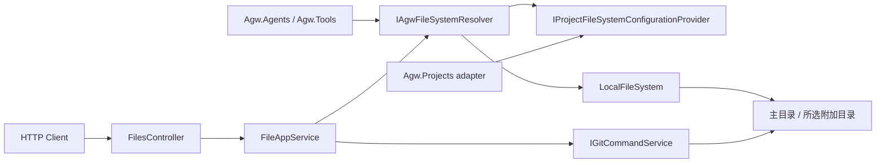

# Agw.Files

`Agw.Files` 为 Agw 提供项目文件访问基础设施。HTTP 接口通过 `projectId`、可选 `directoryId` 和相对路径访问主目录或附加目录，不直接接受客户端提供的宿主机绝对路径。Agent 和文件工具使用本轮目录快照。

## 设计目标

- **统一项目工作区访问**：Agent 和文件工具通过 `IAgwFileSystem` 与 `IAgwFileSystemResolver` 使用相对于所选目录的路径。
- **保持默认工作目录一致**：Agent 与 Shell 的默认 cwd 始终是主目录；Files 和 Git 可以选择主目录或附加目录。
- **限制路径范围**：文件接口的路径检查始终相对于明确选中的根目录。
- **提供文件 SDK**：公共接口、Local 实现、Git 能力和文件异常由 `Agw.Files` 提供；通用路径工具 `PathUtil` 由 `Agw.Shared` 提供。

`Agw.Files` 当前只支持宿主机可见的本地文件系统。需要访问网络文件系统时，应先由操作系统、容器平台或部署基础设施完成挂载，再把挂载目录配置为 `Project.Workspace`。应用内的文件 adapter 不是操作系统挂载，不能为 Git 或其他外部进程提供工作目录。

## 模块职责

| 职责 | 所在位置 |
| --- | --- |
| 项目文件列举、读取、删除、Git diff、暂存/取消暂存、重置和文件名搜索 | `Agw.Files.Application.Files.FileAppService` |
| HTTP 参数和响应映射 | `Agw.Files.Api.FilesController`、`Agw.Files.Api.FileEndpointExceptionMappingMiddleware` |
| Local 文件系统实现与项目解析 | `Agw.Files.Application.Storage` |
| 文件系统公共契约 | `Agw.Files.Abstracts`、`Agw.Files.Abstracts.Dtos` |
| Git 命令及返回模型 | `Agw.Files.Services` |
| 面向 Agent 的文件工具 | `Agw.Tools.Impl.ToolBlocks.FileAccess` |
| Project、Workspace 和 AdditionalDirectories 持久化 | `Agw.Projects` |

`Agw.Files` 不负责定义 Agent 工具，也不拥有 Project 数据。`Agw.Projects` 通过 `IProjectFileSystemConfigurationProvider` adapter 提供名称、owner、主目录和附加目录；Files 不读取 `Project.ExtraSetting`，也不直接依赖 Projects；通过 Shared 复用目录数据与通用路径工具。

## 总体架构



Agent runtime 和文件工具先解析 Project：

```csharp
var fileSystem = await resolver.ResolveAsync(projectId, cancellationToken);
```

调用方随后只传相对于所选目录的路径，例如 `README.md`。指定附加目录时调用 `ResolveAsync(projectId, directoryId, cancellationToken)`。Git 在真实仓库上加锁，并把结果与操作限制在所选目录内；两个目录可以属于同一仓库，目录也可以没有 Git。

## Project 文件系统解析

`Project.Workspace` 保留主目录语义，为空时沿用 `~/.agw/projects/{projectId:N}` 并按需创建。`AdditionalDirectories` 是 Project 自有 JSON 配置，每项为 `{ "id": "UUID", "path": "~/source/docs" }`，默认 `[]`。新增目录必须存在，接受宿主机绝对路径和 `~` 路径；规范化后的重复目录会被拒绝，嵌套目录允许关联。路径改变时分配新 ID。创建响应返回服务端分配的 ID；更新时省略该字段保留配置，传 `[]` 清空关联，不移动或删除磁盘文件。

resolver 每次校验 Project 归属，再按明确的 directoryId 选根目录。Project 不存在、缺少 owner 或 directoryId 不属于 Project 时返回未找到；目录不可用时报告包含该路径的错误，不回退到主目录或临时目录。

缓存以 `(projectId, directoryId, normalizedPath)` 为键，保留 owner 和创建时间，没有 TTL。Project 更新或删除主动失效本机缓存；其他执行节点在解析时比较配置，不复用另一目录的文件系统。

文件界面保存后立即刷新。Agent 每轮开始捕获 `ProjectWorkspaceSnapshot`，包含规范化后的主目录、附加目录及配置指纹。文件工具调用 `ResolveSnapshotAsync`，使用快照中的路径并继续校验 Project 归属。即使关联在本轮被移除，本轮与后台子执行仍使用原快照；下一轮重建工具和 runtime。durable manifest 保存同一快照，恢复和重试不加载新附加目录；旧 manifest 首次恢复时补齐单主目录快照并持久化。

## 使用方式

### 注册模块

Host 通过 `AddFiles` 注册 `FileAppService`、Git 命令和默认 resolver：

```csharp
builder.Services.AddFiles(builder.Configuration);
```

按 Project 解析文件系统的 Host 还必须注册 `IProjectFileSystemConfigurationProvider`；Agw Server 通过 `AddProjects` 完成这项注册。

### 配置 Workspace

Workspace 是 Agw Server 所在主机或容器可见的目录：

```json
{
  "name": "demo",
  "workspace": "/srv/agw/workspaces/demo"
}
```

Workspace 支持 `~` 展开。使用操作系统挂载目录时，应确保：

- Agw 进程具有所需读写权限；
- 挂载在 Agw 启动和执行 Agent 前已经就绪；
- 挂载提供 Git 所需的文件锁、重命名和一致性语义；
- 容器或多实例部署中的每个执行节点都能看到同一路径。

### 在应用代码中访问文件

```csharp
using Agw.Files.Abstracts;

public sealed class WorkspaceDocumentService
{
    private readonly IAgwFileSystemResolver _fileSystemResolver;

    public WorkspaceDocumentService(IAgwFileSystemResolver fileSystemResolver)
    {
        _fileSystemResolver = fileSystemResolver;
    }

    public async Task<string> ReadReadmeAsync(
        Guid projectId,
        CancellationToken cancellationToken)
    {
        var fileSystem = await _fileSystemResolver.ResolveAsync(projectId, cancellationToken);
        return await fileSystem.ReadAllTextAsync("README.md", cancellationToken);
    }
}
```

`IAgwFileSystem` 提供存在性检查、stat、文本读写、建目录、删除、枚举和内容搜索。所有 I/O 方法都接收 `CancellationToken`；调用方不得用 `CancellationToken.None` 覆盖上游取消信号。

## HTTP 文件接口

`FilesController` 的路由前缀是 `/api/files`。每个端点接收 `projectId`、可选 `directoryId` 和相对于所选目录的 `path`。省略 directoryId 表示主目录；list/search 的条目携带 directoryId：

| 方法与路由 | 主要参数 | 作用 |
| --- | --- | --- |
| `GET /api/files/list` | `projectId`、`path`、`diff`、`recursive` | 列出目录，可按 Git 变更过滤 |
| `GET /api/files/read` | `projectId`、`path` | 读取文本文件 |
| `GET /api/files/diff` | `projectId`、`path`、可选 `scope` | 获取完整、`staged` 或 `unstaged` Git diff |
| `DELETE /api/files/delete` | `projectId`、`path` | 删除文件或递归删除目录 |
| `POST /api/files/reset` | `projectId`、`path` | 把文件重置到 Git HEAD |
| `POST /api/files/stage` | `projectId`、`path` | 暂存一个文件或目录下的变更 |
| `POST /api/files/unstage` | `projectId`、`path` | 取消暂存一个文件或目录下的变更 |
| `GET /api/files/search` | `projectId`、`path`、`keyword`、`limit`、`recursive` | 按相对路径名称搜索 |

HTTP `search` 的 `fullPath` 返回所选目录下的完整主机路径，`relativePath` 返回相对于搜索起点的路径。聊天 `@` 建议在项目没有附加目录时使用相对路径，配置附加目录后使用完整路径；含空格时加双引号。

HTTP `search` 搜索文件或目录名称；`IAgwFileSystem.SearchAsync` 搜索文件内容，两者语义不同。

## 路径与安全约束

传给 `IAgwFileSystem` 的路径必须相对于所选主目录或附加目录。`LocalFileSystem` 会拒绝绝对路径及经过规范化后逃逸该根目录的路径。

当前检查是词法路径检查，不解析符号链接的最终目标。部署时不要在 Workspace 中放置指向敏感目录的符号链接；需要增强时必须同时处理跨平台链接解析、目标不存在和竞态条件。

`DELETE /api/files/delete` 会递归删除目录，但空路径、`.` 及规范化后指向根的路径返回 `400`，保护所选目录根。Stage/Unstage 同样拒绝目录根。

## 扩展原则

不要通过增加一个远程文件 adapter 来假装获得本地工作目录。Git、Claude Code、Codex、编译器和 shell 都要求进程可见的真实路径。未来增加远端 Workspace 时，应先定义工作树物化或远端执行的生命周期、同步、锁和冲突语义，再让 Files 与执行进程消费同一个 Workspace。

新增 HTTP 文件操作时：

1. 接收 `projectId`、可选 `directoryId` 和相对路径；
2. 通过 `FileAppService` 与 resolver 访问 Workspace；
3. controller 只负责协议映射；
4. 保持认证、相对路径限制和异常转换；
5. 在 `Agw.Files.Tests` 中分别覆盖 application 行为和 HTTP adapter。

## 测试

从仓库根目录运行：

```bash
dotnet test tests/Agw.Files.Tests/Agw.Files.Tests.csproj
```

只验证模块编译时运行：

```bash
dotnet build src/server/Agw.Files/Agw.Files.csproj
```

现有测试覆盖文件操作、Git diff scope、Stage/Unstage、文件名搜索、项目解析、Local 路径安全、异常映射和 controller 归属。

## 常见误区

- **给文件系统传绝对路径**：调用方必须使用 Project 相对路径。
- **把应用 adapter 当成系统挂载**：外部进程只能访问宿主机可见路径。
- **把浏览目录当成 Agent cwd**：下拉选择只切换文件树、搜索、预览和 Git；Agent 始终从主目录启动，目录配置下一轮生效。
- **混淆两种搜索**：HTTP `search` 搜索路径名称，`IAgwFileSystem.SearchAsync` 搜索内容。
- **假设所有网络挂载都适合 Git**：正确性与性能取决于具体挂载实现的文件系统语义。
