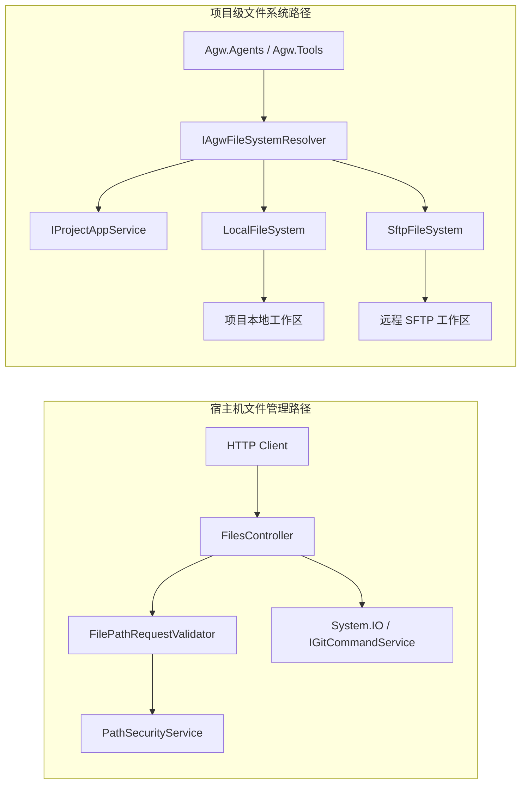

# Agw.Files

`Agw.Files` 为 Agw 提供文件访问基础设施。它一方面暴露面向宿主机文件的 HTTP 管理接口，另一方面通过 `IAgwFileSystem` 为 Agent、运行时和项目级工具提供统一的文件系统抽象。

这两个入口解决的问题不同，也没有共享同一条执行链路。维护或扩展本模块前，最重要的是先判断需求属于“宿主机文件管理”还是“项目工作区存储”。混淆这两条路径，很容易出现配置已经切换到 SFTP，但 HTTP 接口仍在读取本地文件的误解。

## 设计目标

- **统一项目工作区访问**：Agent 和文件工具只依赖 `IAgwFileSystem` 与 `IAgwFileSystemResolver`，不关心文件实际位于本地还是远端。
- **让存储后端可替换**：resolver 按项目选择 Local 或 SFTP，调用方始终使用工作区相对路径。
- **限制路径边界**：HTTP 接口和 Local 后端都先规范化路径，再检查其是否仍位于允许的根目录内。
- **集中管理生命周期**：resolver 创建并缓存项目文件系统，释放时统一清理实现了 `IAsyncDisposable` 的远程资源。
- **保持模块解耦**：接口位于 `Agw.Shared.Contracts.Storage`，实现位于 `Agw.Files`，所以 `Agw.Agents` 和 `Agw.Tools` 不依赖具体存储 SDK。

当前内置两个项目级后端：

| 后端 | 实现 | 适用场景 |
| --- | --- | --- |
| Local | `LocalFileSystem` | 项目工作区位于 Agw Server 可访问的本地磁盘 |
| SFTP | `SftpFileSystem` | 项目文件位于远程主机，需要通过 SSH/SFTP 访问 |

HTTP 文件操作产生的未处理异常由 `FileEndpointExceptionMappingMiddleware` 转换为边界响应：权限错误返回 `403`，其他异常返回 `500`。

## 模块边界

| 职责 | 所在位置 |
| --- | --- |
| 宿主机文件的列举、读取、删除、Git diff、重置和文件名搜索 | `Agw.Files.Controllers.FilesController` |
| HTTP 路径校验和异常映射 | `Agw.Files.Application.Files`、`Agw.Files.Controllers.FileEndpointExceptionMappingMiddleware` |
| 项目级 Local/SFTP 文件系统实现与解析 | `Agw.Files.Application.Storage` |
| 文件系统公共契约 | `Agw.Shared.Contracts.Storage` |
| 面向 Agent 的 `read_file`、`write_file`、`ls`、`glob`、`grep` 等工具 | `Agw.Tools.Impl.Files` |
| 项目及其 `Workspace`、`ExtraSetting` 的持久化 | `Agw.Projects` |

`Agw.Files` 不负责定义 Agent 工具，也不拥有项目数据。它只读取项目配置，并向上层提供文件访问能力。

## 总体架构



### 宿主机文件管理路径

`FilesController` 的路由前缀是 `/api/files`。它直接使用 `System.IO` 和 `IGitCommandService` 操作宿主机文件，不经过 `IAgwFileSystemResolver`。

这条路径适合 Web UI 浏览或管理 Agw Server 可访问的文件。路径可以是绝对路径、相对于 Host `ContentRootPath` 的路径，或者位于用户主目录下的 `~` 路径，但最终结果必须落在允许根目录内。

### 项目级文件系统路径

Agent runtime 和 `Agw.Tools` 中的文件工具先调用：

```csharp
var fileSystem = await resolver.ResolveAsync(projectId, cancellationToken);
```

resolver 根据项目配置返回 `LocalFileSystem` 或 `SftpFileSystem`。之后所有路径都应相对于该文件系统的根目录，例如 `README.md`、`src/server/Program.cs`，而不是宿主机绝对路径。

因此，新增项目存储后端不会自动影响 `/api/files/*`。如果新需求要让 HTTP 接口访问项目存储，必须显式设计项目标识、授权和 resolver 调用，不能只在 resolver 中增加一个分支。

## 目录结构

- `Application/Files/`：HTTP 路径验证与安全策略；
- `Application/Storage/Local/`：本地文件系统及工厂；
- `Application/Storage/Sftp/`：SFTP 文件系统及工厂；
- `Application/Storage/Resolver/`：按项目选择并缓存文件系统；
- `Controllers/`：HTTP 文件接口与异常映射；
- `DependencyInjection.cs`：模块服务注册。

公共接口、配置类型和返回模型位于 `Agw.Shared.Contracts.Storage`，上层模块只依赖这些契约。

## 项目文件系统如何解析

`ProjectScopedFileSystemResolver.ResolveAsync` 按以下顺序工作：

1. `projectId` 为 `Guid.Empty` 时，使用 `~/.agw/temp` 下的临时 Local 文件系统；
2. resolver 已缓存该项目时，直接返回缓存实例；
3. 项目不存在时，记录警告并回退到临时 Local 文件系统；
4. `Project.ExtraSetting` 包含 `fileStorage` 时，按其中的 `type` 创建 Local 或 SFTP 后端；
5. 没有 `fileStorage` 配置时，使用 `Project.Workspace`；如果 Workspace 为空，则使用 `~/.agw/{project.Name}`。

resolver 以 singleton 注册，并按 `projectId` 缓存文件系统。当前没有缓存失效机制：进程运行期间修改项目的 `Workspace` 或 `ExtraSetting.fileStorage`，已经解析过的项目不会自动切换后端。需要配置即时生效时，应先设计明确的缓存失效和旧连接释放机制。

## 使用方式

### 注册模块

Host 通过 `AddFiles` 注册路径安全服务、存储工厂和默认 resolver：

```csharp
builder.Services.AddFiles(builder.Configuration);
```

`Agw.Host/Program.cs` 还注册了 `FileEndpointExceptionMappingMiddleware`。如果在其他 Host 中复用本模块，HTTP 文件接口需要同时接入这个 middleware，项目级 `IAgwFileSystem` 本身则不依赖它。

### 配置 Local 存储

下面的 JSON 是 `Project.ExtraSetting` 的内容，不是独立的 `appsettings.json` 配置节：

```json
{
  "fileStorage": {
    "type": "local",
    "local": {
      "rootPath": "/srv/agw/workspaces/demo"
    }
  }
}
```

显式 `fileStorage.local.rootPath` 建议使用绝对路径。当前从显式 Local 配置创建文件系统时不会展开 `~`；没有 `fileStorage` 配置、回退到 `Project.Workspace` 时才会经过支持 `~` 展开的工厂重载。

### 配置 SFTP 存储

私钥认证示例：

```json
{
  "fileStorage": {
    "type": "sftp",
    "sftp": {
      "host": "sftp.example.com",
      "port": 22,
      "username": "agw",
      "authType": "privateKey",
      "privateKeyPath": "/home/agw/.ssh/id_ed25519",
      "rootPath": "/srv/projects/demo"
    }
  }
}
```

`privateKeyPath` 是 Agw Server 所在机器上的路径，不是远程路径；加密私钥还可以提供 `passphrase`。密码认证则把 `authType` 设为 `password` 并提供 `password`。当前实现直接从 `Project.ExtraSetting` 读取这些值，不要把真实凭据提交到仓库、示例配置或日志中。

### 在应用服务中访问项目文件

调用方注入 `IAgwFileSystemResolver`，解析项目后再使用相对路径：

```csharp
using Agw.Shared.Contracts.Storage;

public sealed class WorkspaceDocumentService
{
    private readonly IAgwFileSystemResolver _fileSystemResolver;

    public WorkspaceDocumentService(IAgwFileSystemResolver fileSystemResolver)
    {
        _fileSystemResolver = fileSystemResolver;
    }

    public async Task<string> ReadReadmeAsync(
        Guid projectId,
        CancellationToken cancellationToken)
    {
        var fileSystem = await _fileSystemResolver.ResolveAsync(projectId, cancellationToken);
        return await fileSystem.ReadAllTextAsync("README.md", cancellationToken);
    }
}
```

`IAgwFileSystem` 提供以下能力：

| 方法 | 作用 |
| --- | --- |
| `ExistsFileAsync` / `ExistsDirectoryAsync` | 判断文件或目录是否存在 |
| `StatAsync` | 获取相对路径、类型、大小和 UTC 修改时间 |
| `ReadAllTextAsync` / `ReadAllLinesAsync` | 读取文本文件 |
| `WriteAllTextAsync` | 创建或覆盖文本文件 |
| `CreateDirectoryAsync` | 创建目录 |
| `DeleteAsync` | 删除文件或递归删除目录 |
| `EnumerateAsync` | 按 glob 风格的 `searchPattern` 枚举目录 |
| `SearchAsync` | 按正则表达式搜索文件内容，返回文件、行号和文本 |

所有 I/O 方法都接收 `CancellationToken`。新增调用方或实现时，不要用 `CancellationToken.None` 覆盖上游取消信号。

### 使用 HTTP 文件接口

HTTP 接口要求 `path` 查询参数，并受 Host 认证边界保护：

| 方法与路由 | 主要参数 | 作用 |
| --- | --- | --- |
| `GET /api/files/list` | `path`、`diff`、`recursive` | 列出直接子项；也可以按 Git 变更过滤 |
| `GET /api/files/read` | `path` | 读取文本文件 |
| `GET /api/files/diff` | `path` | 获取单个文件的 Git diff |
| `DELETE /api/files/delete` | `path` | 删除文件或递归删除目录 |
| `POST /api/files/reset` | `path` | 把文件重置到 Git HEAD |
| `GET /api/files/search` | `path`、`keyword`、`limit`、`recursive` | 按相对路径名称搜索文件和目录 |

例如，列出一个目录中的 Git 变更：

```bash
curl --get 'http://localhost:5015/api/files/list' \
  --header 'Authorization: Bearer agw_...' \
  --data-urlencode 'path=/srv/agw/workspaces/demo' \
  --data-urlencode 'diff=true'
```

这里有两个同名但语义不同的“搜索”：`GET /api/files/search` 按文件或目录的相对路径匹配 `keyword`；`IAgwFileSystem.SearchAsync` 则读取文件内容并按正则表达式返回命中行。

## 路径与安全约束

### HTTP 接口

`PathSecurityService` 默认把以下位置作为允许根目录：

- Host 的 `IWebHostEnvironment.ContentRootPath`；
- 运行 Agw Server 的用户主目录。

相对路径基于 `ContentRootPath` 解析，`~` 会展开为用户主目录。服务会先调用 `Path.GetFullPath`，再使用相对路径语义检查包含关系，因此与根目录共享字符串前缀的相邻目录不会被误判为子目录。

当前校验是规范化后的词法路径检查，不解析符号链接的最终目标。部署时不要在允许根目录中放置指向敏感目录的符号链接；如果要增强这一点，需要同时考虑跨平台链接解析、目标不存在和竞态条件。

`DELETE /api/files/delete` 会递归删除目录。新增调用入口时，应继续要求显式路径并保留认证、路径校验和审计日志，不能绕过 controller 的校验流程直接接受客户端绝对路径。

### 项目级存储

传给 `IAgwFileSystem` 的路径应始终相对于项目根目录。`LocalFileSystem` 会拒绝逃逸根目录的路径；新的远程或对象存储实现也必须把 root、bucket prefix 或 tenant prefix 当作安全边界，而不只是字符串拼接前缀。

对所有后端，建议保持这些语义一致：

- 返回给调用方的是项目相对路径；
- `FileEntry.LastModifiedUtc` 使用 `DateTimeOffset` 和 UTC；
- 不存在的路径由 `Exists*Async` 或 `StatAsync` 表达，不引入后端特有的返回格式；
- 预期的配置和应用错误使用 `AgwException` 及 `ErrorCodes`；
- 远程连接和流必须在取消或释放时正确清理。

## 怎么扩展

### 新增存储后端

以新增一种 `WebDav` 后端为例，最小改动面如下。

#### 1. 扩展公共配置契约

在 `Agw.Shared.Contracts.Storage` 中增加后端所需的 options；如果调用方需要枚举类型，同时扩展 `FileStorageType`。不要把 WebDAV SDK、HTTP client 或实现细节放进 `Agw.Shared`。

配置字段应只描述连接和根目录，例如 endpoint、用户名、凭据引用和 root path。需要特别说明哪些路径属于 Agw Server，哪些路径属于远端。

#### 2. 实现 `IAgwFileSystem`

在 `Agw.Files/Application/Storage/WebDav/` 中增加 `WebDavFileSystem`，完整实现 `IAgwFileSystem` 的每个成员。实现时重点检查：

- 路径规范化和根目录逃逸；
- 相对路径返回值在不同后端间是否一致；
- glob、内容搜索、大小和修改时间的语义；
- `CancellationToken` 是否传递到网络和流操作；
- 并发访问时客户端是否线程安全；
- 实现 `IAsyncDisposable` 后，是否能关闭连接并释放流。

如果后端基于 HTTP，必须通过 `IHttpClientFactory` 创建客户端，不要直接 `new HttpClient()`。

#### 3. 增加工厂

工厂负责验证 options、构造 SDK client，并把后端根目录传给文件系统实现。配置缺失、认证类型不支持等预期错误应抛出带 `ErrorCodes` 的 `AgwException`。

工厂不应读取项目或缓存实例；这些职责仍属于 `ProjectScopedFileSystemResolver`。

#### 4. 接入 resolver

在 `ProjectScopedFileSystemResolver` 中完成三处接入：

1. 通过构造函数注入新工厂；
2. 在 `CreateFromConfig` 的 `type` 分支中识别新类型；
3. 增加一个私有解析方法，把 JSON 配置映射到 options 并调用工厂。

当前 resolver 使用小写字符串选择后端，因此配置值应大小写不敏感，并为未知值保留 `FileStorageBackendNotSupported` 错误。

#### 5. 注册依赖

在 `Agw.Files/DependencyInjection.cs` 中注册新工厂。默认 `IAgwFileSystemResolver` 仍保持 singleton；如果新 client 的生命周期不适合被项目级长期缓存，应先调整缓存设计，而不是在文件系统方法内部反复创建连接。

#### 6. 补齐验证

至少覆盖以下测试：

- 必填配置缺失时返回稳定的 `ErrorCodes`；
- `..`、绝对路径和根目录前缀碰撞不能逃逸存储根；
- 读、写、覆盖、枚举、搜索和递归删除的行为与现有契约一致；
- 取消信号可以终止较慢的 I/O；
- resolver 能从 `Project.ExtraSetting.fileStorage` 选择新后端；
- resolver 释放时会释放已缓存的异步资源。

远程后端测试优先针对可替换的 client adapter 编写单元测试，再用少量集成测试验证真实服务器协议，避免把所有测试都绑定到外部服务。

### 扩展项目解析策略

如果选择后端不再只依赖 `Project.ExtraSetting`，应扩展或替换 `IAgwFileSystemResolver`，而不是让 Agent 工具分别读取项目配置。resolver 必须继续提供单一选择结果，并明确：

- 配置优先级；
- 项目不存在时是否允许回退；
- 缓存键和失效条件；
- 旧文件系统何时释放；
- 配置切换期间正在执行的 turn 如何处理。

这类改动会影响 `Agw.Agents` 和 `Agw.Tools` 的运行时行为，不能只按普通工厂扩展处理。

### 扩展 HTTP 文件接口

新增 `/api/files/*` 端点时：

1. 复用 `IFilePathRequestValidator`，并把解析后的路径写入 middleware 使用的 `HttpContext.Items`；
2. 在 `FileEndpointExceptionMappingMiddleware` 中补充操作名和失败消息；
3. 保持认证、路径限制和日志信息；
4. 按 `docs/rules.md` 检查 API 响应与异常约束，不要只复制旧端点的返回方式；
5. 在 `Agw.Files.Tests` 中覆盖路径拒绝、权限异常、缺失文件和正常响应。

如果端点操作的是项目工作区而不是宿主机路径，应优先设计为接收 `projectId` 并使用 `IAgwFileSystemResolver`。不要同时接收未经约束的宿主机绝对路径和项目标识。

## 测试

从仓库根目录运行：

```bash
dotnet test tests/Agw.Files.Tests/Agw.Files.Tests.csproj
```

只验证模块能否编译时，可以运行：

```bash
dotnet build src/server/Agw.Files/Agw.Files.csproj
```

现有测试主要覆盖 HTTP 路径校验、安全根目录、文件名搜索、异常映射和 controller 的模块归属。修改存储实现或 resolver 时，应另外补充对应后端和项目配置解析测试。

## 常见误区

- **把 HTTP 文件接口当作项目存储接口**：`FilesController` 不使用 `IAgwFileSystemResolver`，切换项目到 SFTP 不会改变这些端点。
- **给项目文件系统传绝对路径**：`IAgwFileSystem` 的调用方应使用相对于工作区根目录的路径。
- **在显式 Local 配置中依赖 `~` 展开**：当前显式 `fileStorage.local.rootPath` 路径不会经过展开 `~` 的工厂重载，建议使用绝对路径。
- **修改项目配置后期待缓存立即刷新**：resolver 会缓存已经解析的项目文件系统，当前没有主动失效机制。
- **混淆两种搜索**：HTTP `search` 搜索路径名称，`IAgwFileSystem.SearchAsync` 搜索文件内容。
- **忽略远程资源释放**：远程实现应实现 `IAsyncDisposable`，并确保 resolver 能释放缓存实例。
- **把真实 SFTP 凭据放进示例或版本控制**：当前配置支持直接读取密码和 passphrase，维护者需要自行保证配置数据的访问边界。

简单来说，扩展 `Agw.Files` 时应先选对入口：宿主机管理走 controller 和路径安全边界，项目工作区访问走 resolver 和 `IAgwFileSystem`。只要这条边界保持清晰，新增存储后端通常只需要扩展公共配置、具体实现、工厂、resolver、DI 和对应测试，不需要修改 Agent 或文件工具调用方。
