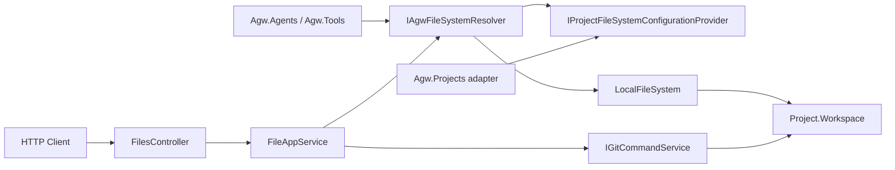

# Agw.Files

`Agw.Files` 为 Agw 提供项目文件访问基础设施。HTTP 接口、Agent、运行时和文件工具都通过项目标识访问 `Project.Workspace`，不直接接受客户端提供的宿主机绝对路径。

## 设计目标

- **统一项目工作区访问**：Agent 和文件工具通过 `IAgwFileSystem` 与 `IAgwFileSystemResolver` 使用项目相对路径。
- **保持进程工作目录一致**：Files、Git、Claude Code 和 Codex 使用同一个宿主机可见 Workspace。
- **限制路径范围**：所有文件操作都限制在项目根目录内。
- **提供自包含 SDK**：公共接口、Local 实现、Git 能力、路径工具和文件异常都由 `Agw.Files` 提供；本模块不依赖 `Agw.Shared`。

`Agw.Files` 当前只支持宿主机可见的本地文件系统。需要访问网络文件系统时，应先由操作系统、容器平台或部署基础设施完成挂载，再把挂载目录配置为 `Project.Workspace`。应用内的文件 adapter 不是操作系统挂载，不能为 Git 或其他外部进程提供工作目录。

## 模块职责

| 职责 | 所在位置 |
| --- | --- |
| 项目文件列举、读取、删除、Git diff、重置和文件名搜索 | `Agw.Files.Application.Files.FileAppService` |
| HTTP 参数和响应映射 | `Agw.Files.Api.FilesController`、`Agw.Files.Api.FileEndpointExceptionMappingMiddleware` |
| Local 文件系统实现与项目解析 | `Agw.Files.Application.Storage` |
| 文件系统公共契约 | `Agw.Files.Abstracts`、`Agw.Files.Abstracts.Dtos` |
| Git 命令及返回模型 | `Agw.Files.Services` |
| 面向 Agent 的文件工具 | `Agw.Tools.Impl.Files` |
| Project 及其 Workspace 持久化 | `Agw.Projects` |

`Agw.Files` 不负责定义 Agent 工具，也不拥有 Project 数据。`Agw.Projects` 通过 `IProjectFileSystemConfigurationProvider` adapter 提供 Project 名称和 Workspace；Files 不读取 `Project.ExtraSetting`，也不直接依赖 Projects 或 Shared。

## 总体架构



Agent runtime 和文件工具先解析 Project：

```csharp
var fileSystem = await resolver.ResolveAsync(projectId, cancellationToken);
```

调用方随后只传相对于 Workspace 的路径，例如 `README.md` 或 `src/server/Program.cs`。Git、Claude Code 和 Codex 则使用同一 Workspace 的宿主机绝对路径作为进程工作目录。

## Project 文件系统解析

`ProjectScopedFileSystemResolver.ResolveAsync` 按以下顺序工作：

1. `projectId` 为 `Guid.Empty` 时，使用 `~/.agw/temp`；
2. 已缓存该 Project 时，返回现有 `LocalFileSystem`；
3. Project 不存在时，记录警告并回退到 `~/.agw/temp`；
4. Project 有 Workspace 时，将它展开并作为根目录；
5. Workspace 为空时，使用 `~/.agw/{project.Name}`。

resolver 以 singleton 注册，并按 `projectId` 缓存 `CachedEntry(FileSystem, CreatedAt)`。`CreatedAt` 当前只保留缓存创建时间，不触发 TTL 或自动刷新。进程运行期间修改已经解析过的 Project Workspace 不会立即生效，需要重启服务。若将来要求即时切换，应先设计明确的缓存失效语义。

## 使用方式

### 注册模块

Host 通过 `AddFiles` 注册 `FileAppService`、Git 命令和默认 resolver：

```csharp
builder.Services.AddFiles(builder.Configuration);
```

按 Project 解析文件系统的 Host 还必须注册 `IProjectFileSystemConfigurationProvider`；Agw Server 通过 `AddProjects` 完成这项注册。

### 配置 Workspace

Workspace 是 Agw Server 所在主机或容器可见的目录：

```json
{
  "name": "demo",
  "workspace": "/srv/agw/workspaces/demo"
}
```

Workspace 支持 `~` 展开。使用操作系统挂载目录时，应确保：

- Agw 进程具有所需读写权限；
- 挂载在 Agw 启动和执行 Agent 前已经就绪；
- 挂载提供 Git 所需的文件锁、重命名和一致性语义；
- 容器或多实例部署中的每个执行节点都能看到同一路径。

### 在应用代码中访问文件

```csharp
using Agw.Files.Abstracts;

public sealed class WorkspaceDocumentService
{
    private readonly IAgwFileSystemResolver _fileSystemResolver;

    public WorkspaceDocumentService(IAgwFileSystemResolver fileSystemResolver)
    {
        _fileSystemResolver = fileSystemResolver;
    }

    public async Task<string> ReadReadmeAsync(
        Guid projectId,
        CancellationToken cancellationToken)
    {
        var fileSystem = await _fileSystemResolver.ResolveAsync(projectId, cancellationToken);
        return await fileSystem.ReadAllTextAsync("README.md", cancellationToken);
    }
}
```

`IAgwFileSystem` 提供存在性检查、stat、文本读写、建目录、删除、枚举和内容搜索。所有 I/O 方法都接收 `CancellationToken`；调用方不得用 `CancellationToken.None` 覆盖上游取消信号。

## HTTP 文件接口

`FilesController` 的路由前缀是 `/api/files`。每个端点接收 `projectId` 和 Project 相对路径：

| 方法与路由 | 主要参数 | 作用 |
| --- | --- | --- |
| `GET /api/files/list` | `projectId`、`path`、`diff`、`recursive` | 列出目录，可按 Git 变更过滤 |
| `GET /api/files/read` | `projectId`、`path` | 读取文本文件 |
| `GET /api/files/diff` | `projectId`、`path` | 获取单个文件的 Git diff |
| `DELETE /api/files/delete` | `projectId`、`path` | 删除文件或递归删除目录 |
| `POST /api/files/reset` | `projectId`、`path` | 把文件重置到 Git HEAD |
| `GET /api/files/search` | `projectId`、`path`、`keyword`、`limit`、`recursive` | 按相对路径名称搜索 |

HTTP `search` 搜索文件或目录名称；`IAgwFileSystem.SearchAsync` 搜索文件内容，两者语义不同。

## 路径与安全约束

传给 `IAgwFileSystem` 的路径必须相对于 Project 根目录。`LocalFileSystem` 会拒绝绝对路径及经过规范化后逃逸根目录的路径。

当前检查是词法路径检查，不解析符号链接的最终目标。部署时不要在 Workspace 中放置指向敏感目录的符号链接；需要增强时必须同时处理跨平台链接解析、目标不存在和竞态条件。

`DELETE /api/files/delete` 会递归删除目录，但空路径返回 `400`，防止删除整个 Workspace。

## 扩展原则

不要通过增加一个远程文件 adapter 来假装获得本地工作目录。Git、Claude Code、Codex、编译器和 shell 都要求进程可见的真实路径。未来增加远端 Workspace 时，应先定义工作树物化或远端执行的生命周期、同步、锁和冲突语义，再让 Files 与执行进程消费同一个 Workspace。

新增 HTTP 文件操作时：

1. 接收 `projectId` 和相对路径；
2. 通过 `FileAppService` 与 resolver 访问 Workspace；
3. controller 只负责协议映射；
4. 保持认证、相对路径限制和异常转换；
5. 在 `Agw.Files.Tests` 中分别覆盖 application 行为和 HTTP adapter。

## 测试

从仓库根目录运行：

```bash
dotnet test tests/Agw.Files.Tests/Agw.Files.Tests.csproj
```

只验证模块编译时运行：

```bash
dotnet build src/server/Agw.Files/Agw.Files.csproj
```

现有测试覆盖文件操作、Git 编排、文件名搜索、项目解析、Local 路径安全、异常映射和 controller 归属。

## 常见误区

- **给文件系统传绝对路径**：调用方必须使用 Project 相对路径。
- **把应用 adapter 当成系统挂载**：外部进程只能访问宿主机可见路径。
- **修改 Workspace 后期待缓存立即刷新**：已解析 Project 的缓存需要服务重启。
- **混淆两种搜索**：HTTP `search` 搜索路径名称，`IAgwFileSystem.SearchAsync` 搜索内容。
- **假设所有网络挂载都适合 Git**：正确性与性能取决于具体挂载实现的文件系统语义。
