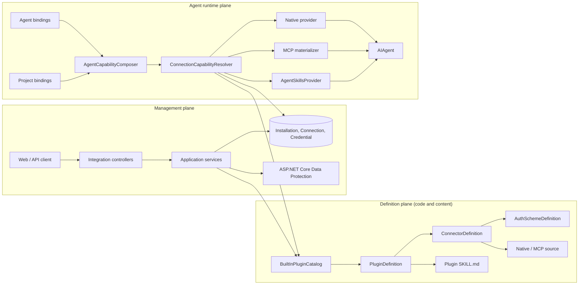
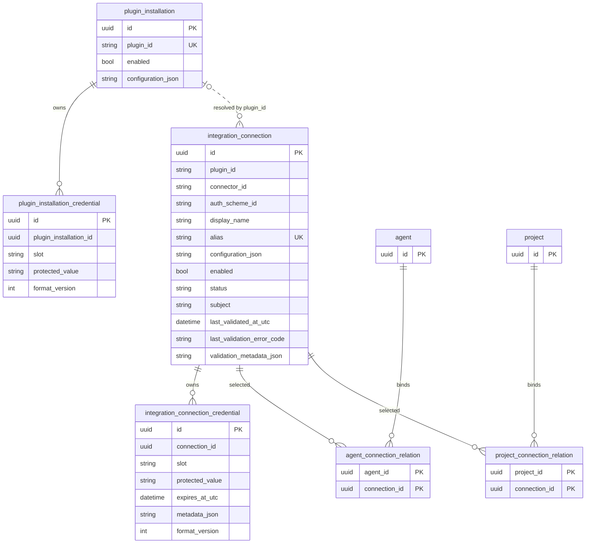
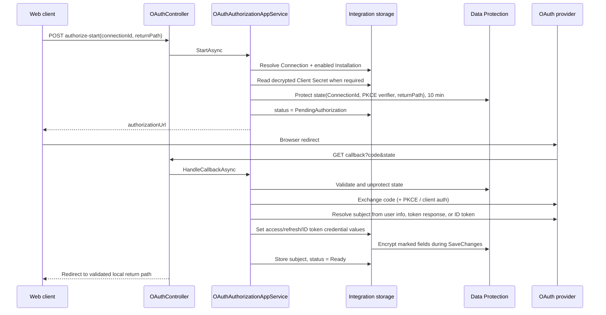
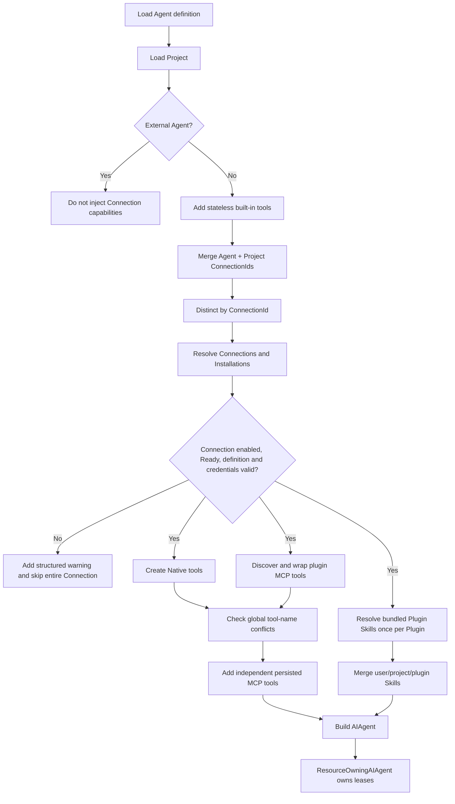

# Agw.Integrations

[简体中文](README.zh-CN.md)

`Agw.Integrations` turns external accounts and service endpoints into capabilities that an in-process Agw Agent can select and use. It separates immutable integration definitions from mutable installation, account, credential, and binding state so that one plugin can support multiple protocols, authentication schemes, and accounts without coupling Agent runtime code to a specific vendor.

The built-in catalog currently contains GitHub only.

## Design goals

The module follows these principles:

| Principle | Consequence |
| --- | --- |
| Separate definitions from state | Plugin, Connector, authentication, capability-source, and bundled Skill definitions live in code/content. Installations, Connections, credentials, and Agent/Project bindings live in the database. |
| Select an exact account | Agents and Projects bind a concrete `ConnectionId`, not a plugin type such as “GitHub”. Two GitHub accounts therefore remain distinguishable. |
| Keep protocol and authentication independent | A Connector describes the service or protocol; an Auth Scheme describes how one authenticates. A plugin may expose multiple Connectors and each Connector may expose multiple Auth Schemes. |
| Namespace every connection tool | Connection tools are always named `{alias}__{operation}`. The alias identifies the exact account or endpoint that will receive the call. |
| Resolve secrets late | Native and plugin MCP invocations open a fresh dependency-injection scope and read the latest encrypted credential, so credential rotation does not require rebuilding plugin definitions. |
| Fail closed | Only `Ready` Connections contribute tools or bundled Skills. Missing definitions, credentials, and non-ready states produce structured warnings instead of partially exposing a connection. |
| Own resource lifetimes explicitly | MCP clients/transports and capability resources are represented by async leases and released when discovery, invocation, or the owning Agent ends. |
| Do not expose secret material | JSON APIs return only `configured: true/false` for secret fields. Plaintext secrets, provider tokens, and protected database values are never returned. |

## Scope and boundaries

Implemented:

- static built-in Plugin Catalog;
- OAuth 2.0 Authorization Code, API Key, and AK/SK definition types;
- schema-driven installation and connection fields;
- encrypted installation and connection credentials;
- generic Connection CRUD, status evaluation, OAuth start/callback/refresh, and local validation;
- connection-bound Native tools;
- connection-bound stdio, HTTP, and SSE MCP tools;
- bundled Plugin Skills loaded through the existing Agent Skills provider;
- Agent and Project bindings by `ConnectionId`;
- GitHub OAuth and Native tools.

Not implemented:

- remote plugin marketplace, download, signing, caching, or upgrades;
- execution of scripts shipped by a third-party Plugin Skill;
- Connection injection into external Codex or Claude Agents;
- live mutation of an already-created Agent's tool list when a Connection status changes.

## Architecture



The implementation spans these areas:

- `Domain/Plugins`: immutable catalog definition models.
- `Application/Management`: catalog projection, installation configuration, Connection CRUD, validation, secret mutation, and status transitions.
- `Application/OAuth`: authorization start, callback, token exchange, subject resolution, and refresh.
- `Application/Credentials`: scoped reads of decrypted installation and Connection credential values.
- `Application/Capabilities`: runtime Connection resolution, Native/MCP tool creation, bundled Skill references, warnings, and leases.
- `Infrastructure/Plugins`: the built-in Plugin Catalog.
- `Agw.Infrastructure/Data/Encryption`: shared `[Encrypted]` database-field persistence.
- `Mcp`: transport-neutral MCP descriptors, materialization, and resource ownership.
- `Tools`: Native providers, currently GitHub.

## Core model

### Definition hierarchy

```text
PluginDefinition
├── ConnectorDefinition[]
│   ├── AuthSchemeDefinition[]
│   │   ├── InstallationFields[]
│   │   └── ConnectionFields[]
│   └── CapabilitySourceDefinition[]
│       ├── NativeCapabilitySourceDefinition
│       └── McpCapabilitySourceDefinition
└── PluginSkillDefinition[]
    └── ContentPath -> SKILL.md
```

| Concept | Meaning |
| --- | --- |
| `PluginDefinition` | A versioned capability package. It groups Connectors and bundled Skills. Definitions are returned by `IPluginCatalog` and are not persisted. |
| `ConnectorDefinition` | A service or protocol variant, for example `github-cloud` or another endpoint variant exposed by the same Plugin. |
| `AuthSchemeDefinition` | Authentication metadata and form schema. Current types are `OAuth2`, `ApiKey`, and `AkSk`. |
| Installation fields | Platform-wide values shared by Connections of the plugin, such as an OAuth Client ID and Client Secret. |
| Connection fields | Values belonging to one account or endpoint, such as an API Key, access key, secret key, endpoint, or region. |
| `NativeCapabilitySourceDefinition` | Selects an in-process C# provider through its `Provider` key. |
| `McpCapabilitySourceDefinition` | Describes an MCP transport and the exact credential-to-header/environment bindings allowed for it. |
| Capability Source `Id` | A stable identity within a Connector. MCP wrapper tools retain this ID so the source can be found again when an operation is invoked. It is not a semantic capability taxonomy. |
| `PluginSkillDefinition` | Stores only a safe relative `ContentPath`. Skill ID and description are read from the `name` and `description` frontmatter fields in `SKILL.md`. |
| `PluginInstallation` | One platform-wide row per plugin. A row is required and must be enabled before a Connection can contribute runtime capabilities. |
| `Connection` | One Agent-selectable external account or endpoint. It fixes the Plugin, Connector, Auth Scheme, display name, immutable alias, status, subject, and non-secret configuration. |
| Credential | An encrypted value owned by either a Plugin Installation or a Connection and addressed by a stable slot. |

### Why Connection is the selection unit

A Plugin answers “what integration package exists?” A Connector answers “which service or protocol is used?” An Auth Scheme answers “how is it authenticated?” A Connection answers “which exact account or endpoint should this Agent call?”

For example:

```text
Plugin: github
Connector: github-cloud
Auth scheme: oauth2

Connection A: alias = work-github     subject = company-user
Connection B: alias = personal-github subject = personal-user
```

The resulting tools are distinct:

```text
work-github__list_repositories
personal-github__list_repositories
```

The model never relies on “the first GitHub account”.

## Persistence model



Important storage rules:

- `plugin_installation.plugin_id` is unique. Connector/Auth Scheme scopes share the same installation row.
- Installation non-secret fields are stored in `ConfigurationJson` under `{connectorId}:{authSchemeId}:{fieldId}`.
- Connection non-secret fields are stored in `ConfigurationJson` under their field IDs.
- Secret fields never enter either `ConfigurationJson`.
- Installation secret slots use `field:{connectorId}:{authSchemeId}:{fieldId}`.
- Connection secret slots use `field:{fieldId}`.
- OAuth tokens use `oauth.access-token`, `oauth.refresh-token`, and `oauth.id-token`.
- `integration_connection.alias` is globally unique and immutable after creation.
- Credential owners have a unique `(owner_id, slot)` pair.
- Agent and Project relation tables use composite keys, preventing duplicate bindings.
- `ValidationMetadataJson` and credential `MetadataJson` are reserved internal fields and are not part of the management API.

The EF model declares ownership/navigation relationships, while the current integration migration intentionally creates these integration tables without database foreign-key constraints. `AgwDbContext` therefore removes dependent credentials and Agent/Project relations explicitly when an Installation, Connection, Agent, or Project is deleted.

## Connection status model

Only `Ready` contributes tools and bundled Skills.

| Status | Meaning and typical entry path |
| --- | --- |
| `NeedsConfiguration` | The Plugin Installation is absent, disabled, or missing required fields; or required Connection fields are missing. |
| `PendingAuthorization` | An OAuth Connection has no access token, authorization is in progress, or the provider denied the authorization request. |
| `Unverified` | Configuration exists but has not passed local validation since creation or mutation. |
| `Ready` | Required configuration and encrypted credentials are readable and unexpired. OAuth callback success also marks the Connection Ready. |
| `Expired` | Local validation or runtime credential checks find an expired credential. |
| `Invalid` | A protected value cannot be decrypted, local data is invalid, token exchange fails, or refresh fails. |
| `Disabled` | The Connection itself is disabled. |
| `DefinitionUnavailable` | Its Plugin, Connector, or Auth Scheme can no longer be resolved from the current Catalog. |

`POST /api/integrations/connections/validate` performs local definition, required-field, credential-decryption, and expiration checks. It does not call a provider-specific health endpoint. A Native or MCP operation can still fail later because of revoked authorization, remote permissions, network errors, or provider availability.

Changing an Installation invalidates affected Connections:

- disabling an Installation moves all Connections for that plugin out of Ready;
- missing required Installation values produces `NeedsConfiguration`;
- an OAuth Connection without a token becomes `PendingAuthorization`;
- otherwise the Connection becomes `Unverified` and must be validated or reauthorized.

## Management data flow

### Catalog and installation

1. `GET /api/integrations/plugins` reads the static `IPluginCatalog`.
2. `PluginCatalogAppService` joins each Plugin with its persisted Installation, if any.
3. The response contains Connector/Auth Scheme schemas, non-secret configuration, and secret `configured` flags.
4. `PUT /api/integrations/plugin-installations` resolves the requested definition and validates input against `InstallationFields`.
5. Non-secret values are written to scoped installation configuration keys.
6. `Set` secrets are protected and stored in credential slots; `Keep` leaves the current value; `Clear` deletes it.
7. Affected Connections are invalidated so stale readiness is not trusted.

There is no separate Installation GET endpoint. Installation state is projected into the corresponding Auth Scheme returned by the Plugin Catalog API.

### Connection creation and update

1. The service resolves `pluginId + connectorId + authSchemeId` against the Catalog.
2. Alias is normalized to lowercase and must match lowercase kebab-case: `^[a-z0-9]+(?:-[a-z0-9]+)*$`.
3. Display name and schema-driven fields are validated.
4. Non-secret fields and encrypted secret fields are persisted separately.
5. Initial status is derived from enabled state, Installation readiness, auth type, and token presence.
6. Updates may change display name, enabled state, and field values, but may not change alias or the selected definition tuple.

Deleting a Connection also removes its credentials and Agent/Project bindings through the unit-of-work cleanup path.

### OAuth Authorization Code flow



The callback URI is built by the server. The return path must be a safe local relative path. OAuth state is time-limited to ten minutes and contains the Connection ID, optional PKCE verifier, return path, and expiration.

## Agent runtime data flow



`AgentCapabilityComposer` merges Agent and Project bindings and de-duplicates them by `ConnectionId`. It then combines:

1. stateless tools from `ToolRegistryService`;
2. Connection Native and plugin MCP tools;
3. independently persisted `McpServer` tools;
4. user/Project Skills and bundled Plugin Skills.

Tool names are checked case-insensitively across all sources. A collision raises an explicit configuration error; there is no silent first-wins behavior.

### Native invocation

A Native tool captures only `ConnectionId`, `ProjectId`, and alias-derived identity. On every invocation it:

1. creates a fresh DI scope;
2. loads the current credential by slot;
3. decrypts it through Data Protection;
4. calls the provider;
5. disposes the scope.

The built-in GitHub provider exposes:

- `{alias}__current_user`;
- `{alias}__list_repositories`;
- `{alias}__clone_repository`.

GitHub cloning accepts only owner, repository, and an optional relative destination. The destination is confined to the Project workspace, including symbolic-link checks. The token is supplied through a temporary Git config environment value, not the clone URL or command arguments, and is redacted from process output.

### Plugin MCP invocation

At runtime composition, the resolver materializes an MCP source once to discover tool schemas, then disposes that discovery client. Each exposed wrapper keeps the Connection ID, Source ID, operation name, and schema.

When the Agent calls the wrapper:

1. a fresh DI scope reloads the Connection, Installation, and source definition;
2. declared credential bindings are resolved and decrypted;
3. a call-scoped MCP client and transport are materialized;
4. the original MCP operation is invoked;
5. the client and transport are disposed.

This makes credential rotation visible on the next operation, even for an already-created Agent runtime.

Credential binding rules:

- stdio MCP sources may inject credentials only into declared environment-variable names;
- HTTP/SSE MCP sources may inject credentials only into declared HTTP headers;
- a credential-bound HTTP/SSE endpoint must use HTTPS;
- value sources may be a Connection field, an Installation field, or the Connection OAuth access token;
- runtime environment/header overrides cannot replace credential values because credential values are merged last;
- plugin MCP sources do not create duplicate persistent `McpServer` rows.

### Plugin Skills

Plugin Skills are copied with the assembly as content assets. A definition contains only:

```csharp
new PluginSkillDefinition
{
    ContentPath = "Plugins/github/skills/github/SKILL.md"
}
```

`PluginSkillMetadataReader` reads the following frontmatter as the single metadata source:

```markdown
---
name: github
description: Use connected GitHub tools to inspect and work with repositories.
---
```

The path must be relative, remain under the plugin content root after physical/symbolic-link resolution, and point to an existing `SKILL.md`. `name` must be lowercase kebab-case and both `name` and `description` are required.

At Agent creation:

- the same Plugin contributes its bundled Skills only once even if several Ready Connections use it;
- user/Project Skills override a Plugin Skill with the same name;
- malformed or missing Plugin Skills are skipped with warnings;
- Plugin Skills use the existing lazy `load_skill` mechanism;
- Plugin Skill scripts are rejected; only instructions and resources are trusted;
- Plugin Skills are not inserted into the `Skill`, `AgentSkillRelation`, or `ProjectSkillRelation` tables.

## Credential security

All installation secrets, API Keys, AK/SK values, OAuth access tokens, refresh tokens, and ID tokens use encrypted database fields. Credential entity `Value` properties carry the shared `[Encrypted]` marker.

`AgwDbContext` encrypts marked properties during `SaveChanges` and restores plaintext only in tracked entities. Its materialization interceptor decrypts marked properties when rows are loaded. `DataProtectionEncryptedDataProtector` uses an entity-specific ASP.NET Core Data Protection purpose:

```text
Agw.DatabaseFieldEncryption / v1 / entity/{table}/{entityId}
```

Write path:

```text
API SecretValue
  -> schema validation
  -> credential Value
  -> AgwDbContext encrypted-property processor
  -> ciphertext in the database
```

Read path:

```text
Database ciphertext
  -> AgwDbContext materialization interceptor
  -> decrypted credential Value
  -> scoped provider/MCP invocation
```

Operational implications:

- the Data Protection key ring is part of the ability to decrypt stored credentials;
- deployments must persist the key ring and share it between instances that use the same database;
- losing or isolating the key ring makes existing ciphertext unreadable and moves affected Connections out of usable state;
- APIs expose only `configured`; they do not return ciphertext, plaintext, environment-variable references, or display hints;
- secret mutation requires an explicit `Keep`, `Set`, or `Clear` action.

## How to use

### Web UI

For the built-in GitHub plugin:

1. Open `/integrations`.
2. Configure the GitHub Plugin Installation with its OAuth Client ID and Client Secret.
3. Create a Connection with a descriptive display name and immutable kebab-case alias such as `work-github`.
4. Start OAuth authorization and complete provider consent.
5. Confirm that the Connection is `Ready`; use Validate to re-check local credential state when needed.
6. Open an Agent or Project editor and select the Ready Connection.
7. Run the in-process Agent. The model sees tools such as `work-github__list_repositories` and the bundled GitHub Skill.

Binding a Connection at Project level makes it available to every in-process Agent executed in that Project. Binding it directly to an Agent makes it available to that Agent. If both bind the same Connection, only one tool set is created.

### REST API example

Discover definitions:

```http
GET /api/integrations/plugins
```

Configure the shared GitHub OAuth client:

```http
PUT /api/integrations/plugin-installations
Content-Type: application/json

{
  "pluginId": "github",
  "connectorId": "github-cloud",
  "authSchemeId": "oauth2",
  "enabled": true,
  "configuration": {
    "client-id": "your-oauth-client-id"
  },
  "secrets": {
    "client-secret": {
      "action": "Set",
      "secretValue": "your-oauth-client-secret"
    }
  }
}
```

Create the exact account Connection:

```http
POST /api/integrations/connections
Content-Type: application/json

{
  "pluginId": "github",
  "connectorId": "github-cloud",
  "authSchemeId": "oauth2",
  "displayName": "Work GitHub",
  "alias": "work-github",
  "enabled": true,
  "configuration": {},
  "secrets": {}
}
```

Start authorization using the returned Connection ID:

```http
POST /api/integrations/oauth/authorize-start
Content-Type: application/json

{
  "connectionId": "00000000-0000-0000-0000-000000000000",
  "returnPath": "/integrations"
}
```

Open the returned `authorizationUrl` in the browser. The provider redirects to the server callback, which stores protected tokens and redirects back to the local return path.

Bind the Connection when creating or updating an Agent/Project:

```json
{
  "connectionIds": [
    "00000000-0000-0000-0000-000000000000"
  ]
}
```

When updating a secret:

```json
{
  "secrets": {
    "api-key": { "action": "Keep" },
    "secret-key": { "action": "Set", "secretValue": "rotated-value" },
    "obsolete-key": { "action": "Clear" }
  }
}
```

Only fields declared by the selected Auth Scheme are accepted.

## API surface

| Method | Route | Purpose |
| --- | --- | --- |
| GET | `/api/integrations/plugins` | List definitions and projected Installation state. |
| PUT | `/api/integrations/plugin-installations` | Create/update one Connector/Auth Scheme scope within the plugin-wide Installation. |
| GET | `/api/integrations/connections?id={id}` | List Connections or retrieve one by query ID. |
| POST | `/api/integrations/connections` | Create a Connection. |
| PUT | `/api/integrations/connections` | Update mutable Connection fields; alias and definition tuple remain immutable. |
| DELETE | `/api/integrations/connections?id={id}` | Delete a Connection and its dependent bindings/credentials. |
| POST | `/api/integrations/connections/validate` | Re-evaluate local definition, configuration, decryption, and expiry state. |
| POST | `/api/integrations/oauth/authorize-start` | Build an authorization URL and protected state. |
| GET | `/api/integrations/oauth/callback` | Handle the provider redirect and redirect back to the Web client. |
| POST | `/api/integrations/oauth/refresh` | Refresh a Connection whose OAuth definition supports refresh. |

All JSON endpoints return Bens.Results envelopes. The OAuth callback is a protocol redirect response. Enums such as `AuthSchemeType`, status, secret action, transport kind, and binding target are serialized as strings.

## How to extend

### 1. Add a Plugin and Connector

All currently available plugins are listed in [`BuiltInPluginCatalog`](Infrastructure/Plugins/BuiltInPluginCatalog.cs). Add a `PluginDefinition` there or replace `IPluginCatalog` with another in-process implementation.

Choose stable IDs. Catalog IDs must start with a letter and may contain alphanumeric kebab-case segments. IDs are unique case-insensitively within their scope.

### 2. Define authentication fields

Use `InstallationFields` for platform-shared settings and `ConnectionFields` for per-account/per-endpoint settings:

```csharp
new AuthSchemeDefinition
{
    Id = "ak-sk",
    DisplayName = "Access key / Secret key",
    Type = AuthSchemeType.AkSk,
    ConnectionFields =
    [
        new FormFieldDefinition
        {
            Id = "access-key",
            Label = "Access key",
            Type = FormFieldType.Secret,
            IsRequired = true
        },
        new FormFieldDefinition
        {
            Id = "secret-key",
            Label = "Secret key",
            Type = FormFieldType.Secret,
            IsRequired = true
        },
        new FormFieldDefinition
        {
            Id = "endpoint",
            Label = "Endpoint",
            Type = FormFieldType.Url,
            IsRequired = true
        }
    ]
}
```

`Text` and `Url` fields enter `ConfigurationJson`; `Secret` fields enter encrypted credential rows. If a protocol needs an authentication model beyond `OAuth2`, `ApiKey`, and `AkSk`, add an explicit Auth Scheme type and its validation rather than overloading an unrelated type.

### 3A. Add a Native provider

Declare a source:

```csharp
new NativeCapabilitySourceDefinition
{
    Id = "example-native",
    Provider = "example"
}
```

Implement `IConnectionNativeCapabilityProvider`:

```csharp
public sealed class ExampleConnectionNativeCapabilityProvider
    : IConnectionNativeCapabilityProvider
{
    public string Provider => "example";

    public IReadOnlyList<AITool> CreateTools(
        ConnectionNativeCapabilityContext context)
    {
        // Every returned name must begin with $"{context.Alias}__".
        // Capture IDs, create a DI scope per invocation, then read current credentials.
        throw new NotImplementedException();
    }
}
```

Register it in `AddIntegrations`. The runtime selects it by the source's `Provider` key. Do not put tokens into tool closures, URLs, arguments, logs, or return values.

### 3B. Add an MCP source

No new Agent runtime integration is required. Declare transport and credential bindings:

```csharp
new McpCapabilitySourceDefinition
{
    Id = "example-mcp",
    Transport = new StdioMcpTransportDefinition
    {
        Command = "example-mcp-server"
    },
    CredentialBindings =
    [
        new CredentialBindingDefinition
        {
            ValueSource = new ConnectionFieldCredentialValueSourceDefinition
            {
                AuthSchemeId = "ak-sk",
                FieldId = "access-key"
            },
            Target = CredentialBindingTarget.EnvironmentVariable,
            TargetName = "SERVICE_ACCESS_KEY"
        },
        new CredentialBindingDefinition
        {
            ValueSource = new ConnectionFieldCredentialValueSourceDefinition
            {
                AuthSchemeId = "ak-sk",
                FieldId = "secret-key"
            },
            Target = CredentialBindingTarget.EnvironmentVariable,
            TargetName = "SERVICE_SECRET_KEY"
        }
    ]
}
```

For HTTP/SSE, use `HttpHeader` targets and HTTPS when credentials are bound. The Catalog validator rejects unknown Auth Schemes/fields, duplicate targets, invalid target names, invalid transport/target combinations, unsafe prefixes, and credential-bound non-HTTPS endpoints.

### 4. Add a bundled Skill

Place content under `Plugins/{plugin}/skills/{skill}/`:

```text
Plugins/
└── example/
    └── skills/
        └── example/
            ├── SKILL.md
            └── references/
```

Add only the content path to the Plugin definition. The project file already copies `Plugins/**` to build and publish output. Keep scripts out of bundled third-party Skills because runtime execution is intentionally rejected.

### 5. Validate and test

`BuiltInPluginCatalog` runs `PluginCatalogValidator` in its constructor. Validation covers:

- duplicate or invalid Plugin, Connector, Auth Scheme, field, and Source IDs;
- missing display names and unsupported enum/transport values;
- OAuth endpoints, field mappings, subject resolution, and reserved authorize parameters;
- unsafe Skill paths;
- MCP transport, target, credential-source, target-name, prefix, and HTTPS rules.

Runtime validation additionally enforces the `{alias}__` prefix and detects tool conflicts across all sources.

Run:

```bash
dotnet test tests/Agw.Integrations.Tests/Agw.Integrations.Tests.csproj
dotnet test Agw.slnx
```

Regenerate the Web OpenAPI artifacts after changing response/request contracts:

```bash
cd src/clients
pnpm gen:api
pnpm lint
pnpm build
```

## Key implementation entry points

- [Built-in plugin list](Infrastructure/Plugins/BuiltInPluginCatalog.cs)
- [Catalog validation](Application/Plugins/PluginCatalogValidator.cs)
- [Connection management](Application/Management/ConnectionAppService.cs)
- [Installation management](Application/Management/PluginInstallationAppService.cs)
- [OAuth flow](Application/OAuth/OAuthAuthorizationAppService.cs)
- [Database field encryption](../Agw.Infrastructure/Data/Encryption/DataProtectionEncryptedDataProtector.cs)
- [Runtime capability resolution](Application/Capabilities/ConnectionCapabilityResolver.cs)
- [MCP materialization](Mcp/McpToolMaterializer.cs)
- [Plugin Skill metadata](Application/Capabilities/PluginSkillMetadataReader.cs)
- [GitHub Native provider](Tools/GitHub/GitHubConnectionNativeCapabilityProvider.cs)
- [Module registration](Extensions/DependencyInjection.cs)
