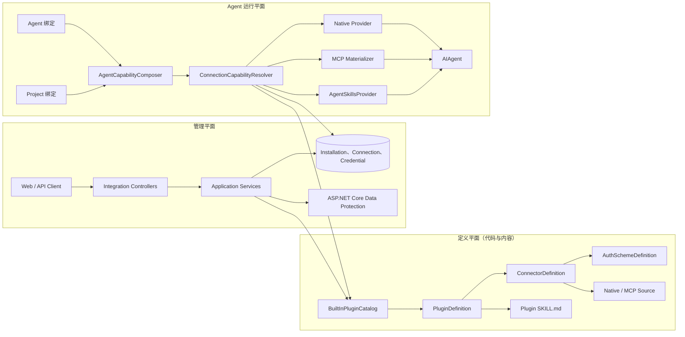
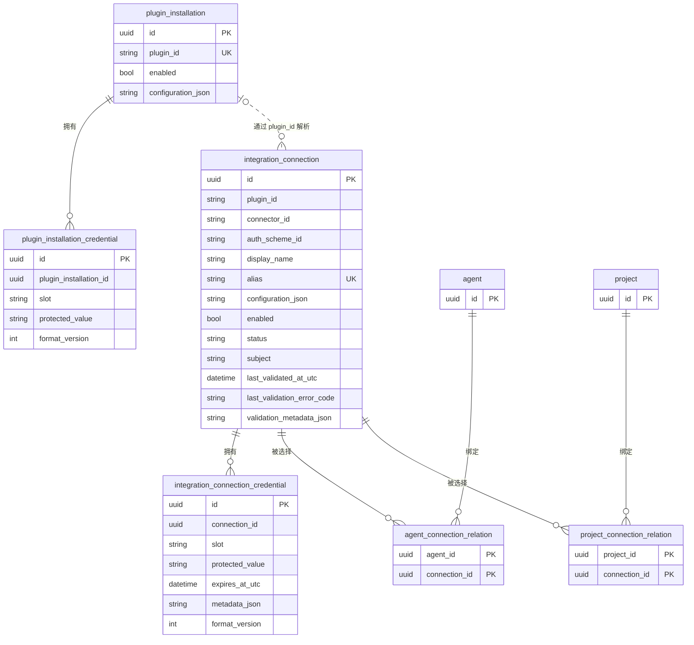
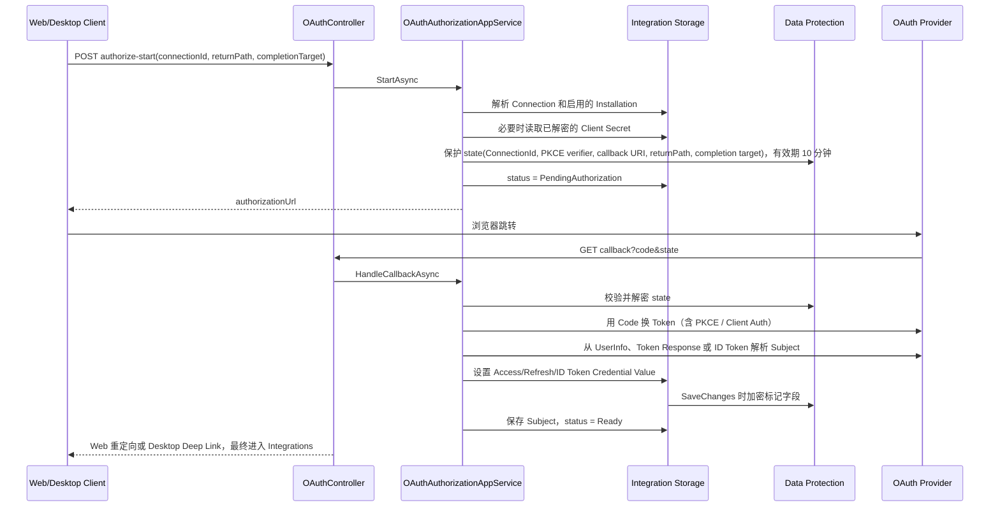
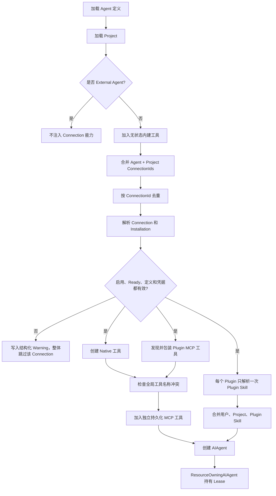

# Agw.Integrations

[English](README.md)

`Agw.Integrations` 将外部账号或服务端点转换为进程内 Agw Agent 可以选择和使用的能力。模块将稳定的集成定义与可变的安装配置、账号、凭据和绑定关系分离，使同一个 Plugin 可以承载多种协议、多种认证方式和多个账号，而不需要让 Agent Runtime 依赖某个具体厂商。

当前内建 Catalog 只有 GitHub。

## 术语与所有权

产品界面统一使用 Integration 术语：Catalog 定义显示为 **Available integrations**，用户配置的账号或服务端点显示为 **Configured integrations**。实现层保留更精确的开发者模型：

- `PluginDefinition` 是系统内置的 Integration 定义。
- `PluginInstallation` 是当前用户自己的基础设置，例如 OAuth Client ID 和 Client Secret；每个用户都可以维护独立 setup，变更只影响该用户的 Connection。
- `Connection` 是由 `CreateBy` 中稳定用户 ID 拥有的一个 Integration 配置实例；同一用户可以基于同一定义创建多个 Connection。
- `Connector` 是 Plugin 内的服务或协议变体，不是 Connection 的同义词。

Connection CRUD、OAuth、凭据读取、Agent/Project 绑定视图以及每次 Native/MCP 调用都必须校验 Owner。Alias 创建后不可修改，并且只在同一 Owner 内唯一。共享 Agent 和 Project 会为每个用户分别保留自己的 Connection 绑定叠加层。

## 设计目标

模块遵循以下原则：

| 原则 | 设计结果 |
| --- | --- |
| 定义与状态分离 | Plugin、Connector、认证方式、能力源和内建 Skill 定义位于代码或内容资产中；Installation、Connection、凭据以及 Agent/Project 绑定存储在数据库中。 |
| 精确选择一个账号 | Agent 和 Project 绑定具体的 `ConnectionId`，而不是“GitHub”这样的 Plugin 类型，因此工作账号和个人账号不会混在一起。 |
| 协议与认证方式解耦 | Connector 描述服务或协议，Auth Scheme 描述认证方式。一个 Plugin 可以有多个 Connector，每个 Connector 又可以有多个 Auth Scheme。 |
| 每个 Connection 都有工具命名空间 | Connection 工具始终使用 `{alias}__{operation}`，Alias 明确指出本次调用会使用哪个账号或端点。 |
| 尽量晚地解析凭据 | Native 和 Plugin MCP 工具在每次调用时创建新的 DI Scope，并读取最新的加密凭据；轮换凭据不需要重建 Plugin 定义。 |
| 默认关闭、不降级暴露 | 只有 `Ready` Connection 才能贡献工具和内建 Skill。定义、配置或凭据有问题时会整体跳过该 Connection，并产生结构化 Warning。 |
| 显式管理资源生命周期 | MCP Client、Transport 和能力资源由异步 Lease 持有，并在发现结束、调用结束或 Agent 释放时关闭。 |
| 不暴露秘密 | JSON API 对 Secret 字段只返回 `configured: true/false`，不会返回明文、数据库密文或第三方 Token。 |

## 当前范围

已实现：

- 静态内建 Plugin Catalog；
- OAuth 2.0 Authorization Code、API Key、AK/SK 三种定义类型；
- Schema 驱动的 Installation 和 Connection 字段；
- Installation 与 Connection 凭据的加密存储；
- 通用 Connection CRUD、状态计算、OAuth Start/Callback/Refresh 和本地校验；
- Connection 绑定的 Native 工具；
- Connection 绑定的 stdio、HTTP、SSE MCP 工具；
- 通过现有 Agent Skills Provider 加载的 Plugin Skill；
- Agent 和 Project 按 `ConnectionId` 绑定；
- GitHub OAuth 与 Native 工具。

暂未实现：

- 远程 Plugin Marketplace、下载、签名、缓存和升级；
- 执行第三方 Plugin Skill 自带的脚本；
- 向外部 Codex 或 Claude Agent 注入 Connection；
- Connection 状态变化后，实时修改一个已经创建好的 Agent 工具列表。

## 整体架构



实现涉及以下职责区域：

- `Domain/Plugins`：不可变的 Catalog 定义模型。
- `Application/Management`：Catalog 投影、Installation 配置、Connection CRUD、本地校验、Secret 变更和状态流转。
- `Application/OAuth`：授权开始、Callback、Token Exchange、Subject 解析和 Refresh。
- `Application/Credentials`：在 Scope 内读取已解密的 Installation 与 Connection Credential Value。
- `Application/Capabilities`：运行时 Connection 解析、Native/MCP 工具创建、Plugin Skill 引用、Warning 和 Lease。
- `Infrastructure/Plugins`：内建 Plugin Catalog。
- `Agw.Infrastructure/Data/Encryption`：共享的 `[Encrypted]` 数据库字段持久化。
- `Mcp`：与 EF 无关的 MCP Descriptor、工具物化和资源管理。
- `Tools`：Native Provider，目前只有 GitHub。

## 核心模型

### 定义层级

```text
PluginDefinition
├── ConnectorDefinition[]
│   ├── AuthSchemeDefinition[]
│   │   ├── InstallationFields[]
│   │   └── ConnectionFields[]
│   └── CapabilitySourceDefinition[]
│       ├── NativeCapabilitySourceDefinition
│       └── McpCapabilitySourceDefinition
└── PluginSkillDefinition[]
    └── ContentPath -> SKILL.md
```

| 概念 | 含义 |
| --- | --- |
| `PluginDefinition` | 一个带版本号的能力包，用于组合 Connector 和 Plugin Skill。它由 `IPluginCatalog` 返回，不写入数据库。 |
| `ConnectorDefinition` | 某种服务或协议变体，例如 `github-cloud`，或者同一个 Plugin 暴露的其他端点变体。 |
| `AuthSchemeDefinition` | 认证元数据和表单 Schema。当前类型为 `OAuth2`、`ApiKey`、`AkSk`。 |
| Installation Fields | 平台级共享字段，例如 OAuth Client ID 和 Client Secret。 |
| Connection Fields | 单个账号或端点自己的字段，例如 API Key、Access Key、Secret Key、Endpoint、Region。 |
| `NativeCapabilitySourceDefinition` | 通过 `Provider` Key 选择一个进程内 C# Provider。 |
| `McpCapabilitySourceDefinition` | 描述 MCP Transport，以及允许把哪些凭据注入哪些 Header 或环境变量。 |
| Capability Source `Id` | Connector 内稳定且唯一的 Source 标识。MCP 包装工具会保留这个 ID，以便真正调用时重新找到对应 Source。它不是一套语义化 Capability 分类。 |
| `PluginSkillDefinition` | 只保存安全的相对 `ContentPath`；Skill ID 和描述来自 `SKILL.md` Frontmatter 中的 `name`、`description`。 |
| `PluginInstallation` | 每个 Plugin 一条平台级配置。Connection 想要在运行时提供能力，必须能找到启用的 Installation。 |
| `Connection` | 用户拥有、Agent 可以选择的一个具体外部账号或服务端点。它固定 Plugin、Connector、Auth Scheme、显示名、Owner 内唯一且不可变的 Alias、状态、Subject 和非敏感配置。 |
| Credential | 由 Plugin Installation 或 Connection 拥有的加密值，通过稳定的 Slot 定位。 |

### 为什么以 Connection 为选择单位

Plugin 回答“系统里有什么集成能力包”，Connector 回答“使用哪个服务或协议”，Auth Scheme 回答“如何认证”，Connection 回答“这次到底调用哪个账号或端点”。

例如：

```text
Plugin: github
Connector: github-cloud
Auth scheme: oauth2

Connection A: alias = work-github     subject = company-user
Connection B: alias = personal-github subject = personal-user
```

最终会产生两套明确区分的工具：

```text
work-github__list_repositories
personal-github__list_repositories
```

系统不会依赖“取第一个 GitHub 账号”这样的隐含规则。

## 持久化模型



重要存储规则：

- `(plugin_installation.create_by, plugin_installation.plugin_id)` 唯一。多个 Connector/Auth Scheme Scope 共享同一用户的 Installation。
- Installation 的非敏感字段使用 `{connectorId}:{authSchemeId}:{fieldId}` 作为 Key，写入 `ConfigurationJson`。
- Connection 的非敏感字段直接用 Field ID 作为 Key，写入 `ConfigurationJson`。
- Secret 字段绝不会进入两种 `ConfigurationJson`。
- Installation Secret Slot 为 `field:{connectorId}:{authSchemeId}:{fieldId}`。
- Connection Secret Slot 为 `field:{fieldId}`。
- OAuth Token Slot 为 `oauth.access-token`、`oauth.refresh-token`、`oauth.id-token`。
- `(integration_connection.create_by, integration_connection.alias)` 唯一，Alias 创建后不可修改。
- 同一凭据所有者的 `(owner_id, slot)` 唯一。
- Agent 和 Project 关系表使用复合主键，因此不会出现重复绑定。
- `ValidationMetadataJson` 和 Credential 的 `MetadataJson` 是内部保留字段，不属于管理 API。

按照全局架构规范，EF Model 可以声明导航与级联关系，但 SQLite 和 PostgreSQL 的迁移生成器不得生成数据库外键约束或外键迁移操作，也不得在手写 Migration 中补加外键。因此删除 Installation、Connection、Agent 或 Project 时，Application/Infrastructure 流程负责引用完整性，`AgwDbContext` 会显式清理相关 Credential 和 Agent/Project 关系。

升级说明：`EnforceUserDataIsolation` 会保留所有非空的 `create_by`；无法从历史行恢复归属的空 Owner 回退给管理员 `1001`，而 `AgentUsage` 会优先从关联 Project owner 回填 `user_id`。Connection 和 PluginInstallation 的唯一键改为带 Owner 的复合键。多用户部署升级前应先审计空 Owner 和跨 Owner 的同名记录，必要时据外部 Owner 映射回填后再应用迁移。

## Connection 状态模型

只有 `Ready` 状态会提供工具和 Plugin Skill。

| 状态 | 含义和常见进入方式 |
| --- | --- |
| `NeedsConfiguration` | Plugin Installation 不存在、已禁用或缺少必填字段；或者 Connection 缺少必填字段。 |
| `PendingAuthorization` | OAuth Connection 没有 Access Token、正在等待授权，或者用户拒绝了授权。 |
| `Unverified` | 配置已经存在，但创建或变更后还没有完成本地校验。 |
| `Ready` | 必填配置存在、加密凭据可解密且没有过期；OAuth Callback 成功也会直接进入 Ready。 |
| `Expired` | 本地校验或运行时检查发现凭据已过期。 |
| `Invalid` | 加密值无法解密、本地数据无效、Token Exchange 失败或 Refresh 失败。 |
| `Disabled` | Connection 自身被禁用。 |
| `DefinitionUnavailable` | 当前 Catalog 已经无法解析对应 Plugin、Connector 或 Auth Scheme。 |

`POST /api/integrations/connections/validate` 做的是本地定义、必填字段、凭据解密和过期时间检查，不会调用第三方的健康检查接口。因此即使 Connection 为 `Ready`，Native/MCP 调用仍可能因为授权已撤销、权限不足、网络错误或第三方故障而失败。

修改 Installation 会让相关 Connection 失效：

- 禁用 Installation 时，该 Plugin 下所有 Connection 都不再保持 Ready；
- 缺少必填 Installation 字段时进入 `NeedsConfiguration`；
- OAuth Connection 没有 Token 时进入 `PendingAuthorization`；
- 其他情况进入 `Unverified`，等待重新校验或授权。

## 管理数据流

### Catalog 与 Installation

1. `GET /api/integrations/plugins` 读取静态 `IPluginCatalog`。
2. `PluginCatalogAppService` 把每个 Plugin 与数据库中的 Installation（如果存在）合并。
3. 返回结果包含 Connector/Auth Scheme Schema、非敏感配置和 Secret 的 `configured` 状态。
4. `PUT /api/integrations/plugin-installations` 解析目标定义，并按照 `InstallationFields` 校验输入。
5. 非敏感字段写入带 Scope 的 Installation Configuration Key。
6. Secret 使用 `Set` 时加密并写入 Credential Slot，`Keep` 保持原值，`Clear` 删除原值。
7. 相关 Connection 被重新标记，避免继续信任旧的 Ready 状态。

系统没有单独的 Installation GET API。Installation 状态被投影到 Plugin Catalog 响应中对应的 Auth Scheme 下。

### Connection 创建与更新

1. Application Service 使用 `pluginId + connectorId + authSchemeId` 从 Catalog 解析定义。
2. Alias 会转成小写，并且必须满足 lowercase kebab-case：`^[a-z0-9]+(?:-[a-z0-9]+)*$`。
3. Display Name 和 Schema 字段被校验。
4. 非敏感字段与加密 Secret 分开持久化。
5. 系统根据启用状态、Installation 是否就绪、认证类型和 Token 是否存在计算初始状态。
6. 更新时可以修改 Display Name、启用状态和字段值，但不能修改 Alias 或 Plugin/Connector/Auth Scheme 组合。

删除 Connection 时，同一 Unit of Work 会清理它的 Credential 和 Agent/Project 绑定。

### OAuth Authorization Code 流程



第三方 Provider 始终回调服务端。`Integrations:OAuth:PublicBaseUrl` 可配置服务端对外可访问的 Base URL，`Integrations:OAuth:WebBaseUrl` 可配置 Web Client 的 Base URL。Return Path 必须是安全的本地相对路径。OAuth State 的有效期是十分钟，内容包括 Connection ID、可选 PKCE Verifier、精确的 Callback URI、Return Path、Completion Target 和过期时间。Web 流程跳转到 Web Integrations 页面；Desktop 流程打开 `agw-desktop://oauth/complete`，再由应用进入 Desktop Integrations 页面。

## Agent 运行时数据流



`AgentCapabilityComposer` 合并 Agent 和 Project 的绑定，并按 `ConnectionId` 去重，随后组合：

1. `ToolRegistryService` 提供的无状态工具；
2. Connection Native 与 Plugin MCP 工具；
3. 独立持久化的 `McpServer` 工具；
4. 用户/Project Skill 与 Plugin Skill。

所有来源的工具名称都按大小写不敏感方式检查。发生冲突时抛出明确的配置错误，不采用 silent first-wins。

### Native 工具调用

Native 工具只捕获 `ConnectionId`、`ProjectId` 和由 Alias 派生的身份。每次调用都会：

1. 创建新的 DI Scope；
2. 按 Slot 读取当前 Credential；
3. 使用 Data Protection 解密；
4. 调用第三方 Provider；
5. 释放 Scope。

内建 GitHub Provider 提供：

- `{alias}__current_user`；
- `{alias}__list_repositories`；
- `{alias}__clone_repository`。

GitHub Clone 只接受 Owner、Repository 和可选的相对目标目录。目标路径必须位于 Project Workspace 内，并包含符号链接越界检查。Token 通过临时 Git Config 环境值传入，不出现在 Clone URL 或命令参数中，进程输出也会做脱敏。

### Plugin MCP 工具调用

组装 Runtime 时，Resolver 会临时物化一次 MCP Source，用于发现工具 Schema，然后立即释放发现阶段的 Client。对 Agent 暴露的包装工具只保留 Connection ID、Source ID、Operation Name 和 Schema。

Agent 真正调用包装工具时：

1. 新的 DI Scope 重新读取 Connection、Installation 和 Source Definition；
2. 解析并解密声明过的 Credential Binding；
3. 创建调用级 MCP Client 和 Transport；
4. 调用原始 MCP Operation；
5. 释放 Client 和 Transport。

因此即使 Agent Runtime 已经创建，轮换 Credential 也会从下一次 MCP 调用开始生效。

Credential Binding 规则：

- stdio MCP Source 只能向声明的环境变量名注入凭据；
- HTTP/SSE MCP Source 只能向声明的 HTTP Header 注入凭据；
- 只要 HTTP/SSE Source 绑定了凭据，Endpoint 就必须使用 HTTPS；
- Value Source 可以是 Connection Field、Installation Field 或 Connection 的 OAuth Access Token；
- Runtime 提供的环境变量/Header 不能覆盖凭据，因为凭据最后合并；
- Plugin MCP Source 不会重复创建持久化 `McpServer` 记录。

### Plugin Skill

Plugin Skill 作为程序集内容资产一起复制。Definition 只包含：

```csharp
new PluginSkillDefinition
{
    ContentPath = "Plugins/github/skills/github/SKILL.md"
}
```

`PluginSkillMetadataReader` 把以下 Frontmatter 作为唯一元数据源：

```markdown
---
name: github
description: Use connected GitHub tools to inspect and work with repositories.
---
```

路径必须是相对路径，经过真实路径和符号链接解析后仍位于 Plugin Content Root 内，并且必须指向存在的 `SKILL.md`。`name` 必须使用小写 kebab-case，`name` 和 `description` 都是必填字段。

创建 Agent 时：

- 即使同一个 Plugin 有多个 Ready Connection，也只加入一份 Plugin Skill；
- 同名时，用户/Project Skill 优先于 Plugin Skill；
- 缺失或格式错误的 Plugin Skill 会记录 Warning 并安全跳过；
- Plugin Skill 继续通过现有 `load_skill` 懒加载；
- Plugin Skill 脚本被拒绝执行，只信任 instructions 和 resources；
- Plugin Skill 不写入 `Skill`、`AgentSkillRelation` 或 `ProjectSkillRelation` 表。

## Credential 安全

Installation Secret、API Key、AK/SK、OAuth Access Token、Refresh Token 和 ID Token 全部使用加密数据库字段存储。Credential 实体的 `Value` 属性通过共享 `[Encrypted]` 标记声明。

`AgwDbContext` 在 `SaveChanges` 时加密这些属性，并只在被跟踪的实体中恢复明文；物化拦截器在读取数据库行时完成解密。`DataProtectionEncryptedDataProtector` 使用按实体隔离的 ASP.NET Core Data Protection Purpose：

```text
Agw.DatabaseFieldEncryption / v1 / entity/{table}/{entityId}
```

写入流程：

```text
API SecretValue
  -> Schema 校验
  -> Credential Value
  -> AgwDbContext 加密属性处理器
  -> 数据库密文
```

读取流程：

```text
数据库密文
  -> AgwDbContext 物化拦截器
  -> 已解密的 Credential Value
  -> 当前 Scope 内的 Provider/MCP 调用
```

运维含义：

- Data Protection Key Ring 是解密现有 Credential 的必要条件；
- 使用同一数据库的多实例部署必须持久化并共享同一套 Key Ring；
- Key Ring 丢失或实例之间不一致时，已有密文无法解密，相关 Connection 将无法继续使用；
- API 只返回 `configured`，不会返回密文、明文、环境变量引用或 Display Hint；
- 修改 Secret 时必须明确指定 `Keep`、`Set` 或 `Clear`。

## 如何使用

### Web UI

以内建 GitHub Plugin 为例：

1. 打开 `/integrations`。
2. 配置自己的 GitHub Plugin Installation，填写 OAuth Client ID 和 Client Secret。
3. 创建 Connection，填写易读的 Display Name 和不可变的小写 kebab-case Alias，例如 `work-github`。
4. 发起 OAuth Authorization，并完成第三方授权。
5. 确认 Connection 为 `Ready`；需要时可以用 Validate 重新检查本地 Credential 状态。
6. 打开 Agent 或 Project 编辑页面，选择该 Ready Connection。
7. 运行进程内 Agent。模型会看到 `work-github__list_repositories` 等工具以及 GitHub Plugin Skill。

Project 级绑定会让该 Project 中运行的所有进程内 Agent 都能使用 Connection；Agent 级绑定只影响该 Agent。Agent 和 Project 同时绑定同一个 Connection 时，只创建一套工具。

绑定更新按 Owner 隔离。请求中的 `ConnectionId` 如果不存在或属于其他用户，会按不可用处理并直接忽略，不暴露其所有权。客户端提交完整绑定列表前应刷新当前用户可用的 Integrations。

### REST API 示例

查询可用定义：

```http
GET /api/integrations/plugins
```

配置当前用户自己的 GitHub OAuth Client：

```http
PUT /api/integrations/plugin-installations
Content-Type: application/json

{
  "pluginId": "github",
  "connectorId": "github-cloud",
  "authSchemeId": "oauth2",
  "enabled": true,
  "configuration": {
    "client-id": "your-oauth-client-id"
  },
  "secrets": {
    "client-secret": {
      "action": "Set",
      "secretValue": "your-oauth-client-secret"
    }
  }
}
```

创建一个具体账号的 Connection：

```http
POST /api/integrations/connections
Content-Type: application/json

{
  "pluginId": "github",
  "connectorId": "github-cloud",
  "authSchemeId": "oauth2",
  "displayName": "Work GitHub",
  "alias": "work-github",
  "enabled": true,
  "configuration": {},
  "secrets": {}
}
```

使用返回的 Connection ID 发起授权：

```http
POST /api/integrations/oauth/authorize-start
Content-Type: application/json

{
  "connectionId": "00000000-0000-0000-0000-000000000000",
  "returnPath": "/integrations"
}
```

在浏览器中打开返回的 `authorizationUrl`。第三方会重定向到服务端 Callback；服务端加密存储 Token 后，再跳回本地 Return Path。

创建或更新 Agent/Project 时绑定 Connection：

```json
{
  "connectionIds": [
    "00000000-0000-0000-0000-000000000000"
  ]
}
```

更新 Secret 时：

```json
{
  "secrets": {
    "api-key": { "action": "Keep" },
    "secret-key": { "action": "Set", "secretValue": "rotated-value" },
    "obsolete-key": { "action": "Clear" }
  }
}
```

只接受当前 Auth Scheme 明确定义过的字段。

## API 列表

| Method | Route | 用途 |
| --- | --- | --- |
| GET | `/api/integrations/plugins` | 查询 Plugin 定义和投影后的 Installation 状态。 |
| PUT | `/api/integrations/plugin-installations` | 创建或更新当前用户 Plugin Installation 中的一个 Connector/Auth Scheme Scope。 |
| GET | `/api/integrations/connections?id={id}` | 查询全部 Connection，或按 Query ID 查询一个。 |
| POST | `/api/integrations/connections` | 创建 Connection。 |
| PUT | `/api/integrations/connections` | 更新可变 Connection 字段；Alias 和定义组合保持不变。 |
| DELETE | `/api/integrations/connections?id={id}` | 删除 Connection 及其 Credential/绑定。 |
| POST | `/api/integrations/connections/validate` | 重新计算本地定义、配置、解密和过期状态。 |
| GET | `/api/integrations/oauth/callback-info` | 返回需要在第三方 Provider 注册的、由服务端确定的 Callback URL。 |
| POST | `/api/integrations/oauth/authorize-start` | 生成 Authorization URL 和受保护 State。 |
| GET | `/api/integrations/oauth/callback` | 处理第三方重定向，再把完成结果交给发起流程的 Web 或 Desktop Client。 |
| GET | `/api/integrations/oauth/desktop-complete` | 在系统浏览器中把 Desktop 完成结果桥接到 Desktop Deep Link。 |
| POST | `/api/integrations/oauth/refresh` | 刷新定义中声明支持 Refresh 的 OAuth Connection。 |

所有 JSON API 都返回 Bens.Results Envelope；OAuth Callback 是协议要求的重定向响应。`AuthSchemeType`、Status、Secret Action、Transport Kind、Binding Target 等枚举都以字符串序列化。

## 如何扩展

### 1. 添加 Plugin 和 Connector

当前所有可用 Plugin 都定义在 [`BuiltInPluginCatalog`](Infrastructure/Plugins/BuiltInPluginCatalog.cs)。可以直接在其中添加 `PluginDefinition`，也可以用另一个进程内实现替换 `IPluginCatalog`。

ID 应当保持稳定。Catalog ID 必须以字母开头，可以使用字母数字组成的 kebab-case 段，并且在各自 Scope 内按大小写不敏感方式保持唯一。

### 2. 定义认证字段

用户 setup 共享字段放在 `InstallationFields`，账号或端点自己的字段放在 `ConnectionFields`：

```csharp
new AuthSchemeDefinition
{
    Id = "ak-sk",
    DisplayName = "Access key / Secret key",
    Type = AuthSchemeType.AkSk,
    ConnectionFields =
    [
        new FormFieldDefinition
        {
            Id = "access-key",
            Label = "Access key",
            Type = FormFieldType.Secret,
            IsRequired = true
        },
        new FormFieldDefinition
        {
            Id = "secret-key",
            Label = "Secret key",
            Type = FormFieldType.Secret,
            IsRequired = true
        },
        new FormFieldDefinition
        {
            Id = "endpoint",
            Label = "Endpoint",
            Type = FormFieldType.Url,
            IsRequired = true
        }
    ]
}
```

`Text`、`Url` 字段进入 `ConfigurationJson`，`Secret` 字段进入加密 Credential 表。如果某个协议需要 `OAuth2`、`ApiKey`、`AkSk` 以外的认证模型，应当新增明确的 Auth Scheme Type 和对应校验，不要借用一个语义不匹配的类型。

### 3A. 添加 Native Provider

先声明 Source：

```csharp
new NativeCapabilitySourceDefinition
{
    Id = "example-native",
    Provider = "example"
}
```

然后实现 `IConnectionNativeCapabilityProvider`：

```csharp
public sealed class ExampleConnectionNativeCapabilityProvider
    : IConnectionNativeCapabilityProvider
{
    public string Provider => "example";

    public IReadOnlyList<AITool> CreateTools(
        ConnectionNativeCapabilityContext context)
    {
        // 所有工具名称都必须以 $"{context.Alias}__" 开头。
        // 工具只捕获 ID；每次调用新建 DI Scope，再读取当前 Credential。
        throw new NotImplementedException();
    }
}
```

最后在 `AddIntegrations` 中注册。运行时通过 Source 的 `Provider` Key 选择实现。不要把 Token 放入工具闭包、URL、参数、日志或返回值。

### 3B. 添加 MCP Source

这条路径不需要修改 Agent Runtime，只需要声明 Transport 和 Credential Binding：

```csharp
new McpCapabilitySourceDefinition
{
    Id = "example-mcp",
    Transport = new StdioMcpTransportDefinition
    {
        Command = "example-mcp-server"
    },
    CredentialBindings =
    [
        new CredentialBindingDefinition
        {
            ValueSource = new ConnectionFieldCredentialValueSourceDefinition
            {
                AuthSchemeId = "ak-sk",
                FieldId = "access-key"
            },
            Target = CredentialBindingTarget.EnvironmentVariable,
            TargetName = "SERVICE_ACCESS_KEY"
        },
        new CredentialBindingDefinition
        {
            ValueSource = new ConnectionFieldCredentialValueSourceDefinition
            {
                AuthSchemeId = "ak-sk",
                FieldId = "secret-key"
            },
            Target = CredentialBindingTarget.EnvironmentVariable,
            TargetName = "SERVICE_SECRET_KEY"
        }
    ]
}
```

HTTP/SSE 必须使用 `HttpHeader` Target；只要绑定了 Credential 就必须使用 HTTPS。Catalog Validator 会拒绝未知 Auth Scheme/Field、重复 Target、非法 Target Name、错误的 Transport/Target 组合、不安全 Prefix，以及绑定 Credential 的非 HTTPS Endpoint。

### 4. 添加 Plugin Skill

把内容放在 `Plugins/{plugin}/skills/{skill}/`：

```text
Plugins/
└── example/
    └── skills/
        └── example/
            ├── SKILL.md
            └── references/
```

Plugin Definition 只填写 Content Path。项目文件已经配置将 `Plugins/**` 复制到 Build 和 Publish 输出。不要在第三方 Plugin Skill 中依赖脚本执行，因为运行时会明确拒绝。

### 5. 校验和测试

`BuiltInPluginCatalog` 在构造时执行 `PluginCatalogValidator`。校验范围包括：

- Plugin、Connector、Auth Scheme、Field、Source ID 的格式和重复；
- 缺失 Display Name、无效 Enum 和不支持的 Transport；
- OAuth Endpoint、字段映射、Subject Resolution 和保留的 Authorize Parameter；
- 不安全的 Skill Path；
- MCP Transport、Target、Credential Source、Target Name、Prefix 和 HTTPS 规则。

运行时还会检查 `{alias}__` 前缀，并检测所有来源之间的工具名称冲突。

执行：

```bash
dotnet test tests/Agw.Integrations.Tests/Agw.Integrations.Tests.csproj
dotnet test Agw.slnx
```

如果修改了 API Request/Response，还需要重新生成 Web OpenAPI 文件：

```bash
cd src/clients
pnpm gen:api
pnpm lint
pnpm build
```

## 关键代码入口

- [内建 Plugin 列表](Infrastructure/Plugins/BuiltInPluginCatalog.cs)
- [Catalog 校验](Application/Plugins/PluginCatalogValidator.cs)
- [Connection 管理](Application/Management/ConnectionAppService.cs)
- [Installation 管理](Application/Management/PluginInstallationAppService.cs)
- [OAuth 流程](Application/OAuth/OAuthAuthorizationAppService.cs)
- [数据库字段加密](../Agw.Infrastructure/Data/Encryption/DataProtectionEncryptedDataProtector.cs)
- [运行时能力解析](Application/Capabilities/ConnectionCapabilityResolver.cs)
- [MCP 工具物化](Mcp/McpToolMaterializer.cs)
- [Plugin Skill 元数据](Application/Capabilities/PluginSkillMetadataReader.cs)
- [GitHub Native Provider](Tools/GitHub/GitHubConnectionNativeCapabilityProvider.cs)
- [模块依赖注入](Extensions/DependencyInjection.cs)
