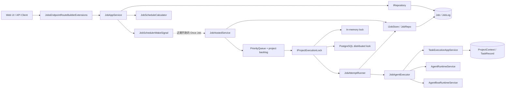
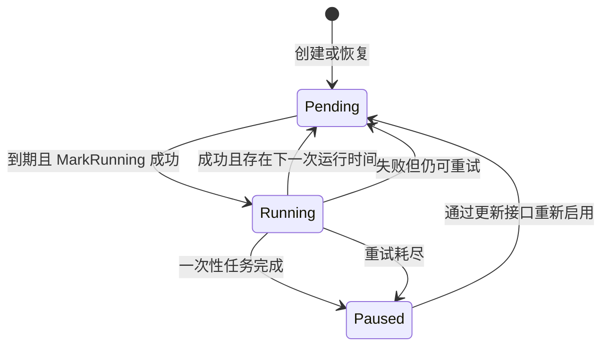

# Agw.Jobs

`Agw.Jobs` 是 Agw 的持久化任务调度模块。它把数据库中的 `Job` 转换为 Agent 或 Agentflow 执行：数据库负责保存任务状态和运行记录，内存优先队列负责到点唤醒，项目级锁负责串行化同一项目的定时任务，`Agw.Projects` 和 `Agw.Agents` 则负责创建逻辑任务并真正执行 Agent。

这个边界很重要：`Agw.Jobs` 不是独立的通用消息队列，也不直接拥有 EF Core 实现或 Agent runtime。维护调度行为时，需要同时理解 `Agw.Jobs`、`Agw.Infrastructure`、`Agw.Projects` 和 `Agw.Agents` 之间的协作关系。

## 设计目标

- **持久化调度状态**：Host 重启后，可以从数据库重新预取尚未执行的任务。
- **兼顾持久性和调度精度**：数据库保存事实状态，进程内 `PriorityQueue` 按 `NextRunTime` 等待和派发。
- **按项目串行执行**：同一项目的定时任务依次运行，不同项目可以并行运行。
- **统一执行入口**：定时任务最终创建普通的项目 Task 和 Context，再复用 Agent 或 Agentflow runtime。
- **记录重试和历史**：每次尝试都会更新 `Job` 状态，并写入 `JobLog`。
- **保持时间语义一致**：调度计算基于 `TimeProvider` 和 UTC，API 时间值使用带时区的 RFC 3339 字符串。

## 模块边界

| 职责 | 所在位置 |
| --- | --- |
| Job CRUD 和用例协调 | `Agw.Jobs.Application` |
| Minimal API 端点和请求/响应 DTO | `Agw.Jobs.Api`、`Agw.Jobs.Contracts` |
| 触发时间计算、调度快照和持久化端口 | `Agw.Jobs.Scheduling` |
| 预取、内存排队、唤醒和按项目派发 | `Agw.Jobs.Scheduling.Coordination` |
| 单次执行状态迁移、日志和重试 | `Agw.Jobs.Scheduling.Attempts` |
| Agent / Agentflow 执行适配 | `Agw.Jobs.Execution` |
| `Job`、`JobLog`、状态和触发器实体 | `Agw.Data/Entities/Jobs` |
| EF Core 仓储和 `IJobStore` 实现 | `Agw.Infrastructure.Repositories.JobRepo` |
| 内存锁、PostgreSQL 分布式锁和锁路由 | `Agw.Infrastructure.Jobs` |
| 项目 Task、Context 及执行状态 | `Agw.Projects` |
| Agent 和 Agentflow runtime | `Agw.Agents` |

`Agw.Jobs` 定义 `IJobStore` 和 `IProjectExecutionLock` 等所需端口，具体基础设施由 `Agw.Infrastructure` 提供。这样调度器不依赖 EF Core 或 PostgreSQL 锁的实现细节。

## 总体架构



### 主要组件

#### `JobsEndpointRouteBuilderExtensions`

通过 `MapJobsApi()` 注册 `/api/jobs` 下的 CRUD 和执行日志查询端点。所有响应都使用 `AgwApiResult`，因此客户端收到的是 Bens.Results 响应封装，而不是裸 JSON 模型。

#### `JobAppService`

负责创建、查询、更新和删除 Job。创建或更新时，它通过 `JobScheduleCalculator` 从当前 UTC 时间计算 `NextRunTime`。名称为空时，会生成 `job-{序号}-{yyyyMMdd}` 格式的名称。

创建成功后会调用 `JobSchedulerWakeSignal.NotifyCreated`。当前只有已启用、状态为 `Pending` 且即将在一分钟内执行的 `Once` Job 会唤醒预取循环；其他任务和更新操作由周期性预取发现。这里使用的是模块内的调度协作信号，不是领域事件总线。

#### `JobHostedService`

这是调度核心。服务会先等待 Agw 完成初始化，然后同时运行两个循环：

- 预取循环每分钟查询一次未来 10 分钟内的可执行 Job；
- 执行循环从内存优先队列取出到期 Job，再按 `ProjectId` 派发。

内存中的 `_jobMap` 为每个 Job 保存最新版本，优先队列里的旧版本会在出队时惰性丢弃。`_runningProjects` 和 `_projectBacklog` 保证单个进程内同一项目只有一条执行链。

这些时间窗口目前是代码常量：预取间隔 1 分钟、预取窗口 10 分钟、重试间隔 30 秒，没有对应的 `appsettings.json` 配置项。

#### `JobAttemptRunner`

负责一次 Job 尝试的完整状态迁移：认领 `Pending` Job、调用执行适配器、计算下一次运行时间、写入成功或失败日志，并返回“重新入队”或“丢弃”结果。`JobHostedService` 因此只保留调度和队列职责。

#### `JobAgentExecutor`

每次运行都会生成新的 `contextId`，并通过 `TaskExecutionAppService.CreateRunningAsync` 创建项目 Task。随后根据 `AgentType` 选择执行入口：

- `AgentRuntimeType.Agent`：调用 `IAgentRuntimeService.ExecuteByIdAsync`；
- `AgentRuntimeType.Agentflow`：调用 `IAgentflowRuntimeService.ExecuteAsync`。

执行成功后，项目 Task 标记为成功；发生异常时，项目 Task 标记为失败，异常继续交给调度器处理重试。Job 没有 `AgentId` 或 `AgentType` 时，创建接口仍可保存它，但真正执行时会失败。

#### `JobRepo`

`JobRepo` 同时实现通用的 `IRepository<Job>` 和调度专用的 `IJobStore`。前者供 CRUD 使用，后者封装预取、状态迁移和日志落库，避免调度代码直接操作 `DbContext`。

## 数据模型与状态

### `Job`

| 字段 | 作用 |
| --- | --- |
| `ProjectId` | 本次执行所属项目，也是串行化执行的分组键 |
| `AgentType` / `AgentId` | 目标类型和目标 Agent 或 Agentflow 标识 |
| `Prompt` | 传给目标 runtime 的输入；为空时使用 Job 名称生成默认提示词 |
| `TriggerType` / `TriggerValue` | 触发器类型和对应的字符串配置 |
| `NextRunTime` | 下一次执行时间，由服务端计算 |
| `Status` / `IsEnabled` | 调度状态和总开关 |
| `RetryCount` / `MaxRetryCount` | 当前失败重试次数和允许的最大重试次数 |
| `LastError` | 最近一次执行错误 |

`JobStatus` 包含三个值：`Pending = 1`、`Running = 2`、`Paused = 3`。

正常状态流如下：



一次性 Job 成功后会被设为 `Paused` 并关闭 `IsEnabled`。周期 Job 成功后回到 `Pending`，清空 `RetryCount` 和 `LastError`，并保存新的 `NextRunTime`。失败且仍可重试时，Job 在 30 秒后重新进入队列；重试耗尽后会暂停并禁用。

`MaxRetryCount` 表示首次尝试之后还能重试多少次。例如值为 `3` 时，最多发生 1 次首次尝试和 3 次重试。

### `JobLog`

进入执行阶段的每次尝试都会写入一条日志，包含开始/结束时间、成功状态、尝试序号和错误信息。数据库实体还保存内部 `TaskId`，查询 API 会通过 `TaskRecord` 和 `ProjectContext` 将它转换为对外的 `ContextId`，不会直接暴露 `TaskId`。

## 核心数据流

### 1. 创建或更新 Job

1. 客户端调用 `POST /api/jobs` 或 `PUT /api/jobs/{id}`；
2. `JobAppService` 规范化名称，并根据触发器计算 `NextRunTime`；
3. Job 和审计字段写入数据库；
4. 创建操作通知 `JobSchedulerWakeSignal`；
5. 已启用且近期执行的 `Once` Job 会唤醒预取循环，其他 Job 等待下一轮周期预取。

更新和删除当前不会向调度器派发专用事件。仍位于预取窗口内的更新会在下一次预取时用版本号替换旧内存项；禁用、暂停或删除的 Job 会在执行前重新检查持久化状态并丢弃。但如果只是把 `NextRunTime` 移到预取窗口之外，旧内存项不会因此立即失效。因此不要把更新接口理解为对内存队列的同步修改；需要严格的即时改期或取消语义时，应先补充对应事件和队列失效机制。

### 2. 预取与到期派发

1. `JobRepo.PrefetchAsync` 查询 `IsEnabled = true`、`Status = Pending` 且 `NextRunTime` 位于预取窗口内的 Job；
2. `JobHostedService` 把它们写入 `_jobMap`，并按 `NextRunTime` 加入 `PriorityQueue`；
3. 执行循环等待最早的 Job 到期；
4. 同一项目已有 Job 运行时，新 Job 进入该项目的 backlog；
5. 获得 `IProjectExecutionLock` 后，调度器调用 `JobAttemptRunner`；
6. `JobAttemptRunner` 通过 `MarkRunningAsync` 再次确认持久化状态，确认成功后进入 Agent 执行流程。

项目锁只保证同一项目的定时任务不会并发运行，不等同于持久化消息队列的 exactly-once 投递保证。需要严格一次性语义时，还需要基于数据库租约、幂等键或原子认领设计额外机制。

### 3. Agent 执行

1. `JobAgentExecutor` 为本次运行生成独立 `contextId`；
2. 在目标项目中创建状态为 Running 的逻辑 Task，执行用户记为 `job-executor`；
3. 根据 `AgentType` 调用 Agent 或 Agentflow runtime；
4. runtime 成功后将项目 Task 标记为成功；
5. runtime 抛出异常时将项目 Task 标记为失败，并把异常交回调度器。

所以 Job 执行历史既存在于 `JobLog` 中，也会以普通项目 Task 和 Context 的形式进入项目历史。`JobLog` 负责描述“第几次调度尝试”，项目记录负责保存实际对话和执行内容。

### 4. 成功、重试与失败

执行成功时，`JobAttemptRunner` 重新计算下一次运行时间：

- 仍有下一次运行时间：Job 回到 `Pending` 并重新入队；
- 没有下一次运行时间：Job 设为 `Paused` 且禁用，常见于 `Once`；
- 无论哪种情况，都会写入成功日志。

执行失败时：

- `RetryCount <= MaxRetryCount`：保存错误，30 秒后重试，并写入失败日志；
- 超过上限：保存最后错误，将 Job 暂停并禁用，再写入失败日志。

## 使用方式

### 在 Host 中注册

`Agw.Host` 已在组合根中注册所需模块：

```csharp
builder.Services
    .AddAgents(builder.Configuration)
    .AddInfrastructure(builder.Configuration)
    .AddJobs(builder.Configuration)
    .AddProjects(builder.Configuration);
```

如果在其他 Host 中复用 `Agw.Jobs`，除了 `AddJobs`，还必须提供 `IJobStore`、`IProjectExecutionLock`、项目执行服务、Agent runtime、`TimeProvider` 和服务器初始化状态。当前标准实现由 `Agw.Infrastructure`、`Agw.Projects` 和 `Agw.Agents` 注册。

### 通过 Web UI 使用

启动后端和 Web 客户端后，打开 `http://localhost:3000/jobs`。页面支持创建、查看、编辑、删除 Job，以及查看最近执行记录。

```bash
# 仓库根目录
dotnet run --project src/server/Agw.Host

# 另一个终端，从 Web 客户端目录运行
cd src/clients/web
pnpm dev
```

Web 客户端会把 `/api/*` 代理到后端；默认后端地址是 `http://localhost:5015`。

### 通过 REST API 使用

Job API 受 Host 认证边界保护。下面使用 API Token，避免基于 Cookie 或本地可信身份调用写接口时还需要携带 CSRF Token。

创建一个每天 UTC 01:00 运行的 Agent Job：

```bash
curl 'http://localhost:5015/api/jobs' \
  --request POST \
  --header 'Authorization: Bearer agw_...' \
  --header 'Content-Type: application/json' \
  --data '{
    "projectId": "11111111-1111-1111-1111-000000000001",
    "agentType": 0,
    "agentId": "22222222-2222-2222-2222-000000000001",
    "name": "daily-summary",
    "prompt": "Summarize the latest project progress.",
    "triggerType": 3,
    "triggerValue": "0 1 * * *",
    "maxRetryCount": 3,
    "isEnabled": true
  }'
```

常用接口：

| 方法与路由 | 作用 |
| --- | --- |
| `GET /api/jobs` | 按 `NextRunTime` 列出 Job |
| `GET /api/jobs/{id}` | 查询单个 Job |
| `GET /api/jobs/{id}/logs` | 查询 Job 执行日志，按开始时间倒序返回 |
| `POST /api/jobs` | 创建 Job |
| `PUT /api/jobs/{id}` | 完整更新 Job 并重新计算下一次执行时间 |
| `DELETE /api/jobs/{id}` | 删除 Job |

查询日志：

```bash
curl 'http://localhost:5015/api/jobs/33333333-3333-3333-3333-000000000001/logs' \
  --header 'Authorization: Bearer agw_...'
```

更新接口使用 `JobUpdateRequest`，除了创建字段还必须传入 `status`。恢复暂停任务时，通常需要同时设置 `status: 1`、`isEnabled: true`，并保证触发器仍能计算出未来时间。

### 触发器格式

| `triggerType` | 名称 | `triggerValue` 示例 | 说明 |
| --- | --- | --- | --- |
| `1` | Once | `2026-07-16T09:00:00Z` | 应使用可解析、晚于当前时间且带时区的 RFC 3339 时间 |
| `2` | Interval | `00:15:00` | 使用 .NET `TimeSpan` 格式，且必须大于零 |
| `3` | Cron | `0 1 * * *` | Cronos 标准 5 段表达式，按 UTC 计算 |

过去的 `Once` 时间不会立即执行。创建或更新时，当前实现会把无法得到下一次运行时间的 Job 设为 `DateTimeOffset.MaxValue`，所以创建或恢复一次性任务时应始终传入未来时间。

`agentType` 使用 `0` 表示 Agent，`1` 表示 Agentflow。`agentId` 必须指向对应类型且可用的目标，否则 Job 会在执行阶段失败并进入重试流程。

### 配置项目级锁

默认配置位于 `Agw.Host/appsettings.json`：

```json
{
  "Database": {
    "Provider": "sqlite",
    "ConnectionString": "Data Source=agw.db"
  },
  "DistributedLock": {
    "Provider": null,
    "ConnectionString": ""
  }
}
```

`DistributedLock:Provider` 为空时，会跟随数据库类型：

| 数据库 | 默认锁实现 |
| --- | --- |
| SQLite | `inmemory`，只在当前进程内有效 |
| PostgreSQL | `postgres`，使用 PostgreSQL advisory lock |

显式使用独立 PostgreSQL 锁库时，可以配置：

```json
{
  "DistributedLock": {
    "Provider": "postgres",
    "ConnectionString": "Host=locks;Database=agw_locks;Username=agw;Password=..."
  }
}
```

PostgreSQL 模式的锁名是 `agw:jobs:project-lock:{projectId}`。连接字符串为空时复用 `Database:ConnectionString`。`inmemory` 和 `postgres` 是当前仅支持的两个 provider；多实例部署不能使用 `inmemory` 来协调不同进程。

## 扩展点

| 需求 | 扩展位置 |
| --- | --- |
| 增加或修改触发器计算 | `JobScheduleCalculator` |
| 更换持久化实现 | `IJobStore` |
| 更换项目锁实现 | `IProjectExecutionLock` |
| 改变 Agent 执行适配 | `IJobAgentExecutor` |
| 修改单次执行、日志或重试流程 | `JobAttemptRunner` |
| 修改创建后的预取唤醒条件 | `JobSchedulerWakeSignal` |
| 让更新、删除即时影响调度队列 | `JobHostedService` 的队列失效协议（当前尚未实现） |

新增触发器时，还要同步更新 `TriggerType`、API 契约、Web 表单、OpenAPI 生成类型和测试。预期的配置或应用失败应使用 `AgwException` 与已有 `ErrorCodes`，不要在后台循环中引入无法稳定识别的通用异常。

## 测试

从仓库根目录运行：

```bash
dotnet test tests/Agw.Jobs.Tests/Agw.Jobs.Tests.csproj
```

只验证模块编译：

```bash
dotnet build src/server/Agw.Jobs/Agw.Jobs.csproj
```

现有测试覆盖 Minimal API 响应封装、Job 名称生成、触发时间计算、创建唤醒条件、单次执行的成功与重试状态迁移、`JobRepo` 日志持久化、锁配置解析、内存项目锁和锁路由。修改 `JobHostedService` 的预取、排队或按项目串行逻辑时，仍应补充对应的调度宿主测试。

## 常见问题

- **Job 一直不执行**：检查 Host 是否完成初始化、`IsEnabled` 是否为 `true`、`Status` 是否为 `Pending`、`NextRunTime` 是否在未来，以及目标 Agent/Agentflow 是否存在并可运行。
- **Cron 时间与预期不一致**：Cron 表达式固定按 UTC 计算，时区转换应由客户端处理。
- **创建成功但运行后失败**：创建接口不会提前验证 Agent 目标是否完整；缺少或无效的 `AgentType`、`AgentId` 会在执行阶段进入失败和重试流程。
- **更新后没有立刻改期**：更新不会直接修改内存队列，通常要等下一轮预取。对严格即时取消或改期有要求时，需要扩展调度信号和队列失效机制。
- **多实例仍使用内存锁**：`inmemory` 只能协调单个进程。共享 PostgreSQL 数据库的多实例部署应使用 `postgres` 锁 provider。
- **把项目锁当作 exactly-once**：项目锁解决的是同项目并发，不是消息去重或分布式任务认领。外部副作用仍应设计幂等性。
- **误解重试次数**：`MaxRetryCount` 不包含首次尝试；总尝试上限是 `1 + MaxRetryCount`。

简单来说，`Agw.Jobs` 的运行链路是“数据库持久化 → 窗口预取 → 内存定时 → 项目级串行 → 项目 Task → Agent/Agentflow → 状态与日志回写”。排查问题时沿着这条链逐层确认，通常比只盯着 Job 表或内存队列更有效。
