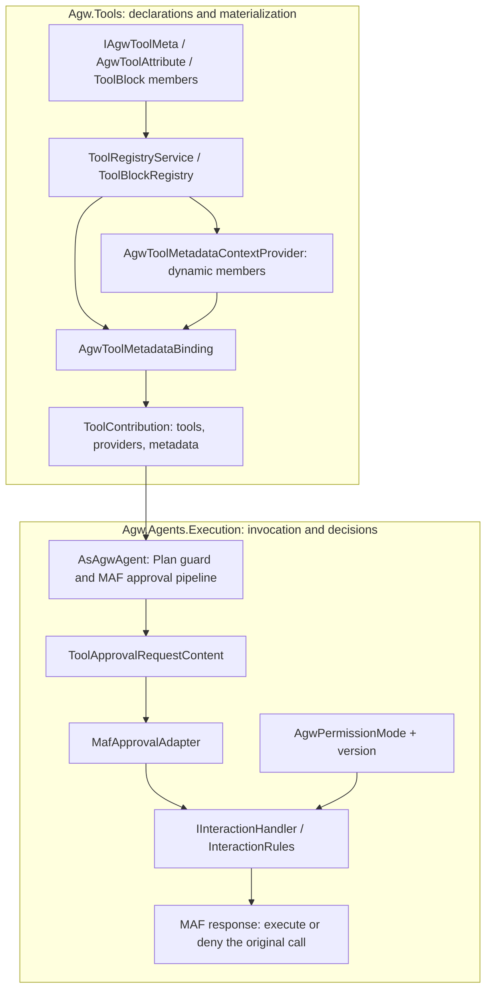
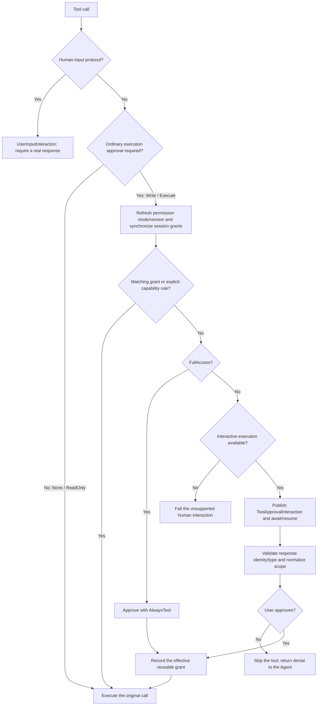
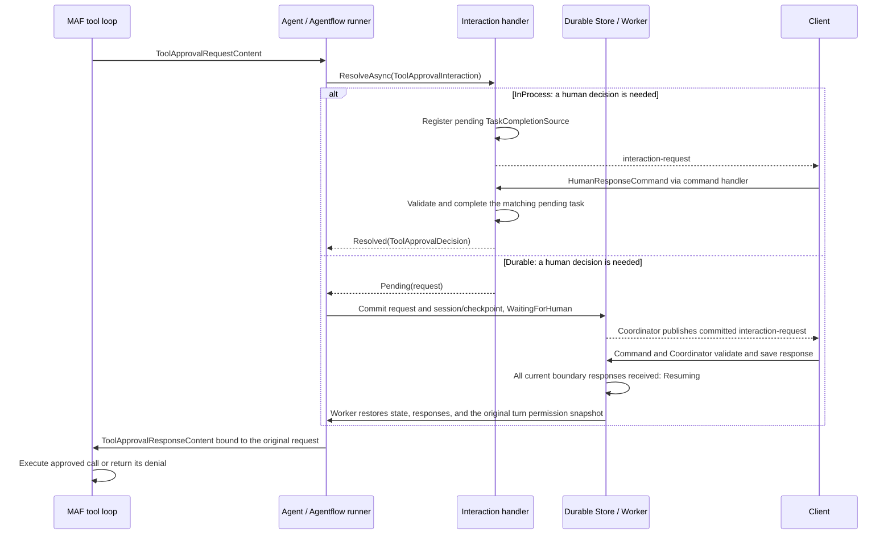

# Agw.Tools

`Agw.Tools` owns the built-in Tool catalog and the runtime materialization of
Tools and Tool Blocks.

## Capability model

```text
Tool Capability
├── Tool       independently selectable
└── ToolBlock  atomic group of member Tools
```

A Tool exposes one callable operation to the model and can be added or removed
independently. A ToolBlock represents a coherent group of Tools whose behavior
and state must stay consistent. Its member Tools are therefore selected,
materialized, and removed as one unit.

Current Tool Blocks:

- `todo`: `todos_add`, `todos_list`, `todos_complete`, and related Todo tools.
- `mode`: `mode_get` and `mode_set`.
- `project-memory`: Agw project-memory tools backed by the database or
  `<Project.Workspace>/.agw/memory`. The same project shares memory across
  agents and conversations; filesystem-backed memory is shared when Projects
  point to the same Workspace.
- `user-memory`: database-only Markdown memory bound to the authenticated user.
  It follows that user across Agents, Projects, and conversations without being
  visible to other users.
- `file-access`: Harness file-access tools bound to the turn's directory snapshot. Optional `directoryId` selects an additional Project directory; omission uses the primary `Project.Workspace`. Project Memory remains in the primary directory. Docker Shell mounts additional roots at `/project-directories/{id}` and reports these paths in its context.
- `background-agents`: one-level background delegation tools.
- All `background-agents` members declare `ReadOnly` and require no parent-tool approval, including starting, continuing, and clearing tasks. Plan-mode availability remains independently declared.

Context-aware standalone Tools:

- `web_search`: uses the provider-hosted marker when supported and otherwise
  materializes Agw local search with a `tool-warning`.
- `run_shell`: materializes the configured local or Docker shell executor and
  its context provider. It remains independently selectable.

`WebSearchContextualTool` is the single registered entry point and owns permission
declarations, search selection, and AI function creation. The internal
`LocalWebSearchExecutor` in `Impl/ContextualTools/WebSearch` handles HTTP requests, search-provider
fallback, and result parsing without implementing a tool registration interface.
Request and response types live in `Contracts/WebSearch`.

The existing `bash` and `powershell` Tools remain ordinary standalone Tools.

## Data and selection

Agent and Project definitions use one strongly typed `tools` field:

```json
[
  {
    "kind": "tool",
    "definition": {
      "name": "web_search",
      "options": {}
    }
  },
  {
    "kind": "toolBlock",
    "definition": {
      "name": "project-memory",
      "options": {
        "storage": "database"
      }
    }
  },
  {
    "kind": "toolBlock",
    "definition": {
      "name": "user-memory",
      "options": {}
    }
  }
]
```

- The outer `ToolValueObject` is polymorphic on `kind`: `tool` or
  `toolBlock`.
- The nested `definition` is polymorphic on `name` and resolves to a concrete
  `ToolDefinition` or `ToolBlockDefinition`.
- `options` is always required and is always a JSON object; parameterless
  definitions use `{}`.
- Agent and Project values are merged by `definition.name`; a Project
  definition replaces the Agent definition with the same name.
- `null` and `[]` both mean that the current layer adds nothing.
- `background-agents` is Agent-only.
- New Agents and Projects start with an empty `tools` list.
- Legacy database values such as `["web_search"]` are read as typed Tool
  values and are written back in the new shape on the next save. Unknown
  legacy names fail instead of being ignored.

ToolBlock member names never appear as selectable catalog items. Selecting a
member such as `todos_add` as a standalone Tool fails with an error directing the
caller to its owning ToolBlock.

## Catalog

`GET /api/tools` is the single catalog interface. All three catalog endpoints
return [`ToolLiteInfo`](Contracts/ToolLiteInfo.cs) through Bens.Results envelopes.
The response retains identity, display/category, member names, selection scopes,
workspace requirements, and permission/approval metadata. It omits `typeName`,
`parameters`, `isAsync`, and `timeoutMs`; the Registry retains the original
`ToolInfo` internally, and model-facing schemas and runtime approval are unchanged.

The catalog returns both kinds (selected fields shown below):

```json
{
  "kind": "toolBlock",
  "name": "todo",
  "displayName": "Todo",
  "memberToolNames": ["todos_add", "todos_list", "todos_complete"],
  "scopes": 3,
  "requiresWorkspace": false
}
```

`kind` is either `tool` or `toolBlock`. `/api/tools/by-category` and
`/api/tools/{name}` use the same shape. There is no separate ToolBlock endpoint.
`ExcludeToolFromListAttribute` removes an attributed Tool or ToolBlock from
`GET /api/tools` and `/api/tools/by-category`; direct lookup and runtime use remain available.

## Runtime architecture

```text
Agent + Project definitions
          |
          v
AgentCapabilityComposer
  |-- ToolRegistryService -------- ordinary and contextual Tools
  |-- ToolValueResolution -------- Agent/Project merge by definition.name
  |-- ToolBlockRegistry ---------- atomic Tool Blocks
  |-- Connections / MCP / Skills
          |
          v
ToolContribution
  |-- Tools
  |-- ContextProviders
  |-- LoopEvaluators
  |-- AutoApprovalRules
  |-- Warnings
  `-- owned IAsyncDisposable resources
          |
          v
AsAgwAgent
```

`ToolContribution` is the common runtime result for both standalone contextual
Tools and ToolBlocks. The composer flattens its Tools for model invocation and
passes the remaining providers, evaluators, approval rules, and warnings into
the Agent pipeline.

An aggregate contribution owns its child contributions. Resources are released
in last-in, first-out order when the Agent capability lease is disposed. If
materialization fails, already-created contributions are still disposed.

### Tool calls and automatic context compaction

Context compaction is not owned by a Tool or ToolBlock. The `AsAgwAgent`
pipeline in `Agw.Agents` applies it uniformly to Definition Agents. Each model
provides two limits through `AgwAiModel`:

- `MaxContextWindowTokens`: the total context window for one model call,
  including input context and reserved output;
- `MaxOutputTokens`: the maximum tokens generated by one response, also passed
  through `ChatOptions.MaxOutputTokens`.

The compaction strategy calculates the effective input budget as:

```text
InputBudget = MaxContextWindowTokens - MaxOutputTokens
```

The MAF core `ContextWindowCompactionStrategy` uses its default thresholds
against that budget. At 50%, it compacts older Tool call/result content. At
80%, it truncates older messages. A Tool call and its corresponding result are
treated as an atomic message group and are never retained independently. The
framework uses an estimated token count, which is not equivalent to character
count and may differ slightly from the provider's final token accounting.

With the defaults of `256_000 / 64_000`, the effective input budget is
`192_000`, so the two thresholds are approximately `96_000` and `153_600`
input tokens. The Compaction Provider runs inside the function-invocation loop
and after per-service-call history persistence, so every model request before
and after a Tool invocation re-evaluates the budget. Compaction changes only
the request sent to the model: EF Core retains the complete original history,
while compaction state is persisted through `AgentSession.StateBag`. External
Agents and one-shot summary clients do not use this pipeline.

Name validation occurs at catalog construction and runtime composition:

- duplicate Tool names fail;
- duplicate ToolBlock names fail;
- duplicate member ownership fails;
- a ToolBlock name cannot collide with a Tool or member name;
- Tools contributed by Connections, MCP servers, contextual Tools, and
  ToolBlocks cannot collide.

## Core types

Concrete implementations are grouped under `Impl/Tools` (ordinary and attributed
Tools), `Impl/ContextualTools`, and `Impl/ToolBlocks`. Specialized executors and
providers stay with their group; shared ToolBlock storage adapters live in
`Impl/ToolBlocks/Storage`.

- `IAgwToolMeta`: shared name, category, Plan-mode, and `AgwToolPermission`
  declaration for every standalone Tool.
- `IAgwTool`: ordinary built-in Tool implementation.
- `IContextualTool`: standalone Tool that needs Agent, Project, workspace,
  provider, or environment context before it can be created.
- `IToolBlock`: atomic Tool group implementation.
- `ToolValueObject`: outer `kind`-discriminated persisted value.
- `ToolDefinition`: `name`-discriminated standalone Tool configuration.
- `ToolBlockDefinition`: `name`-discriminated ToolBlock configuration.
- `ToolBlockDescriptor`: catalog metadata and typed member declarations.
- `ToolValueResolution`: Agent/Project merge rules.
- `ToolMaterializationContext`: runtime Agent/Project context.
- `ToolContribution`: materialized runtime behavior and owned resources.
- `ToolRegistryService`: unified Tool and ToolBlock catalog plus standalone Tool
  materialization.
- `ToolBlockRegistry`: ToolBlock validation and materialization.

`AgwWorkspaceProvider` is deliberately not represented by any catalog item. It
belongs to `Agw.Agents` and is attached to every System Agent as a core context
provider.

## Runtime state

State belongs to the runtime behavior that needs it, not to the catalog:

- Todo and Mode use MAF session-backed providers.
- Project Memory uses an Agw-owned provider with no Agent-session state.
- Project Memory database storage is isolated by Project ID.
- Project Memory filesystem storage is rooted below
  `<Project.Workspace>/.agw/memory`; Projects using the same Workspace share it.
- User Memory is always stored in the database and isolated by the authenticated
  user ID. Only its Markdown content is encrypted; names and descriptions stay
  searchable.
- The shared Agent request-context pipeline injects at most 50 User Memory names
  and complete Markdown bodies for System and External Agents. The injected
  context is transient and is not persisted as conversation history. Descriptions
  remain display metadata for management UI and `user_memory_list`.
- Background relations and results are persisted by their owning runtime.

### Memory scope and privacy

Use User Memory for personal preferences and context that should follow one user
across projects. Use Project Memory for knowledge owned by a project and shared
by every Agent or user working in that project. User Memory never uses the
filesystem, while Project Memory may use either database or workspace storage.
User Memory automatically injects up to 50 complete bodies. Additional entries
remain available through `user_memory_list` and `user_memory_read`.

### User Memory management API

Authenticated management endpoints are scoped by the principal's stable user ID and return Bens.Results envelopes:

| Method | Route | Purpose |
| --- | --- | --- |
| `GET` | `/api/user-memories/paged?pageIndex=1&pageSize=20` | List the current user's summaries without encrypted bodies. |
| `GET` | `/api/user-memories/detail?id={id}` | Read one owned memory. |
| `POST` | `/api/user-memories` | Create a memory from `name`, `description`, and Markdown `content`. |
| `PUT` | `/api/user-memories` | Update an owned memory by body `id`. |
| `DELETE` | `/api/user-memories?id={id}` | Delete an owned memory. |

An ID owned by another user is never exposed through these queries. API Token requests use the Token creator's user ID.

Tool runtime messages use author `tools` and these message types:

- `tool-todo-snapshot`
- `tool-mode-status`
- `tool-background-task-status`
- `tool-warning`

## Tool approval and AgwPermissionMode

Tool approval answers whether a particular call may execute. It combines a
declaration owned by `Agw.Tools` with an execution policy owned by
`Agw.Agents.Contracts` and enforced by `Agw.Agents.Execution`. Tool selection,
Plan/Execute mode, and permission mode are separate controls.

### Permission declarations and execution policy

[`AgwToolPermission`](Contracts/AgwToolPermission.cs) classifies each Tool or
ToolBlock member. It is not a flags enum or a hierarchy of user roles.

| Declaration | JSON value | Ordinary execution approval | Current examples |
| --- | --- | --- | --- |
| `None` | `none` | Not required by the permission declaration. | `diff`, Todo mutations, `ask_user_question`, `mode_set`. |
| `ReadOnly` | `readOnly` | Not required by the permission declaration. | `web_fetch`, `web_search`, file/memory reads, `mode_get`. |
| `Write` | `write` | Required; the execution policy decides how to resolve it. | `git_clone`, file/memory writes and deletes. |
| `Execute` | `execute` | Required; the execution policy decides how to resolve it. | `bash`, `powershell`, `run_shell`. |

These are explicit product declarations, not classifications inferred from tool
names or arguments. `run_shell` remains `Execute` even for `pwd`. Todo mutations
declare `None`, and all `background-agents` members declare `ReadOnly`, including
start/continue/cleanup. Approval of a parent delegation call does not grant new
permissions to the child Agent. `None` also does not mean that a tool cannot need
human input: `ask_user_question` and `mode_set` have a separate input protocol.

[`AgwPermissionMode`](../Agw.Agents.Contracts/Execution/AgwPermissionMode.cs)
selects the execution policy. For built-in tools with no additional automatic
approval rules, the behavior is:

| Mode | JSON value | `None` / `ReadOnly` | `Write` / `Execute` | Effective scope of an approved decision |
| --- | --- | --- | --- | --- |
| `FullAccess` | `fullAccess` | No execution approval. | Automatically approve ordinary tool requests. | `AlwaysTool` |
| `AlwaysAsk` | `alwaysAsk` | No execution approval. | Ask for every call; stored grants are not reused. | `Once` |
| `AllowSameArguments` | `allowSameArguments` | No execution approval. | Reuse a matching session grant; otherwise ask. | `AlwaysArguments` |
| Unspecified (`null`) | `null` or omitted | No execution approval. | Require a decision unless an existing grant or explicit automatic rule applies. | Preserve the submitted valid scope. |

The nullable backend settings and request contracts default to `null`, which is
not an alias for `FullAccess` or `AlwaysAsk`. The shared Chat
[`ConversationController`](../../clients/packages/chat-runtime/src/conversation-controller.ts)
currently defaults an omitted client option to `fullAccess` and sends that value.
API and integration callers should choose the desired mode explicitly.

`ApprovalScope` describes reuse of an accepted decision: `Once` covers one call,
`AlwaysTool` covers the same tool in the same session, and `AlwaysArguments`
covers that tool with matching arguments in the same session. The server
normalizes submitted scopes according to the table; a rejected decision always
becomes `Once` and creates no grant. For example, submitting `AlwaysTool` in
`AllowSameArguments` does not authorize every argument combination. Submitting
`Once` in that mode is also normalized to `AlwaysArguments` after approval.

### From declarations to runtime enforcement



1. **Declare once.** `IAgwTool` and `IContextualTool` inherit the required
   `RequiredPermission` member from `IAgwToolMeta`. Attributed methods declare
   it in `AgwToolAttribute`; ToolBlocks declare it for each member in
   `ToolBlockDescriptor.Members`. `AllowInPlanMode` is independently declared
   and defaults to `false`.
2. **Bind during materialization.**
   [`AgwToolMetadataBinding`](Runtime/AgwToolMetadata.cs) attaches
   `AgwToolMetadata(Source, RequiredPermission, AllowInPlanMode)`. Sources include
   `built-in`, `attribute`, `contextual`, and `tool-block:<name>`. For
   `AIFunction`, it adds a delegating metadata wrapper and wraps `Write` and
   `Execute` with `ApprovalRequiredAIFunction`. Rebinding identical metadata is
   supported; conflicting metadata or an invalid permission fails explicitly.
3. **Cover dynamically generated members.**
   [`AgwToolMetadataContextProvider`](Runtime/AgwToolMetadataContextProvider.cs)
   wraps the ToolBlock's providers, checks their newly produced member set,
   and binds the declared metadata on every invocation. Static members are
   bound directly. Missing, duplicate, and undeclared dynamic members fail
   before model access. Providers and their `GetService<T>()` access remain
   available through the wrapper.
4. **Enforce in the Agent pipeline.**
   [`AsAgwAgent`](../Agw.Agents.Execution/Agents/Tools/AgwAgentExtensions.Tools.cs)
   configures `UseApprovalResponseBinding` to preserve the original call,
   `UseApprovalNotRequiredFunctionBypassing` so a mixed batch does not force
   ordinary unprotected functions through approval, and `UseFunctionInvocation`
   to execute functions or surface approval requests. `MafApprovalGrantAgent`
   refreshes permissions and records reusable grants; `UseToolApproval` checks
   grants and capability rules. Unresolved requests reach the execution handler.

Non-`AIFunction` tools, such as a provider-hosted search marker, can carry
`None`/`ReadOnly` metadata through a weak-table association. Binding `Write` or
`Execute` to a non-function fails because this path cannot enforce local function
approval. Read metadata with `AgwToolMetadataBinding.GetMetadata(tool)` for either
kind, or `function.GetService<AgwToolMetadata>()` for a function.

`ToolContribution.AutoApprovalRules` is an extension point checked after session
grants and before the execution handler's permission rules. Current built-in
Tools and ToolBlocks do not add rules. A custom rule can approve a request before
`AlwaysAsk` reaches the handler, so its policy must be reviewed separately; it
must not replace permission declarations. Registered user-input calls are
excluded before either grants or capability rules are evaluated.

The catalog's `requiredPermission` reports a standalone Tool's declaration.
For a ToolBlock it is `null`; the member declarations remain on the descriptor.
`requiresConfirmation` is derived from `Write`/`Execute`, or from whether any
ToolBlock member has either permission. It is a capability summary, not a
prediction that this execution will display a card: `FullAccess` may approve
automatically, while a `None` tool can still ask for input.

### Approval decision flow

This flow shows a call eligible for execution after capability and Plan checks.
The invocation guard still rechecks Plan/Execute mode immediately before a
restricted function runs.



`AlwaysAsk` never matches a stored grant. `AllowSameArguments` only matches a
grant for the same tool and argument value. Rejecting a tool call does not itself
interrupt the whole turn; the Agent receives the denial and can respond or choose
another action. Execution interruption is a separate command/cancellation path.

### Grant matching, lifetime, and revocation

[`MafSessionApprovalState`](../Agw.Agents.Execution/HumanInteraction/Infrastructure/Maf/MafSessionApprovalState.cs)
stores Agw grants under `AgentSession.StateBag["Agw.ToolApproval.Grants"]`.
Grants follow that session's save/restore lifecycle, not a global user allowlist
or a Project-wide policy. A different session does not inherit them.

Matching uses an ordinal, case-sensitive tool name and `JsonNode.DeepEquals`
against a saved copy of the approved arguments. Object property order does not
matter; array order, property-name casing, types, and string contents do. Numeric
JSON values such as `1`, `1.0`, and `1e0` compare equal; `"1"` is different.
`null`, `{}`, and `{"value":null}` are distinct. Later mutation of an argument
object does not change the approved snapshot.

For example, after approving `file_access_write` with
`{"path":"notes.md","content":"draft"}` in `AllowSameArguments`, the same call
with reordered properties reuses the grant. A different path, content, or tool
requires a new decision. Shell command equivalence and filesystem-path
equivalence are not inferred: approval compares the actual JSON arguments.

`InteractionPermissionState` holds a mode, a monotonically increasing version,
and an execution scope ID. Each turn captures a snapshot. Control commands update
only the next turn; a changed mode or version, including `A → B → A`, invalidates
old grants when that turn starts. Reapplying an unchanged mode preserves valid
grants. The SDK execution path synchronizes its own session against the active
turn snapshot before recording or checking grants.

Agw deliberately keeps these grants separate from MAF's `toolApprovalState`,
which also contains pending requests and collected answers. Revocation clears
Agw grants without deleting the SDK queue. The adapter sends a single-call MAF
response with Agw scope metadata; it does not create an SDK standing-approval
wrapper. This preserves Agentflow and Durable continuation state.

### InProcess waiting and Durable resumption

Both paths use typed `ToolApprovalInteraction` / `ToolApprovalDecision` and
the same `InteractionRules`. `MafApprovalAdapter` preserves SDK request/call
identity and node scope. The client must return the original `interactionId`;
tool names alone cannot identify a pending decision.



InProcess keeps an asynchronous pending task alive; it registers the task before
publishing, so an immediate response cannot arrive too early. Cancellation and
publication failure clean up the pending entry. Durable ends the current segment
normally and persists the wait; no original task remains suspended. Requests and
session/checkpoint state are committed before publication. Responses are checked
against ownership, execution generation, identity, and type; partial answers are
retained until the current boundary is complete. Resume applies the original
turn permission snapshot before continuing.

Switching to `FullAccess` selects the next turn's policy and leaves all current
pending requests unchanged. Durable stores `NextPermissionMode` and
`NextPermissionVersion` separately from the active execution snapshot.
`permission-status` reports active and next choices; user input and HumanGate
still require actual responses in either mode.

### Configure execution and submit decisions

These JSON objects are command payloads for the existing SignalR
`ExecutionHub.DispatchCommand` entry point. Replace example IDs with the current
project, execution, and interaction IDs. They do not belong in a Tool's `options`
or in the `/api/tools` catalog.

Set the initial policy while the connection is idle, before sending `ExecCommand`:

```json
{
  "type": "SettingCommand",
  "projectId": "11111111-1111-4111-8111-111111111111",
  "contextId": "tool-approval-demo",
  "permissionMode": "allowSameArguments"
}
```

Select the next turn's policy, including while the current turn is running:

```json
{
  "type": "SetPermissionModeCommand",
  "permissionMode": "alwaysAsk"
}
```

The command requires a defined, non-null mode. Re-sending `SettingCommand`
during an active turn is subject to the settings busy check; use the dedicated
permission command instead. The shared `@agw/execution-core` helpers are
`buildSettingCommand`, `buildSetPermissionModeCommand`, and
`buildHumanResponseCommand`.

Approval cards arrive in an `AgwMessage` with
`additionalProperties.type = "interaction-request"` and the typed request in
`additionalProperties.interaction`. For a `kind: "tool-approval"` request,
submit its ID in a typed response:

```json
{
  "type": "HumanResponseCommand",
  "executionId": "22222222-2222-4222-8222-222222222222",
  "response": {
    "kind": "tool-approval",
    "interactionId": "interaction-id-from-request",
    "approved": true,
    "scope": "AlwaysArguments"
  }
}
```

`scope` uses the exact JSON strings `Once`, `AlwaysTool`, and `AlwaysArguments`.
To deny, send `approved: false` and `scope: "Once"`. The server applies its
active turn's permission snapshot when accepting the response; the client cannot widen
authorization beyond that mode by changing `scope`. It also cannot substitute new tool arguments
in this response.

For direct backend execution, set `PermissionMode` on `AgentExecuteRequest`,
`AgentExecuteByIdRequest`, or `CreateAiAgentRequest` as appropriate; Agentflow
runtime execution also accepts the mode. Jobs use the execution facade's
`AgentExecutionPermissionMode.FullAccess` with `HumanInteractionPolicy.Reject`.
Ordinary tool approvals can proceed, while requests needing a real person fail
explicitly rather than waiting indefinitely.

### Plan mode, human input, and external Agents

| Control | What it decides | Enforcement |
| --- | --- | --- |
| Tool selection | Which capabilities this Agent/Project contributes. | Definition resolution and materialization. |
| Plan/Execute (`mode`) | Whether the current Agent mode permits a tool. | `AgentModeProvider`, explicit `AllowInPlanMode`, visibility filtering, and invocation guard. |
| `AgwToolPermission` | Whether an ordinary function needs execution approval. | Metadata binding and `ApprovalRequiredAIFunction`. |
| `AgwPermissionMode` | How an execution resolves that approval. | Session grants and execution interaction rules. |
| Human-input protocol / HumanGate | Which real answer or workflow decision is required. | Typed interaction handler and tool protocol / workflow boundary. |

When the `mode` ToolBlock supplies an `AgentModeProvider`, the Plan guard runs
after tool-producing providers, hides restricted tools from the model, and
rechecks mode before invoking restricted functions. Missing/unknown mode fails
closed to Plan restrictions. `FullAccess` and an earlier approval cannot bypass
this guard. Switching `mode` to `execute` does not change `AgwPermissionMode`.

`ask_user_question` and Agent-requested `mode_set` use
[`IHumanInteractionProtocol`](HumanInteraction/IHumanInteractionProtocol.cs)
and `HumanInteractionRequiredAIFunction`. Their `None` declaration skips ordinary
execution authorization while their `UserInputInteraction` still requires a
real response. Cancelling input returns the protocol's cancellation result
without running the inner action. Rejecting a HumanGate ends the workflow;
neither behavior is replaced by `FullAccess`.

Background Agents cannot pause for a new approval or expose the interactive
channel. A new approval request fails through `BackgroundAgentApprovalMiddleware`;
the parent `background-agents` permission declaration does not remove this rule.

The declaration-to-MAF flow above describes Agw's System/Definition Agents.
Claude Code supports all three permission modes through its native tool-approval
bridge. Codex and Pi support only Full access in the current SDK integration;
explicitly selecting another mode fails. Query `/api/agents/permission-capabilities`
for the target before offering choices. External runtime permission changes take
effect through a rebuild before the next turn, preserving the provider session.
External input bridges still require actual user input. Approval does not replace
workspace path checks, ownership, credentials, or operating-system restrictions.
See the [execution contract](../../../docs/ws-flow.md#permission-capabilities).

### Declare permissions when adding tools

Use the declaration appropriate to the existing extension point. For an
`IAgwTool` or `IContextualTool`, the metadata portion looks like:

```csharp
public string Name => "run_shell";
public AgwToolPermission RequiredPermission => AgwToolPermission.Execute;
public bool AllowInPlanMode => false;
```

For an attributed method, supply the permission explicitly, as on `git_clone`:

```csharp
[AgwTool("git_clone", AgwToolPermission.Write)]
```

For a ToolBlock, declare each member independently, as in `file-access`:

```csharp
new ToolBlockMemberDescriptor("file_access_read", AgwToolPermission.ReadOnly, allowInPlanMode: true),
new ToolBlockMemberDescriptor("file_access_write", AgwToolPermission.Write),
```

These are declaration excerpts, not complete new registrations. Add the typed
definition and implementation using the extension steps below. Return tools
through the Registry/Composer path so metadata binding is applied; a raw
`ToAITool()` call alone does not perform Registry binding. In particular,
`ShellContextualTool` creates its SDK function with `requireApproval: false`:
the Registry then applies `Execute` and adds the approval wrapper. That local
factory argument is not the final approval policy.

Do not put client-message publication or waiting logic into an ordinary Tool.
Use the human-input protocol only when an actual answer is needed, and let the
execution module own approval state and lifecycle. Keep declarations stateless;
put runtime state and disposable resources in providers and contributions.

Relevant implementation and regression references:

| Area | Reference |
| --- | --- |
| Declarations and dynamic metadata | [AgwToolPermissionTests](../../../tests/Agw.Tools.Tests/AgwToolPermissionTests.cs), [ToolBlockRegistryTests](../../../tests/Agw.Tools.Tests/ToolBlockRegistryTests.cs) |
| File reads versus approved writes | [FileAccessPermissionTests](../../../tests/Agw.Tools.Tests/FileAccessPermissionTests.cs) |
| Mode normalization and real-input boundaries | [InteractionRulesTests](../../../tests/Agw.Agents.Tests/InteractionRulesTests.cs), [BuiltInInteractionIntegrationTests](../../../tests/Agw.Agents.Tests/BuiltInInteractionIntegrationTests.cs) |
| JSON matching, session restore, and revocation | [MafSessionApprovalStateTests](../../../tests/Agw.Agents.Tests/MafSessionApprovalStateTests.cs) |
| Plan enforcement and approval continuation | [AgwAgentExtensionsTests](../../../tests/Agw.Agents.Tests/AgwAgentExtensionsTests.cs) |
| Interaction architecture and Durable lifecycle | [HumanInteraction](../Agw.Agents.Execution/HumanInteraction/README.md), [MAF adapter](../Agw.Agents.Execution/HumanInteraction/Infrastructure/Maf/README.md) |


## Shared declarations and Skill-owned Tools

[`Agw.Tools.Abstractions`](../Agw.Tools.Abstractions/README.md) owns `IAgwToolMeta`, `IAgwTool`, `IProjectScopedAgwTool`, `AgwToolPermission`, generated-tool contracts, and declaration attributes. It depends only on `Microsoft.Extensions.AI.Abstractions`; its public namespaces use `Agw.Tools.Abstractions.*`. `IProjectScopedAgwTool` inherits metadata directly and requires `ToAITool(Guid projectId)`; ordinary `IAgwTool` uses `ToAITool()`.

`Agw.Tools.Generators` compiles attributed methods into an `IAgwGeneratedToolModule`: metadata, input/result schemas, and direct invocation delegates are generated at build time. A partial Skill or ToolBlock declares its Tool containers through `IAgwToolSet<T>`; the generator supplies `ToolTypes` and the fixed ToolBlock descriptor factory. Runtime startup does not scan attributed methods, read XML documentation, call `AIFunctionFactory` for those methods, or invoke them through reflection. Unsupported signatures report `AGWTOOL001`; invalid declarations report `AGWTOOL002`.

The global Registry consumes the generated `Agw.Tools` module by default. Additional global generated containers use `AddToolCatalogTypes(typeof(MyTools))` and must still satisfy persisted-definition coverage. Referencing the abstractions or registering a generated module does not place that module's business Tools in the global catalog.

Business modules keep their Tools in `Application/Tools` and DTOs in `Contracts/Tools`. A built-in Skill registration can provide manual `Tools`; a partial registration uses `IAgwToolSet<T>` to receive generated `ToolTypes`. Execution contributes these only when the Skill is bound to the Agent or Project, deduplicates Skill bindings, binds the trusted project ID, rejects name conflicts, and applies `AgwToolMetadataBinding` with source `skill:<name>`. The functions are available from Agent creation; `load_skill` provides usage instructions, not an execution authorization gate.

`AgwToolContainerAttribute` exposes the public ordinary methods declared directly by a class. Use `AgwToolIgnoreAttribute` for public helpers that must not become Tools. Default names retain their casing and remove one terminal `Async`; explicit names are unchanged. Instance containers use constructor injection. A method may mark a parameter with `AgwToolServiceAttribute` or the compatible MVC `FromServicesAttribute`; service and `CancellationToken` parameters are excluded from model-facing schemas. Each invocation gets an independent async DI scope.

Declarations retain no per-Agent state or scoped services. Bind project context inside the returned function and resolve scoped services at invocation. Raw `ToAITool` calls do not enforce approvals; runtime composition owns permission binding and Plan enforcement. `IContextualTool`, `IToolBlock`, `ToolMaterializationContext`, and `ToolContribution` remain in `Agw.Tools`.

## Extending the module

### Add a standalone Tool

Use `IAgwTool` or the existing Tool attributes when the Tool can be created
without Agent/Project context. Add its concrete `ToolDefinition`, stable
`JsonDerivedType` name mapping, and execution implementation together. Startup
validation enforces this one-to-one relationship. Implementations and attributed
containers are stateless and must declare `AgwToolPermission` explicitly.

### Add a contextual Tool

1. Implement `IContextualTool`.
2. Add the concrete `ToolDefinition` and its `JsonDerivedType` mapping.
3. Declare `Name`, `Category`, Plan-mode access, and `AgwToolPermission`.
4. Materialize a `ToolContribution` and transfer every executor, provider, or
   client lifetime to it.

`ToolRegistryService` discovers these implementations in the selected catalog assemblies during Host startup and
generates their `ToolInfo`; implementations do not construct catalog DTOs.

### Add a ToolBlock

1. Add a derived `ToolBlockDefinition` and stable `name` discriminator in
   `Agw.Data`.
2. Add the matching runtime name to `ToolBlockNames`.
3. Implement `IToolBlock` in its own folder under `Impl/ToolBlocks`.
4. Declare every member Tool and its permission in `ToolBlockDescriptor.Members`.
5. Materialize all members and their state providers in one
   `ToolContribution`.
6. Add registry, resolution, materialization, API, and UI tests.

Do not register ToolBlock members independently and do not add implicit
selection defaults.

After successful materialization, each ToolBlock must provide its complete declared
member set on every provider invocation. Missing, duplicate, or undeclared members
are rejected before tools reach the model, in both Plan and Execute modes. Resolve
wrapped providers through `GetService<T>()`; concrete-type filtering skips them.
Definitions retained by the Registry must use dependencies safe for singleton
lifetimes; resolve scoped services inside the runtime scope.

## Verification

```bash
dotnet test tests/Agw.Tools.Tests/Agw.Tools.Tests.csproj
dotnet test tests/Agw.Agents.Tests/Agw.Agents.Tests.csproj
dotnet build Agw.slnx

cd src/clients
pnpm exec turbo run build --filter=@agw/tools --filter=@agw/agents --filter=@agw/projects
pnpm test:boundaries
```
