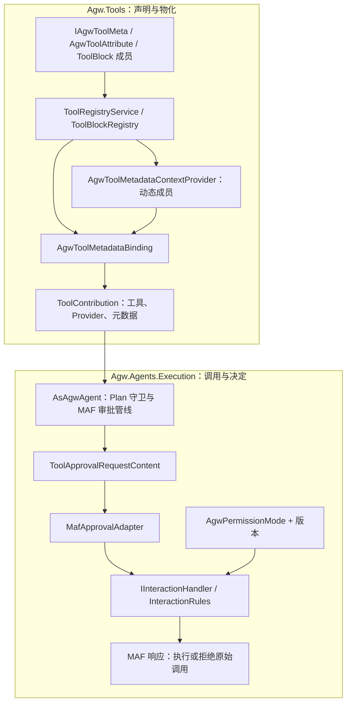
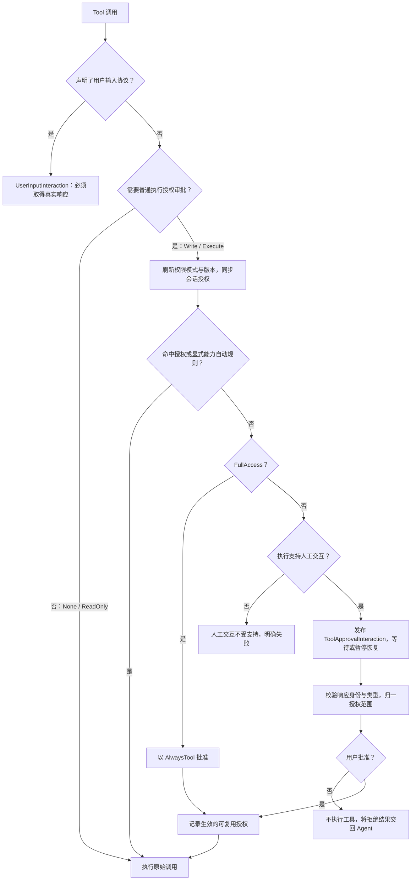
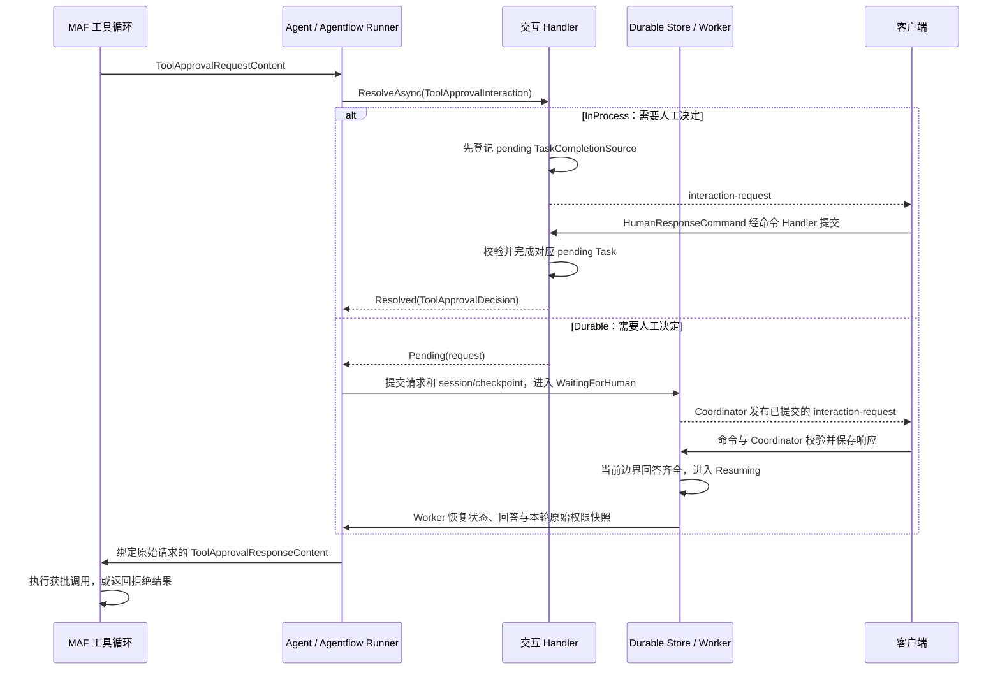

# Agw.Tools

`Agw.Tools` 负责内置 Tool 的编目，以及 Tool 与 ToolBlock 的运行时物化。

## 能力模型

```text
Tool Capability
├── Tool       可独立选择
└── ToolBlock  一组必须原子化管理的成员 Tool
```

Tool 对模型暴露一个可调用操作，可以单独添加或删除。ToolBlock 表示行为和状态必须保持一致的一组 Tool，因此其成员只能整体选择、物化和删除。

当前 ToolBlock：

- `todo`：`todos_add`、`todos_list`、`todos_complete` 等 Todo 工具。
- `mode`：`mode_get`、`mode_set`。
- `project-memory`：Agw Project Memory 工具，存储可选数据库或
  `<Project.Workspace>/.agw/memory`。同一项目的 Agent 与会话共享记忆；
  Filesystem 模式下，指向同一 Workspace 的多个项目也共享记忆。
- `user-memory`：只存数据库、绑定当前认证用户的 Markdown 记忆。它可跨
  Agent、Project 和会话使用，但其他用户不可见。
- `file-access`：限定在 `Project.Workspace` 下的 Harness 文件工具。
- `background-agents`：只允许一层的后台 Agent 委派工具。
- `background-agents` 的全部成员统一声明 `ReadOnly`，包括启动、继续和清理任务，父级工具调用均免审批；Plan 模式可用性仍独立声明。

需要上下文物化的独立 Tool：

- `web_search`：Provider 支持时使用 Hosted marker，否则物化 Agw Local Search，并产生 `tool-warning`。
- `run_shell`：物化全局配置的 Local 或 Docker Shell Executor 及其 Context Provider，仍可单独选择。

`WebSearchContextualTool` 是唯一注册入口，负责权限声明、搜索方式选择和 AI 函数创建。`LocalWebSearchExecutor` 位于 `Impl/ContextualTools/WebSearch`，仅负责 HTTP 请求、搜索源回退和结果解析；不实现工具注册接口。请求、响应类型位于 `Contracts/WebSearch`。

Shell 执行使用 `run_shell`，已删除废弃的 `bash`、`powershell` 实现。

## 数据与选择语义

Agent 和 Project 统一使用一个强类型 `tools` 字段：

```json
[
  {
    "kind": "tool",
    "definition": {
      "name": "web_search",
      "options": {}
    }
  },
  {
    "kind": "toolBlock",
    "definition": {
      "name": "project-memory",
      "options": {
        "storage": "database"
      }
    }
  },
  {
    "kind": "toolBlock",
    "definition": {
      "name": "user-memory",
      "options": {}
    }
  }
]
```

- 外层 `ToolValueObject` 以 `kind` 多态，取值为 `tool` 或 `toolBlock`。
- 内层 `definition` 以 `name` 多态，反序列化为具体
  `ToolDefinition` 或 `ToolBlockDefinition`。
- `options` 必须存在且必须为 JSON object；无配置项时写为 `{}`。
- Agent 与 Project 按 `definition.name` 合并；同名时 Project
  Definition 覆盖 Agent Definition。
- `null` 与 `[]` 都表示当前层不增加配置。
- `background-agents` 仅允许 Agent 配置。
- 新建 Agent 和 Project 的 `tools` 默认为 `[]`。
- 只支持当前类型化对象格式。旧字符串数组及 `bash`、`powershell`、`generate_guid` 定义会明确失败，不会自动改写存储值。

ToolBlock 成员不会作为独立 catalog item 出现。若将 `todos_add` 写入
独立 Tool 配置，系统会明确提示应选择其所属的 `todo` ToolBlock。

## Catalog

`GET /api/tools` 是唯一的 Tool catalog 接口。该接口通过 Bens.Results Envelope 返回 [`ToolLiteInfo`](Contracts/ToolLiteInfo.cs)，保留标识、展示与分类、成员名称、选择范围、Workspace 要求和权限／审批元数据。

HTTP 响应不再包含 `typeName`、`parameters`、`isAsync`、`timeoutMs`；Registry 内部仍保留原来的 `ToolInfo`，提供给模型的 Schema 和运行时审批逻辑不受影响。

Catalog 同时返回两种 item，以下展示部分字段：

```json
{
  "kind": "toolBlock",
  "name": "todo",
  "displayName": "Todo",
  "memberToolNames": ["todos_add", "todos_list", "todos_complete"],
  "scopes": 3,
  "requiresWorkspace": false
}
```

`kind` 为 `tool` 或 `toolBlock`。`/api/tools/by-category` 和
`/api/tools/{name}` 使用相同结构，不再存在单独的 ToolBlock endpoint。
`ExcludeToolFromListAttribute` 会从 `GET /api/tools` 和
`/api/tools/by-category` 排除标记的 Tool 或 ToolBlock；按名称查询和运行时调用保持可用。

## 运行时架构

```text
Agent + Project definitions
          |
          v
AgentCapabilityComposer
  |-- ToolRegistryService -------- 普通 Tool、上下文 Tool
  |-- ToolValueResolution -------- 按 definition.name 合并 Agent/Project
  |-- ToolBlockRegistry ---------- 原子 ToolBlock
  |-- Connections / MCP / Skills
          |
          v
ToolContribution
  |-- Tools
  |-- ContextProviders
  |-- LoopEvaluators
  |-- AutoApprovalRules
  |-- Warnings
  `-- 持有的 IAsyncDisposable 资源
          |
          v
AsAgwAgent
```

`ToolContribution` 是上下文 Tool 与 ToolBlock 共用的物化结果。Composer 将其中的 Tools 展平给模型调用，并把 Provider、Evaluator、审批规则和 warning 交给 Agent pipeline。

聚合 Contribution 通过持有子 Contribution 形成资源所有权树。Agent capability lease 释放时，资源按后进先出顺序清理；物化中途失败时，已经创建的资源也会被释放。

### Tool 调用与自动上下文压缩

上下文压缩不属于 Tool 或 ToolBlock 本身，而是由 `Agw.Agents` 的 `AsAgwAgent` 管线为 Definition Agent 统一执行。每个模型通过 `AgwAiModel` 提供两项限制：

- `MaxContextWindowTokens`：一次模型调用的总上下文窗口上限，包含输入上下文和预留输出；
- `MaxOutputTokens`：单次模型回复的最大 token 数，同时写入 `ChatOptions.MaxOutputTokens`。

压缩策略的有效输入预算为：

```text
InputBudget = MaxContextWindowTokens - MaxOutputTokens
```

MAF 核心包的 `ContextWindowCompactionStrategy` 按有效输入预算的默认阈值工作：达到 50% 时压缩较旧的 Tool call/result，达到 80% 时截断较旧消息。Tool call 与对应 result 作为原子消息组处理，不会只保留其中一部分。框架按 token 估算值判断阈值，该值不等同于字符数，也可能与模型提供方的最终计数略有差异。

默认配置 `256_000 / 64_000` 对应 `192_000` 的有效输入预算，因此两个阈值分别约为 `96_000` 和 `153_600` 个输入 token。Compaction Provider 位于函数调用循环内部，并在逐次历史持久化层之后运行，所以一次 Tool 调用前后的每次模型请求都会重新检查预算。压缩只改变当前发给模型的请求；EF Core 仍保存完整原始历史，压缩状态随 `AgentSession.StateBag` 持久化。External Agent 与一次性 Summary client 不经过这条管线。

Catalog 构建和运行时组合都会校验名称：

- 独立 Tool 不能重名；
- ToolBlock 不能重名；
- 一个成员 Tool 不能属于多个 ToolBlock；
- ToolBlock 名称不能与 Tool 或成员名称冲突；
- Connection、MCP、上下文 Tool 和 ToolBlock 最终贡献的 Tool 不能重名。

## 关键类型

具体实现统一放在 `Impl` 下：`Tools` 包含普通和 Attribute Tool，`ContextualTools` 包含上下文工具，`ToolBlocks` 包含工具块。专用 Executor、Provider 随所属实现分组；工具块共用的存储适配放在 `Impl/ToolBlocks/Storage`。

- `IAgwToolMeta`：所有独立 Tool 共用的名称、分类、Plan 模式和 `AgwToolPermission` 声明。
- `IAgwTool`：普通内置 Tool。
- `IContextualTool`：创建时需要 Agent、Project、workspace、Provider 或环境变量上下文的独立 Tool。
- `IToolBlock`：原子 Tool 集合。
- `ToolValueObject`：外层以 `kind` 区分的持久化值。
- `ToolDefinition`：以 `name` 区分的独立 Tool 强类型配置。
- `ToolBlockDefinition`：以 `name` 区分的 ToolBlock 强类型配置。
- `ToolBlockDescriptor`：catalog 元数据及带权限的成员声明。
- `ToolValueResolution`：Agent/Project 合并规则。
- `ToolMaterializationContext`：物化所需的运行时上下文。
- `ToolContribution`：物化后的行为与资源所有权。
- `ToolRegistryService`：统一 catalog 与独立 Tool 物化入口。
- `ToolBlockRegistry`：ToolBlock 校验和物化入口。

`AgwWorkspaceProvider` 不属于 catalog。它位于 `Agw.Agents`，作为所有 System Agent 都会添加的核心 Context Provider。

## 运行时状态

状态由需要它的运行时行为拥有，而不是由 catalog 拥有：

- Todo、Mode 使用 MAF session provider。
- Project Memory 使用 Agw 自有且无 Agent Session 状态的 Provider。
- Project Memory 数据库存储按 Project ID 隔离。
- Project Memory 文件系统存储位于 `<Project.Workspace>/.agw/memory`；指向同一
  Workspace 的多个 Project 共享该目录。
- User Memory 始终存储在数据库中，并按认证用户 ID 隔离。只有 Markdown
  正文加密，名称和描述保持可检索。
- System 与 External Agent 共用的请求上下文管线最多注入 50 条 User Memory 名称及
  完整 Markdown 正文；注入内容是瞬时上下文，不写入会话历史。描述仅用于管理界面和
  `user_memory_list` 展示。
- Background relation 与结果由对应 runtime 持久化。

### Memory 作用域与隐私边界

个人偏好和需要跨项目跟随同一用户的上下文应使用 User Memory；属于某一项目、
需要由参与该项目的 Agent 或用户共享的知识应使用 Project Memory。User Memory
不会使用文件系统，Project Memory 则可以选择数据库或 Workspace 存储。
User Memory 会自动注入最多 50 条完整正文；超出范围的条目可通过
`user_memory_list` 和 `user_memory_read` 获取。

### User Memory 管理 API

管理端点需要认证，按 Principal 的稳定用户 ID 隔离，并统一返回 Bens.Results Envelope：

| 方法 | 路由 | 作用 |
| --- | --- | --- |
| `GET` | `/api/user-memories/paged?pageIndex=1&pageSize=20` | 分页列出当前用户的摘要，不返回加密正文。 |
| `GET` | `/api/user-memories/detail?id={id}` | 读取一条属于当前用户的 Memory。 |
| `POST` | `/api/user-memories` | 用 `name`、`description` 和 Markdown `content` 创建。 |
| `PUT` | `/api/user-memories` | 按 Body 中的 `id` 更新当前用户的 Memory。 |
| `DELETE` | `/api/user-memories?id={id}` | 删除当前用户的 Memory。 |

其他用户拥有的 ID 不会通过这些查询暴露；API Token 请求使用 Token 创建者的用户 ID。

运行时消息 author 为 `tools`，消息类型为：

- `tool-todo-snapshot`
- `tool-mode-status`
- `tool-background-task-status`
- `tool-warning`

## Tool 审批与 AgwPermissionMode

Tool 审批用于决定一次具体调用是否可以执行。`Agw.Tools` 声明工具需要的权限，`Agw.Agents.Contracts` 定义执行策略，`Agw.Agents.Execution` 负责落实审批、等待和恢复。工具选择、Plan/Execute 模式和权限模式是相互独立的控制项。

### 权限声明与执行策略

[`AgwToolPermission`](Contracts/AgwToolPermission.cs) 为每个 Tool 或 ToolBlock 成员声明权限类别；它不是 Flags 枚举，也不是用户角色的权限等级。

| 权限声明 | JSON 值 | 普通执行授权审批 | 当前示例 |
| --- | --- | --- | --- |
| `None` | `none` | 权限声明不要求审批。 | `diff`、Todo 修改、`ask_user_question`、`mode_set`。 |
| `ReadOnly` | `readOnly` | 权限声明不要求审批。 | `web_fetch`、`web_search`、文件与记忆读取、`mode_get`。 |
| `Write` | `write` | 需要审批，由执行策略决定如何处理。 | `git_clone`、文件与记忆的写入和删除。 |
| `Execute` | `execute` | 需要审批，由执行策略决定如何处理。 | `run_shell`。 |

权限是工具显式声明的产品策略，不根据工具名或参数推断。`run_shell` 即使执行 `pwd` 也属于 `Execute`。Todo 修改声明为 `None`；`background-agents` 的全部成员，包括启动、继续和清理任务，统一声明为 `ReadOnly`。父级委派调用获准执行，不会因此给子 Agent 增加权限。`None` 也不代表“不需要人的回答”：`ask_user_question` 和 `mode_set` 还有独立的用户输入协议。

[`AgwPermissionMode`](../Agw.Agents.Contracts/Execution/AgwPermissionMode.cs) 选择本次执行的审批策略。对于未额外注入自动审批规则的内置工具，行为如下：

| 模式 | JSON 值 | `None` / `ReadOnly` | `Write` / `Execute` | 批准后生效的授权范围 |
| --- | --- | --- | --- | --- |
| `FullAccess` | `fullAccess` | 不要求执行授权审批。 | 自动批准普通工具请求。 | `AlwaysTool` |
| `AlwaysAsk` | `alwaysAsk` | 不要求执行授权审批。 | 每次调用都询问，不复用已有授权。 | `Once` |
| `AllowSameArguments` | `allowSameArguments` | 不要求执行授权审批。 | 命中相同参数的会话授权则复用，否则询问。 | `AlwaysArguments` |
| 未指定（`null`） | `null` 或省略 | 不要求执行授权审批。 | 没有可复用授权或显式自动规则时，需要用户决定。 | 保留用户提交的合法范围。 |

后端 Settings 和执行请求中的可空字段默认是 `null`，不等同于 `FullAccess`，也不等同于 `AlwaysAsk`。共享 Chat 的 [`ConversationController`](../../clients/packages/chat-runtime/src/conversation-controller.ts) 当前会把未指定的客户端选项默认为 `fullAccess`，并发送该值。API 和集成调用方应显式选择所需模式。

`ApprovalScope` 描述一次批准可以怎样复用：`Once` 只批准本次调用，`AlwaysTool` 允许同一会话中相同工具的后续调用，`AlwaysArguments` 只允许同一会话中工具和参数均匹配的后续调用。服务端按上表归一客户端提交的范围；拒绝统一归一为 `Once`，不产生授权。例如，在 `AllowSameArguments` 下提交 `AlwaysTool`，不会放宽到任意参数；提交 `Once` 并批准，也会归一为 `AlwaysArguments`。

### 从声明到运行时执行的装配链



1. **统一声明。** `IAgwTool` 和 `IContextualTool` 通过 `IAgwToolMeta` 强制声明 `RequiredPermission`；Attribute Tool 在 `AgwToolAttribute` 中声明；ToolBlock 在 `ToolBlockDescriptor.Members` 中逐个声明成员。`AllowInPlanMode` 独立声明，默认是 `false`。
2. **物化时绑定。** [`AgwToolMetadataBinding`](Runtime/AgwToolMetadata.cs) 绑定 `AgwToolMetadata(Source, RequiredPermission, AllowInPlanMode)`，来源包括 `built-in`、`attribute`、`contextual` 和 `tool-block:<name>`。对 `AIFunction`，先添加委派式元数据包装，再为 `Write`、`Execute` 添加 `ApprovalRequiredAIFunction`。相同元数据允许重复绑定；元数据冲突或权限值无效时明确失败。
3. **覆盖动态成员。** [`AgwToolMetadataContextProvider`](Runtime/AgwToolMetadataContextProvider.cs) 包装 ToolBlock 的 Provider，每次调用都校验其新生成的成员集并绑定声明；静态成员直接绑定。动态成员缺失、重名或未声明时，在暴露给模型前失败。包装后仍可通过 `GetService<T>()` 访问原 Provider 提供的服务。
4. **在 Agent 管线执行。** [`AsAgwAgent`](../Agw.Agents.Execution/Agents/Tools/AgwAgentExtensions.Tools.cs) 配置 `UseApprovalResponseBinding`，把批准绑定到原始调用；配置 `UseApprovalNotRequiredFunctionBypassing`，避免同一批调用中本来无需审批的普通函数被连带要求审批；由 `UseFunctionInvocation` 执行函数或产生审批请求。`MafApprovalGrantAgent` 刷新权限并记录可复用授权，`UseToolApproval` 检查授权及能力规则，未解决的请求再交给执行层 handler。

Provider-hosted search marker 等非 `AIFunction` 工具可通过弱引用表携带 `None`／`ReadOnly` 元数据。如果声明 `Write` 或 `Execute`，绑定会失败，因为这条路径无法实施本地函数审批。统一读取时使用 `AgwToolMetadataBinding.GetMetadata(tool)`；确定为函数时，也可使用 `function.GetService<AgwToolMetadata>()`。

`ToolContribution.AutoApprovalRules` 是扩展点，在会话授权之后、执行 handler 的权限规则之前检查。当前内置 Tool 和 ToolBlock 不添加额外规则。自定义规则可能在请求进入 `AlwaysAsk` 的 handler 前就批准调用，因此必须单独审查其策略，也不能用它代替权限声明。已登记的用户输入调用会在会话授权和能力规则之前被排除，始终走真实输入流程。

Catalog 的 `requiredPermission` 返回独立 Tool 的权限声明；ToolBlock 的该字段为 `null`，成员权限保留在 Descriptor 上。`requiresConfirmation` 对独立 Tool 由 `Write`／`Execute` 推导，对 ToolBlock 则由“是否至少一个成员声明这两种权限”推导。它表示能力可能需要执行授权，不表示本轮一定弹卡片：`FullAccess` 可以自动批准，声明为 `None` 的工具也可能请求用户输入。

### 一次审批如何决定

下图从通过能力和 Plan 检查后的候选调用开始。真正执行受限函数前，调用守卫仍会再次检查当前 Plan/Execute 模式。



`AlwaysAsk` 不命中任何已存授权；`AllowSameArguments` 只匹配工具和参数均相同的授权。拒绝某次 Tool 调用本身不会直接中断整轮执行，Agent 可以根据拒绝结果作答或选择其他动作。中断执行由独立命令和取消链处理。

### 授权如何匹配、保存和失效

[`MafSessionApprovalState`](../Agw.Agents.Execution/HumanInteraction/Infrastructure/Maf/MafSessionApprovalState.cs) 将 Agw 授权保存在 `AgentSession.StateBag["Agw.ToolApproval.Grants"]`。授权随该 session 保存和恢复，不是全局用户白名单，也不是 Project 级策略；其他 session 不会继承它。

匹配时，工具名按 ordinal、区分大小写比较，参数使用 `JsonNode.DeepEquals` 与批准时保存的副本比较。对象属性顺序不影响结果，数组顺序、属性名大小写、类型和字符串内容会影响结果。JSON 数值 `1`、`1.0`、`1e0` 相等，字符串 `"1"` 则不同；`null`、`{}`、`{"value":null}` 也不同。批准后再修改原参数对象，不会改变已保存的授权快照。

例如，在 `AllowSameArguments` 下批准 `file_access_write` 的 `{"path":"notes.md","content":"draft"}` 后，同一工具使用相同参数、仅交换属性顺序，可以复用授权。改变路径、正文或工具名，都需要重新决定。系统不推断 Shell 命令或文件路径是否“等价”，只比较实际 JSON 参数。

`InteractionPermissionState` 保存模式、单调递增的版本和执行作用域 ID，每轮捕获独立快照。控制命令只更新下轮设置；模式或版本变化（包括 `A → B → A`）在新 turn 开始时使旧授权失效。重复选择同一模式保留有效授权，SDK 执行链在记录或检查授权前按本轮快照同步 session。

Agw 授权与 MAF 的 `toolApprovalState` 分开保存，因为后者还包含待处理请求和已收集的回答。撤销时只清除 Agw 授权，不删除 SDK 队列。Adapter 给 MAF 返回单次调用响应，并附带 Agw 授权范围元数据，不创建 SDK 的长期授权 wrapper，从而保留 Agentflow 和 Durable 的继续执行状态。

### InProcess 等待与 Durable 恢复

两条链都使用 `ToolApprovalInteraction`／`ToolApprovalDecision` 和相同的 `InteractionRules`。`MafApprovalAdapter` 保留 SDK 请求、调用和节点作用域的关联。客户端必须回传原始 `interactionId`，不能只根据工具名猜测等待项。



InProcess 保留异步等待 Task；先登记再发布，因此客户端立即回答也不会早于等待项建立。取消或发布失败时清理对应 pending。Durable 正常结束当前分段，将等待持久化，不保留原调用 Task；请求和 session/checkpoint 提交成功后才发布。响应按所有者、execution generation、交互身份和类型校验；同一边界可以先保存部分回答，齐全后再恢复，并在恢复前应用本轮原始权限快照。

切换到 `FullAccess` 只选择下轮策略，当前全部 pending 保持不变。Durable 在 manifest 中单独保存 `NextPermissionMode` 与 `NextPermissionVersion`，Worker 继续使用本轮快照。`permission-status` 分别报告本轮和下轮选择；用户输入与 HumanGate 在两种模式下仍需真实响应。

### 配置执行策略与提交审批

以下 JSON 是现有 SignalR `ExecutionHub.DispatchCommand` 的命令载荷。将示例 ID 替换为当前 Project、execution 和交互的真实 ID；这些配置不属于 Tool 的 `options`，也不写入 `/api/tools` catalog。

连接空闲时，在发送 `ExecCommand` 前设置初始策略：

```json
{
  "type": "SettingCommand",
  "projectId": "11111111-1111-4111-8111-111111111111",
  "contextId": "tool-approval-demo",
  "permissionMode": "allowSameArguments"
}
```

通过专门命令选择下轮策略；当前 turn 继续使用原快照：

```json
{
  "type": "SetPermissionModeCommand",
  "permissionMode": "alwaysAsk"
}
```

该命令要求非空且已定义的模式值。活动 turn 中重新发送 `SettingCommand` 会受 settings 的 busy 检查约束，应使用独立的权限命令。共享 `@agw/execution-core` 已提供 `buildSettingCommand`、`buildSetPermissionModeCommand` 和 `buildHumanResponseCommand`。

审批卡片通过 `AgwMessage` 下发，其中 `additionalProperties.type = "interaction-request"`，类型化请求位于 `additionalProperties.interaction`。收到 `kind: "tool-approval"` 后，携带原始 ID 提交类型化响应：

```json
{
  "type": "HumanResponseCommand",
  "executionId": "22222222-2222-4222-8222-222222222222",
  "response": {
    "kind": "tool-approval",
    "interactionId": "interaction-id-from-request",
    "approved": true,
    "scope": "AlwaysArguments"
  }
}
```

`scope` 的准确 JSON 值是 `Once`、`AlwaysTool`、`AlwaysArguments`。拒绝时发送 `approved: false` 和 `scope: "Once"`。服务端在接收响应时按本轮权限快照归一，客户端不能通过修改 `scope` 越过当前模式允许的授权范围，也不能在这个响应中替换工具参数。

直接从后端执行时，根据入口设置 `AgentExecuteRequest`、`AgentExecuteByIdRequest` 或 `CreateAiAgentRequest` 的 `PermissionMode`；Agentflow runtime 执行入口也接受该模式。Jobs 使用执行 Facade 的 `AgentExecutionPermissionMode.FullAccess`，同时指定 `HumanInteractionPolicy.Reject`：普通工具审批可以继续，需要真实用户决定的请求会明确失败，不会无限等待。

### 与 Plan 模式、用户输入及 External Agent 的边界

| 控制项 | 决定什么 | 执行位置 |
| --- | --- | --- |
| Tool 选择 | 当前 Agent/Project 提供哪些能力。 | Definition 合并与物化。 |
| Plan/Execute（`mode`） | 当前 Agent 模式是否允许调用工具。 | `AgentModeProvider`、显式 `AllowInPlanMode`、可见性过滤与调用守卫。 |
| `AgwToolPermission` | 普通函数是否需要执行授权审批。 | 元数据绑定与 `ApprovalRequiredAIFunction`。 |
| `AgwPermissionMode` | 当前执行如何处理审批。 | 会话授权与执行交互规则。 |
| 用户输入协议 / HumanGate | 需要取得什么真实回答或工作流决定。 | 类型化交互 Handler 与工具协议 / 工作流边界。 |

当 `mode` ToolBlock 提供 `AgentModeProvider` 时，Plan 守卫在工具生成 Provider 之后执行：从模型可见列表隐藏受限工具，并在调用受限函数前再次检查模式。模式缺失或未知时按 Plan 限制处理。`FullAccess` 或已经取得的审批不能绕过这个守卫；把 `mode` 切换成 `execute` 也不会改变 `AgwPermissionMode`。

`ask_user_question` 和 Agent 发起的 `mode_set` 使用 [`IHumanInteractionProtocol`](HumanInteraction/IHumanInteractionProtocol.cs) 与 `HumanInteractionRequiredAIFunction`。它们声明 `None`，跳过的是普通执行授权，`UserInputInteraction` 仍需真实响应。取消输入时返回协议定义的取消结果，不执行内部动作；拒绝 HumanGate 则终止工作流。这些行为都不会被 `FullAccess` 代替。

后台 Agent 不能为新审批暂停，也不暴露交互 channel。新的审批请求通过 `BackgroundAgentApprovalMiddleware` 明确失败；父级 `background-agents` 工具的权限声明不会取消这一约束。

前述“声明 → MAF”流程针对 Agw 的 System/Definition Agent。Claude Code 通过原生工具审批桥接支持三种模式；Codex 和 Pi 当前 SDK 接入仅支持 Full access，显式选择其他模式会失败。客户端先查询 `/api/agents/permission-capabilities`。外部权限变更在下轮前重建实例时生效，保留 provider session；当前 turn 不变。外部用户输入桥接仍需真实输入，审批不替代 Workspace、归属、凭据或操作系统限制。详见[执行契约](../../../docs/ws-flow.md#permission-capabilities)。

### 新工具如何声明权限

按现有扩展入口声明即可。`IAgwTool` 或 `IContextualTool` 实现中的元数据部分示例：

```csharp
public string Name => "run_shell";
public AgwToolPermission RequiredPermission => AgwToolPermission.Execute;
public bool AllowInPlanMode => false;
```

Attribute Tool 在方法特性中显式传入权限，例如 `git_clone`：

```csharp
[AgwTool("git_clone", AgwToolPermission.Write)]
```

ToolBlock 按成员分别声明，例如 `file-access`：

```csharp
new ToolBlockMemberDescriptor("file_access_read", AgwToolPermission.ReadOnly, allowInPlanMode: true),
new ToolBlockMemberDescriptor("file_access_write", AgwToolPermission.Write),
```

以上是声明片段，不是完整的新工具注册；仍需按下文扩展步骤添加强类型 Definition 与执行实现。工具必须经过 Registry/Composer 路径，才能获得统一绑定；只直接调用原始 `ToAITool()` 不会执行 Registry 的绑定。特别是 `ShellContextualTool` 使用 `requireApproval: false` 创建 SDK 函数，再由 Registry 根据 `Execute` 添加审批包装；局部工厂参数不是最终审批策略。

普通 Tool 不应自行发布客户端消息或管理审批等待。只有确实需要人的答案时才使用输入协议，把审批状态与生命周期交给执行模块。定义保持无状态，运行时状态和可释放资源放在 Provider 与 Contribution 中。

实现与回归测试入口：

| 范围 | 参考 |
| --- | --- |
| 权限声明与动态元数据 | [AgwToolPermissionTests](../../../tests/Agw.Tools.Tests/AgwToolPermissionTests.cs)、[ToolBlockRegistryTests](../../../tests/Agw.Tools.Tests/ToolBlockRegistryTests.cs) |
| 文件读取与写入审批 | [FileAccessPermissionTests](../../../tests/Agw.Tools.Tests/FileAccessPermissionTests.cs) |
| 模式归一与真实输入边界 | [InteractionRulesTests](../../../tests/Agw.Agents.Tests/InteractionRulesTests.cs)、[BuiltInInteractionIntegrationTests](../../../tests/Agw.Agents.Tests/BuiltInInteractionIntegrationTests.cs) |
| JSON 匹配、session 恢复与撤销 | [MafSessionApprovalStateTests](../../../tests/Agw.Agents.Tests/MafSessionApprovalStateTests.cs) |
| Plan 限制与审批后继续执行 | [AgwAgentExtensionsTests](../../../tests/Agw.Agents.Tests/AgwAgentExtensionsTests.cs) |
| 交互架构与 Durable 生命周期 | [HumanInteraction](../Agw.Agents.Execution/HumanInteraction/README.md)、[MAF Adapter](../Agw.Agents.Execution/HumanInteraction/Infrastructure/Maf/README.md) |


## 公共声明与 Skill 携带的工具

[`Agw.Tools.Abstractions`](../Agw.Tools.Abstractions/README.md) 提供 `IAgwToolMeta`、`IAgwTool`、`IProjectScopedAgwTool`、`AgwToolPermission`、生成工具契约和声明特性，仅依赖 `Microsoft.Extensions.AI.Abstractions`；其公开命名空间统一使用 `Agw.Tools.Abstractions.*`。`IProjectScopedAgwTool` 直接继承元数据接口，提供 `ToAITool(Guid projectId)`；普通工具使用 `IAgwTool.ToAITool()`。

`Agw.Tools.Generators` 在编译期将 Attribute 方法生成成 `IAgwGeneratedToolModule`，其中包含元数据、输入／返回 Schema 和直接调用委托。partial Skill 或 ToolBlock 通过 `IAgwToolSet<T>` 声明 Tool 容器，生成器补齐 `ToolTypes` 和固定 ToolBlock Descriptor 工厂。运行时启动不再扫描 Attribute 方法、读取 XMLDoc、为这些方法调用 `AIFunctionFactory`，也不通过反射执行。生成器用 `AGWTOOL001` 报告不支持的签名，用 `AGWTOOL002` 报告无效声明。

全局 Registry 默认消费 `Agw.Tools` 的生成模块。额外的全局生成容器使用 `AddToolCatalogTypes(typeof(MyTools))` 显式选择，仍需满足持久化 Definition 完整性校验。仅引用抽象项目或登记业务模块的生成清单，不会自动把业务 Tool 加入全局目录。

业务模块可通过 `IAgentSkillRegistration.Tools` 提供手写 Tool；partial Skill 使用 `IAgwToolSet<T>` 获得生成的 `ToolTypes`。只有 Skill 绑定到 Agent 或 Project 后才贡献能力。

`AgwToolContainerAttribute` 会暴露类直接声明的 public 普通方法。public 辅助方法使用 `AgwToolIgnoreAttribute` 排除。默认名称保留大小写，并移除末尾一个 `Async`；显式名称原样保留。实例容器使用构造函数注入；方法参数可用 `AgwToolServiceAttribute` 或兼容的 MVC `FromServicesAttribute` 标记为服务。服务参数和 `CancellationToken` 不进入模型 Schema，每次调用使用独立的异步 DI scope。

业务工具位于所属模块的 `Application/Tools`，DTO 位于 `Contracts/Tools`。内置 Skill 通过 `IAgentSkillRegistration.Tools` 提供无状态项目工具声明，默认集合为空。Execution 仅为已绑定 Skill 装配这些工具，对 Agent/Project 重复绑定去重，绑定可信项目 ID，检查跨来源重名，并用来源 `skill:<name>` 接入统一权限管线。绑定后即提供具名工具；`load_skill` 提供使用指导，不承担执行授权。

声明不能保留每个 Agent 的状态或 scoped 服务。项目上下文属于返回的运行时函数，每次调用独立解析和释放业务 scope。直接调用 `ToAITool` 不会自动获得审批和 Plan 限制。`IContextualTool`、`IToolBlock`、`ToolMaterializationContext` 和 `ToolContribution` 继续位于 `Agw.Tools`。

## 扩展方式

### 新增普通 Tool

不需要 Agent/Project 上下文时，使用 `IAgwTool` 或 Tool attribute。同时增加具体 `ToolDefinition`、稳定的 `JsonDerivedType` 名称映射和执行实现；启动校验会保证 Definition 与执行实现一一对应。实现类和 Attribute 容器必须无状态并显式声明 `AgwToolPermission`。

### 新增上下文 Tool

1. 实现 `IContextualTool`。
2. 增加具体 `ToolDefinition` 及其 `JsonDerivedType` 映射。
3. 声明 `Name`、`Category`、Plan 模式支持和 `AgwToolPermission`。
4. 返回 `ToolContribution`，并将 Executor、Provider、Client 等生命周期移交给它。

`ToolRegistryService` 在 Host 启动时从明确指定的目录程序集发现这些实现并生成 `ToolInfo`，实现类无需构造 catalog DTO。

### 新增 ToolBlock

1. 在 `Agw.Data` 增加 `ToolBlockDefinition` 派生类型和稳定的 `name` discriminator。
2. 在 `ToolBlockNames` 增加对应运行时名称。
3. 在 `Impl/ToolBlocks` 下创建独立文件夹并实现 `IToolBlock`。
4. 在 `ToolBlockDescriptor.Members` 中声明全部成员及各自权限。
5. 在一个 `ToolContribution` 中物化所有成员及其状态 Provider。
6. 增加 Registry、Resolution、物化、API 和 UI 测试。

不要将 ToolBlock 成员注册为独立 Tool，也不要增加隐式默认选择。

成功物化后，ToolBlock 每次 Provider 调用都必须提供完整的声明成员集。缺失、重复或未声明的成员会在暴露给模型前被拒绝，此规则同时适用于 Plan 和 Execute 模式。通过 `GetService<T>()` 查询包装后的 Provider，具体类型过滤会漏掉它们。Registry 持有的定义必须使用适合单例生命周期的依赖；scoped 服务应在运行时作用域中解析。

## 验证

```bash
dotnet test tests/Agw.Tools.Tests/Agw.Tools.Tests.csproj
dotnet test tests/Agw.Agents.Tests/Agw.Agents.Tests.csproj
dotnet build Agw.slnx

cd src/clients
pnpm exec turbo run build --filter=@agw/tools --filter=@agw/agents --filter=@agw/projects
pnpm test:boundaries
```
